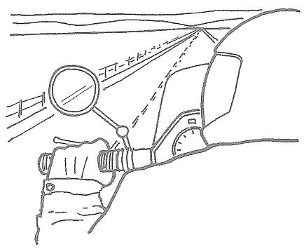
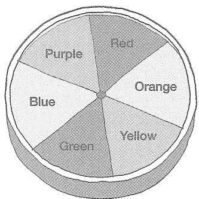
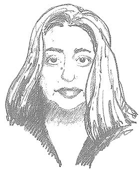

# 我在建筑学院学到的101件事 马修·弗雷德里克

# 我在建筑学院学到的101件事

# 马修·弗雷德里克 我在建筑学院学到的101件事

① 2007 马修·弗雷德里克

版权所有。未经出版商书面许可，本书任何部分不得以任何电子或机械方式（包括影印、录制或信息存储和检索）复制。

麻省理工学院出版社的书籍可按特殊批量折扣购买，用于商业或销售促销。如需了解信息，请发送电子邮件至<special_sales@mitpress.mit.edu>或写信至麻省理工学院出版社特别销售部，地址：马萨诸塞州剑桥市海沃德街55号，邮编02142。

本书由麻省理工学院出版社采用Helvetica Neue字体排版，在中国印刷装订。

美国国会图书馆图书在版编目数据

弗雷德里克，马修。《我在建筑学院学到的101件事》/马修·弗雷德里克著。

厘米。ISBN-13 978-0-262-06266-4（精装： alk.纸）1. 建筑学—学习与教学。2. 建筑设计—学习与教学。I. 书名。II. 书名：One hundred one things I learned in architecture school. III. 书名：One hundred and one things I learned in architecture school.

NA2000:F74 2007 720- dc22

献给索尔奇，是她让这一切以及更多事情成为可能

# 作者注

建筑专业学生能确定的事情寥寥无几。建筑课程就像一头令人困惑且难以驾驭的野兽，需要投入大量时间，研读晦涩的文本，还常常要面对难懂的教学内容。如果说建筑学的知识很迷人（事实的确如此），那么它们也充满了无数的例外和 caveat（警告、说明），以至于学生们很容易怀疑，关于建筑学是否真的有什么具体的东西可以学习。

建筑教学的这种模糊性在很大程度上是有必要的。毕竟，建筑学是一个创造性领域，设计教师们自然很难将课程计划具体化，因为他们担心这会给创作过程施加不必要的限制。由此产生的开放性为学生们提供了探索许多迷人新领域的机会，但他们往往会觉得建筑学像是建立在流沙之上，而非坚实的土地上。

本书旨在巩固建筑工作室的基础，提供一些可依循的要点，让设计过程能够在此基础上蓬勃发展。以下这些关于设计、绘图、创作过程和展示的知识，在我自己的学习生涯中，最初只是迷雾中难以分辨的微光。但在那之后，作为从业者和教育者的这些年里，它们变得越来越清晰、明亮。而它们所解决的问题，一直是建筑教育的核心问题：我的学生们一次又一次地向我证明，建筑学院里的疑问和困惑几乎是普遍存在的。

我建议你在工作室工作时，把这本书摊开在桌面上；在乘坐公共交通时，把它放在外套口袋里阅读；在需要灵感来解决建筑设计问题时，随意翻阅。无论你如何对待接下来的这些知识，幸好我不会在你身边，一一指出每一条知识背后无数的例外和说明。

建筑师 马修·弗雷德里克 2007年8月

# 致谢

非常感谢黛博拉·坎托-亚当斯、朱利安·张、罗杰·康诺弗、德里克·乔治、井口康代子、特里·拉穆勒、吉姆·兰德、苏珊·刘易斯、马克·洛温塔尔、汤姆·帕克斯；感谢我那些重视通俗易懂英语的建筑导师们；感谢我的学生们，他们提出并解答了许多问题，促成了这本书的诞生；最要感谢的是我的伴侣兼经纪人索尔奇·费尔班克。

# 我在建筑学院学到的101件事

是

否

# 如何画一条线

1. 建筑师会根据不同的目的使用不同的线条，但建筑学中最具特色的线条是在起笔和收笔处加以强调。这种做法能让线条牢牢固定在纸上，使图纸具有说服力和冲击力。如果你的线条在末端逐渐变细，图纸就会显得软弱无力、模糊不清。要训练自己画出有力的线条，可以练习在每一笔的开头和结尾画一个小墨点或回笔。

2. 线条相交时，要稍微重叠一点。这样可以避免角落看起来不合时宜地圆润。

3. 草图绘制时，不要在纸上“ feather and fuzz（轻描淡写、模糊不清地画）”——也就是说，不要用许多短小、重叠的线段组成一条看起来模糊的线条。相反，要用一种有控制的、流畅的动作让铅笔从起点移动到终点。在画最终线条之前，先画一条轻轻的辅助线可能会对你有帮助。完成绘图后，不要擦掉辅助线——它们会为图纸增添特色和生气。

图形是放置在页面、画布或其他背景上的元素或形状。底图是页面的空间。

图形也被称为物体、形式、元素或正形。底图也可称为空间、剩余空间、空白空间或场域。

4个图形随机排列，产生负空间

同样的4个图形排列成正空间（三角形）

同样的4个图形排列成正空间（字母A）

图形-底图理论指出，放置图形后产生的空间应该和图形本身一样被精心考虑。空间

如果放置图形后留下的空间没有形成特定形状，就称为负空间。如果它有了形状，就是正空间。

当元素或空间不是明确存在的，但却能被感知到——我们能“看到”它们，尽管实际上看不到——就说它们是隐含的。

实体-虚空理论是图形-底图理论在三维空间中的对应理论。它认为，由实体放置所塑造或暗示的 volumetric（ volumetric：体积的、容积的）空间，与实体本身同等重要，甚至更为重要。

一个三维空间如果具有明确的形状，并且在内部和外部之间有边界或门槛的感觉，就被视为正空间。正空间可以通过点、线、面、实体体积、树木、建筑边缘、柱子、墙壁、倾斜的土地以及无数其他元素，以无限多种方式来定义。

大学里的“四方院”通常是校园里人们进行社交互动和闲逛的首选空间。

# 我们穿过负空间，栖息在正空间里。

建筑空间的形状和特质极大地影响着人类的体验和行为，因为我们居住在建筑环境的空间中，而不是塑造这些空间的坚实墙壁、屋顶和柱子里。人们几乎总是更喜欢在正空间里停留和进行社交互动。负空间则更倾向于促进移动，而非让人停留。

中世纪城市图形-底图平面图

当代郊区图形-底图平面图

# 郊区的建筑是空间中独立的物体。城市的建筑往往是空间的塑造者。

如今我们建造建筑时，常常把精力集中在建筑的形状上，而户外空间的形状则成了偶然剩下的部分。这些户外空间，比如典型的郊区户外空间，都是负空间，因为建筑的排列并没有赋予它们之间的空间特定的形状。

然而，城市建筑的设计往往基于相反的理念：建筑形状可能是次要的，公共空间的形状才是主要的，以至于有些城市建筑几乎可以说是被“变形”了，只为了让周围的广场、庭院等空间能形成正空间。

“建筑是对空间的深思熟虑的塑造。”

——路易斯·康

# 场所感

“场所精神”（Genius Loci）字面意思是场所的灵魂。它用来描述那些因其建筑和体验特质而令人深刻难忘的地方。

# 我们对建筑空间的体验很大程度上受我们进入它的方式影响。

一个高大明亮的空间，如果前面有一个低矮、光线柔和的空间作为对比，会让人感觉更高大、更明亮。一个宏伟的或神圣的空间，如果位于一系列次要空间的尽头，会让人感觉更有意义。一个有朝南窗户的房间，当人们穿过一系列朝北的空间后再进入，会给人更强烈的感受。

# 运用“先抑后扬”来丰富在建筑环境中的穿行体验。

当我们在建筑物、城镇和城市中穿行时，会在脑海中把周围环境的视觉线索与自己的需求和期望联系起来。我们体验的满意度和丰富度，在很大程度上取决于这些联系的建立方式。

“先抑后扬”能有助于营造丰富的体验。在设计行进路径时，可以先让使用者看到他们的目标——楼梯、建筑入口、纪念碑或其他元素，然后在他们继续靠近时，暂时将目标遮挡起来。之后，从不同的角度或以有趣的新细节再次展示目标。让使用者走上一条意想不到的路径，制造更多的悬念，甚至让他们暂时有点迷路；然后用其他有趣的体验或目标的其他视角来“奖励”他们。这种额外的“付出”会让旅程更有趣，到达目的地时也更有成就感。

# 设计建筑空间时，要适应特定的功能、体验或意图。

不要在平面图上画一个矩形或任何其他随意的形状，给它贴上标签，就认为它适合预期的用途。相反，要详细研究功能需求，确定在那里会发生的具体活动。想象在这些空间里会出现的实际场景或体验，然后设计出能适应并增强这些场景或体验的建筑。

# 空间规划是为了适应功能需求而对空间进行的组织或安排。

空间规划是建筑师的一项关键技能，但仅仅为了满足功能需求而安排空间，只是建筑师工作的一小部分。空间规划师解决的是建筑在场地内的功能布局问题；而建筑师还关心场地及其建筑的意义。空间规划师为办公室工作人员创造实用的建筑面积；建筑师则会考虑在办公环境中进行的工作的性质、它对工作人员的意义以及它对社会的价值。空间规划师提供打篮球、进行实验室实验、制造小部件或上演戏剧的空间；建筑师则赋予这些场所的体验以深刻、丰富、乐趣、美感和讽刺意味。

# 建筑始于一个想法。

好的设计解决方案不仅在形式上有趣，而且是由潜在的想法驱动的。想法是一种特定的思维结构，通过它我们可以组织、理解外部的体验和信息，并赋予它们意义。如果没有潜在的想法为建筑提供指导，建筑师就只是空间规划师而已。用装饰来“美化”的空间规划不是建筑；建筑存在于建筑的DNA中，存在于一种嵌入其中、贯穿整体的情感中。

# “设计理念”（parti）是建筑的核心想法或概念。

“设计理念”（parti [par- TEE]）可以通过多种方式表达，但最常见的是通过图表来展示建筑的总体平面布局，并暗示其体验和美学感受。“设计理念”图表可以描述体量、入口、空间层次、与场地的关系、核心位置、内部流通、公共/私人分区、实体/透明感以及许多其他方面的考虑。每个因素所受关注的比例因项目而异。

这里展示的“设计理念”来自之前构思的项目；将一个旧项目的“设计理念”成功应用到一个新项目中，即使不是不可能，也几乎是不太可能的。设计过程就是为一个项目创造一个独特且合适的“设计理念”的过程。

有些人会认为，一个理想的“设计理念”是包罗万象的——它会影响建筑的每个方面，从整体布局和结构系统到门把手的形状。另一些人则认为，完美的“设计理念”既无法实现也并非必要。

# “设计理念”源于非建筑领域的理解，在建筑形式诞生之前必须加以培养。

在最具抱负的层面上，“设计理念”源于比单纯建筑更超凡的事物。例如，“冲突中的L形”可能适合作为一个新的政府大楼的“设计理念”，该大楼为两个曾经交战但已组成新国家的派别而建。“伸向森林的手指”可能源于对田野和森林关系的生态信念。“缺失的轮辐”可能暗示一种“损失带来机遇”的哲学。

# 设计想法越具体，它可能产生的吸引力就越大。

试图通过模糊不清的表达来吸引所有人，结果往往是无人被吸引。但在创作中，借鉴一个具体的观察、深刻的陈述、具有讽刺意味的观点、诙谐的思考、理性的联系、政治观点或独特的信念，有助于你创造出其他人能以自己的方式产生共鸣的环境。

为紧张的新娘走下楼梯的那一天设计一段楼梯。设计一扇窗户，用来框住秋天某个完美日子里的一棵特定的树。建造一个阳台，让世界上最糟糕的独裁者可以在那里训斥他的臣民。创造一个休息区，让一群脾气暴躁的青少年可以在那里抱怨他们的父母和老师。

以具体想法为导向的设计不会限制人们使用和理解你所设计的建筑的方式；它会让人们有机会将自己的解读和特质融入其中。

# 任何设计决策都应该至少有两种合理的解释。

楼梯的主要用途是让人从一层走到另一层，但如果设计得好，它还可以作为聚集空间、雕塑元素以及建筑内部的定向装置。一扇窗户可以框住景色、让光线洒满墙壁、让建筑使用者了解外部景观、体现墙壁的厚度、展示建筑的结构系统，以及与另一个建筑元素形成轴线关系。一排柱子可以提供结构支撑、定义流通路径、充当“导向”装置，以及与其他布置更不规则的建筑元素形成节奏对比。

在建筑的几乎每个元素中，都能找到多种设计解释的可能性。你能为任何一个元素找到或创造的解释越多越好。

# 分层次绘图。

在任何媒介中绘图时，不要从图纸的一端以“100%的细节程度”一直画到另一端的空白处。相反，先从构图中最一般的元素开始，然后逐渐过渡到更具体的方面。首先规划好整个图纸的布局。使用轻柔的辅助线、几何对齐、视觉直觉检查以及其他方法，反复检查你所绘制元素的比例、关系和位置。当在这个 schematic（ schematic：示意性的）层面上取得一定成果后，再进入下一个细节层面。如果你发现自己专注于图纸某个特定区域的细节，可以短暂投入，然后转移到图纸的其他区域。不断评估自己的成果，在整个图纸的背景下进行局部调整。

工程师往往关注物理事物本身。建筑师则更直接地关注人与物理事物的互动。

# 建筑师对所有事情都略知一二。工程师对一件事情了如指掌。

建筑师是通才，而不是专才——就像交响乐的指挥，而不是能完美演奏每一种乐器的大师。作为从业者，建筑师要协调一个专业团队，其中包括结构工程师、机械工程师、室内设计师、建筑规范顾问、景观建筑师、规范编写者、承包商以及其他学科的专家。通常，一些团队成员的利益会与其他成员的利益产生冲突。建筑师必须对每个学科都有足够的了解，才能在协调和综合这些相互竞争的需求的同时，满足客户的需求并维护整个项目的完整性。

Stylus  ABCDEFGHIJKLMNOPQRSTUVWXYZ  I 234567890 abcdefghijklmnopqrstuvwxyz

City Blueprint

ABCDEFGHIJKLMNOPQRSTUVWXYZ  I 234567890 abcdefghijklmnopqrstuvwxyz

Bernhard Fashion

ABCDEFGHIJKLMNOPQRSTUVWXYZ  I 234567890 abcdefghijklmnopqrstuvwxyz

# 如何进行建筑手写体书写

良好的建筑手写体遵循以下几个原则和技巧：

1. 最重要的是清晰易读和保持一致。2. 使用辅助线（实际画出的或想象的）来确保统一性。3. 强调所有笔画的开头和结尾，并且在笔画相交处稍微重叠——就像画线条时一样。4. 让你的水平笔画略微向上倾斜。如果向下倾斜，字母会看起来无精打采。5. 让弯曲的笔画像气球一样饱满。6. 认真注意字母之间的空白。例如，字母“E”在“I”后面时需要的空间比在“S”或“T”后面时要多。

有几种标准的电脑字体与建筑手写体相似，在你培养手动书写技能之前，可以作为参考。

对现实的客观参与 超然观察

对现实的主观参与 直接沉浸

人们可以主观地参与现实，即假定自己与所关注的对象融为一体；也可以客观地参与现实，即假定与对象保持距离。

客观性是科学家、技术人员、机械师、逻辑学家和数学家的领域。主观性是艺术家、音乐家、神秘主义者和自由精神者的领域。现代文化中的人们倾向于重视客观观点——因此这可能也会成为你的世界观——但这两种参与方式对理解和创造建筑都至关重要。

“科学研究事物的碎片和片段，并假定其连续性；而艺术家只研究事物的连续性，并假定其碎片和片段。”

——罗伯特·皮尔西格，《禅与摩托车维修艺术》

跨层楼梯

平行于层的楼梯

# 以“设计理念”为指导来设计建筑的诸多方面。

在设计楼梯、窗户、柱子、屋顶、大厅、电梯核心或建筑的任何其他部分时，都要考虑其设计如何表达和强化建筑的核心思想。

例如，想象一个“设计理念”旨在表达一种分层组织，每层都有独特的建筑特质。这座建筑内的中央楼梯可以：

1. 定向为横跨各层，这样人们在走楼梯时就能穿过各个楼层；2. 与其他楼层平行，也就是说，它本身就是一个楼层；3. 置于层系统之外，以保持其纯粹性；4. 任何有助于表达“这座建筑是关于分层的”的设计（而不是与之矛盾的设计）。

# 优秀的设计师能随机应变。

随着设计过程的推进，不可避免地会出现各种复杂情况——结构问题、客户需求的不断变化、消防疏散难以解决、功能规划中被遗忘又重新想起的部分、对旧信息的新理解等等。你曾经绝妙的“设计理念”可能突然面临失败。

糟糕的设计师会试图固守失败的“设计理念”，并对问题区域进行局部修补，从而失去整体的完整性。另一些人可能会感到挫败，放弃对整体整合的追求。但优秀的设计师明白，“设计理念”的弱化是一个有益的信号，表明项目需要朝着新的方向发展。

当设计过程中的复杂情况破坏了你的方案时，要改变——必要时，放弃你的“设计理念”。但不要放弃拥有“设计理念”，也不要固执地捍卫一个不再可行的方案。创造另一个能全面整合你目前对建筑所有了解的“设计理念”。

# 柔和的想法用柔和的线条；强硬的想法用强硬的线条

粗马克笔、炭笔、蜡笔、颜料、软铅笔以及其他松散或柔软的工具，在设计过程的早期探索概念性想法时非常有价值，因为它们本质上倾向于鼓励宏观思考，避免细枝末节的决策。当设计过程接近更完善的方案时，细尖马克笔和锋利的铅笔会更有用。明暗图有助于表达细微差别和微妙之处。

硬线图——用直尺或计算机程序按比例绘制的图纸——最适合传达确定、具体和定量的信息，例如最终的平面图或详细的墙体剖面图。它们在方案设计阶段偶尔也有用，比如当你需要测试设计概念在尺寸上的可行性时。然而，计算机绘图程序如果作为设计工具被过度使用，可能会鼓励无休止地生成选项，而不是加深对想要解决的设计问题的理解。

# 优秀的设计师不害怕放弃好想法。

仅仅因为你想到了一个有趣的想法，并不意味着它适合你正在设计的建筑。要对每一个想法、头脑风暴的结果、随意的思考和有用的建议进行仔细、批判性的考虑。作为设计师，你的目标应该是创造一个整体协调的作品，而不是将所有好的元素都纳入建筑中，不管它们是否能相互配合。

可以把“设计理念”看作作家运用的论点，或者作曲家运用的音乐主题：创作者想到的并非所有想法都适合当前的作品！把那些好但不合适的想法保存起来，留到其他时间和项目中——并且要知道，到那时它们可能仍然不合适。

# 注重过程而非结果，是设计师要培养的最重要也最困难的技能。

注重过程意味着：

1. 在寻求解决方案之前，先努力理解设计问题；2. 不要把旧问题的解决方案硬套在新问题上；3. 不要过分投入到自己的项目中，不要轻易迷恋自己的想法；4. 全面地（同时解决设计问题的多个方面）进行设计研究和决策，而不是按顺序（在研究下一个方面之前先确定一个方面的解决方案）；5. 有条件地做出设计决策——也就是说，要意识到随着向最终解决方案推进，这些决策可能可行也可能不可行；6. 知道何时该改变，何时该坚持之前的决策；7. 接受不知道该做什么时产生的焦虑是正常的；8. 在概念层面和细节层面之间灵活切换，看看它们如何相互影响；9. 无论对自己的解决方案有多满意，都要不断问“如果……会怎样？”

“一座恰当的建筑，自然、合理且富有诗意地源于其所有条件。”

——路易斯·沙利文，《幼儿园闲谈》（释义）

改进的设计过程，而不是完美实现的建筑，是你从一个设计工作室获得并带到下一个工作室的最有价值的东西。

设计工作室的导师们，最重要的是希望他们的学生培养良好的过程。如果一位导师给一个在你看来很差的项目打了高分，很可能是因为这个学生展示了良好的过程。同样，你可能会看到一个显然很好的项目只得到了中等分数。为什么呢？因为如果一个项目背后的过程是草率的、结构混乱的，或者只是靠运气偶然成功的，那么它不值得一个好分数。

最有效、最具创造力的问题解决者会进行元思考，即“对思考进行思考”。

元思考意味着在思考的同时，意识到自己是如何思考的。元思考者会进行持续的内部对话，测试、拓展、批判和调整自己的思维过程。

# 如果你想让一个建筑空间或元素具有特定的特质，要确保这种特质确实存在。

如果你想让一堵墙感觉厚重，就要确保它真的很厚重。如果一个空间要让人感觉高大，就要确保它真的很高大。

清晰地表达设计意图对初出茅庐的设计师来说至关重要。有经验的设计师通常知道如何让细微的差异产生巨大的影响。

# 要框定景色，而不仅仅是展示景色。

虽然“一整面墙的窗户”似乎是处理壮丽景色的最佳方式，但更丰富的体验往往来自那些经过精心选择、框定、遮挡甚至暂时隐藏的景色。作为设计师，要努力精心设计窗户的形状、大小和位置，使其与所要呈现的景色和体验相契合。

# “我喜欢风景，但我喜欢背对着它坐着。”

——格特鲁德·斯泰因，《爱丽丝·托克拉斯自传》

明暗图（用阴影渲染的图）往往比线条图更能传达情感。

# 任何美学特质通常都会因对立面的存在而得到增强。

当你想为一个空间、元素或建筑赋予特定的美学特质（明亮、黑暗、高大、光滑、笔直、弯曲、醒目等）时，尝试加入一种相反或对立的特质，以获得最大的效果。如果你想让一个房间感觉高大明亮，可以设计一个通过低矮黑暗空间的入口。如果你想让一个中庭成为建筑中几何纯净、高度有序的中心，可以让它周围环绕着更有机或随意布置的空间。如果你想强调一种材料的丰富性，可以用一种朴素、不够精致的材料来与之对比。建筑的每个方面都有这样的机会：粗糙表面与光滑表面对比，水平体量与垂直体量对比，重复的柱子与连续的墙壁对比，直线排列与曲线对比，大窗户与小窗户对比，顶部采光的空间与侧面采光的空间对比，流动的空间与分隔的房间对比等等。

# 罗盘的四个基本方位具有特定的意义联想，可以增强建筑体验。

东方：年轻、纯真、清新

南方：活跃、清晰、简洁

西方：衰老、质疑、智慧

北方：成熟、接纳、死亡

这些联想虽然不是绝对的，但可以帮助你决定在场地或建筑内不同空间和活动的位置：方位对殡仪馆、礼拜空间、成人教育讲堂或婴儿 nursery（ nursery：托儿所）的位置有什么启示呢？

# 静态构图看起来是静止的。

静态构图通常是对称的。成功的静态构图会给人以力量、坚固、坚定、确定、权威和永恒的感觉。不太成功的例子则可能缺乏吸引力，显得枯燥乏味。

# 动态构图会吸引视线去探索。

动态构图几乎都是不对称的。它们能给人以活跃、兴奋、有趣、运动、流动、攻击性和冲突的感觉。不太成功的例子则可能显得刺耳或令人迷惑。

# 动态与对立

要在二维或三维空间中创造一个动态且平衡的构图，首先做出一个强烈的、动态且不平衡的初始设计决策；然后用一个次要的动态举措来与第一个举措形成对立。可以把对立看作一种美学上的反驳：它与对立面相似但又不完全相同，理论上，对于一个给定的动态，可以有无数种对立方式。例如，一个大的漩涡可以用几个小方块来对立，因为“几个”与“一个”相对，“小”与“大”相对。但同一个漩涡也可以用断断续续的锯齿形、强调规则的网格、一系列漂浮的圆圈等来对立，因为每一种对立的动态都在某些方面与漩涡的特质相反。

在左边的构图中，至少有四种不同的动态，每种动态都与其他所有动态形成对立。

# 那些大一时做的关于“点和点”“块和块”的枯燥工作室练习，确实与建筑有关。

许多刚开始学习建筑的学生，对初级设计工作室通常布置的二维和三维设计练习感到厌烦和不耐烦。而高年级的学生，庆幸自己熬过了初级设计阶段，往往不会回顾早期的设计课程，看看它们如何为解决复杂的建筑问题奠定基础。

如果你的导师没有说清楚二维和三维设计与“真正的”建筑之间的联系，可以要求举例说明。或者问问高年级工作室的导师。扎实掌握二维和三维设计的基本原理，从长远来看，会让你在复杂的建筑领域走得更远。

# 当难以确定平面图、场地规划图、建筑立面图、剖面图或建筑形状时，可以把它看作一个二维或三维的构图。

这会鼓励你平衡地关注形式和空间，帮助你整合方案中不同的方面，避免过分关注自己喜欢的特征。在二维或三维层面可以问的问题包括：

- 构图整体是否平衡？- 是否混合了不同大小和纹理的元素，以从不同角度和距离吸引视线？- 是否有一个主要的“动态”和一个或多个对立的动态？- 构图中是否有任何区域看起来被忽略了？

# 色彩理论为理解色彩的特性和意义提供了框架。

色彩可能与季节相关联：

- 冬季：灰色、白色、冰蓝色以及类似的颜色- 秋季：金色、赤褐色、橄榄色、棕紫色、柔和或浑浊的色调- 夏季：原色或明亮的颜色- 春季：柔和的色调

色彩可分为暖色和冷色。冷色往往会从观者眼前后退——也就是说，它们看起来更远，而暖色则会向前突出。

- 暖色：红色、棕色、黄色、黄绿色或橄榄绿色- 冷色：蓝色、灰色、纯绿色或蓝绿色

色轮上位置相对的颜色是互补色，可以用来组织色彩。将互补色一起使用——例如蓝色和橙色——有助于创建平衡的色彩方案。

# 三种认知层次

简单性是孩子或无知成人的世界观，他们完全沉浸在自己的体验中，快乐地对表象之下的事物一无所知。

复杂性是普通成人的世界观特征。它表现为意识到自然界和社会中的复杂系统，但无法辨别其中清晰的模式和联系。

明智的简单性是一种开明的现实观。它建立在能够辨别或在复杂的混合物中创造清晰模式的能力之上。模式识别是建筑师的一项关键技能，因为建筑师必须在众多相互竞争且常常模糊不清的设计考虑中，创造出一个高度有序的建筑。

# 通过明智的简单性或简单事物的相互作用来创造建筑的丰富性，而不是通过不必要的繁杂堆砌。

无论建筑美学是追求极简还是复杂，体验是神秘还是清晰，空间是简朴还是层次丰富，建筑都必须是一个高度有序的事物。在建筑平面中创造简化的模式，是一种在保持秩序的同时允许多种解读和体验的方式。

一些不必要的复杂性的例子：

- 当三个明智的举措就能完成时，却做出十几个单独的设计举措；- 因为项目本身枯燥乏味，就用一些小玩意儿来使其变得繁杂；- 把许多不相关的元素堆砌在一起，不考虑它们的统一性，仅仅因为它们本身很有趣。

# 方形建筑、建筑侧翼和房间可能难以组织。

因为方形本质上是缺乏动态的，它不会自然地暗示出移动的方向。这会使得在方形平面图中建立合适的流通路径变得困难。此外，方形建筑内部的房间可能远离自然光和空气。非方形的形状——矩形、新月形、楔形、L形等——更自然地适合移动、聚集和居住的模式。

但当然，大量相似的事物更能反映模块化的扰动，考虑到由轴向关系建立的语言的特殊性。

# 如果你不能用你祖母能理解的语言向她解释你的想法，那你就还不够了解你的学科。

有些建筑师、导师和学生使用过于复杂（而且往往毫无意义！）的语言，试图获得认可和尊重。你可能不得不容忍他们中的一些人这样做，但不要模仿他们。真正精通自己学科领域的专业人士，知道如何用日常语言向他人传达自己的知识。

# 在北半球，日光的高度、角度和颜色会随着罗盘方位和一天中的时间而变化。

朝北的窗户的日光在一天中大部分时间和一年中的大部分时间都倾向于无阴影、漫射且呈中性或略带灰色。

东边的日光在早晨最强。它往往高度较低，有柔和的长阴影，颜色呈灰黄色。

南边的日光在上午晚些时候到下午中段占主导地位。它往往能准确地呈现颜色，并投下强烈、清晰的阴影。

西边的日光在下午晚些时候和傍晚最强，带有浓郁的金橙色。它能深入建筑物内部，有时会过于强烈。

# 窗户在白天看起来是暗的。

在绘制建筑外部视图时，把窗户画成暗的（除非玻璃是反光的，或者后面有浅色的百叶窗或窗帘），会增加深度感和真实感。

# 美更多地源于构图元素之间和谐的关系，而非元素本身。

穿上你最喜欢的裤子、最笔挺的衬衫和最酷的夹克，但不考虑它们之间的搭配。然后走到街上，看看能不能不被人嘲笑。

用有史以来最惊艳的汽车的最美观部件组装一辆车。看看你的朋友们是否愿意和你一起坐这辆车。

用你最喜欢的好莱坞帅哥美女的身体部位创造一个梦中情人。看看你对这些部位的总和是否还像对原来的整体那样感兴趣。

是各部分之间的“对话”，而非各部分本身，造就了美学上的成功。

# 许多人认为，对不对称平衡的欣赏体现了更高层次的思维能力。

无论是创作静态还是动态的构图，艺术家通常都力求达到平衡。平衡在对称构图中是固有的，但不对称构图可能是平衡的，也可能是不平衡的。因此，不对称往往需要对整体性有更复杂和 sophisticated（ sophisticated：复杂的、高级的）理解。

一座好的建筑，从不同距离观看，会呈现出不同的面貌。

# 几何形状具有内在的动态特质，会影响我们对建筑环境的感知和体验。

例如，正方形本质上是静态的、无方向性的。因此，正方形或立方体比例的房间可能会让人感觉宁静，但如果设计不当，可能会显得沉闷或空洞。矩形因为有两条长边和两条短边，本质上是有方向性的。矩形房间越长，就越会促使人们在视觉和物理上沿着其长轴方向移动。

圆形有无数条半径，因此既是全方位的，又是无方向的：圆形或圆柱形建筑平等地面向周围的每一个点，因此可以成为景观中的一个有效焦点。同时，圆形建筑没有哪个部分天生就是正面、侧面或背面。

# 穿过小房间的流通路径，最佳位置通常是紧贴一面墙，笔直穿过。

这样可以让房间的主要使用者不受穿行人流的干扰。穿过小房间最糟糕的流通路径通常是对角线穿过，或者平行于房间的长轴。在这种情况下，很难安排舒适的家具，因为在房间里停留的人会觉得——即使实际上并非如此——自己挡了穿行的人的路。

# 大多数建筑形式可以分为 additive（ additive：叠加的）、 subtractive（ subtractive：消减的）、塑形的或抽象的。

叠加形式看起来像是由各个部分组装而成的。

消减形式看起来像是从一个先前“完整”的形式中雕刻或切割出来的。

塑形或模制形式看起来像是由可塑性材料通过直接施加的力形成的。

抽象形式的起源不确定。

# 工作室项目的有效口头陈述，要从总体开始，逐步过渡到具体。

1. 说明所分配的设计问题。2. 讨论你在解决这个设计问题时所秉持的价值观、态度和方法。3. 描述你的设计过程以及在此过程中遇到的主要发现和想法。4. 阐述从你的过程中产生的“设计理念”或统一概念。用一个简单的图表来展示。5. 展示你的图纸（平面图、剖面图、立面图和小插图）和模型，并始终结合“设计理念”进行描述。6. 进行适度而自信的自我批判。永远不要以“嗯，你从这里的前门进去”开始陈述，除非你想让听众昏昏欲睡。

# 建筑的比例是其建造方式的一种美学表达。

传统建筑（在19世纪末现代建筑方法出现之前建造的）往往有较短的结构跨度和垂直的窗户比例。现代建筑则更多地有较长的跨度和水平的窗户比例。

传统建筑的垂直比例是由于石头或木头过梁（开口上方的支撑梁）的长度受到手工寻找、制作和吊装能力的限制。当窗户的宽度受到限制时，要制作一个大窗户，唯一的办法就是把它做高。

当代的钢铁和混凝土建筑方法允许较长的结构跨度，因此当代建筑中的窗户可以有任何比例。然而，它们常常采用水平比例，至少在一定程度上是因为这能在美学上与传统窗户区分开来。

# 传统建筑有厚重的外墙。现代建筑有轻薄的墙壁。

传统建筑利用外墙来支撑建筑的重量。墙壁必须很厚，因为它们要承受来自上方楼层、屋顶和墙壁的沉重荷载，然后将这些荷载传递到地面。例如，十二层的莫纳德诺克大厦的外墙底部有六英尺厚。

大多数现代建筑采用钢或混凝土柱和梁框架来支撑结构荷载，并将建筑的重量传递到地面。外墙附着在这个框架上并由其支撑，因此只起到抵御天气的作用。因此，墙壁可以比传统建筑的墙壁薄得多，而且——尽管看起来并非如此——它们通常不直接建在地面上。例如，当用砖或石头来覆盖摩天大楼时，砖石墙壁并不是在地面上堆叠四十层，而是每隔一两层就由上部结构支撑。

# 传统建筑采用三部分式（base-middle-top，基座-中部-顶部）的形式。

传统建筑的基座通常旨在表达其对上部楼层的结构支撑以及将这些荷载传递到地面的功能。砖石基座通常是粗凿的——石头和灰浆接缝的形状设计得让人感觉基座非常沉重和厚实。传统建筑的顶部象征性地是一个皇冠或帽子，在天际线上宣告建筑的用途或精神。

“少即是多。”

——密斯·凡·德罗

“少即是乏味。”

——罗伯特·文丘里，《向拉斯维加斯学习》

# 在引入楼层高度变化时，避免“迪克·范·戴克台阶”。

楼层之间的一个台阶很少足以形成有意义的空间区分。它常常是一个不方便的绊脚石，可能会导致诉讼。三步的高度差异通常是让人感觉合适的最小值。

注：迪克·范·戴克是一位喜剧电视演员，以笨拙的摔跤而闻名。

# 如果你要旋转或倾斜平面图、柱网或建筑的其他方面，要让它有意义。

因为在时尚的建筑杂志上看到过，就把柱子、空间、墙壁或其他建筑元素布置成非几何形状，这是一个糟糕的设计理由。而这样做是为了创造一个聚集场所、引导流通路径、突出入口、开辟远景、朝向纪念碑、适应街道几何形状、考虑日照，或指向麦加，则是更好的理由。

# 始终在你的平面图上显示结构柱——即使在设计过程的很早阶段。

在整个设计过程中，在平面图上显示结构系统——即使只是几个点或小块——会帮助你组织功能，鼓励你将自己的创作视为一座真实的建筑，并帮助你控制最终的结构解决方案。事实上，一个没有充分考虑结构的建筑师，可能会让结构工程师把一个不理想的结构系统强加给建筑。

柱子的布置和间距通常为了视觉统一和施工效率而规范化。普通的木结构建筑通常每隔10到18英尺有一排柱子或承重墙；钢或混凝土的商业规模建筑，每隔25到50英尺有一排。展览馆、竞技场和其他类似空间的结构系统可以有90英尺或更长的跨度。

# 柱子不仅仅是结构元素；它们是组织和塑造空间的工具。

尽管它们的主要用途当然是结构方面的，但柱子在其他方面也很有价值：一排柱子可以界定其一侧的空间与另一侧的空间不同；区分流通路径和聚集空间；在建筑内部充当“导向”元素；或在建筑外部充当节奏元素。

不同形状的柱子有不同的空间效果：方柱在方向上是中性的；矩形柱确立“纹理”或方向性；圆柱有助于营造流动的空间感。传统砖石建筑中经常使用复杂的柱子形状，以创造丰富交织的空间。

# 良好的图形展示要符合“十英尺测试”。

你为设计工作室展示而钉起来的图纸的基本元素——特别是标签和标题——应该在10英尺外能看清。

# 在剖面图中设计！

优秀的设计师在平面图和剖面图之间反复推敲，让它们相互启发。糟糕的设计师专注于平面图，之后才画建筑剖面图，作为在平面图中已经做出的决策的记录。但可以说，剖面图代表了建筑体验的50%。事实上，有些场地（如陡坡场地）和建筑类型（需要高大内部空间、精心处理楼层之间的连接、或特别关注采光的建筑）要求你在考虑平面图之前先在剖面图中进行设计。

# 随机无根据的假设

平面图展示建筑的组织逻辑；剖面图体现建筑的情感体验。

# 在透视图中设计！

建筑师擅长阅读和解读正交（平面、剖面和立面）图纸，但即使是最优秀的建筑师也无法仅通过这种方式了解建筑的全部。在整个设计过程中，绘制你所设计的建筑和建筑内部的准确一点和两点透视图，会让你能够测试你对建筑在实际体验中的外观、功能和感觉的预期，并可视化在二维图纸中不明显的设计机会。

# 如何绘制矩形内部空间的一点透视图：

1. 按正确比例绘制房间的端墙。在示例中，端墙宽8英尺，高12英尺，所以它的宽度是高度的1.5倍。2. 在纸上轻轻画一条地平线（HL）。地平线是你的眼睛离地面的高度。如果你身高5英尺6英寸，地平线大约在墙上5英尺的位置（即八分之五的高度）。3. 在水平线上标记一个消失点（VP）。消失点代表你作为场景观察者相对于侧墙的位置。在这里，观察者/消失点被设定在距离左墙3英尺的位置。4. 轻轻画出从消失点穿过端墙四个角的线，然后将它们更粗重地延伸到纸的边缘。这些线较粗的部分描绘了空间的外部界限。5. 要包含一个与观察者身高相似的人，将其头部中心放在水平线上，然后根据前景或背景位置调整人的大小。

# 用模型进行设计！

三维模型——无论是实体模型还是电子模型——都能帮助你以新的方式理解你的项目。对于设计来说，最有用的模型是建筑体量模型——一种快速的实体（黏土、纸板、泡沫、塑料、金属片、现成物品等）研究模型，通过它你可以轻松比较和测试正在考虑的设计方案。

精心制作、细节丰富的成品模型作为设计工具并不有用，因为它们的目的是记录已经做出的设计决策，而不是帮助评估正在考虑的想法。

# 有效组织平面图的两个最重要的关键是处理实体-虚空关系和解决流通问题。

出于概念设计的目的，可以将建筑的核心功能——卫生间、储藏室、设备间、电梯井、消防楼梯等——视为实体。核心空间通常集中在一起或位于彼此附近。虚空是建筑中较大的主要功能空间——大厅、实验室、礼拜空间、展览馆、图书馆阅览室、礼堂、体育馆、客厅、办公室、生产空间等。解决平面图问题意味着在核心空间和主要功能空间之间建立实用且令人愉悦的关系。

建筑的流通——人们行走的地方——应该以既合理又有趣的方式将功能空间与楼梯和电梯大厅连接起来：流通系统必须高效运行（特别是在发生火灾时），并且在美学上令人满意，沿途提供令人愉快的惊喜、意想不到的远景、有趣的角落、宜人的光线变化和其他有趣的体验。

建筑设计工作室分配的许多建筑类型，如博物馆、图书馆和集会建筑，可以通过路易斯·康的“被服务空间”和“服务空间”概念进行有效组织。

“被服务空间”和“服务空间”类似于功能空间和核心空间。康巧妙地将服务空间组合在一起，既满足了建筑的功能需求，又为整体增添了含蓄而富有诗意的节奏。

# 画出它所在的盒子。

建筑因为有坚硬的边缘，而且常常是直线的，所以适合用简单的线条画出来。然而，建筑师画的许多东西——汽车、家具、树、人——都是非直线的。当一个物体看起来太复杂而难以绘制时，先画出你想象中它所在的盒子。然后在这个简化的容器里画这个物体。

# 过度设计。

在设计过程开始时，让你的空间比满足指定功能所需的大大约10%。在设计过程中，会出现额外的空间需求——设备间、结构柱、储藏室、流通空间、墙壁厚度，以及在制定建筑功能时没有预料到的其他上百种东西。

过度设计的目的不是设计一个比必要更大的建筑，而是设计一个最终大小合适的建筑。在不太可能的情况下，如果额外的空间最终被证明是不必要的，你会发现缩小一个过大的建筑比在不存在空间的地方创造更多空间更容易。

# 没有任何设计系统是完美的，也不应该是完美的。

设计师常常被一种出于好意但错误的信念所困扰，即一个好的设计解决方案是完美系统的，并且毫无例外地涵盖设计问题的所有方面。但不符合常规的奇特之处可以成为你项目中丰富、人性化的方面。事实上，规则的例外往往比规则本身更有趣。

“杰作的成功似乎不在于它们没有缺点——事实上，我们容忍它们所有的严重错误——而在于一个完全掌握其视角的头脑所具有的巨大说服力。”

——弗吉尼亚·伍尔夫，《飞蛾之死》

# 总是把消防楼梯放在你设计的建筑的两端，即使在设计过程的最早阶段也是如此。

设计师可能很容易认为有比消防楼梯更吸引人的关注点，但紧急疏散与建筑更普遍的运作息息相关。如果你不把这样的安全考虑融入你的设计过程，有一天你可能要在法官和陪审团面前为自己的漠视辩护。

# 飞机

立面图

剖面图

# 方案设计的酷炫绘图标题

用浅色的粗头马克笔写出小写的建筑体字母；然后用细黑笔沿着写出的形状描边。

# 真正掌控设计过程往往会让人感觉像是在失去对设计过程的掌控。

设计过程通常是有条理和有方法的，但它不是一个机械过程。机械过程有预定的结果，但创作过程力求产生以前不存在的东西。真正的创造力意味着你不知道自己要走向何方，尽管你有责任引导这个过程。这需要一种不同于传统的、权威式的控制；一根宽松的天鹅绒缰绳可能更有帮助。

要有耐心地投入到设计过程中。不要模仿流行的对创作过程的描绘，认为它依赖于单一的、仓促的灵感爆发。不要试图在一次 sittings（ sittings：一段时间）或一周内解决一个复杂的建筑问题。接受不确定性。认识到在过程的大部分时间里感到迷茫是正常的。不要为了缓解焦虑而过早地“嫁给”一个设计解决方案；设计上的“离婚”从来都不美好。

# 真正的建筑风格并非来自有意识地去创造特定外观的努力。它是通过一个整体过程间接产生的——甚至是偶然产生的。

1740年美国殖民地房屋的建造者，不像我们今天经常做的那样想：“我真的很喜欢殖民地风格的房子，我想建一座。”相反，房子是用可用的材料和技术合理建造的，并且注重比例、尺度与和谐。殖民地时期的窗户有许多小窗格，不是因为想要制作殖民地风格的窗户，而是因为当时的技术只能稳定地生产和运输小尺寸的玻璃片。百叶窗是实用的，不是装饰性的；需要时，它们会被关上遮住窗户，以遮挡阳光。由这些考虑因素产生的殖民地建筑是自然而然的：早期的美国房屋是殖民地风格的，因为殖民者是殖民地居民。

# 所有设计努力都表达时代精神。

“时代精神”（zeitgeist）是一个德语词，大致意思是一个时代的精神。时代精神是一个时代的主流风气或情感，人们的普遍情绪，公共话语的基调，日常生活的气息，以及作为人类努力基础的智力倾向和偏见。由于时代精神的存在，在文学、宗教、科学、建筑、艺术和其他创造性事业中，往往会出现相似（尽管不完全相同）的趋势。

不可能严格定义人类历史的各个时代；然而，我们可以总结西方的主要智力趋势如下：

- 古代：倾向于接受基于神话的真理；- 古典（希腊）时代：重视秩序、理性和民主；- 中世纪：有组织宗教的真理占主导地位；- 文艺复兴：科学与艺术的全面融合；- 现代：偏爱通过科学方法揭示的真理；- 后现代（当前）：倾向于认为真理是相对的或无法被认识的。

# 关于建筑的两种观点

建筑是对真理的实践。一座恰当的建筑要符合普遍知识，并在表达其功能和材料方面完全诚实。

建筑是对叙事的实践。建筑是讲故事的载体，是传递社会神话的画布，是日常生活戏剧的舞台。

# 巧妙地暗示材料特质，而不是用写实的方式去描绘它们。

建筑图纸，无论是手绘的还是计算机生成的，如果把砖块画成“砖红色”，把屋顶画成“沥青黑”，都会看起来像卡通画。尝试使用淡化或柔和的颜色，它们更具暗示性而非写实性。同样，不要画出砖墙上的每一块砖、瓦屋顶上的每一片瓦或瓷砖地板上的每一块瓷砖。有选择地暗示材料特质。

# 管理好你的自我。

如果你想因设计出一座好的甚至伟大的建筑而得到认可，那就忘掉你希望这座建筑成为什么样；相反，问问自己：“这座建筑想要成为什么样？”设计问题必须根据其自身情况来解决：客户的需求、场地的性质、建筑功能的现实情况，以及许多其他因素。这些因素指向一种内在的秩序，在自我表达进入设计过程之前，必须承认这种秩序。

努力在你的作品中体现和表达普遍关注的问题——人类对意义和目的的追求，光线和阴影在有纹理的墙上的变幻，公共和私人关系的交织，建筑材料固有的结构和美学机会——你会找到感兴趣的观众。

# 精心布置“锚点”可以让建筑内部充满活力。

“锚点”是本身就能吸引人们的功能元素。例如，百货商店位于购物中心的两端，因为它们能吸引许多顾客。在这些大型商店之间行走的人们会顺便看看中间的小商店。通过这种方式，锚点商店之间看似低效的关系促进了经济活动和内部街道生活。

你的项目中有任何“锚点”机会吗？尝试将体育馆的入口和更衣室放在娱乐中心的两端。把酒店的前台和电梯放在比最有效率的位置稍远一点的地方。让停车场和办公楼大厅的入口距离比原本认为理想的距离更远一些。在这些空间之间，为你的“ captive audience（ captive audience：固定观众）”创造有趣的建筑体验！

# 一个物体、表面或空间，当其次要的结构与主要几何形状相反时，通常会让人感觉更平衡或完整。

尝试在矩形表面的短边上划出条纹，而不是平行于其主轴。用交叉元素分隔长长的走廊。尝试以放射状而非同心状来组织弯曲的空间。铺设地板砖时，看看将它们的长轴朝向房间的短轴是否感觉更好。

织物建筑，或背景建筑，是城市中数量更多的建筑。物体建筑或前景建筑是具有特殊重要性的建筑。

织物建筑用于普通住宅和商业。在成功的城市中，织物建筑形成物理上连贯的纹理，这表明了潜在的社会结构。物体建筑是教堂、清真寺、政府建筑、著名住宅、城市纪念碑和类似的建筑。它们往往与周围环境略有或甚至显著地分开。

# 运输或储存图纸时，将图纸卷起来，使图像面朝外。

这样，当你把它们放在桌子上或钉在墙上展示时，它们会更容易保持平整。

# 贴着街道墙建造。

在设计城市填充建筑时，除非有令人信服的理由不这样做，否则应将其正面放在街道的常规建筑线上。事实上，就像许多现代主义建筑师那样，通过将城市建筑从街道后退来使其与众不同，这可能很有诱惑力，但城市生活的基础是 proximity（ proximity： proximity）、可步行性和即时性。让建筑从人行道后退会使它们对路人来说更难接近，降低一层商业的经济可行性，并削弱街道的空间定义。

“设计任何东西时，都要把它放在更大的背景中考虑——房间里的椅子，房子里的房间，环境中的房子，城市规划中的环境。”

——埃利尔·沙里宁

# 政府规范建筑设计的主要机制是分区法、建筑规范和无障碍规范。

分区规范通常关注建筑与其周围环境的关系。它们通常规范用途（住宅、商业、工业等）、高度、密度、地块大小、距 property lines（ property lines： property lines）的后退距离和停车场。

建筑规范主要关注建筑本身的运作。它们规范建筑材料、建筑面积（对于不易燃的建筑材料，面积更大）、高度（对于不易燃的材料，高度更高）、能源使用、消防系统、自然采光、通风等方面。

无障碍规范为有身体障碍的人使用建筑提供保障。它们规范坡道、楼梯、扶手、卫生设施、标识、台面和开关的高度等。国家无障碍规范是《美国残疾人法案》（ADA）规范。美国的大多数州也有自己的无障碍规范。

“鸭子”（duck）是一种以直白方式表达其意义的建筑。

通过标识传达意义

通过建筑符号传达意义

“装饰性棚屋”（decorated shed）是一种传统的建筑形式，通过标识或建筑装饰来传达意义。

夏天的人宽22英寸。冬天的人宽24英寸。

# 限制会激发创造力。

永远不要抱怨设计问题的限制——太小的场地、不便的地形、过长的空间、不熟悉的材料、客户矛盾的要求……解决方案就存在于这些限制之中！

陡峭的斜坡场地是否让建造传统建筑变得困难？那么就用迷人的楼梯、坡道或中庭来赞美空间的垂直关系。一堵丑陋的旧墙是否正对着你的建筑？想办法框定它的视图，让它变得有趣和令人难忘。你是否被要求在一个狭窄且过长的场地、建筑或房间内进行设计？把这些比例变成一段有趣的旅程，在尽头设置巨大的惊喜。

# 启机

# 中文中“危机”一词由两个字组成：一个表示“危险”，另一个表示“机会”。

设计问题不是需要克服的东西，而是需要抓住的机会。最好的设计解决方案不会让问题消失，而是接受问题作为世界的一种必要状态。它们往往只不过是对问题的一种有说服力的重新表述。

# 采取行动。

当一个设计问题如此棘手，几乎让人瘫痪时，不要等到思路清晰了才开始画。绘画不仅仅是描绘设计解决方案的一种方式；它本身也是了解你试图解决的问题的一种方式。

# 给它起个名字。

当你想到一个概念、“设计理念”或零散的想法时，给它起个名字。“被吃掉一半的甜甜圈”、“被侵蚀的立方体”、“分裂的体量”、“陌生人的相遇”以及其他类似的名称会帮助你向自己解释你所创造的东西。随着设计过程的推进和更有力的概念的出现，允许新的昵称出现，让旧的昵称变得过时。

# 建筑师大器晚成。

大多数建筑师要到50岁左右才能在职业上崭露头角！

也许没有其他职业需要将如此广泛的知识整合到如此具体和实在的东西中。建筑师必须了解历史、艺术、社会学、物理学、心理学、材料、符号学、政治过程以及无数其他领域，并且必须创造一座符合规范、抵御天气、抵抗地震、有正常运行的电梯和机械系统、满足使用者复杂功能和情感需求的建筑。学习将如此多的关注点整合到一个连贯的作品中需要很长时间，其间会有很多试错。

如果你要进入建筑领域，就要做好长期奋斗的准备。这是值得的。

马修·弗雷德里克是一位建筑师和城市设计师，住在马萨诸塞州剑桥市。他曾在多所学院和大学任教，包括波士顿建筑学院和温特沃斯理工学院。

# 建筑

# 我在建筑学院学到的101件事 马修·弗雷德里克

这本书是建筑专业的学生想要放在工作室和背包里的书。这也是他们可能想不让教授看到的书，因为它用清晰简单的语言表达了那些在课堂上往往被神秘化的东西。这101个关于设计、绘图和展示的简明知识——从“如何画一条线”的基础知识到色彩理论的复杂内容——提供了一本急需的建筑素养入门书，将建筑课程中常常模糊不清或开放性的内容具体化。这本书由一位建筑师兼导师撰写，他希望自己还是学生的时候就有这样一本书。《我在建筑学院学到的101件事》为驾驭设计工作室提供了宝贵的指导。建筑毕业生——从年轻设计师到经验丰富的从业者——也会翻阅这本书，因为对于任何面临复杂设计问题的人来说，这也是一本回归基础的指南。

马修·弗雷德里克提供了每一位建筑专业学生在初次学习艰巨的设计过程时都应该理解、考虑并接受——或者可能拒绝——的建筑智慧精华。这本书涵盖了理论和实践，并配有常常诙谐风趣的插图。《101件事》是对建筑哲学、构图策略和技巧、设计惯例、绘图和展示技术，甚至关于如何像建筑师一样行事的提示的精选汇总。”——罗杰·K·刘易斯，马里兰大学荣誉退休教授，《建筑师？职业坦率指南》作者

“《101件事》揭开了那些模糊设计学院所教内容真正含义的行话的神秘面纱。任何对设计感兴趣的人都会从这本很棒的书中学到很多东西。”——西奥多·C·兰德斯马克，波士顿建筑学院院长；2006-07年美国建筑学院协会主席