# AN ARCHITECTURAL APPROACH TO LEVEL DESIGN

CHRISTOPHER W. TOTTEN

# AN ARCHITECTURAL APPROACH TO LEVEL DESIGN

CHRISTOPHER W. TOTTEN

Written by a game developer and professor trained in architecture, An Architectural Approach to Level Design is one of the first books to integrate architectural and spatial design theory with the field of level design. It explores the principles of level design through the context and history of architecture.

The book presents architectural techniques and theories for you to use in your own work. The author connects architecture and level design in different ways that address the practical elements of how designers construct space and the experiential elements of how and why humans interact with this space. Throughout the text, you will learn skills for spatial layout, evoking emotion through gamespaces, and creating better levels through architectural theory.

# Features

- Presents case studies that offer insight on modern level design practices, methods, and tools- Explores how historical structures can teach us about good level design- Shows how to use space to guide or elicit emotion from players- Discusses spatial design for real-world, persuasive games- Includes chapter exercises that encourage you to create spaces that tell stories, facilitate action, or promote socialization

Bringing together topics in game design and architecture, this book helps you create better spaces for your games. Software independent, the book discusses tools and techniques that you can use in crafting your interactive worlds.

# AN ARCHITECTURALAPPROACH TOLEVEL DESIGN

# AN ARCHITECTURAL APPROACH TO LEVEL DESIGN

CHRISTOPHER W. TOTTEN  GEORGE MASON UNIVERSITY  FAIRFAX, VIRGINIA

CRC PressTaylor & Francis Group6000 Broken Sound Parkway NW, Suite 300Boca Raton, FL 33487- 2742

$\widehat{\Xi}$  2014 by Taylor & Francis Group, LLC CRC Press is an imprint of Taylor & Francis Group, an Informa business

No claim to original U.S. Government worksVersion Date: 20140317

International Standard Book Number- 13: 978- 1- 4665- 8542- 3 (eBook - PDF)

This book contains information obtained from authentic and highly regarded sources. Reasonable efforts have been made to publish reliable data and information, but the author and publisher cannot assume responsibility for the validity of all materials or the consequences of their use. The authors and publishers have attempted to trace the copyright holders of all material reproduced in this publication and apologize to copyright holders if permission to publish in this form has not been obtained. If any copyright material has not been acknowledged please write and let us know so we may rectify in any future reprint.

Except as permitted under U.S. Copyright Law, no part of this book may be reprinted, reproduced, transmitted, or utilized in any form by any electronic, mechanical, or other means, now known or hereafter invented, including photocopying, microfilming, and recording, or in any information storage or retrieval system, without written permission from the publishers.

For permission to photocopy or use material electronically from this work, please access www.copyright.com (http://www.copyright.com/) or contact the Copyright Clearance Center, Inc. (CCC), 222 Rosewood Drive, Danvers, MA 01923, 978- 750- 8400. CCC is a not- for- profit organization that provides licenses and registration for a variety of users. For organizations that have been granted a photocopy license by the CCC, a separate system of payment has been arranged.

Trademark Notice: Product or corporate names may be trademarks or registered trademarks, and are used only for identification and explanation without intent to infringe.

Visit the Taylor & Francis Web site at http://www.taylorandfrancis.com

and the CRC Press Web site at http://www.crcpress.com

For our daughter, Adeline

# Contents

Acknowledgments, xviiAbout the Author, xixIntroduction, xxi

CHAPTER 1 - A Brief History of Architecture and Level Design 1

CHAPTER 1 - A Brief History of Architecture and Level Design 1BREAKING THE RULES OF LEVEL DESIGN 2AN EXPERIENTIAL HISTORY OF ARCHITECTURE 4Elements of Architecture and Level Design 6Functional Requirements 6Usability 7Delight 7The Beginnings of Architectural Sight Lines 8Architecture as Representation in Ancient Mesopotamia 9Architecture as Statement in Ancient Egypt 10Spatial and Symbolic Relationships in Greek Architecture 12Indian, Southeast Asian, and Asian Representational Architecture 15Linear Experiences in Roman Architecture 18Medieval Christian and Islamic Symbolic Architecture 19The Renaissance Return to Human- Centered Architecture 22Ornamental Reformations and Material Revolutions 23THE HISTORY OF GAMESPACES 28Physical Gamespaces and Architecture 29Digital Gamespaces 30

WAYS OF SEEING FOR LEVEL DESIGN 34

SUMMARY 37

ENDNOTES 38

CHAPTER 2 Tools and Techniques for Level Design 41

LEVEL DESIGN GOALS FOR CREATING GAME EXPERIENCES 41

Adjustment of Behavior 43

Transmission of Meaning 45

Augmentation of Space 46

NON- DIGITAL LEVEL DESIGN TOOLS 48

Basic Drawing Techniques 49

How to Draw a Line 50

Contours and Line Weights 50

Drawing with References 51

Shading 52

Hierarchical Drawing 53

Types of Architectural Drawings 54

Plan 55

Section 56

Elevation 57

Axonometric 57

Perspective 60

Sketching and Journal Writing 62

Designing on Paper 63

DIGITAL LEVEL DESIGN TOOLS 65

CAD Programs 67

Digital Art Programs 70

Engine Primitives and Placeholder Art 71

3D Modeling Programs 74

LEVEL DESIGN WORKFLOWS 77

Form Follows Core Mechanics 77

Level Design Parti 81

Pacing Your Levels with the Nintendo Power Method 82

Iterative Design with Playtesting 85Non- Digital Prototypes 87Digital Prototypes with Whiteblocking 88Modular Level Design 90ENGINE- SPECIFIC METHODOLOGIES 93Game Maker 93Unreal Development Kit (UDK) 94Source's Hammer Level Editor 95Unity 96SUMMARY 98ENDNOTES 98

# CHAPTER 3 Basic Gamespaces 103

ARCHITECTURAL SPATIAL ARRANGEMENTS 104Figure- Ground 104Form- Void 108Arrivals 109Genius Loci 112HISTORIC GAMESPACE STRUCTURES 112Labyrinth 113Maze 114Rhizome 116SPATIAL SIZE TYPES 118Narrow Space 118Intimate Space 120Prospect Space 122MOLECULE LEVEL SPACES 125The Basics of Molecule Design 125Spatial Types as Molecule Nodes and Edges 129FORM FOLLOWS GAMEPLAY WITH PROXIMITYDIAGRAMS 132HUB SPACES 133

SANDBOX GAMESPACES 135

SANDBOX GAMESPACES 135Pathfinding with Architectural Weenies 136Organizing the Sandbox: Kevin Lynch's Image of the City 137Landmarks 138Paths 139Nodes 139Edges 140Districts 142CONSIDERATIONS OF CAMERA 1443D Views 145First Person 146Third Person 1472D Views 148Side- Scrolling Space 150Top- Down Space 151Axonometric/Isometric Views 152ENEMIES AS ALTERNATIVE ARCHITECTURE 155SUMMARY 157ENDNOTES 158

CHAPTER 4 - Teaching in Levels through Visual Communication 161

TEACHING THEORIES FOR GAME LEVELS 162Behavior Theory and Operant Conditioning 162Montessori Method 164Constructivism 167SYMBOLS AND VISUAL DESIGN IN GAMES 169Implementing Symbols in Games 171Teaching with Symbols in Games 173Introducing Symbols in First Levels 173Symbols as Guides 175Designing and Placing Symbols for Effective Communication 176Basic Color Theory 176

Contrast 178Framing 179Rule of Thirds 180ARCHITECTURAL FORMS AND TYPES 182TEACHING GAMEPLAY THROUGH ADVERTISINGMETHODS 184Demonstrative Advertising with Scripted Events and Triggers 184Illustrative Advertising through Environmental Narrative 186Associative Advertising as Deconstruction 187CONTROLLING INFORMATION IN MEMORY PALACES 190Certainty 191Uncertainty 192Risk 194SUMMARY 194ENDNOTES 195

CHAPTER 5 - Introducing Emotional Level Design through Survival Instincts 203SURVIVAL INSTINCTS AND PLAYER AVATARS 204Maslow's Hierarchy of Needs 205The Problem of the Protagonist 206Problem of the Protagonist as a Game Structure 207Problem of the Protagonist in Individual Game Challenges 208PROSPECT AND REFUGE SPATIAL DESIGN 210Creating Paths with Refuges, Prospects, and Secondary Refuges 211Prospects and Refuges in Architecture 212Prospects and Refuges in Video Games 217SHADE, SHADOW, AND SURVIVAL 221Shade 221Shadow 225Negative Space 228LOVING AND HATING HEIGHT 229SUMMARY 233ENDNOTES 233

# CHAPTER 6 - Enticing Players with Reward Spaces 241

CHAPTER 6 - Enticing Players with Reward Spaces 241THE PURPOSE OF REWARDS 242Incentivizing In- Game Behaviors 242Enticing Exploration 243Creating a Sense of Curiosity 244THE TYPES OF REWARDS IN GAMESPACES 245Reward Vaults 246Rewarding Vistas 247Meditative Space 248Narrative Stages 249MAKING REWARDS EXCITING THROUGH DENIAL 250Zen Views 251Frank Lloyd Wright's Hanna House 253Religious Structures and Eastern Garden Design 254Layered Walls 256Oku 258GOALS AND REWARD SCHEDULES 259Long- and Short- Term Goals 260The Rod of Many Parts 261Reward Schedules 261SUMMARY 262ENDNOTES 262

# CHAPTER 7 - Storytelling in Gamespace 265

CHAPTER 7 - Storytelling in Gamespace 265EXPRESSIVE DESIGN 266Narrative Design and Worldbuilding 268Narrative Worldbuilding in Games 269MECHANICS VS. MOTIF 270Narrative as a Generator of Design 270Mechanics vs. Story Narrative 271Mechanics vs. Gameplay Narrative 273NARRATIVE SPACES 275Evocative Spaces 275

Staging Spaces 278Embedded Spaces 279Resource- Providing Spaces 280ENVIRONMENT ART STORYTELLING 283Storytelling with Modular Assets 283Environment Art and Cinematography 285MATERIALITY AND THE HERO'S JOURNEY 288PACING AND NARRATIVE REWARDS 292The Dramatic Arc as a Pacing Tool 292Rewarding Exploration with Embedded Narrative 294Rewarding Exploration with Optional Narrative and Easter Eggs 294SUMMARY 296ENDNOTES 296

# CHAPTER 8 - Possibility Spaces and Worldbuilding 301

UNDERSTANDING IMMERSION AND PLAYER INDIVIDUALITY 302The Immersive Fallacy 303Player Personalities 303ARCHITECTURAL PHENOMENOLOGY AND PLAY 305EMERGENT SPACES 308Emergence 308Possibility Spaces 309MINIATURE GARDEN AESTHETIC 310Overviews 312Overviews in Historic Games 312Overviews in 3D 313Tours 316Possibility Space and Procedural Literacy 317JAPANESE GARDEN DESIGN AND WORLDBUILDING 319Points of View in Japanese Gardens 320

Scenic Effects 323Sensory Effects 324OFFERING EXPERIENTIAL CHOICE 328Introducing Choice 328Intelligible Choice 329Shaping Choice, Risk, and Reward 331Reward- Possibility Mazes 333DEGENERATIVE DESIGN 336SUMMARY 337ENDNOTES 338

CHAPTER 9 - Influencing Social Interaction with Level Design343EMERGENCE AND SOCIAL INTERACTION 344LEARNING FROM URBAN EMERGENCE 348Modernism and Non- Emergent Cities 349Jane Jacobs and Mixed- Use Emergent Neighborhoods 352Integrating Urban Design into Multiplayer Gamespace 354THE IMPORTANCE OF SPAWN POINTS AND QUEST HUBS 358Shaping with Spawn Points 358Shaping Player Interaction with Quest Hubs 359Enticing Exploration with Side Quests 360HOUSES, HOMES, AND HOMETOWNS IN GAMES 361SUMMARY 363ENDNOTES 364

THE ROLE OF RHYTHM IN GAMES AND BUILDINGS 368Mood and Music 369Rhythm and Interactive Sound 372Rhythmic Entrainment in Games and Spaces 375Varying Structural Rhythms 376

# COMPLEMENTING LEVEL DESIGN WITH AMBIENT SOUND 379

2D Sound 379  3D Sound 380  ENHANCING GAMEPLAY EXPERIENCES WITH SOUND  DESIGN 383  Sound as Gameplay Feedback 384  Sound as Reward 386  Sound as Narrative Indicators 387  SUMMARY 388  ENDNOTES 388

# CHAPTER 11 - Real-World Adaptive Level Design 393

WHEN MAGIC CIRCLES COLLIDE 394  Magic Circles Colliding through History 394  Games with New Contexts 395  Device as Dungeon Master 396  Magic Circle Game Typology 397  Pervasive Games 397  Augmented Reality Games 397  Alternate Reality Games 397  Low- Tech Public Games 397  ADAPTIVE GAME REUSE GOALS 398  Adapting Level Design Goals 399  Real- World Level Design Goals 399  Games That Enhance 400  Games That Pervade 401  Games That Rehabilitate 402  ANALYSIS FOR ADAPTIVE CORE MECHANICS 405  Site- Specific Core Mechanics 405  Rules for Social Intervention 406  SUMMARY 408  ENDNOTES 409

CONCLUSION 415

# Acknowledgments

T design method for architectural design. Through the development of this book I have had the support of a great many people who I will attempt to acknowledge here (sorry if I miss anyone).

I thank the staff at AK Peters/CRC Press for allowing me to develop this project for publication, especially Rick Adams and David Fausel. I thank my wonderful reviewers, Jeff Howard (who also got me in touch with the publisher) and Helen Stuckey, whose direction was of great benefit to the quality of this book. Also thanks to my wonderful interviewees—Greg Grimsby, Chris Pruett, Robin Rath, Gnarwal Studios' Chris Weed and Joe Sklover and Eric Zimmerman—for offering their insight into their game and level design processes. Thanks also to the organizers of the Game Developers Conference (GDC) for sponsoring an event that allows game developers, writers, teachers, and students to meet and make valuable networking connections, some of which made this book possible. Thanks to the GDC associate program for being such a wonderful part of my life and allowing me to get to GDC in the first place.

I certainly would not have had the courage to pursue such a project were it not for the valuable opportunities to discuss the concepts in this book in several venues beforehand. For this I owe a great deal of gratitude to Christian Nutt at Gamasutra, who has helped me develop and publish several articles for that wonderful publication. I also thank the organizers of the East Coast Game Conference in Raleigh, North Carolina, and the Digital Games Research Association (DiGRA) for allowing me to speak and properly "playtest" the information contained here.

Many thanks to my supportive colleagues in the Computer Game Design Program at George Mason University: Mary Bean, Greg Grimsby, Seth Hudson, Scott Martin, Matt Nolan, Chris Ondrus, Boris Willis,

Chris Wren, and Stewart VanBuren. Thanks to Dorothy Green for her help with this and other projects, and the members of the D.C. chapter of the International Game Developers Association (IGDA), especially Trey Reyher and Taro Omiya, who have been wonderful collaborators on many gaming endeavors. Thanks to the development team for my current project for their patience with me as I took time to write this. I certainly cannot forget the faculty of the Catholic University School of Architecture, who have supported my efforts since I began this journey.

Lastly, I thank my parents, without whose guidance I would not have become the person to conceive of a project like this, and my amazing wife, Clara, whose encouragement and support have allowed me to make this book something tangible.

# About the Author

Christopher Totten is an assistant professor of game design at George Mason University. He has a master's degree in architecture with a concentration in digital media from the Catholic University of America in Washington, D.C. He is the founder of Pie For Breakfast Studios and has participated in several independent and serious game projects as an artist, animator, level designer, and project manager. Chris has written articles featured on Gamasutra, Game Career Guide, and other publications. He is the author of Game Character Creation in Blender and Unity (Wiley, 2012).

Chris has spoken at several game development and game studies conferences, including Dakota State University's Workshop on Integrated Design, GDC China, East Coast Game Conference, and the Digital Games Research Association (DiGRA) Conference. He has also discussed using games to address real- world problems at events such as the mHealth Conference in National Harbor, Maryland. Chris is an active member of the International Game Developers Association (IGDA) and serves on the steering committee of the Washington, D.C., chapter. He has also been involved in the GDC associate program as a volunteer for several years.

Chris wants to help shape a new generation of game designers who look deeper into their work to create personally expressive pieces. He works with students and other designers to challenge gaming conventions through cross- disciplinary research.

# Introduction

G Ame designer and theorist Ian Bogost has been quoted as outside the field underestimate the amount of work, expertise, and manpower required to make video games, many inside the industry are humbled by game design's staggering complexity. The International Game Developers Association (IGDA) 2008 curriculum framework for game design education is a testament to this complexity. Over twenty- seven pages of its forty- one- page length are devoted to a list of suggested topics to cover in an academic program on game design.2 In The Art of Game Design: A Book of Lenses,3 designer Jesse Schell highlights nineteen fields from which a successful game designer must draw knowledge. Both documents cite topics including business and economics, programming, art, psychology, and theater performance theory. Clearly, the entirety of modern game design is a daunting beast.

Perhaps this is why an important part of the game design process, level design, is so often overlooked as a topic of serious study. Andrew Rollings and Ernest Adams highlight level design's difficulty in their book Andrew Rollings and Ernest Adams on Game Design by arguing that there is no one standard way to design levels.4 Jay Wilbur and John Romero have great respect for the level designer's work, saying "Level Design is where the rubber hits the road"5 and "The level designer is largely responsible for the implementation of the game play in a title."6

Level design is not only an important part of game development, it is also one of the most exhilarating. Many aspiring game designers get their start by creating their own custom levels, called mods, in toolsets for existing games. This act of creating the environment for a game and then playing inside your creation is one of the most empowering parts of video games, as both a hobby and a profession. Some games, such as The Sims7

and Little Big Planet, $^{8}$  even tout their level creation tools on their packaging to entice potential buyers.

The importance of level design in a game project is exactly why it deserves careful consideration as a subject of both academic and professional study. This book is such a study.

# WHAT IS THIS BOOK ABOUT?

This is a book about level design. It is also about how to look at designed space, which game levels, environments, and worlds most certainly are. Real- world architecture, urban environments, and gardens are also designed spaces. At some point, a designer (it doesn't matter which kind; design is mostly universal) sat down to solve a problem that could only be solved by designing an interactive space. This problem could be how to best capture sunlight coming through a window, embody a religious idea, accentuate an important clue to solving a puzzle, or provide the best position for fragging competitors in an online game. Sometimes these spaces are loved by the people who use them, whether it is a home to raise a family, a plaza to enjoy a latte and some people watching, or a city in which to shoot gangsters and jump cars off of piers.

Comparing level design and architecture can be very simple. It can also allow us to reveal things about both we have not seen before. This book reflects on both based on how they solve problems and create meaningful experiences for those using them. From these reflections, this book provides an architectural approach to level design that emphasizes spatial design for maximum user engagement.

# WHAT CAN WE LEARN FROM ARCHITECTURE?

In recent years, the topic of game and level design investigating the field of architecture has appeared in many industry discussions, articles, and conference talks. When people think of integrating architectural thought with game design, they often turn to environmental art styles or references to famous buildings. While these things help create interesting level experiences, they are also the tip of the iceberg in terms of game design's current relationship with architectural design. Rather than simply turning to architecture as a reference for surface level visual elements, we can study how architects conduct space and occupant movement. We can also look to architecture and the many fields it references for inspiration, to understand spatial planning, organization, and how to manage relationships between a space and its occupants.

Many seminal books on game design and many seminal game designers do not base their methodologies for creating experiences in game design alone. To do so is very difficult and risks limiting the body of knowledge we can learn from. While games have arguably existed as long as modern man, video games have only existed for about forty years. While the current video game design texts have done well building a critical discourse in that amount of time, there is still much work to be done.

The books and designers that do, however, pull from other fields often do so to fill in blanks that game design itself cannot fill. How do you create a meaningful succession of rewards to entice players through your game and teach them how to play? Look no further than B.F. Skinner's theory of operant behavior. Need a narrative structure for your hero's epic quest? Try Joseph Campbell's monomyth of the hero's journey. What about a way to make little computer people happy in their little computer environment? Try Christopher Alexander's A Pattern Language.

This book will do the same for level design, taking architectural principles and using them as inspiration for video game levels and environments. Like the above examples, level design does not need to stand on its own, but can pull from thousands of years of human knowledge that came before it was a professional field. As designed space, game levels have much to learn from their precursors in real- life architecture, including the development of sight lines, lighting conditions, shade and shadow, exploration, orientation, spatial rhythms, and even how to get epic spaces to be even more epic—among other things.

# BUILDING A BRIDGE BETWEEN GAMES AND ARCHITECTURE

All of this discussion of level design and architecture is well and good, but it is ultimately meaningless unless the spaces that result fit into the context of a game. A game, as defined by Katie Salen and Eric Zimmerman, is "a system in which players engage in an artificial conflict, defined by rules, that results in a quantifiable outcome."

To design a game, therefore, is to create the system, the rules by which it runs and by which a player interacts with it, the artificial conflict it is meant to embody, and the criteria by which an outcome is reached in the system. This closely reflects Salen and Zimmerman's definition of design: "the process by which a designer creates a context to be encountered by a participant, from which meaning emerges."

This definition can mean the design of either games or architecture. In architecture, the architect is the designer, the building or urban space is the context, the participant is anyone who occupies our space, and the experiences that the occupant has while in the space are the meaning that emerges from it. However, establishing a parallel is not enough; a true link must be established between the design of games and the design of architecture.

Consider Rudolf Kremers's definition of level design: "This is a basic purpose of level design, to interpret the game rules, and to translate them into a construct (a level) that best facilitates play. Another way of expressing this is by stating that 'level design is applied game design."14

Kremers's definition is a good one that addresses a level's function as a facilitator of a game's rules, as expressed by Wilbur and Romero, and as a construct created by a designer. Where Kremers's definition falters, however, is in the expression of the level as a medium for creating gameplay and for using spatial design principles to facilitate meaningful user experiences. These experiences can be created through cognitive interactions with the player or through emotional means—all executed through spatial methods that will be discussed in later chapters. A better definition for the purposes of this book would be: "level design is the thoughtful execution of gameplay into gamespace for players to dwell in."

The best level designers do not only take the contents of a game's ruleset and embody them in an interactive space. They also thoughtfully employ spatial articulations that enhance a player's journey through that space. These articulations give previews of what's to come, allow players to orient themselves in the environment, provide narrative clues without the need for overt storytelling methods such as cutscenes, and entice further exploration.

Such spaces are gamespaces—spaces that both embody gameplay and facilitate the player's journey through it, allowing him or her to better experience the game's mechanics. These spaces do so in such a way that players spend more time having fun and less time figuring out how to use the space. As a field that has perfected these kinds of spatial experiences over thousands of years, architecture is the perfect precedent to teach us how to create better gamespaces.

# WHAT THIS BOOK WILL TEACH YOU

This book explores architectural techniques and theories for level designers to use in their own work. The utilized approach connects architecture and level design in different ways that address the practical elements of how designers construct space and the experiential elements of how and

why humans interact with this space. Throughout the book, you will learn the skills listed below.

# Spatial Layout

Learning how to create a spatial sequence is paramount to the study of architectural design. Over centuries of work, the field of architecture has developed a methodology for going from design idea to constructed building. These methods include sketching and modeling crude forms to generate a building idea. They also include more sophisticated renderings of buildings through plan, section, elevation, perspective, and even modern 3D visualization techniques. While this book avoids exploring the nuances of drafting, these techniques will be used to illustrate how to get both macro and micro views of your gamespaces for the sake of event layout and pacing.

Beyond the types of media used to plan buildings, the book also explores how architects deal with materials not just from a structural standpoint, but also from an aesthetic one. While level designers deal with materials primarily on a visual level, the practical concerns of material use can be very useful for level designers. For example, many newer level designers wonder how to make the box- shaped spaces inherent to many level editors seem less boxy. They also wonder how to make their realistically textured surfaces feel more like real- world materials they are conveying in the eyes of players. Understanding how architects use these materials will help create better gamespaces.

# Evoking Emotion through Gamespaces

If using spatial layout techniques is how we create contexts for users to inhabit, then the emotions these contexts create are what give these contexts life. Many buildings in the architectural canon are there because they evoke some greater idea or emotion from occupants. The same can be said of great game levels. Using the arrangements of space as a jumping off point, this book will explore how these arrangements respond to emotional factors of game players.

One way in which game designers and architects are inherently different is in the functions of their spaces. While architects typically design for pure function or for the embodiment of positive emotions, game designers are free to utilize negative emotions such as anger, aggression, or fear. Architects have developed a set of rules not only for what to do in design, but also what not to do. Game designers can look to both sets of rules for

inspiration, arranging the "what to do" spaces among the "what not to do" spaces to create an emotionally exhilarating sequence of gameplay.

Creating Better Levels through Architectural Theory

Rollings and Adams are correct in saying that there is no one way to design levels. For example, a common level design technique such as white- blocking, which will be explored in Chapter 2, can mean different things to different designers. On the other hand, there are common truths to spatial arrangement that transcend concerns about software techniques. By studying spatial arrangement techniques utilized in great architecture and the kinds of experiences these create, level designers will be able to create similar experiences in their own work regardless of the tools they are using.

The effect that level design has on games is profound. As Kremers points out, "Bad level design can ruin a good game."15 In current level design practice, playtesting—evaluating a level by having people play it many times to test for experiential and technical functionality—is the standard way of ensuring that levels are good. Utilizing architectural principles of spatial design in addition to playtesting can do two things to make this process easier. The first is allowing designers to utilize historically successful spatial sequences at the outset of design rather than having them only reach success through experimentation or by copying previous games. Second, having a knowledge of architectural design can give level designers a broader vocabulary with which to create gamespaces. As is common in many branches of design, level designers may be aware of many successful spatial layouts through their experiences in the field or through playing games. However, gaining a vocabulary for these layouts transforms them from vaguely understood secrets to concrete tools that can be used over and over again to great effect.

# WHAT THIS BOOK WILL NOT TEACH YOU

While this book attempts to offer a broad exploration of design concepts that can enrich level design, there is also a lot of information that is outside of its scope. Some of these topics are addressed here to quell any confusion over the material in this book.

# Environment Art

Many game designers confuse level design with the field of environment art. While both contribute to one final finished game level, we will treat

these as two distinct disciplines for the purposes of this book. Level design is concerned with the sequence of spaces in a game level and how they create a better gameplay experience for users. Environment art, on the other hand, is the creation of art assets (3D models, 2D sprites, tiles, or textures) that create the look of a game environment. Neither is more or less important than the other, as good environment art will enliven the sequence of spaces that a level designer creates and often give it a context within the game's narrative. Likewise, a good level can utilize environment art assets as part of its system of visual communication—communicating to the player through the repetition of specific assets that come to mean things within the context of a game.

While this book explores how to best use environment art to communicate to players, it does not cover how to create 3D models or 2D textures, sprites, or tiles in art asset creation programs such as 3D Studio Max, Maya, Blender, or Photoshop. There are, however, many other great books on these topics, which you should explore if you are interested in creating environment art in these programs.

# CAD Software

This book will also not teach you how to utilize computer- aided design (CAD) or building information modeling (BIM) software. As with art asset creation software, teaching these software packages is outside the scope of the book.

As for the use of this software to level designers, CAD is discussed in Chapter 2, "Tools and Techniques for Level Design," as a potential tool for level design, though for different reasons than how architects use it. BIM, on the other hand, is of little use to level designers, as it is much more tightly connected to the construction management functions of real- world architecture. BIM programs such as Revit or ArchiCAD allow designers to create drawings of buildings using premade elements—doors, windows, structural elements, etc.—and store construction information in each specific element that can be used for ordering materials and directing contractors.

# Game Engines

In most applications, level design occurs within programs known as game engines, that are used to create video games. Modern game engines provide a framework for rendering assets on screen, responding to player input, facilitating artificial intelligence (AI) interactions, simulating real- world

physics, among other things. In the industry, many different game engines exist, with some studios building their own for internal use. While there are popular ones, there is no universally agreed- upon industry standard as with other types of software.

This book describes a selection of engines that are popular at the time of its writing, but it avoids providing in- depth software tutorials for using these engines. This is done for two reasons: one is the aforementioned lack of an industry standard. If this book contained tutorials in the Unity engine, for example, it would be a Unity engine book, rather than one approachable for users of Source or the Unreal Development Kit. Engines come and go as technology advances, so it is hoped that readers can get more evergreen knowledge from this book even when today's engines are historic footnotes. As with environment art, a wide selection of books that teach the use of these game engines is available that interested readers can explore.

# WHO SHOULD READ THIS BOOK

This book looks at level design through the lens of architectural and spatial experience theory. While matters relevant to game art are discussed, it is not a book on environmental modeling or how to create 3D game assets. If you have not yet bought this book and are perhaps reading it in a bookstore, then you may want to see if you fit into one of the following groups:

The level designer who wants to understand architecture better and bring elements of it into his or her work. Many discussions of game levels and architecture focus on environment art creation, with statements of how "cool" certain architectural styles or layouts would look in the art for a game. This book brings level designers into the fray by discussing spatial concepts that have bearing on the layout and arrangement of gamespaces relevant to their gameplay goals. It also features interviews with industry veterans who have spent time building game levels and worlds, or who have contributed to the field in other ways.

The environment artist seeking to better communicate with players through his or her work. The environment artist is not forgotten in this text. Visual communication with players involves the graphics, colors, forms, and textures that constitute a game's environmental art assets. Throughout the book, methodologies for utilizing a game's artistic presentation together with its spatial gameplay design are proposed for creating memorable player experiences.

Teachers and students studying level design. This book approaches level design from a point of view that synthesizes several bodies of knowledge into one source and employs them through case studies. With the advent of the game design degree, a danger facing the industry is the loss of the eclectic experiences of designers who come from other backgrounds to join the gaming industry. By viewing an important element of game creation, level design, through topics relevant to architecture, this book gives teachers and students in game design programs a broad landscape to pull from. Students especially can look to designer interviews to gain insight into the process from industry veterans.

Architects. While this book mainly focuses on the practice of level design as educated by architectural principles, it is also written to enliven architectural design through the implementation of game design methodologies. This book recommends an iterative workflow focused around playtesting and audience interaction in interactive spatial simulations. Many architects today find themselves frustrated by the confines of 2D space and the guesswork that comes with trying to create meaningful spatial experiences with plan, elevation, and section drawings. This book discusses space and architecture as an interactive medium dependent on user input, much as it was throughout history.

Overall, if you have an interest in game design, level design, or architecture, this book will provide a focused and practical approach to level design that cannot be found elsewhere. Whether you are a professional level designer, artist, or teacher looking for another perspective on your craft, a game design student looking for input from other industries, or an architect trying to learn what all these interactive technologies can do for your own industry, this book has something for you. As games approach that murky and difficult- to- define status known as art, they should be studied in the light of other fields that create meaningful user experiences or even as brave new examples for the established canon.

# HOW TO USE THIS BOOK

This book is separated into a variety of topics on experiential concepts in architectural and video game level design. These concepts are approached in a general manner rather than focusing on specific game types or genres. For example, there are no chapters with names such as "Sight Lines for First- Person Shooters," but rather ones on spatial design elements that can be applied to many game types. This was done purposefully so that

the techniques are explored in a less prescriptive manner, and so that designers can implement them in any way they choose.

While the subject of each chapter can be understood without reading the chapters that came before, each portion of the book builds on the knowledge from previous sections. As such, it is recommended that readers read chapters in order to avoid confusion when a chapter refers to information given in one preceding it.

# HARDWARE AND SOFTWARE REQUIREMENTS

This book practices some software agnosticism by not making tutorials in a certain application a requirement. However, readers may wish to practice the level design methods in one of several popular game engines. Many of the most widely used game engines for both independent and commercial game development offer free versions, often for non- commercial use. Check their websites to find out the exact terms of how they may be licensed. Here are a few links to websites where you can learn about acquiring free game engine software:

Unity 3D: www.Unity3D.com. Unreal Development Kit (UDK): http://www.unrealengine.com/udk/. SourceSDK:https://developer.valvesoftware.com/wiki/SDK_Installation. Game Maker: http://www.yoyogames.com/studio. Game Maker for Mac: http://www.yoyogames.com/legacy.

The hardware specifications for each of these tools can be found on the following pages:

Unity hardware specs: http://unity3d.com/unity/system- requirements. html.

UDK hardware specs: http://udn.epicgames.com/Three/Development KitFAQ.html.

Source SDK hardware specs: Source SDK shares the same system requirements as any game that it comes with.

Game maker requirements: http://www.yoyogames.com/studio/system- requirements.

You may want to download some other tools for creating architectural map drawings, and 2D or 3D art assets:

Blender 3D (free 3D art and animation program): www.blender.org.

GIMP (free 2D art program): www.gimp.org.

Draftsight (free CAD software): http://www.3ds.com/products/draftsight/overview/.

# WHAT'S INSIDE THIS BOOK

This book explores an architectural approach to level design through a variety of topics on spatial design. Each topic is accompanied by studies of both game level and real worldbuilding cases. Through these studies, the book proposes spatial design principles for game levels in 2D, 3D, and multiplayer applications. Each chapter is also accompanied by a level design exercise so users can practice what they've learned. The chapters and the topics they cover are as follows.

Chapter 1, "A Brief History of Architecture and Level Design"

This chapter gives a brief overview of the architectural history that is relevant throughout the rest of the book. This includes a listing of styles and techniques from prehistory through Postmodernism. This chapter also discusses several milestones in how the spaces of games evolved from single- screen games with limited movement into the sprawling 3D worlds of current games.

Chapter 2, "Tools and Techniques for Level Design"

This chapter further explores our definition of level design and provides an overview of some useful tools for level designers to use in creating their gamespaces, including popular software packages such as Unity, the Unreal Development Kit, and the Source engine. It also details types of architectural drawings and visualization useful for planning spaces. Lastly, it covers some game design workflows, how they can utilize architectural techniques, and how they can be used to implement spatial designs.

Chapter 3, "Basic Gamespaces"

This chapter teaches lessons on architectural spatial arrangement, starting from basic principles and then applying these principles to several

famous types of gamespaces, such as linear and sandbox spaces. It then analyzes spaces in famous games to discover spatial types that can be used among a variety of games. Lastly, it discusses how game cameras accentuate level spaces in games based on their positioning in relation to the player character.

Chapter 4, "Teaching in Levels through Visual Communication"

Chapter 4 moves beyond overviews of how spaces are used in games and investigates how creating repeatable architectural forms allows designers to communicate with players. Such techniques are demonstrated as methods for changing player behaviors and teaching players game mechanics through subtle in- level tutorials. They are also discussed as methods for helping players retain and develop their knowledge of how to play through a game through level design.

Chapter 5, "Introducing Emotional Level Design through Survival Instincts"

This chapter introduces spatial arrangements and techniques that allow designers to evoke emotions connected with human survival instincts. It shows how arrangements of specifically sized spaces entice players to move along paths. It also shows techniques for using lighting to engage curiosity or fear responses.

Chapter 6, "Enticing Players with Rewarding Spaces"

Chapter 6 utilizes psychological theories popular with game designers to discover how game levels can reward players. It explores the architectural principle of denial to show how spaces and sight lines can be used to make levels that entice players to move through them.

Chapter 7, "Storytelling in Gamespace"

This chapter addresses narrative elements of games and explores the different ways that built spaces can tell or facilitate stories. It discusses how changes in materials and environment art can assist the storytelling process. It also explores how storytelling opportunities can be rewards for passing through difficult gameplay sequences.

Chapter 8, "Possibility Spaces and Worldbuilding"

This chapter discusses how game levels can be built to accommodate different player styles and create robust worlds with many play choices. It discusses

how some gamespaces expand based on the abilities players have and that they acquire during gameplay. It also shows how some architects and game designers provide visual overviews of the spaces they create, and how ancient practices of Japanese garden design can inform the designs of game worlds.

Chapter 9, "Influencing Social Interaction with Level Design"

Chapter 9 explores how urban designers arrange buildings of different use types to facilitate social interaction and unforeseen in- game events. These studies can influence quest structure in single- player games, or even how players interact in massively multiplayer online (MMO) games.

Chapter 10, "Enhancing Level Design with Music and Sounds"

Chapter 10 addresses an often- overlooked part of spatial design in games: sound design. It explores how architects have used acoustic design to create different spatial experiences and how rhythms in space and sound can drive gameplay. It also explores how sound can enhance many of the spatial types found elsewhere in the book.

Chapter 11, "Real- World Adaptive Level Design"

In this final chapter, level design is taken out of video games and brought in to the real world through modern trends in outdoor game design. This chapter discusses how to utilize level design principles to design games for existing urban and outdoor spaces. Through these types of games, designers can allow people to discover new things about their own real- world environments.

# ENDNOTES

1. Fullerton, Tracy, Christopher Swain, and Steven Hoffman. Game Design Workshop: A Playcentric Approach to Creating Innovative Games. 2nd ed. Amsterdam: Elsevier Morgan Kaufmann, 2008.  
2. Gold, Susan. IGDA Curriculum Framework: The Study of Games and Game Development. PDF file, version 3.2 Beta. February 2008. http://www.igda.org/wiki/images/e/ee/Igda2008cf.pdf.  
3. Schell, Jesse. The Art of Game Design: A Book of Lenses. Amsterdam: Elsevier/Morgan Kaufmann, 2008.  
4. Rollings, Andrew, and Ernest Adams. Andrew Rollings and Ernest Adams on Game Design. Indianapolis: New Riders, 2003.  
5. Saltzman, Marc. Game Design: Secrets of the Sages. Indianapolis: Macmillan Digital, 1999.  
6. Shahrani, Sam. Educational Feature: A History and Analysis of Level Design in 3D Computer Games—Pt. 1. Gamasutra. http://www.gamasutra.com/view/feature/131083/educational_feature_a_history_and_.php (accessed October 20, 2012).

7. The Sims. Maxis (developer), Electronic Arts (publisher), February 4, 2000. PC game.8. Little Big Planet. Media Molecule (developer), Sony Computer Entertainment (publisher), October 2008. Playstation 3 video game.9. Salen, Katie, and Eric Zimmerman. Rules of Play: Game Design Fundamentals. Cambridge, MA: MIT Press, 2003, p. 345.10. Campbell, Joseph. The Hero with a Thousand Faces. 2nd ed. Princeton, NJ: Princeton University Press, 1968.11. Donovan, Tristan. Replay: The History of Video Games. East Sussex, England: Yellow Ant, 2010. Will Wright was famously inspired to create The Sims after reading A Pattern Language by Christopher Alexander. The game was originally about building architectural spaces according to Alexander's language of architectural patterns. The Sims characters' original purpose was to score the player's use of the patterns.12. Salen, Katie, and Eric Zimmerman. Rules of Play: Game Design Fundamentals. Cambridge, MA: MIT Press, 2003, p. 80.13. Salen, Katie, and Eric Zimmerman. Rules of Play: Game Design Fundamentals. Cambridge, MA: MIT Press, 2003, p. 41.14. Kremers, Rudolf. Level Design: Concept, Theory, and Practice. Wellesley, MA: A.K. Peters, 2009, p. 18.15. Kremers, Rudolf. Level Design: Concept, Theory, and Practice. Wellesley, MA: A.K. Peters, 2009, p. 3.

# A Brief History of Architecture and Level Design

W to enhance their environment art or create an epic backdrop for their game. As we will see in later chapters, these uses are not far off the mark in terms of level design. Using architectural language that the player recognizes but may associate with exotic places is one way to enhance the experience of your game. These experiences enhance a game's ability to bring players into its make- believe world and provide the feeling that the player's actions have some sort of effect on important events.

Looking to historic precedents can have other important effects for designers, however. Beyond being inspirations for backdrops, historical spaces have many lessons to teach about how space is composed. While form has always been a consideration of architects, historic buildings were also built with a great focus on the experience they created for visitors. As such, level designers looking to architecture for insight into their own work can learn a great deal about composing sight lines, telling stories with levels, and many other spatial design principles by carefully studying historic structures.

This chapter provides a brief overview of architectural history with a focus on buildings that are important for our explorations in the rest of

the book. We look at the evolution of gamespaces to discover how game rules and technological limitations created interesting design opportunities. Finally, we explore some guidelines for visual analysis that will influence how we play gamespaces.

What you will learn in this chapter:

Breaking the rules of level designAn experiential history of architectureThe history of gamespacesWays of seeing for level design

# BREAKING THE RULES OF LEVEL DESIGN

A common struggle in game development is whether software/technology or theory is more important for understanding how games are made. Software advocates argue that game developers should focus on the technology of games to make advances. They focus on software- based techniques to demonstrate the "correct" ways of making games or game assets. This is done both to utilize new technology and to directly address the limitations of the platform upon which a given game is developed. To these designers, theory is impractical: good games are only created through the experience of creating lots of games. Theory advocates, on the other hand, see software as a means to an end, a tool for creating game experiences, rather than an end unto itself. To these designers, theory is a way to build upon the knowledge generated by the creation of previous games. This allows them to decode the more mysterious elements of game experiences through theoretical guidelines rather than pin down the correct rules for design. In truth, we should be looking at a mix of the two: usable design theory utilized in concert with practical concerns of game development. This way, we can push the tenets of game design while addressing practical concerns.

Among the many facets of game design, level design is one of the most difficult to isolate as having one correct methodology. It is for this reason that we need to approach both methodology- based discussions of level design and theoretical ones. As we will see in Chapter 2, "Tools and Techniques for Level Design," the way a designer approaches level construction can vary depending on the tools he or she is using to develop the game, and, if he or she is using a middleware engine, which engine he or she is using. Designing for games of different genres or play mechanics can

further complicate matters: a level for a first- person shooter has different needs than a level for a puzzle platformer, etc.

In many ways, level design cannot be learned in the same way something like 3D game art can. With few exceptions, there is an accepted way of creating 3D art, just as there are accepted ways of creating game sound or specific classes one would use to utilize inputs when scripting in a game engine. In this way, level design differs from many other topics in game development. Software- based tutorials for level design typically utilize engines geared toward specific game types (often first- person shooters). While these demonstrate software- specific methods that get developers started, they often do little to give designers advice on how they might best create spatial experiences. For this type of information, it's best to focus less on software or game- specific learning and more on spatial theory.

At one time, an emphasis on software to the detriment of theory was an issue plaguing game design. Prior to 2003, books on the general design of games and game design theory were rare, and many books on "game design" were actually software or coding manuals. One of the earliest examples of a book devoted to game design theory is *The Art of Computer Game Design* by Chris Crawford. Written in 1984, it was one of the few game design theory books for many years. In the 2000s, publications such as *Andrew Rollings and Ernest Adams on Game Design*, *Rules of Play: Game Design Fundamentals*, *The Art of Game Design*, and *Game Design Workshop* advanced the field from purely computational to an aesthetic practice. These books take a much more generalist approach to game design, showing readers how to conceive of games through their mechanical, narrative, or experiential elements. Ian Schreiber and Brenda Brathwaite's *Challenges for Game Designers* has readers actively deconstruct games to learn new things about them. In this way, games become modular systems that can be shaped by designers rather than the result of specific how- to manuals. Many of these books draw from fields outside of game design to influence their material. Salen and Zimmerman discuss not only the design of famous games, but also the work of multiple psychologists, designers, architects, and others to synthesize how one might create games.

We need to similarly break the rules of how we understand level design if we are to advance it. While it can be beneficial to explore the design of levels for games of specific genres, there is also a lot of room for generalization. For example, if we were to say, "In first- person shooters, it is tactically advantageous to have a high position to shoot from," this could be a good criterion for designing deathmatch maps: having lots of sniping positions

  
FIGURE 1.1 Height generally offers strategic advantages to players in game levels. This is a guideline that can apply to many game genres and types.

and crisscrossing catwalks. If we remove the specificity to first- person shooters, however, we can say, "It is advantageous to have a high position when in a game level." This can then be applied to stealth games, fighting games, platformers, first- person shooters, and many others (Figure 1.1). Understanding this, a developer working in a specific engine can apply this spatial knowledge in whatever way works best for it: creating a tall BSP Brush geometry in Unreal, importing a tall level object into Unity, building a tall structure with tiles in Game Maker, etc. This is how we approach level design in this book: as information that designers can utilize in the context of their software of choice.

In this way, architectural history has a lot to show us about how. gamespace can be constructed. If we understand level design as the application of a broad set of general spatial theories applied to playable games, we can use experientially rich architecture- that meant to elicit an emotional response from occupants or affect their behavior in some way- - as a precedent for our own level designs.

# AN EXPERIENTIAL HISTORY OF ARCHITECTURE

There are many ways to understand the history of architecture. Some writers focus on a history of structural components: post- and- lintel construction, column types, arches, domes, vaults, etc. (Figure 1.2). Others focus on the evolutions of styles over time. Some of these styles have philosophies that impact how one explores works in that style, but often they focus on the formal or sculptural aspects of buildings. Lastly, there is the evolution of architectural experiences. These can be closely related to cultural factors of the times and places in which they were built.

  
FIGURE 1.2 Standard structural elements found in architecture. These can be useful to game designers and environment artists seeking to have believable architectural components in their game levels.

They often most closely reflect the ideas of the designers and builders of space. Experientially- focused buildings utilize space to create specific experiences or evoke some idea broader than the architecture itself.

Understanding these varied outlooks on architectural history can be useful to game and level designers. Having proper structural elements in a level adds to the structural believability of a gamespace. If a column does not look like it would reasonably support a building in real life, for example, players may notice a similar inconsistency if this same column is used in environmental art—breaking player engagement. Knowledge of architectural style and form helps art directors create the look of games. Some games utilize fictional architectures inspired by real styles. The Halo series, for example, often utilizes Gothic- inspired motifs for game levels,7 the latest example being Halo  $4^{\circ}\mathrm{s}^{8}$  Requiem mission (Figure 1.3). Architectural allusions can be a good way to theme your gamespace or give it a sense of epic otherworldliness. In the case of Halo, the vertical elements of Forerunner buildings lend to the Forerunner race's perceived power and mythical presence in the series. Style and form will be an important part of the discussions in this book, as they discuss the language through which we communicate with players.

  
FIGURE 1.3 The Gateway structure at the end of Halo 4's Requiem mission features Gothic architecture-inspired elements such as tall pointed arches and a reliance on vertical linear elements.

It is, however, the experiential elements of architecture that most of this book focuses on. In many ways, level design is about how players utilize space. Level spaces in games are about creating cohesive, engaging experiences for players. This is why we focus not on the entirety of architectural history—that is a topic for an entire book, several of which already exist—but instead on a selection of architectural pieces that have some important experience to talk about. Some of these pieces will also have structural or formal elements worthy of note, which is discussed later in the book. However, a building's inclusion in this historic overview is ultimately to serve our own spatial design goals: creating a meaningful and emotionally evocative user experience.

Elements of Architecture and Level Design

The Roman architect Vitruvius, who lived around 40 BCE, considered firmitas (firmness), utilitias (utility), and venustas (delight) to be the vital elements of architecture. This book, based on spatial design theory while addressing practical elements of level construction, utilizes elements similar to those outlined by Vitruvius.

# Functional Requirements

First and foremost, your game must work. This is the firmitas of level design. It is for this reason that this book will keep theory discussions grounded in level construction methods. Chapter 2, for example, discusses practical elements of level design, including overviews of level construction methods for several engines. Later chapters discuss theory

with an eye toward how game assets may be used to fulfill experiential goals for level design.

# Usability

UsabilityNext, gamespaces must be usable. In this way, we should concentrate on how players see gamespace through points of view and game cameras and how one navigates levels. This element of level design concentrates on navigation and teaching. As we will see, levels are an opportunity for game designers to have an indirect conversation with players. As such, our game levels should teach players how to use themselves and speak in easily understood language.

# Delight

DelightLastly, our gamespaces should be rewarding to go through. For this, we must engage the psychological elements of level design and understand how levels guide players through emotional experiences. By challenging and rewarding players, we offer them opportunities to have agency over the climactic elements of games in ways no other media form can offer. For this, we should strive to create the most engaging experience possible.

It is important to note that these experiences are not mutually exclusive, nor is any one hierarchically more important than another; they are equally important for level design (Figure 1.4). It is also important

  
FIGURE 1.4 A diagram of the three elements of level design and how they correspond to one another.

to understand these elements, as they are the lens through which we will explore our experiential history of architecture.

The Beginnings of Architectural Sight Lines

In its earliest form, architecture was simply a means of shelter—the ultimate in fulfilling functional requirement. Fitting early man's migratory lifestyle, early dwellings were in caves or were constructed from temporary, portable materials such as animal skins and poles. As humans became increasingly agricultural, they settled in a single place and their shelters became more hut- like. This occurred about 12,000 years ago, during the Holocene period.10 Over time, settlements became large cities, one of the earliest being the biblical Jericho, originally settled 8000 BCE in what is now Palestine.

With the rise of urban living came the rise of non- hunter/gatherer roles for occupants. Among these were priests and other hierarchically important persons who oversaw the settlement's links to deities and the afterlife. Concentration on the spiritual elements of one's life also necessitated the construction of buildings for spiritual purposes, especially worship and burial. The architecture of these buildings reacted to sacred elements in the lives of their builders. Western European sites such as the Newgrange passage grave in County Meath, Ireland, and Stonehenge in Salisbury, England, are examples of this type of architecture. A transom- like opening in the Newgrange grave allows the light of sunrise during the winter solstice to enter and illuminate the grave's inner chamber (Figure 1.5). Stonehenge is oriented such that the sunrise during the summer solstice occurs directly over a heel stone at its eastern end. This has led some to conclude that the site was a giant observatory

  
FIGURE 1.5 A sectional diagram of the Newgrange passage grave in County Meath, Ireland (constructed ca. 3100 BCE), showing the transom-like passage that allows light to enter the inner chamber at specific times of the year.

  
FIGURE 1.6 Stonehenge, located on the Salisbury Plain in England (constructed ca. 2900-1400 BCE), utilizes architectural elements to establish sight lines to important astrological phenomena.

for prehistoric peoples (Figure 1.6). The examples of Newgrange and Stonehenge illustrate the early acknowledgment of designed sight lines in architecture. In both cases, architectural elements were carefully planned such that they were positioned for best observing specific astrological phenomena. Even in these early stages, we can see how designers utilized architectural forms to direct the attentions of occupants. This will be vital to us as we study user interaction in level design.

Architecture as Representation in Ancient Mesopotamia

The invention of written language by the Sumerians in 3500 BCE is largely considered the border between prehistoric and historic periods in human history. The Sumerians were one of several civilizations that began in Mesopotamia, a territory in modern- day Iraq, Iran, Syria, and Turkey considered the cradle of Western civilization. Mesopotamia was home to several peoples, including the Sumerians, Akkadians, Assyrians, and Babylonians.

The Sumerians worshipped many deities, and thus greatly influenced the development of temple forms. During the Neo- Sumerian period (ca. 2150- 2000 BCE), they developed the ziggurat, a temple raised on an artificial mound, often built of kiln- fired brick. The development of the ziggurat is important in the development of architecture as a system of representation. The ziggurat form (Figure 1.7) is said to have fulfilled two

  
FIGURE 1.7 The Ziggurat at Ur (built in the city-state of Ur (modern-day Iraq) ca. 2100 BCE) typifies the ziggurat form. These buildings brought temples closer to the gods and are said to have been constructed to resemble the mountainous regions from which the Sumerians came. The city of Ur is also notable for having one of the first known board games: the Royal Game of Ur.

functions: elevating temples closer to the gods, and recalling the mountains from which the Sumerians migrated. In this way, the Sumerians were using shapes or ornamentation of buildings to convey a larger idea.

Later Mesopotamian civilizations, such as the Babylonians and Assyrians, would also use architecture as representational forms. The constantly warring Assyrians especially utilized their architecture as a means to convey their power and ferocity. They made great use of the ziggurat form to elevate their palaces above surrounding villages. In Sargon II's royal city of Korsabad, built in 720 BCE, realistic sculptures of animals—bulls, eagles, etc.—and of conquering armies warned visitors of the dangers of defying Assyrian power. The spatial layout of the palace utilized circuitous sequences of rooms for reaching important chambers such as the throne room. This was to confuse and further accentuate the absolute power of the Assyrians (Figure 1.8). The representational systems utilized by Mesopotamian cultures will be useful as we study how to build game worlds and use art and sound assets to set environmental tone.

Architecture as Statement in Ancient Egypt

Ancient Egyptian civilization began ca. 3000 BCE with the uniting of Upper and Lower Egypt by Pharaoh King Menes. Egyptian monumental architecture focused heavily on establishing links between the pharaohs and the gods. It was believed that during life, the pharaohs were manifestations of the falcon- headed god Horus. Upon death, they were linked with Osiris, lord of the underworld. Both gods were linked with Ra, the sun god. It was for this reason that many Egyptian architectural works utilize the pyramid form, either as an entire building or as the tops of obelisks (Figure 1.9), as it was believed to establish links between the pharaohs and the sun god.

  
FIGURE 1.8 Sargon II's palace at Korsabad (built ca. 720 BCE) utilized architectural form, sculptural ornament, and disorienting spatial sequences to assert the dominance of the Assyrians to visitors.

  
FIGURE 1.9 The pyramid form was used in ancient Egypt to establish links between pharaohs and the sun god Ra. This image of a typical Egyptian obelisk, the step pyramid of Djoser (built in 2630 BCE), and the Great Pyramids of Giza (built between 2550 and 2460 BCE) demonstrates uses of the form.

Imhotep, court architect to the pharaoh Djoser, designed one of the first pyramids in 2630 BCE. The building was begun as another traditional Egyptian form, a mastaba—short stone tomb—but was elaborated on by stacking several mastabas on top of one another. Other notable pyramids include the famous Great Pyramids at Giza, built between 2550 and 2460 BCE for the pharaohs Khufu, Khafre, and Menkaure. The chambers in these pyramids have symbolic associations based on their materials.

  
FIGURE 1.10 Hypostyle halls like those found in the mortuary temple of Queen Hatshepsut create the feeling of vast space through rhythmic, closely spaced columns and dim lighting.

The physical positioning of chambers has symbolic significance, such as those bored into the bedrock below the pyramids, representing the underworld. Similarly, special materials such as red granite are used to emphasize important spaces such as the king's chamber in Khufu's pyramid. The constructions of early Egyptian monuments and tombs, from form to materials, were carefully planned to communicate the importance of their patrons.

Later Egyptian works would move away from the pyramid form and toward temple forms with sequential spaces. The mortuary temple of Queen Hatshepsut, built between 1473 and 1458 BCE, utilized a sequence of terraces and colonnades to emphasize depictions of the queen's life embedded in the walls of the temple. These temples also utilized hypostyle halls, spaces with a dense grid of columns holding up a stone roof. Experientially, these halls created the feeling of a vast expanse with dim lighting to make the room feel ethereal (Figure 1.10). Evidence suggests that the Egyptians' use of such columns, especially those with faceted sides, would later influence Greek column styles.

The architectural styles of the Egyptians can likewise influence our own understanding of space. On one hand, they standardized forms such as the pyramid and the column to create the beginnings of modular architectural language. On the other, they associated ideas with these modular pieces such that they were universally recognizable within the culture.

Spatial and Symbolic Relationships in Greek ArchitectureIn the West, Classical Greek civilization is credited with many advancements in art, architecture, philosophy, politics, science, and other fields.

It is no wonder then that Greek architecture can be utilized to understand how relationships between objects and environments drive our experience of space. The Greek philosopher Plato, for example, sought inner beauty through the expression of form, the perfect embodiment of proportional geometries that humans attempt to recreate through art and architecture. $^{11}$

Greek architecture emphasized ratios and dimension to establish forms. The relationships between buildings often occurred on carefully planned axes or sight lines. During Greece's Archaic period, ca. 800- 480 BCE, temple architecture was established following the form of megarons, rectangular spaces with entrances on the shorter sides so the space was perceived as very long. In Greek temple architecture (Figure 1.11), this established a processional sequence of spaces from the temple's entryway (pronaos) to a long interior space (cella or naos) where the statue of the deity would reside, and an additional rear room (opisthodomos). This period also saw the establishment of what the Roman architect Vitruvius would later call the orders of architectural columns: Doric, Ionic, and Corinthian. These three orders represented the proportions of men (Doric), women (Ionic), and young maidens (Corinthian) in their form and ornamentations (Figure 1.12). The use of these columns allows the creation of subtle proportional effects in temple design. Doric columns, for example, lend a weighty and assertive nature to buildings, while Ionic

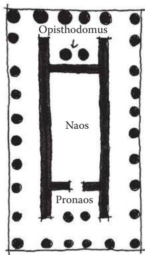  
FIGURE 1.11 Greek temples use a procession of spaces and long rectangular rooms to guide viewers to statues of their gods and goddesses.

  
FIGURE 1.12 The three orders of Greek columns. They allowed for the creation of different proportional effects in building construction and form the basic language of Greek architecture.

columned buildings "feel" light, as though they were being lifted from the ground. More important than their formal qualities is the fact that these columns are among several elements that founded the Greek architectural vocabulary. Architectural vocabularies, often referred to as vernacular, are consistent elements utilized throughout the structures of a specific culture or aesthetic. Architectural vocabularies throughout history allow specific formal arrangements to become associated with specific building ideas or uses. Buildings with recognizable forms and vernacular elements are known as types. As with the Egyptians, the Greeks' use of these linguistic architectural elements exemplifies how we will develop languages of level forms and art assets to create game worlds.

Later Greek public architecture during the Classical period (between 479 and 323 BCE) brings concepts of spatial hierarchies and arrangements even more to the forefront. The Athenian Acropolis, built in 479 BCE, utilizes a carefully planned spatial sequence to guide visitors around and into its primary buildings, the Temple of Athena Nike, the Propylaea, the Erechtheion, and the Parthenon (Figure 1.13). The approach to the Parthenon seems random, but was a carefully planned sequence of perspectival experiences. First, visitors would see the Acropolis from far away as they approached the hill on which it sat. Next, they would enter the entrance portico of the Acropolis, the Propylaea. This building offered a choice: continue onward to the Acropolis proper or divert slightly to the Temple of Athena Nike. Those who continued to the Acropolis proper would view it from behind a screen of columns, framing the statue of Athena. The Parthenon itself was viewed at a slight angle. This was intentional, as designers intended for it to be viewed three- dimensionally by walking around it and seeing it in perspective rather than seeing it straight on.

  
FIGURE 1.13 The plan of the Athenian Acropolis and a simulated sketch view of the approach to it. The designers previewed the visitor's arrival at the Parthenon several times in this spatial sequence.

This also made the composition of views more dynamic, as viewing the building straight on would give it a static feel. Visitors of the Erechtheion are likewise reminded of the Parthenon's dominance of the site, as it utilizes architectural language similar to the larger building and features a porch that offers yet another composed view of the famous building.

Later Greek urban architecture, such as the Athenian Agora—built in 150 BCE—offered not only similarly planned approaches, but also articulations of public and private space through the use of stoa, columned structures used for meetings and commerce (Figure 1.14). People could mingle as they circulated through the large open spaces of the agora, which was on the road to the Acropolis, or stay and linger in the stoa. These dichotomies of public/private, motion/pause, and large/intimately sized space will be of great use as we explore how gamespaces influence player actions.

Indian, Southeast Asian, and Asian Representational ArchitectureWhile Western civilization was growing in Mesopotamia, pockets of civilization were also growing in the Indus Valley of what is now Pakistan and Afghanistan. For much of the early history of these civilizations, cities were laid out in regular grids of houses with raised citadels.

  
FIGURE 1.14 The Athenian Agora offers a mix of public and private spaces. The large, open public spaces are generally used for circulation and travel, while the covered private spaces lend themselves to meetings and other stationary activities.

The architecture of these regions would become greatly influenced by the rise of several religions around the sixth century BCE, especially Hinduism and Buddhism. These religions all believed in the transmigration of souls and the ability to transcend the sorrows of physical existence. Key to Buddhist architecture was a symbolic verticality based on ideas of a vertical world axis. There was a belief in the cyclical nature of existence; thus building forms were hemispherical, symbolizing the earth under the dome of the heavens (Figure 1.15).

The architecture of Hinduism also links gods and worshippers through sacred forms. Hindu temples serve as homes for these gods, who were believed to enjoy mountains and caves. As such, ancient Hindu temples utilize mountain- like verticality to enclose cave- like interior chambers. Hindu temples were often places where worshippers could visit representations of the sacred mountain and holy cave important to Hindu theology (Figure 1.16).

Religion also had a great impact in the experiential architectural histories of East Asian cultures. In China, the scholars Laotzu and Confucius developed their own philosophies, Daoism and Confucianism, which would greatly influence lifestyles in the region. Daoism focuses on finding harmony with the outside world by studying nature. This would have great

  
FIGURE 1.15 Buddhist architecture, such as the Great Stupa in Sanchi, India (built between 250 CE and 250 CE) utilizes form for embodying important religious beliefs.

  
FIGURE 1.16 Angkor Wat (built in 1120 CE in Cambodia) utilized representational forms to evoke sacred locations in Hindu theology.

influence on later Chinese and Japanese garden design, where gardens became simulations of natural landscapes. Confucianism, on the other hand, focused on a respect for authority, the state, and people of superior wisdom.

Daoist ideas can be found in the concept of feng shui, which has designers adjust a building's features to the conditions of a specific site. Similar ideas have risen in Western architectural theory as genius loci, the spirit of place, which is discussed in later chapters. Principles of city planning, on the other hand, often coincide with Confucian ideas on hierarchical authority. Beijing's Imperial and Forbidden Cities are exemplary of this idea, as access to the central Imperial Court was denied to visitors by several layers of outer walls and gates (Figure 1.17).

  
FIGURE 1.17 This diagram of the layered gates in Beijing's Imperial and Forbidden Cities (built in the fifteenth century CE) typifies Confucianist urban planning ideas with layers that deny visitors access to the emperor's Hall of Supreme Harmony in the center of the city.

Chinese and Japanese domestic architecture focused largely on a modular and consistent language of architectural forms: columns, mats, screens, and other elements. The garden designs of both countries allude to natural landscapes through the orientation of rocks, trees, herbs, and other features. Despite representing natural, organically arranged forms, these spaces demonstrate how even exterior scenes can be directed experiences for occupants. The architecture of Asian temples and cities demonstrates how symbolic forms and layered experiences can be used to preview experiences to come, but deny them to viewers until they explore further into a space.

# Linear Experiences in Roman Architecture

If the cultures already mentioned were developers of experiences that offered choice and expansive simulated landscapes, the Romans were designers of linear experiences. Following the architectural forms and language of the Greeks, the Romans—whose empire lasted from the first century BCE to around 337 CE with the end of Constantine's reign—would deliver primarily engineering and structural innovations to the field of architecture. The Imperial Forums in Rome, constructed in the first

century CE, utilized spatial language consistent with Greek stoa and agora constructions (Figure 1.18). Forums such as the ones in Rome utilized public and private articulations, as well as axially arranged landmarks that moved visitors through the public spaces.

Roman temples such as the Pantheon focused mainly on a single, hierarchically important view rather than a variety of three- dimensional views, as seen in the Greek Parthenon. Instead, these temples offered visitors who entered rewarding interior vistas (Figure 1.19) that predict

  
FIGURE 1.18 The Imperial Forums of Rome. This project was a collection of several forums, including the Forum of Trajan, and landmarks that are arranged axially from one another.

  
FIGURE 1.19 Interior and exterior sketches of the Pantheon (built in Rome ca. 125 CE), which utilizes a singular embellished façade to guide visitors into a climactic interior space. This focus on one impressive façade leading into a rewarding interior was typical of Roman architecture.

how game designers can surprise players with rewarding level views. Large interior spaces were an important element of Roman architecture, owing to their refinement of the arch, vault, and dome that allowed expansive spaces. Emperor Hadrian's Villa in Tivoli, built between 117 and 38 CE, featured climactic interior spaces built around water features. The architectures made possible by the Romans' engineering power would greatly influence later cultures, who utilized the Greek and Roman architectural languages to embody spiritual ideas.

Medieval Christian and Islamic Symbolic Architecture

During the Roman Empire, a new religion rose in prominence around Jesus of Nazareth—Christianity. Early Christians were persecuted by Roman authorities and had to keep their beliefs a secret. This changed with the conversion of Emperor Constantine in 313 CE to Christianity and his making it the state religion. From 610 to 633 CE, Islam took root in the Arab world following what is said to have been an appearance by the angel Gabriel to the prophet Mohammed in Mecca. These religions, their development, and their interactions with one another would have great impact on Medieval architectures.

Like the Romans, Christians utilized modular architectural elements and axial arrangements in their buildings. Christians used these to evoke symbolic ideas of the kingdom of heaven and the hierarchical relationship between priest and congregation (Figure 1.20). The use of clerestory

  
FIGURE 1.20 The plan for San Miniato al Monte in Florence, Italy (built between 1062 and 1090) typifies Christian basilica planning with a hierarchically planned procession space toward the altar at the back of the church.

windows, windows raised above the heads of viewers to let light in from above, created the feeling of an ethereal space on the interiors of the churches through the manipulation of lighting conditions.

After the fall of the Roman Empire, Christian buildings began to take on uses and meanings beyond worship spaces.

Throughout Western Europe, church architecture continued to evolve even as the Roman Empire fell. From a period of about 476 to the 1500s CE, Europe was in what is now considered the Middle Ages or Medieval period. Despite popular belief in the intellectual stagnation of Europe during this period, many developments in literature, philosophy, art, and architecture occurred during the period. Conversely, the societal shift caused by the fall of the Roman Empire to barbarian tribes left much of Western Europe illiterate. To combat illiteracy, builders of Medieval churches focused their efforts on embedding biblical narrative into their designs with relief sculpture and mosaics (Figure 1.21). Builders became more adept at creating structurally efficient churches. The zenith of Medieval architecture, the Gothic style, was marked by the use of minimal structural stone on the interior of churches so there could be an increase in stained glass clerestory and rose windows. These filtered

  
FIGURE 1.21 Relief sculptures and mosaics were used in medieval churches to pass biblical narratives on to a largely illiterate populace.

light into the church to create an atmosphere that made patrons feel as though they were closer to God.

Islamic architecture was focused on the embodiment of religious ideas and narrative. Unlike Western civilizations, the Medieval period was a prosperous time for Islamic culture that saw advances in art, architecture, math, and science. Mosque construction would focus on the five duties that each Muslim was to perform, especially praying in the direction of Mecca five times daily. This influenced the directional orientation of mosques and necessitated the construction of minarets, tall towers from which the faithful could be called to prayer. Like Christian architecture, Islamic architecture utilized ornamentation containing passages from their holy book. The embodiment of narrative ideas would become an important one in Islamic architecture with works such as the Taj Mahal in Agra, India.

Both Christian and Islamic architectures fused the practical elements of their respective religions with the need for narrative expression. Both strove to create ethereal experiences through lighting and a separation of the outside world from the sacred space within. It is no wonder, then, that many of these structures would change hands between the two cultures over the course of many centuries, adding narrative elements unintended by the original builders. In these ways, Medieval Christian and Islamic architecture became important narrative and simulation spaces.

The Renaissance Return to Human- Centered Architecture

In the late fifteenth and early sixteenth centuries, an increased interest in classical influences, beginning in Italy, brought about a cultural, artistic, and scientific Renaissance. While Renaissance architecture returned to the architectural language of the classical period—arches, domes, and classical column orders, with elements learned from Medieval construction—there was also an emphasis on symmetry and a centralized floor plan in many Renaissance buildings.

More important for our exploration, however, is the Renaissance's emphasis on mathematical ratios inspired by the works of Plato. These studies led to an increase in humanist architectural forms, which stemmed from the belief that the human body was derived from divine ratios (Figure 1.22). Many Florentine palaces utilized different proportions for demarcating public and private spaces. Beginning with the architecture of Michelozzo Bartolomeo and Leon Battista Alberti in the mid- 1400s, it was common for first stories of wealthy families' palaces to have a taller ground floor with rusticated materials from which the

  
FIGURE 1.22 Leonardo da Vinci's Vitruvian Man, drawn around 1485, exemplifies the belief that man is proportioned according to divine ratios. Such beliefs led Renaissance architects to pursue geometries that responded to the proportions of the human body.

family could conduct business. The second floor was where the family could entertain guests. This floor, known as the piano noble, had a shorter height when compared to the ground floor, but was often emphasized via more elaborate windows (Figure 1.23). The Renaissance emphasis on human proportion shines through the architecture of Andrea Palladio. In many of his works, particularly in his villas, Palladio emphasized rhythmic classical elements and consistent room size ratios. He utilized Greek temple forms to emphasize porticos from which inhabitants could look out onto impressive vistas (Figure 1.24). In many ways, the Renaissance emphasis on space based on human proportions is vital to our own level design work. Understanding the metrics of human interaction forms the basis of our own level measurements throughout the book.

Ornamental Reformations and Material Revolutions

The centuries following the Renaissance saw many societal changes that were reflected in the architecture of the period. Beginning with Martin Luther's nailing of his ninety- five theses to a church in Wittenberg, Germany, a period of Reformation occurred within the Christian Church, resulting in the establishment of Protestantism. The Catholic Church

  
FIGURE 1.23 Alberti's Palazzo Rucellai (built in Florence between 1446 and 1451) emphasizes the height of the ground floor, while using more ornate classical language on upper floors to emphasize their importance to the owners.

responded with a Counter- Reformation movement focused on internal reforms and bringing people back to Catholicism. One of its primary weapons was a new emphasis on ornamental art, which gave rise to the Baroque style.

Baroque architecture has two main facets that will become important to us as we study level design. The first is the previously mentioned use of ornamental elements in the architecture. Works such as the Jesuit home church of Il Gesu or Borromini's S. Carlo alle Quattro Fontane in Rome utilized layered exterior ornamentation and new façade compositions that reflected interior conditions of the church to recreate the grandeur of old Rome. In many ways, the church was utilizing ornamentation not only as a system of narrative communication, as it had in the Middle Ages, but also as a system of advertisement.

  
FIGURE 1.24 Palladio's Villa Rotunda in Vicenza (built between 1566 and 1570) utilized both carefully proportioned spaces and rewarding porticos that allowed viewers to look out onto their surroundings.

Another facet of Baroque architecture useful to level designers is Baroque city planning. The first major work of this kind was the replanning of Rome by Pope Sixtus V in the late 1580s and implemented over the next century. Axial streets linked many of the major pilgrimage churches in the city (Figure 1.25). This was to aid the navigation of pilgrims from landmark to landmark. Large urban plazas, such as the Piazza del Popolo, were constructed to accommodate visitors. This type of planning would be evident in other projects such as the gardens of Versailles, which later influenced the axial street and node- based plan of Washington, D.C.

The eighteenth- century period of Enlightenment, during which intellectuals in Europe challenged ideas based on faith in favor of those based on reason and scientific enterprise, would return architectural styles to a focus on classical forms. It was during this time that Neo- Palladianism, Neo- Classicism, and a rationalization of Gothic architectural ideas flourished. The Industrial Revolution beginning in the late 1700s to mid- 1800s influenced building styles, allowing architects to build higher and wider expanses thanks to the innovations of iron and steel. The materiality and construction of buildings became something of a controversial topic during this time. In response to the engineered

  
FIGURE 1.25 Baroque city planning utilized sight lines and planned axes to link important nodes, gathering spaces, and landmarks.

rationalism of industrial architecture, the arts and crafts movement also rose. These artists and designers advocated for a refocusing on artistic quality rather than a wealth of manufactured goods. In *The Seven Lamps of Architecture* (1849), John Ruskin laid out seven lamps, or principles, of architecture for the design of great buildings.11a Among these were the Lamp of Truth, which argued for the acknowledgment of handcrafted structural materials, and the Lamp of Life, which demands expression of the human mind and hands. Ruskin's work was a great influence on architects such as Philip Webb, whose Red House in Bexleyheath, Kent, England, built between 1859 and 1860, utilized warm, natural materials such as brick and wood. The plan of this building was a reaction to the needs of occupants for light and proximity of household functions (Figure 1.26). Such explorations of naturalistic building materials and forms would be evident in later arts and crafts architects, as well as those from the art nouveau movement such as Antonio Gaudi, who merged Gothic revival language with natural ornamental forms (Figure 1.27), and Louis Sullivan, who integrated natural ornament into the structures of his buildings.12

The clashing of ideas that occurred in the centuries following the Reformation- - ornamentation as a system of rhetoric, the refocusing of cities around user experience, and the industrial innovations that ultimately

  
FIGURE 1.26 Philip Webb's Red House utilizes more natural materials than its industrial contemporaries and focuses its design on the needs of occupants.

  
FIGURE 1.27 Antonio Gaudi's Church of the Sagrada Familia in Barcelona, Spain, begun in 1882 and still ongoing, utilizes naturalistic forms expressed in a Gothic style.

led to the reassertion of natural materials—would come to a head during the twentieth century in various interpretations of Modernist architecture. The architects of this movement, including many who are discussed later in the book, would utilize architecture as an intervention into human society. Their works would influence the actions of occupants in ways that should not be ignored by level designers, who should seek to create spaces catering to the relationship between game players and mechanics.

This overview of architectural history through the lens of user experience is the basis for how we will understand gamespace in this book. Unconcerned with formal expressions, prehistoric builders emphasized

sight lines and responses to human experiences of celestial phenomena. Early civilizations and religious cultures, on the other hand, focused on form as a system of remembrance and communication—building structures that represented important landscapes or asserted their own cultural ideas. Classical cultures utilized these elements in directed spatial experiences, using axial and experiential relationships between buildings to create sequences that influenced user movement. These rules were later combined with embedded ornamentation to create spaces that emphasized both the mechanics of their use and spiritual narrative ideas. Lastly, new building technologies created a backlash devoted to preserving natural building methods and materials treasured by human occupants in contrast to cold industrial materials. These elements—user views and experience, representation, communication, lighting conditions, materials, and others—all have a great impact on how we conduct our own players' spatial experiences.

In the next section, we briefly look at the history of gamespaces to build comparisons between user- based architectural experiences and those found in games.

# THE HISTORY OF GAMESPACES

Like much of architectural history, the history of gamespaces has been influenced by the purpose of the space (i.e., the game being played) and the limitations of materials for constructing these spaces. In many ways, games are as old as the architectures that we have just explored, with early examples of both occurring in the same locations around the same time periods. Even then, it was important that gamespaces corresponded to the rules of play.

Early games such as the Royal Game of Ur and Senet, both created between 3500 and 2500 BCE, were race games whose boards reflected the pattern that players had to traverse to win the game. Later board games such as backgammon, a descendent of these race games, as well as chess, Go, checkers, and numerous others, utilized boards that embodied their rules spatially. Chess and Go are about territorial control and the capturing of opponents' pieces based on the movement rules of one's own pieces. Chess features a specific ruleset on what each piece may do, while Go features a few simple rules that apply to all pieces equally—vastly increasing the possible board combinations that can occur. As such, the spaces embody not only the rules of play, but also the potential for unique player reactions to these rules.

Physical Gamespaces and Architecture

Physical Gamespaces and ArchitecturePhysical gamespaces such as playing fields and arenas responded to the intended gameplay. Ancient analogs to modern sports such as football (soccer), basketball, lacrosse, and others utilize spatial elements in their design: goals, defensive lines, etc. When these games were eventually codified into their modern forms, they gained even more direct spatial elements: boundaries, zones for which there are rules of how or whether the ball can be possessed, and others (Figure 1.28). Once they were organized, these games often also gained spectator areas, which added out- of- game elements to the overall experience, making these games simultaneously game and performance.

In Man, Play, Games, anthropologist Richard Caillois12a identifies fundamental categories of play, one of which is mimicry, which includes theater and other staged productions.13 Like spectator sports, these events are performed in spaces whose performance area (the field for a game or the stage for a play) caters to the performance needs of the event. Boundaries and field markers in sports embody the rules of play. Likewise, the stage for a theater production anticipates the choreography of the production: How will the lighting be arranged to best show the performance? Is there an orchestra pit or choir area? Is there room for dancing if the production calls for it? How do scenery and lighting describe the setting?

  
FIGURE 1.28 Fields for various sports: football (soccer), basketball, baseball, and American football. Each of these fields has spatial elements for which there are rules governing how players may utilize them. Scoring is often related to guiding a ball to or hitting it such that the player can reach scoring territories.

Dating back to the Hellenistic Greek period, theaters have been an important civic structure. Ancient Greek amphitheaters utilized many of the elements common in theater design today, a circular area for the orchestra, a skene building that acted as the backdrop and backstage, and the proskenion, from which the performance occurred. These theaters were reactions to the needs of the theater productions and allowed for the development of performance innovations not originally intended. This included utilization of the skene as a place from which an actor could deliver lines as an unseen supernatural character or change costumes between scenes.

This modularity of uses was also reflected in stadiums such as the Flavian Amphitheater, popularly known as the Roman Coliseum. Famous as a venue for gladiatorial combat, it was also the site for animal hunts and scenic recreations that utilized real tree and animal life.14 Tunnels for the preparation of gladiators and the transportation of scenic elements were located under the spectator areas, and even in some cases under the floor of the stadium itself. The tunnels beneath the performance space featured elevators and trap doors for the introduction of animals into events. Like Greek theaters, the Flavian Amphitheater was a space for basic contests, but also allowed for elaboration based on the imaginations of organizers. Several possibilities are imagined in the 2000 film Gladiator: gladiator fights, chariot battles, historic recreations, fights with dangerous animals in a ring around combatants, and others.15

# Digital Gamespaces

In the twentieth century, the invention of electronic computers and subsequent development of games for them began the concept of designing digital spaces for games. One of the first visually displayed electronic games, Noughts and Crosses, borrows the board design from the popular game tic- tac- toe, which embodies the rules of play: line up three of your own shapes while preventing your opponent from doing the same. Another early electronic game, Tennis for Two,16 similarly borrowed its simulated gamespace from the sport tennis. It displayed the game from the side rather than the top down, necessitating a simplification of tennis's rules to focus on getting the ball over the net, but not on specific rules based on court lines (Figure 1.29). Later tennis- like games such as Ralph Baer's Tennis17 or Atari's Pong18 would depict the game abstractly from the top down, excluding shooting over the net as a challenge and

  
FIGURE 1.29 Tennis for Two had to edit the rules for tennis to accommodate the 2D point of view of the game. Player positions or court boundaries are not an issue for players, who must instead focus on hitting over the net.

  
FIGURE 1.30 Pong edited the rules of ping-pong, similarly to how Tennis for Two edited the rules of tennis, to take advantage of its top-down point of view. Players do not have to worry about the net in this game, but must move their paddle to avoid missing the ball.

concentrating on keeping the ball in play by moving a paddle on the screen (Figure 1.30).

In 1962, Spacewar!19—created by a group of MIT students led by Steve Russel—simulated a battle between two ships in space around a gravity well. Like Tennis for Two and the later games Tennis and Pong, this game occurred on one screen, but featured a wraparound feature where a ship leaving one side of the screen would appear on the other (Figure 1.31). This feature, which simulates the infinity of space, would become popular with later games, notably Asteroids20 in 1979, Pac- Man21 in 1981, and more recently the indie fighting game Towerfall.22 This feature allowed players to formulate complex strategies within the confines of a single- screen space.

  
FIGURE 1.31 Apart from being one of the first computer games and multiplayer digital games, Spacevar! was also the first game to feature a gamespace that wrapped from one side of the screen to another.

  
FIGURE 1.32 Games like Defender and Adventure addressed the problem of creating multiscreen worlds in unique ways.

For much of the early history of digital gamespaces, action occurred largely on one screen. This was due to technical limitations of hardware, as well as the engagement time of many arcade games. Games like Defender23 featured scrolling environments that occurred on the width of several screens. Atari's Adventure,24 a home game designed to be interacted with for longer than typical arcade games, addressed the problem of single- screen gameplay by displaying rooms of the gamespace one at a time (Figure 1.32). Adventure's solution would be standard for many

years in graphical adventure games such as King's Quest, $^{25}$  where players could travel from screen to screen within a larger world. Another method of creating large game worlds on limited hardware was to move away from graphics entirely and express environmental information through text. This type of gameplay had its roots in computers whose output was teletype printers rather than screens. Games such as Colossal Cave Adventure $^{26}$  and Zork  $I^{27}$  would utilize this type of space to create engaging imaginary worlds.

The spatial languages established in these earlier games were used to create more expansive worlds as computers and game consoles became more powerful. Super Mario Bros. $^{28}$  utilizes the screen scrolling of Defender to create lengthy and colorful obstacle course worlds, but adds Adventure- style rooms to create secret bonus levels both above and below the main gamespace to delight curious players (Figure 1.33). These models continued to grow and expand into bigger, more complex, and more visually interesting 2D game worlds.

Three- dimensional game worlds were also evolving at this time. One of the first was Battlezone, $^{29}$  a tank game where players could move around a 3D vector world. This game was so successful that the U.S. Army even contracted Atari to build tank simulators similar to the game. Other 3D games mainly utilized perspectival or axonometric projections (both of which are discussed in more detail in Chapter 2), mainly for aesthetic

  
FIGURE 1.33 Super Mario Bros. utilizes different 2D spatial types—side scrolling and connected rooms—to create bonus levels for surprising and delighting players.

  
FIGURE 1.34 Wolfenstein 3D was one of the first games to usher in the transition to 3D games that eventually resulted in the vast gamespaces of today.

novelty. A true 3D successor to Battlezone emerged in 1992 when developers at id Software created Wolfenstein 3D, $^{30}$  one of the earliest first- person shooter games (Figure 1.34). id and other companies would continue developing 3D software such that bigger and more interactive game worlds became possible.

The history of gamespaces is a combination of building spaces to accommodate specific game rules and play styles and allowing for unique implementations of the spaces later. This history involves overcoming the limitations of the platforms these games were built upon, especially for digital games. These earlier spaces, however, can still show us how meaningful and rewarding game experiences were created even from limited hardware.

In the next section, we look at how level designers can look at both architectural space and gamespace in ways that allow us to learn from their examples.

# WAYS OF SEEING FOR LEVEL DESIGN

To fully understand spatial design principles for level design, precedents from both real- world architecture and video games must be analyzed. The next chapter discusses drawing techniques for documenting analyses, but first we must understand how to best view designed space. Hal Box, FAIA, professor emeritus and former dean of the School of Architecture at the University of Texas at Austin, argues for an educated form of seeing architecture based on study and analysis. In this case,

seeing is used not only to describe using the visual senses, but also to process the spatial, formal, contextual, and historical elements that make a building unique.

For level designers, this type of seeing can be transformative for how we learn from the levels of previous games—both good and bad. Doing this may involve breaking some habits common to game players. For example, gamers don't usually look up when playing games. As designers, the verticality of gamespaces can be an important element in establishing the grandiosity of a setting or for communicating direction with players. For players, it is common to run directly to the next action scene rather than pause to explore game environments. Designers should look for ways to direct the pacing of a game environment in subtle ways—placing narrative elements in the way of player pathways or incentivizing exploration with rewards.

In his book *Think Like an Architect*, Box proposes ten ways for exploring and understanding a building:

1. Learn why a building was built, what it was for, and what it is now.  
2. Look up as you walk around—noticing visual elements, layering of forms, and materials.  
3. Sense the space by its size, shape, and how it interacts with light, sound, and other spaces.  
4. Train your eye to understand the structure of the building and how it holds the building up.  
5. Determine how materials are working—in compression or tension—or if they feel heavy or light.  
6. Determine how the building was constructed and from what materials.  
7. Examine the historical precedents of the building.  
8. Analyze the composition, proportions, and rhythms of building elements.  
9. Observe the appropriateness of the building to its setting.  
10. Analyze what makes the building special from others.31

Obviously, not all of these apply to game levels. While the environment art of a level can represent structures that are in compression or tension,

the game art itself will not be. Many game levels are held up by the fact that they are not defined as rigid- body objects in the game engine, and thus do not fall according to the engine's physics system. However, many of these proposed ways of seeing are applicable to game levels in their current form, or may be modified slightly to fit our purposes. Level designers can modify their ways of seeing with the following methods:

1. Identify what gameplay occurs in the space. What are the game mechanics supported?2. Look up as you walk around, noticing visual elements, especially art that contrasts the rest of the environment or somehow calls attention to itself. Also look down—is the space's verticality used in reverse to make you feel in danger?3. Sense the space by its size, shape, and how it interacts with light, sound, and other spaces. How do the lighting or sound conditions make you feel?4. Analyze the pacing of the level. Does the level usher you through itself quickly, or are there opportunities to explore? Are these required or bonuses for extra curiosity?5. Is there one gameplay style reflected in this level, or are multiple supported? (For example, does a deathmatch map have places for snipers, offensive players, defensive players, etc.? Does a game level play well for barbarians but poorly for mages?)6. How does the space express the narrative of the game? Is it a backdrop, or does exploring the level tell you about the game world in some way? Are narrative events scripted to occur around the player, or are there cutscenes?7. Examine any historical or gameplay precedents. What kinds of spatial experiences were in those games?8. Analyze the composition, proportions, and rhythms of environment art elements.9. How does level geometry compare with the movement abilities of your avatar? Is everything well within their capabilities, or does the level space challenge these measurements? Is there anything that

is outside of these capabilities? If so, does the game offer any way to expand these abilities?

10. What environment art elements are repeated? Are they interactive? If so, do they correspond to a specific gameplay mechanic?

These ways of seeing for level design, as well as the architectural and gamespace precedents found in the rest of this chapter, will guide our explorations of spatial design principles for level design.

# SUMMARY

This chapter has been an introduction to the mindset of studying architectural space, with insight into how game levels are designed. We discussed how theory could be utilized to enhance our practical level design activities. We also discussed how exploring the principles of fields outside of game design can give us a framework from which to better understand existing gamespaces.

To form the foundations of our studies throughout the book, we examined Vitruvian elements of architecture and discovered how they can help us frame our own elements of level design: functional requirements, usability, and delight. These also framed our explorations of historic architecture through a number of civilizations. Our explorations followed an emphasis on the experiential elements of architectural design—use of architectural language, spatial sequences, communicative art, materials, and others—that will be useful as we move forward through the book. We also looked at the development of spaces within games, from board and physical games and play spaces to electronic games that evolved with expanding technology. We looked at how the design of these spaces was influenced by game elements: rules, settings, and the drive to create expansive worlds. In later chapters, we see how experiential elements of architecture can help us enhance our own game levels.

Finally, we explored how we see spaces in both architecture and games. Following the suggestions of experienced architects, we formed ways of seeing for level analysis that will allow us to better identify the elements that create memorable level experiences. In Chapter 2, we explore methods not only for recording these analyses of architectural and level spaces, but also for constructing our own, both on paper and on the computer.

# ENDNOTES

1. Crawford, Chris. *The Art of Computer Game Design*. Berkeley, CA: Osborne/McGraw-Hill, 1984.2. Rollings, Andrew, and Ernest Adams. *Andrew Rollings and Ernest Adams on Game Design*. Indianapolis: New Riders, 2003.3. Salen, Katie, and Eric Zimmerman. *Rules of Play: Game Design Fundamentals*. Cambridge, MA: MIT Press, 2003.4. Schell, Jesse. *The Art of Game Design: A Book of Lenses*. Amsterdam: Elsevier/Morgan Kaufmann, 2008.5. Fullerton, Tracy, Christopher Swain, and Steven Hoffman. *Game Design Workshop: A Playcentric Approach to Creating Innovative Games*. 2nd ed. Amsterdam: Elsevier Morgan Kaufmann, 2008.6. Brathwaite, Brenda, and Ian Schreiber. *Challenges for Game Designers*. Boston: Charles River Media, a part of Course Technology, 2009.7. *The Art of Halo 3*. Roseville, CA: Prima Games, 2008.8. *Halo 4*. 343 Industries (developer) and Microsoft Game Studios (publisher), November 26, 2012. Xbox 360 game.9. Fazio, Michael W., Marian Moffett, and Lawrence Wodehouse. *A World History of Architecture*. 2nd ed. Boston: McGraw-Hill, 2008, p. 1.10. Barker, Graeme. *The Agricultural Revolution in Prehistory: Why Did Foragers Become Farmers?* Oxford: Oxford University Press, 2006.11. Bloom, Allan David, and Plato. *The Republic of Plato*. 2nd ed. New York: Basic Books, 1991.11a. Ruskin, John. *The Seven Lamps of Architecture* (Dover Architecture edition) New York: Dover Publications, 1989.12. Fazio, Michael W., Marian Moffett, and Lawrence Wodehouse. *A World History of Architecture*. 2nd ed. Boston: McGraw-Hill, 2008.12a. Callois, Roger. *Man, Play, and Games*. New York: Free Press of Glencoe, 1961.13. Salen, Katie, and Eric Zimmerman. *Rules of Play: Game Design Fundamentals*. Cambridge, MA: MIT Press, 2003, p. 307.14. Claridge, Amanda, Judith Toms, and Tony Cubberley. *Rome: An Oxford Archaeological Guide to Rome*. Oxford: Oxford University Press, 1998.15. *Gladiator*. DVD. Directed by Ridley Scott. Universal City, CA: DreamWorks Home Entertainment, 2000.16. *Tennis for Two*. William Higenbotham, October 18, 1958. Oscilloscope game.17. *Tennis*. Ralph Baer, August 1972. Magnavox Odyssey game.18. *Pong*. Atari (developer and publisher), 1972. Arcade game.19. *Spacewar!* Steve Russel et al., 1962. PDP-1 computer game.20. *Asteroids*. Atari (developer and publisher), November 1979. Arcade game.21. *Pac-Man*. Namco (developer and publisher), 1981. Arcade game.22. *Towerfall*. Matt Thorson (developer and publisher), June 25, 2013. Ouya game.23. *Defender*. Williams Electronics (developer and publisher), 1980. Arcade game.

24. Adventure. Atari (developer and publisher), 1979. Atari 2600 game.  
25. King's Quest. Sierra Online (developer) and IBM (publisher), 1983. Computer game.  
26. Colossal Cave Adventure. William Crowther (developer and publisher), 1976. PDP-10 game.  
27. Zork I. Infocom (developer and publisher), 1980. Computer text adventure.  
28. Super Mario Bros. Nintendo (developer and publisher), September 13, 1985. Nintendo Entertainment System game.  
29. Battlezone. Atari (developer and publisher), 1980. Arcade game.  
30. Wolfenstein 3D. id Software (developer) and Apogee Software (publisher), May 5, 1992. Microsoft DOS game.  
31. Box, Hal. Think Like an Architect. Austin: University of Texas Press, 2007, pp. 13-17.

# Tools and Techniques for Level Design

I as "the thoughtful execution of gameplay into gamespace for players to dwell in." As we move from discussing historic precedents from both architecture and game design, we will explore the methods we will use to design game levels according to this definition. In this chapter, we discuss what game levels do to create user experiences and some of the techniques and tools used to create game levels. We also take engine- specific workflows into account to show how you can build your own levels in game engines that are available at no cost.What you will learn in this chapter:

What you will learn in this chapter:

Level design goals for creating game experiences

Non- digital level design tools

Digital level design tools

Level design workflows

Engine- specific methodologies

# LEVEL DESIGN GOALS FOR CREATING GAME EXPERIENCES

There is something about the act of creating that stirs excitement. This is what many people who aspire to be architects and game designers seek—fulfillment in the act of creation. A sure way to excite a group of novice

game designers is to let them create things in a level editor. Much less technological but still very powerful is the act of drawing—putting the creations of one's mind on paper. Done for the sheer act of creation, making game levels in these ways is exhilarating.

However, levels made blindly in level editors or on paper are often shallow exercises, based on "wouldn't it be cool" design ideas. In the same way an architect should never begin pouring a foundation without doing a site, budget, or load analysis, game designers should never begin work without taking a very important component of games into account—players. Great or even simply good levels should be planned—not only to get an image of what the level will look like, but also to understand the kind of experience the designer hopes to create for players. Therefore, before exploring the different tools of level design later in this chapter, it is important to know that game levels are the primary tool of communication between game makers and game players.

If game levels are interpretations of gameplay, that is, the constructed system of rules that create a user experience in a game, then they are also the medium by which game designers transmit the gameplay they've designed. It is important to know this, because so often novices in level design open a game's level editor and simply begin placing objects in a scene like a child with a new box of LEGOs. To be honest, playing with LEGOs is possibly the best analogy for creating game levels for reasons that we will explore later. However, planning your levels with user experiences in mind is the difference between building a masterpiece and having a disorganized mess, even if it is a pretty mess.

As the primary tool for communication between game designers and game players, game levels should be built with three goals in mind. By reaching these goals, designers can better direct players through games and create meaningful user experiences:

Adjustment of behavior

Transmission of meaning

Augmentation of space

Concepts contributing to these goals form the content for much of the rest of this book. When reached by designers to create game levels, gamespaces with powerful communicative properties are created. Such gamespaces can deeply affect players, though they should also allow

players to create their own interactions with the game system. Before moving forward, let us briefly explore the following goals of level design.

Adjustment of Behavior

Many designers argue that a level's primary function is to teach players how to play a game. In *Indie Game: The Movie*, for example, *Super Meat Boy* artist and designer Edmund McMillen highlights how the first several levels of the game teach players how to play: He argues that through obstacles that require players to utilize Meat Boy's different abilities to pass, players will not only learn Meat Boy's different properties, but also gain a sense of accomplishment for figuring out how to play. Repetition of these situations, he argues, both reinforces gameplay lessons so they are retained and teaches players how to combine abilities, such as running and jumping, into new moves (Figures 2.1- 2.4).

Kremers argues a similar point in his book *Level Design: Concept, Theory, and Practice*, with the concept of *skill gates*.2 Skill gates are required challenges that block a player's progress unless he or she performs a specific action to pass. Such obstacles can be very simple, such as an enemy or object that players must jump over (Figure 2.5), or more complex, such as games that require you to use new abilities to escape from the room where you acquire them (Figure 2.6).

While behavior adjustment can be accomplished in these very planned ways, there are also games that allow their players to act in very unplanned ways. One celebrated (and sometimes demonized) aspect of games is their allowance of taboo behaviors and role- playing. If a game allows players the choice of many things to do, especially in massively multiplayer online games, they will take on roles that are not always necessarily heroic.

  
FIGURE 2.1 The first level of *Super Meat Boy* requires players to jump to save Bandage Girl.

  
FIGURE 2.2 The second level requires the player to use Meat Boy's wall jumping ability.

  
FIGURE 2.3 The third level requires players to combine running and jumping into a long jump.  
FIGURE 2.4 The final level demonstrates saws to the player in a non-interactive fashion before they become obstacles in future levels.

  
FIGURE 2.5 An early skill gate in Super Mario Bros. requires you to jump over or onto an enemy Goomba to pass. This teaches the player to jump.

  
FIGURE 2.6 After getting new powers in Metroid games, players must often solve a puzzle related to the new power to escape the item room.

Again, gamespaces can help facilitate this kind of role- play by providing environments that mix and match both heroic and support characters while providing mischievous players opportunities to wreck havoc.

Architecture supports both of these types of gameplay. In different cultures and throughout history, architects and builders have used spatial configurations to channel occupant activity. Throughout this book, we discuss the psychological methods that both games and buildings use to adjust user behavior.

# Transmission of Meaning

There is an ongoing debate in the game industry between those who believe that games should be understood according to gameplay mechanics, known as ludologists, and those who believe games should be understood as a narrative medium, known as narratologists. Over time, these two factions have settled their differences, and games are now often understood for how they utilize both rule- based systems and meaningful

structures together. Through explorations of this combination, new genres of games have emerged, such as persuasive games. These games communicate a message or teach players something through gameplay.

Embedding meaning in structural systems is a hallmark of architectural design. Much of architectural history is focused around sacred structures. Built for occupants who were often illiterate, pictorial representations of biblical scenes or figures of deities helped communicate the idea of what the structure was supposed to represent. Some structures, such as Gothic churches, were built in ways meant to simulate the architect's idea of spiritual places such as the kingdom of heaven.

In games, narrative descriptors contained within a game's dialog, art, and symbolism interact with formal and structural elements of game levels—rules of movement and the construction of the gamespace. Understanding how these work together helps us discern how to create meaningful game levels. Rather than simply turning to cutscenes as simple story solutions, designers can make their game levels do a lot of narrative legwork for them. This turns game levels into systems of rhetoric, the art of communicating ideas through discourse. Game theorist Ian Bogost argues that while writing and debate are classical forms of rhetoric, and while art and graphics make arguments through visual rhetoric, games and interactive media can make statements through procedural rhetoric. In Bogost's model, games make their arguments through the cause- and- effect relationships between player actions and game rules. This is explored later to show how gamespaces can help encapsulate narrative or meaningful ideas.

# Augmentation of Space

Tied in with the idea of transmitting meaning is the concept of augmenting space with information. In video games, user interfaces and on- screen icons connect players to databases of in- game information (amount of ammo, enemy information, etc.). In some games, levels can give information to players in ways that allow them to make informed decisions about what is coming next. Lighted signs in Valve Corporation's Portal tell players what mechanics a given puzzle will involve at the entrance to every chamber. Patterns in level design can inform players when bosses or other significant enemies are coming (Figure 2.7).

These types of patterned spaces can be powerful ways to communicate with players. In architecture, formal symbols are often used to communicate the function of a building (Figure 2.8). Establishing a set

  
FIGURE 2.7 Games in the Mega Man series typically use a double set of gates and a hallway to mark the entrance to a boss room. This pattern trains players to know they are about to fight a boss and builds anticipation for the encounter by slightly delaying it. Knowing that a boss fight is about to happen also allows players time to arrange their resources for the battle.

  
FIGURE 2.8 Look at these building sketches. What types of buildings do you suppose they are? Symbolic forms like these help demonstrate to observers what the purpose of a structure is without the need for signage or verbal indicators.

of formal or spatial symbols allows players to understand what's next in a level, or even what objects are interactive (Figure 2.9). Through this type of formal interaction, gamespaces build their own formal languages that can assist in the augmentation of behavior or transmission of meaning.

  
FIGURE 2.9 In many games, interactive objects such as buttons, grappling hooks, switches, and others follow similar visual language throughout so players know when to use their abilities. The game Mirror's Edge uses an interesting approach of color-coding interactive objects in the otherwise whitewashed world.

New to game development are mobile technologies that allow for information to be transmitted not only in the game, but also within the real world. Smartphones now support applications for augmented reality (AR), technology that overlays digital information on the real world. With AR- capable devices, game worlds can expand to include real- world environments. Like creating symbols in digital environments, AR apps are often programmed to recognize certain images in real space and then pair digital information with them. This can help players establish a lexicon of forms that have extra meaning in the context of the AR app.

So, what kinds of spaces should be augmented with AR to create meaningful game situations? Is it enough to put a digital layer on any real- world environment, or are there ways to plan interesting interactions through spatial awareness? Theories of urbanism may hold the key to understanding how functions of AR, alternate reality games (ARGs), and big games (large- scale physical games played in real environments) can meaningfully communicate serious ideas to players.

# NON-DIGITAL LEVEL DESIGN TOOLS

Now that we've established some of the goals of level design, we can discuss some of its tools. Like many things in the game industry, there is no one perfect tool for level design. There are many available game engines out there, a few of which are listed in this book's introduction, that you can use to create your own games. In many ways this makes games much

more of an open medium, as games can be made with many tools, even non- digital media. However, it can also make breaking in confusing for anyone looking for one set path to game development.

Due to the non- standard state of game production, an appropriate list of level design tools should be derived from the methodology you choose to adopt as a designer. Since in the context of this book, we are looking at architecture for inspiration, let us consider some of its tools and methods as a starting point for level design methodologies—beginning as architects do with basic drawings and working toward realized interactive space.

When designing levels, especially 3D ones, designers should strive to prototype their levels in interactive form as soon as possible. However, one should not underestimate the value of non- digital tools for level design. While they do not get designers onto the computer and generating work right away, non- digital sketches and maps can be of great value.

To be clear, this section is not focused on non- digital drawings as the kinds of perspective drawings that are typically used for concept art, though those certainly play a part in planning. Instead, this type of drawing utilizes architectural diagramming and drawing for several different purposes. Planning levels on paper is an obvious application, allowing designers to quickly sketch their ideas before working on a computer. However, as we will see, architectural sketching can also be useful for recording one's experiences in and understanding levels from our favorite games.

Basic Drawing Techniques

University of Washington Professor Emeritus Francis Ching said that drawing both "invigorates seeing" and "stimulates the imagination." Drawing is a core component of not only architectural work, but also visual understanding of designed spaces. It is therefore vital to understand the basics of architectural design drawing. While one might assume that good drawing for artwork is similar to that for architectural analysis, there are quite a few differences.

In architectural drawing, you are trying to capture the shapes, the two- dimensional boundaries of objects; forms, three- dimensional masses of objects; and relationships, how each object interfaces with one another in space. Perhaps the biggest difference is that architectural drawing is often meant to be more communicative than regular sketching, describing to others the forms, shapes, and relationships of spaces, and therefore must be neater and more precise—free of chicken scratch, hurried shapes, and timid lines (Figure 2.10).

  
FIGURE 2.10 These are examples of how not to draw lines or shapes in architectural sketches. Chicken scratch lines and hurried shapes can distract from the meaning of a drawing.

  
FIGURE 2.11 These line sketches show several different techniques, including adding a start and end to each of your lines, how these are used to neatly intersect lines, and how squiggled lines create directionally straight sketch lines.

# How to Draw a Line

Creating cleaner, more confident lines is easier than one might think. Two techniques can help in drawing clean, straight lines. One is beginning and ending each line with a dot or dash. These dots and dashes should overshoot where the line actually ends, so lines coming to a corner should intersect slightly. Another technique is to squiggle your lines as you draw them. This will provide straighter lines. While this seems counterintuitive, wiggling your pen slightly while you draw a straight line will cause you to concentrate more on the squiggle and less on making your line perfectly straight; the result is a line that is more directionally straight (Figure 2.11).

When creating shapes that are not linear, such as circles, it is useful to create straight reference lines and measure out the shape rather than simply attempt to draw it correctly. To draw a circle, first draw a square. Then, draw lines through the square horizontally and vertically. Now, draw arcs between each midline so that you end up with a circular shape (Figure 2.12). When drawing in perspective, circles become ellipses, so draw these by either using the sides of an object as endpoints for the ellipse or measuring the ellipse out with a square drawn in perspective.

# Contours and Line Weights

The previously mentioned drawings are contour drawings. Contour drawings follow the edges of shapes and forms, describing where objects are

  
FIGURE 2.12 To sketch a circle correctly, create a reference square and reference lines, and use them as a base to draw a properly proportioned circle. Circles in perspective flatten and become more elliptical.

  
FIGURE 2.13 This contour drawing shows the placement of buildings, trees, and other natural features in relation to one another.

in space (Figure 2.13). Contour drawing is what people often start with when learning how to draw. Contours also offer a quick way to document spatial conditions when in the field.

When sketching in contour and when drafting, line weights help communicate object distance. Line weight refers to the thickness or darkness of a line used in a drawing (Figure 2.14). When drawing with line weights, the thickest weights are assigned to edges that do not immediately connect with others, such as the outer contours of an object or group of objects. Contours of objects that directly meet other objects are given very light line weights.

# Drawing with References

When sketching designed spaces, reference lines can be used much in the same way you would when sketching shapes. If the point of sketching is to understand the spatial conditions of the scene you are observing, then it is helpful to use light reference lines to line up elements of scenery or architectural forms that line up with one another in space. Ching also recommends using your pencil as a viewfinder to observe spatial relationships.

  
FIGURE 2.14 This sketch utilizes line weight to communicate the distance edges and contours are from one another. The outer contours of objects are therefore the thickest lines in the drawing.

  
FIGURE 2.15 Techniques for using your pencil as a measuring tool and viewfinder. From these exercises, you can create reference lines that help you understand the relationships between objects you are drawing.

Holding your pencil with your thumb halfway up the shaft allows you to measure the image you are seeing. Holding the pencil further down toward the eraser allows you to use the shaft of the pencil as a straightedge to determine angles and relationships between objects so you can draw your reference lines (Figure 2.15).

# Shading

Despite the usefulness of contour drawing, you will occasionally want to describe the surface conditions of forms you are observing or the lighting conditions of a space. To do this, you will use methods of shading to describe these conditions. Shading is using your drawing tools in such a way that describes light and tonal, information related to color, values of an object.

  
FIGURE 2.16 The two described types of shading—hatching/crosshatching and scribbling. Three-dimensional forms can be described in sketches by capturing tonal values through these methods.

There are several different methods for shading. One of the most commonly used is hatching, where the artist uses a series of parallel lines to describe tonal value. When hatching, darker values are created by spacing lines closely together, while lighter values are created by spacing lines farther apart. Crosshatching is a similar technique to hatching where two sets of lines are crossed over one another to create values. Crosshatching and hatching can be used interchangeably in the same drawing to create many different tonal and textural values.

In his book, Ching describes another useful method, called scribbling, that has artists putting down more random lines to denote tonal value than one would while hatching and crosshatching. Scribbling is useful for on- site drawing situations where not a lot of time can be devoted to creating neat hatch lines. By keeping scribbling methods consistent, artists can still create neat and communicative drawings (Figure 2.16).

# Hierarchical Drawing

With all these methods, it is important to remember the purpose of your drawings—communication of the spatial conditions of places you are observing. In this way, you must remember to create your drawings in a hierarchical fashion, that is, in such a way that best communicates the information you are trying to convey without getting caught up in extraneous details. For example, when trying to sketch details on the façade of a Gothic church, it is better to focus on the church itself rather than sketching people and landscape elements around the church. Such elements can be abstracted with scribbles or rough contours.

When trying to establish your visual hierarchy, it is also important to draw in such a way that accentuates the most important part of the drawing. For example, shading or outright blacking out the unimportant

  
FIGURE 2.17 Two versions of the same sketch. One shows the proper way to establish visual hierarchy by focusing more attention onto the subject of the sketch. The other shows how silhouettes of unimportant details can take attention away from the drawing's subject. The subject of these sketches is the Martin Luther King Memorial Library in Washington, D.C. It was designed by Ludwig Mies van der Rohe and completed in 1972.

elements of a drawing can have the adverse effect of seeming hierarchically more important. Intricate details or dark values capture the eye of a viewer much better than lightly drawn lines, so you should focus details and dark tones on the part of a drawing you wish to accentuate (Figure 2.17).

Types of Architectural Drawings

Once a designer understands how to best draw for spatial design, he or she must learn the types of design drawings used to communicate the composition of a space. Each type is used to show specific information about a building design from a specific point of view. The types of architectural drawings that we will utilize are:

Plan  Section  Elevation  Axonometric  Perspective

# Plan

Plan Plans are top- down drawings of a space that show spatial relationships between the elements of a design (rooms, hallways, stairs, gardens, lawns, landscaping features, etc.) from above (Figure 2.18). Like the other construction drawing types we will discuss, they are drawn without perspective. They are drawn assuming that the viewer is observing the design from  $4\frac{1}{2}$  feet above the ground level. Masses such as walls or other objects that pass through this viewing plane (it is best to imagine a giant saw blade cut through the space at  $4\frac{1}{2}$  feet above the ground) are darkened either through hatching or poche, completely blacking in the contours of the cut form. Hatching in this case can be useful for describing material type, a technique common in many architectural drawings rendered on the computer.

Franco- Swiss architect Le Corbusier is famously quoted as saying that "the plan is the generator" in his book Toward an Architecture (popularly known as Towards a New Architecture). Indeed, plans are typically the first drawing that an architect creates when creating building designs. Plans show the arrangement and flow of spaces in a design. They provide a useful top- down view of spaces that make them suitable for diagramming (Figure 2.19). When designing levels, many designers will draw at least one plan diagram or sketch to visualize how their gamespaces will be arranged. Often viewed simply as maps, carefully drawn plans can provide meaningful spatial layouts for viewing things like level challenges and pacing, which are covered later in the chapter.

  
FIGURE 2.18 Plans show the flow and relationships between spaces in a design. Blacked-in masses show built elements. This plan shows a simple coffee shop layout.

  
FIGURE 2.19 This drawing shows how plans can be used to diagram spatial articulations in a design.

Despite these strengths, the primary downside of plan drawings is their lack of three- dimensionality. To describe spatial conditions above and below the level shown in a drawing, dotted lines are typically used, but to properly capture multilevel spaces, a different type of drawing is used.

# Section

In terms of technique, building sections are very similar to plans, as they depict a design cut along a plane. However, rather than the design being cut horizontally to show a top- down view, sections show views into the building as though they had been cut through vertically (Figure 2.20). Like plans, cut- through masses are colored in with poche. Most sections show the elevation, perspective- less drawings of the side of an object, of forms and objects past the cut line, though sectional perspectives and other combinations are quite common.

Sections are often used in tandem with plan drawings to describe three- dimensional space. According to architectural writer Matthew Frederick, "Good designers work back and forth between plans and sections, allowing each to inform the other." Sections can help a level designer map out vertical spatial arrangements for things like multilevel puzzles or battle positions in multiplayer maps. As many 2D games are viewed from the side, sections can offer the same overview of side- scrolling game levels for better planning of level pacing.

Plans are especially important for 3D titles. If you design in a two- dimensional plan, your game level will be two- dimensional, even in

  
FIGURE 2.20 A building section of Fallingwater by Frank Lloyd Wright. It was built between 1936 and 1939 in Mill Run, Pennsylvania.

a 3D game. Having several sections of the major play spaces in your levels will allow you to visualize alternate ways of transitioning from play space to play space. Sections allow you to better utilize height- based spatial transitions such as ramps, overhead bridges, cliffs to jump down, and similar structures that are difficult to encompass in a plan drawing.

# Elevation

Elevations are the third type of architectural drawing. Elevations are similar to sections, but instead of cutting through a design, the viewpoint is from the outside of the building. Elevations are used to show exterior views of a building's sides (Figure 2.21).

Architects use elevations primarily to visualize the exteriors of buildings. For real buildings, this is vital. However, game levels often lack the need for real building conditions like having both an exterior and an interior. Instead, the designer will only create those surfaces that the player will look at. Even so, elevations are still important for designing good building exteriors for scenery. Elevations in level design fall more under the category of concept art rather than spatial planning.

# Axonometric

When planning 3D video games, plans and sections must work together to correctly show 3D space. However, axonometric drawings can be used to represent a design's three- dimensionality. To create an axonometric (axon) drawing, artists take an already- made plan drawing and turn it either 30 or 45 degrees, and then project the plan upward to create 3D forms of the design (Figure 2.22).

  
FIGURE 2.21 A building elevation of Villa Savoye by Le Corbusier. It was completed in 1931 in Poissy, Yvelines, France.

  
FIGURE 2.22 An axonometric drawing. This one is a sectional axonometric, showing the extruded interior geometry of the design and the plan that forms the base of the drawing.

Axonometrics are powerful spatial planning tools. They often combine plan and elevation drawings, and can even combine plan and section to create sectional axonometric drawings like the one seen in Figure 2.22. As drawings that are derived from others, creating axonometrics is often a question of time for level designers. On one hand, they can help visualize 3D space. On the other, they take extra time to produce what could be used for creating level prototypes in your game engine.

Level designers that use axonometric drawings tend to create semi- planned axonometrics. They show the three- dimensionality of a. gamespace but may or may not fully follow a plan of the level. These can be done for several different purposes. One potential purpose is to create spatially planned concept art for a game level space, combining plan and elevation to communicate what the final level geometry may look like. Valve, on the other hand, has used axonometric- like drawings of levels to demonstrate three- dimensional gameplay concepts.10 These axons create the level space only as a visual guide rather than a plan of the actual level. Instead, they use this visual guide as a backdrop for sketches of gameplay events that will happen in the level in a three- dimensional way- - allowing for the mapping of vantage points, sniping spots, or spatial puzzles. In this way, axons become both concept art and a game design tool (Figure 2.23).

  
FIGURE 2.23 These axonometric drawings diagram a level with added notes for gameplay situations.

# Perspective

Finally, there are perspective drawings. Like axons, perspective drawings show 3D space. However, unlike axons, which are drawn without distortion, perspective drawings show how an object distorts based on the viewer's positioning relative to a vanishing point (Figure 2.24).

Perspective drawings can be drawn with multiple vanishing points. Drawings based on one vanishing point, where one side of an object is drawn without distortion in an elevation style, is called a one- point perspective. Drawings that utilize two vanishing points to distort more than one side of an object are called two- point perspectives. Two- point perspectives are the views most commonly seen from a human's eye level. Drawings using three vanishing points, most often done for views of tall buildings from above or below, are three- point perspectives.

  
FIGURE 2.24 Diagrams of perspective drawing, showing how objects are drawn to distort toward one or more vanishing points. These diagrams show one-, two-, and three-point perspectives.

Perspectives are most often used for concept art, as they are the least useful for actual spatial planning but most useful to develop the visual art of a level. They can either be drawn manually or generated through 3D underlays. Three- dimensional underlaying is when an artist creates a simple version of his or her concept art scene in a 3D art program, then paints on top of it using a digital art program like Photoshop. Such underlays are helpful for creating many versions of the same scene to develop a game's final art style (Figure 2.25).

Now that you know a few different drawing techniques and the types of drawings used to understand spatial design, we will show how these techniques can be applied to better understand and plan game levels.

  
FIGURE 2.25 This perspective sketch of a building was painted over a simple 3D rendering. Such underlays can be used to create multiple looks for the same model.

Sketching and Journal Writing

Design drawing is vital for visual understanding of designed spaces. The drawing techniques covered in the two previous sections can be applied both for spatial design drawings in 2D and for recording observations and ideas. For the architect, sketching is an important way to both capture design ideas and record elements he or she has seen while studying a piece of architecture (Figure 2.26). Sketching can also be vital for communicating those design ideas later.

In Chapter 1, we discussed a way of seeing for game levels and buildings. The guidelines for seeing include things like understanding why the level is created the way it is, what gameplay experiences it creates, what its historical precedents are, and what its spatial composition is. Early in an architect's education, he or she is taught to record these kinds of observations in sketchbooks. Using the level design ways of seeing that were isolated in the previous chapter as a guideline, we can also do similar studies for game levels. Having such a sketchbook can be vital for understanding design precedents that will be inspirations for your own levels (Figure 2.27).

  
FIGURE 2.26 Sketches such as these are important tools for both aspiring and professional architects for understanding buildings. Sketching allows the architect to both highlight elements he or she finds important in the design and gain a greater understanding of the building by recreating its forms through manual drawing.

  
FIGURE 2.27 Here are some sketches of Half-Life 2 environments derived from gameplay journals recorded during gameplay sessions. Writing down how you feel during gameplay sessions and taking screenshots can help designers mark what they will analyze with sketches like these later on.

Granted, for many games, one cannot sketch and analyze while being attacked by waves of enemies. In many cases, keeping a gameplay journal and sketchbook concurrently can help players retain their memories of gameplay. On computers, taking screenshots or videos during gameplay and adding them to your journal is also an excellent way for marking what to analyze later on. After taking appropriate screenshots and making notations about what occurs in certain sections of a game, analysis sketches can be derived from these digital recordings.

Designing on Paper

Beyond recording precedent analyses, sketching is useful in level design for quickly recording design ideas. In architectural design, initial ideas are often sketched out in sketchbooks or on trace paper. A standard way of forming design ideas on paper is to do parti sketches. An architectural parti is a simple formal study that seeks to isolate the shape a building will eventually take. These studies can be done on paper or as

architectural models, in both two and three dimensions. For buildings, these are important for understanding the formal principles that will govern a design and how a building will interact with its site, the place where it is built (Figure 2.28). Perhaps as importantly, parti studies are noncommittal, meaning that a designer can quickly create a large number of them without having to commit a lot of effort and detail into any one design, only to realize it was the wrong choice later. They also lack measurement in most cases, so designers can focus more on spatial and formal ideas rather than sizing. Parti is explored later in the chapter as an element of level design workflows.

For more measured level design drawing, a useful tool for generating paper level ideas is graph paper. Graph paper is commonly used to plot various mathematical functions- - thus the name. It comes in many types, but the type most commonly used by building engineers is Cartesian graph paper, which features a regular grid. While not always used by architects, engineers use graph paper as an aid when drafting tools like rulers and triangles are not handy. It is especially useful for figuring out the proportions of objects in a sketch. To do this, builders stipulate that one square

  
FIGURE 2.28 Architectural parti sketches allow designers to quickly understand how their design will interact with site conditions. They also help designers try different spatial and formal compositions quickly without having to commit to any one design.

on the paper represents a specific unit of measurement (1 square = 1 yard, for example), and use that as a base for generating quick but accurately measured sketches.

Spatial design for games also has a close relationship with graph paper. It is the primary tool of many who have created their own maps for the role- playing game Dungeons and Dragons. However, for video games, where the designer will eventually implement his or her design on a computer with a character that will appear to physically interact with the game world, creating architect- like graph paper drawings will help the designer figure out proper proportions for game worlds. A common mistake new designers make is to generate game levels on the computer that do not appropriately fit around a player character. In some extreme cases, this can mean that the player character cannot even go through doors.

To properly design levels, a level designer must understand a player character's metrics. Metrics are gameplay- based measurements expressed in in- engine units that describe size and movement properties of characters in games. Measurements that could be considered metrics include the size of the character, the space traversed by jumps, the space taken up by attacks, the distance traveled over time when the character runs or walks, and many other movement- based things. Many game engines employ their own basic units of measurement; one unit in the Unity game engine, for example, equals 1 meter, which can allow designers to understand the distance player characters use to do things.

Graph paper can serve similar purposes before the design is created on the computer. By stipulating that a square or group of squares on graph paper is equal to a specific unit of measurement, level designers can plan their levels according to player metrics similarly to how architects design according to specific units of measurement (Figure 2.29).

Now that you understand some of the possibilities for recording your experiences with existing levels and planning your own through non- digital means, we can move on to discussing how digital tools can help extend our planning process and bring them into implementation in game engines.

# DIGITAL LEVEL DESIGN TOOLS

The goal of a level designer should be to get his or her designs in interactive form as soon as possible. This way, he and others can playtest the level design, meaning that he plays the game to evaluate whether it fulfills its

  
FIGURE 2.29 This design sketch, showing the plan of a level, utilizes graph paper to help the designer match gamespace measurements against the size of the player character in a 3D game.

original design goals. Once a designer has taken the time to plan levels on paper, concretely forming a plan for how the level experience will play out, he can begin to digitize his ideas.

Digital tools for level design can fulfill a great many functions, in both level generation and planning. One might wonder why additional planning may be needed after spending considerable time doing architectural sketches of levels on paper. However, as we will see, digital tools can help plan spatial conditions that will be discussed in greater detail later in the book, such as the materials of different surfaces and lighting conditions, and can offer ways to plan out the measurements of environmental objects during the drawing phase.

Like the last section, this is not a prescriptive list, but rather a list of tools, what they are used for in terms of architectural drawing, and how they can help the process of level design. Again, your choice of tools should be based on your own process or the process that is most appropriate for your own games.

CAD Programs

CAD ProgramsAlthough this book does not give level designers tutorials on computer- aided design (CAD) software, CAD programs can be a useful next step for level designers that want their drawings to demonstrate more information than a single sketch can. The traditional software used by architects is Autodesk's AutoCAD. However, free alternatives like Dissault Systemes' DraftSight are also excellent, especially if CAD is used only occasionally by a designer (Figure 2.30).

There are several potentially useful applications of CAD software for level designers. The most obvious is that digital drawings have great advantages in clarity over hand drawings, as shown in Figure 2.31. Clear drawings can convey information much better than rough ones. When drafting, CAD programs can make the contents of a sketch clearer in a shorter amount of

  
FIGURE 2.30 DraftSight provides everything a level designer would need from a CAD program.

  
FIGURE 2.31 This simple CAD plan of a level shows the clarity at which level maps can be created.

time than hand drafting can. Additionally, CAD programs have features that force designers to work in logical ways that translate well into game engines.

One such feature of many CAD programs is snapping, where the drawing cursor locks, or snaps, to a point in space when within a certain radius. Like graph paper, CAD drawings can be set up on a grid of dots that can be set as snapping points for the drawing cursor. Another useful part of this system is that the grid spacing can be set to real- world units. Designers working with game engines that have specific unit measurements, such as Unity or Source, can greatly benefit from grids and snaps. With these features activated, designers can draw in regimented ways that are similar to the logic of game engines—working out measurement problems in the drawing phase. Beyond the workspace advantages, CAD programs also allow drawn lines and shapes to be copied, stored, and modified in various ways so that designers can edit quickly without redrawing things by hand (Figure 2.32).

Another useful feature of CAD software that is applicable throughout the entire level design process is modular design. In both professional architecture and level design, many designs are created out of prefabricated pieces that are ordered from a manufacturer and installed. In architecture, many components of buildings come prefabricated: plumbing fixtures, windows, doors, structural elements, curtain wall systems, etc.

  
FIGURE 2.32 This image shows just a few drawing modifications that are standard to many CAD programs. Pictured are lines and shapes that have been offset, filleted, hatched, and arrayed.

Modular design will be explored in more detail later in this chapter, but with CAD software, a standard practice is to store components that will be used many times, such as doors or plumbing fixtures, as blocks. Blocks are drawings that are stored as a separate document so they can be inserted and scaled in future drawings (Figure 2.33).

Where this applies to level design is in the discovery of what pieces of a level will be utilized multiple times. If designers use CAD software or graph paper to sketch out their levels and find themselves using a certain wall shape or environmental object multiple times, they can decide that the object should be prefabricated for repeated use. When levels go into production and 2D and 3D art is being made, the designer can have a list of what objects he will need to complete his design that he can use or give to environment artists. This kind of preproduction planning of levels allows for a LEGO- like construction method for levels rather than having to custom build each environment.

A final useful application of CAD software in level design is as line drawings for use in digital art programs. As great as line drawings are for planning levels from plan, section, and elevation, they often miss the mark in planning atmosphere. This is where rendering your drawings can be handy. If a designer is using CAD software, he can base his digital painting on a clean drawing that can become a very communicative rendering.

  
FIGURE 2.33 This toilet image has been stored as a block and can be inserted into drawings as the designer likes.

# Digital Art Programs

Rendering is the process by which a designer enhances a drawing with color and lighting information through artistic media. In this way, using digital art programs like Adobe Photoshop or the GNU Image Manipulation Program (GIMP) to do the same to level design drawings merges architectural level design preproduction and traditional concept art.

Like more traditional concept art, rendered plans can be used to convey the atmosphere of game levels in ways that concept perspectives cannot. While concept perspectives are excellent at conveying the general atmosphere of a level, they cannot properly convey changes in atmosphere unless additional design perspectives are done. With an architectural drawing of a level, designers can show the progression of a level's atmospheric effects or materials with a single drawing (Figure 2.34). Macro views like those provided in plan drawings allow designers to visualize the atmospheric progression of their levels over time.

When using these types of programs, it is wise to understand their most powerful feature: layers. Starting with Photoshop, digital art programs have allowed users to divide their images into separate layers that can each have their own special effects or adjustments applied (Figure 2.35). Like in most other pieces of concept art, layers are useful both for adding effects to an image and controlling what information is visible. For example, having notes on their own separate layer allows written information like that in Figure 2.34 to show for design discussions or be hidden for clean displays of the art.

  
FIGURE 2.34 This rendered version of the CAD map from Figure 2.31 demonstrates how additional information such as textures and lighting can be used with digital art programs.

  
FIGURE 2.35 The layers window from Adobe Photoshop. Layer effects like those applied to the layers in this image can greatly enhance level map concepts.

If your game is two- dimensional and a digital art program is where you will be creating your final art assets, you can utilize a pixel- based measurement system for sizing game objects. For example, if you are creating a character that on paper or in CAD is 1 grid square wide by 2 grid squares high and jumps at a distance of 8 grid squares horizontally, you can easily convert these to power of 2 pixel measurements supported by most game engines. Using these proportions, you could make a character that is 16 pixels wide, 32 pixels tall, and that can jump 128 pixels horizontally. You will thus know to proportion any level assets and their spacing to these measurements so that the game functions correctly.

Engine Primitives and Placeholder Art

Whether you are working in 2D and using a digital art program for assets or in 3D, where you will need to use a 3D modeling program, you should again be focusing on getting your game into interactive form as quickly as possible through a game engine. A common mistake many new designers make is to assume that gameplay cannot be tested until there is art to put into the engine. It is much more efficient, however, to design the spaces of a level and create any required scripts, pieces of code that make game elements work, while art is being developed. In this way, a level designer can test whether his or her paper designs effectively create the game experience he or she wants.

To do this, game prototypes can be created out of engine primitives, the simple geometric forms that come with some game engines. In a typical engine, this consists of cubes/rectangular solids, spheres, cylinders, and planes. Some engines may also include stairs, cones, and other shapes (Figure 2.36). Engine primitives can create a surprising variety of level geometry, and in fact, many engines' level editors are robust enough that most of the larger spatial geometry of a level can be created entirely out of primitives. For engines without primitives, like many 2D game engines, designers can use placeholder art (often also called programmer art) in the same way. Placeholder art typically consists of simple shapes—squares, circles, triangles, etc.—that are used to test gameplay until final art is imported.

Primitives can nicely follow the planning done by designers using graph paper or CAD drawings, as they are often subject to a standard system of measurements dictated by the game engine. An extreme example of this is Valve's Hammer level editor, part of the Source engine, which requires users to design on a grid with snapping always activated. It does this to avoid holes in a level, which will prevent the level from compiling into a Source game. Hammer's primitive objects automatically snap to measurements in the power of 2, so objects can have Hammer unit lengths of 16, 32, 64, 128, and so on (Figure 2.37). Many 2D engines work with similar power of 2 measurements, so placeholders should be made at those measurements in pixels.

  
FIGURE 2.36 The primitive shapes in the Unreal Development Kit (UDK).

  
FIGURE 2.37 Building with primitives in the Source engine forces users to use grid snaps similar to those found in CAD programs.

  
FIGURE 2.38 This prototype of a zombie FPS was created entirely out of Unity engine primitives. Enemies and allies were scripted to create a defense scenario where players had to hold off a horde as long as they could before being overwhelmed.

Another benefit of getting right into primitives is that designers will have full access to an engine's systems, such as particles, lighting, and others that can influence the look of a game. In this way, they can begin to test gameplay scenarios against their atmosphere as early as possible. Combined with scripting, designers can create rather robust prototypes of their games without the need for developed artwork (Figure 2.38).

# 3D Modeling Programs

In 3D game engines, environmental objects are designed in 3D modeling programs and imported into the engine itself. Like working with 2D level assets or level primitives, these 3D assets can be created according to measurement systems defined during planning stages. The degree that you will have to use 3D programs to generate level geometry will vary by engine: UDK and Hammer's level editing system allows designers to do a lot of work in- engine, while it is best to model level geometry for Unity elsewhere. For the engines with rich level editing power, the main environmental models that will be imported will be decorations or specialty items: furniture, mechanical parts, alien architecture, etc. In these cases, scale is less of a factor. However, if you are using an engine where most of your level geometry, including the actual rooms of a level, must be imported from a 3D modeling program, managing scale between the 3D program and engine is very important.

Like engines, 3D content programs have their own scales and measurement systems that designers can build their models to, typically defined as a generic unit. If the environment artist translates level geometry measurements from paper into the 3D program's unit system, for example, 1 grid square  $= 1$  unit, then objects can be built to proper scale with one another.

One simple methodology for bringing environmental models from a 3D program into an engine and maintaining their scale with one another is to model your entire level in the 3D program (Figure 2.39). It can also

  
FIGURE 2.39 This jungle level was modeled in its entirety in a 3D program and then imported into the game engine as individual landmasses. Aesthetic elements like the river that flows through the level were modeled to fit around the pieces. This created a system that was prescriptive, but that allowed for adjustments to be made in-engine without having to go back into the 3D program.

be convenient for building environmental decorations, as they can be built and arranged in context with the rest of a level (Figure 2.40). This method also offers memory advantages, as some game engines will find a single model much easier to render. The problem, however, is that you are modeling your level in a non- interactive program, so testing can be very slow. Proper planning of your unit metrics (the character jumps 4 units far, so gaps should accommodate that, etc.) can help alleviate this problem, but testing your level layout requires awkward exporting and importing. For this, it is better to establish a system for dividing your level up into parts in the 3D program and assembling it in your engine (Figure 2.41).

Importing 3D models into engines is where managing scale becomes difficult. Since each 3D program and engine has its own measurement system, they may not sync up when 3D objects are imported into an engine.

  
FIGURE 2.40 In this close-up shot of the model from Figure 2.39, environment décor can be seen. Each was modeled on the landmass to check for proper proportion, and then exported individually into the game engine where it could be copied and arranged as needed.

  
FIGURE 2.41 To create a series of city levels for the game SWARM!, tiles were created in 3D programs and imported into the engine so a few parts could be used to create many level designs.

It is common for objects to import at very big or very small sizes in comparison to a scene, so some understanding of the relationship between your 3D program's measurements and your engine's measurements is in order.

If you are modeling all of your level objects at a standard scale in your 3D program, such as the previously mentioned 1 grid square  $= 1$  unit, then all of your level geometry should import at the same scale. If, for example, you find that your objects are importing at 1/20 of the size they are supposed to be, you can import each of your similarly proportioned objects at twenty times their size. If you modeled at the same scale, then each object should import at the same scale, requiring you to remember one scale factor.

An alternative to scaling objects when you import them is figuring out the proportions between units in your 3D program and units in your engine. For example, 1 unit in both Maya and Blender  $= 1$  unit in Unity. This is not always necessarily true for 3D Studio Max. However, Max can use real- world units, so designers can model in proper scale if they utilize the metric system, as 1 Unity unit  $= 1$  meter. Other engines have similar proportions. Once they are figured out, you can even build a scaling model for your 3D program, which is often just a box built at the standard scale of a character or unit that is used as a "measuring tape" for building level geometry (Figure 2.42).

Now that you understand the digital tools of a level designer and how they are implemented in level building, you can use them to generate

  
FIGURE 2.42 This screenshot shows some level geometry tiles for the side of a building alongside some reference models, shown in a darker color. The rectangular solid model is scaled to the size of a character, while the planar level geometry reference models are scaled to be 1 unit by 3 units and 3 units by 3 units in the game engine. Also pictured is a reference model for a door.

your own game levels. In the next section, we discuss some workflows for designing levels and implementing the tools we have discussed.

# LEVEL DESIGN WORKFLOWS

The American architect Louis Sullivan, often credited as the creator of the skyscraper, once famously said, "Form ever follows function." This was shortened to the famous design idiom, "Form follows function." With this phrase, Sullivan stated one of the driving principles of architectural Modernism. Modernism was an architectural movement of the early twentieth century defined by an emphasis on creating buildings whose form was derived from their purpose. In Modernist architecture, ornament was generally a product of the building itself or applied for a purpose, rather than simply for the sake of aesthetics. Similarly to Sullivan, Le Corbusier stated, "The house is a machine for living in." Much of his architecture, as with the architecture of Frank Lloyd Wright, Walter Gropius, Louis Sullivan, and others, was focused on purposefully creating an experience for the occupants.

As we have seen, the same can be said of level design. In level design, developers often design with a specific experiential goal in mind. In a 2008 interview, Valve level designer Dario Casali argued that "experience is key" when creating level design ideas.11 We have previously discussed some goals of level design that related to how users use gamespace and how we as designers communicate to the user through the space. These experiential goals should dictate how we as level designers construct space: form follows function.

In the previous section, we discussed some tools used by level designers, from drafting ideas on graph paper to using scaling models and measurement systems in engines and 3D programs. In this section, we will discuss some workflow processes that involve these tools, beginning with how "form follows function" fits into game design.

# Form Follows Core Mechanics

The tenets of form follows function thrive in game design through a concept known as the core mechanic. A core mechanic is often defined as the basic action that a player makes throughout the course of a game. In his doctoral dissertation, game designer Aki Jarvinen created a core mechanic- centered design method where designers began from verbs.12 If one looks at core mechanics as the basic verb of what a player does in a game, one can understand the foundational elements of what builds each

game's unique experience. For example, Super Mario Bros. $^{13}$  can be said to be about jumping, *The Legend of Zelda* $^{14}$  is about exploring, *Katamari Damacy* $^{15}$  is about rolling, *Angry Birds* $^{16}$  is about flinging, and so on. Beginning from this core, other actions are added that define the rules of the final game product.

When designing levels, having a similar core mechanic idea in mind is necessary. While many new designers assume that individual levels should simply follow the core mechanic of the game, it is possible to define level core mechanics to make each unique. An example is the Badwater Basin level (Figure 2.43) of Valve's *Team Fortress 2 (TF2)*. $^{17}$  In this level, the game's Builders League United (BLU) team must push a bomb into their opponent, the Reliable Excavation Demolition (RED), team's base via a mine cart on a track. The mine cart mechanic of Payload mode, for which Badwater Basin is a map, takes TF2's standard team- based first- person shooter (FPS) mechanics and adds a twist. This changes not only the mechanics of gameplay, but also the conditions of the level's spatial geometry.

One example cited by Casali, who helped design Badwater Basin, was the level's tunnel. In the first prototypes of the level, designers made the

  
FIGURE 2.43 A plan diagram of Badwater Basin from *Team Fortress 2*. RED and BLU team bases are marked on the map, as are major circulation areas and BLU checkpoints between the two bases.

  
FIGURE 2.44 Modifying the width of the tunnel in Badwater Basin allowed for better circulation of both the player and mine cart through the level and made gameplay less aggravating for the offensive team.

mine tunnels a standard width that they had used for other basic maps. However, upon playtesting the level with the mine cart- pushing mechanic in place, they realized that tunnels had to be widened to accommodate both players and the cart. This seems like a small change, but it prevented a lot of aggravation from players that had been getting blocked out of tunnels by the cart (Figure 2.44).

This ties back to the idea of utilizing measurement systems for levels based on gameplay metrics. As level designers, it is our job to design to the realities of how player avatars and other gameplay elements move through levels. Traversing levels is comfortable when level spaces comfortably accommodate metrics. As we explore in later chapters, gameplay drama can be achieved when we create spaces that push metrics to the limit. Such spaces include gaps that require the farthest possible jump a character can make, such as the one found in world 8- 1 of Super Mario Bros. (Figure 2.45) or tight corridors that restrict movement in horror games, such as Resident Evil $^{18}$  (Figure 2.46).

Designing to gameplay does not solely have to involve measurements either. It can also mean designing to specific character abilities such as special attacks or movement modes. Stealth games like Metal Gear Solid $^{19}$  provide a great example of how to construct levels based on different types of character movement. In Metal Gear Solid, the player character, Solid Snake, has the ability to hide behind walls and look around corners.

  
FIGURE 2.45 This section of Super Mario Bros.'s level 8-1 pushes Mario's jumping metrics to their limit. The gap is 10 blocks wide, 1 block longer than Mario's running jump distance of 9 blocks, so using the 1-block-wide middle island is necessary. Most strategies for crossing this gap call for a running jump to the middle island, and then another quick one off the 1-block-wide island so Mario's landing inertia doesn't launch the player into the pit.

  
FIGURE 2.46 Many hallways in Resident Evil are barely wide enough for two characters standing shoulder to shoulder. In this way, a single zombie in these hallways can become a significant threat for players trying to get past. This spatial condition also gives the game a claustrophobic atmosphere.

This vastly changes the meaning of 90- degree corners when compared with other action games—they are strategic hiding places rather than just level geometry. As such, the nuclear weapons facility that makes up Metal Gear Solid's environments has lots of these corners so players can sneak from place to place, looking around corners to find their next refuge. While not measurement or metric based, these kinds of layouts are based on the character's own mechanics, the gameplay actions that form the range of possibilities for how a character may act or interact with his or her environment.

# Level Design Parti

Earlier we discussed the architect's parti, basic formal explorations that architects utilize to determine what shape or orientation they want their building to take. For level designers coming off of determining the core mechanics of their level, a parti is another valuable tool for developing the spatial layout of their level.

Designing with parti is quite different than designing on graph paper or computer. Partis are meant to be sketches, and therefore will lack measurement. While this may seem contradictory to the rest of the advice in this chapter, sketching exercises allow designers to form ideas quickly before spending the time to plan measured versions of their designs. The key to a level designer's parti is to sketch gameplay ideas as spatial diagrams. For example, a level design parti of the Badwater Basin level would be two large masses (representing the teams' base areas) with thinner zones of circulation in between the two to represent the mine cart track, and some smaller bases for BLU players to capture, similar to the diagram in Figure 2.43.

In his discussions of level design from Indie Game: The Movie, Edmund McMillen argues that once a designer has created environmental mechanics, that is, interactive parts of a level that factor into gameplay, they should be usable in many different ways in order to be valuable. For e4 Software's mobile game SWARM!,20 a ball- roller/platformer game where players had to lure enemies into traps, programmer/designer Taro Omiya created many sketches of the electric fence traps to visualize the different uses they could have (Figure 2.47). Likewise, Omiya and others working on the game made formal partis on the computer and on paper to visualize spatial orientations of levels, such as downhill slides, floating islands, and platforming areas (Figure 2.48).

  
FIGURE 2.47 Once designers for SWARM! created the electric fence traps, they sketched many gameplay partis of them to visualize how they could be utilized through different levels.

Pacing Your Levels with the Nintendo Power Method

A downside to planning out individual bits of gameplay is not understanding how they relate to one another within a level. This is where drawing techniques for graph paper and other measurement- based tools come in. Arranging gameplay properly is known by level designers as pacing.

Pacing is based on the concept that in order for gameplay action to seem exciting, it must be contrasted with moments of "quieter" gameplay, such as puzzle solving, exploring, or even playing with a character's movement possibilities. As we show in later chapters, spatial contrast is very important for building meaningful experiences in both games and architecture. As such, we must learn how to control how we pace our levels in games.

In reality, the kind of top- down level design done on paper should occur from two different points of view: macro- scale level design and micro- scale level design. The parti for TF2's Badwater Basin is a macro- scaled design, as it shows the entire level and diagrams how it creates the intended gameplay. On the other hand, the partis of traps and level pieces from SWARM! are micro- scaled designs, as they show individual gameplay instances divorced from an entire level. Many new designers make the mistake of putting intense micro- scaled gameplay instances together in succession in their levels. Proper pacing would have gameplay points like this separated from one another by periods of quieter gameplay.

To circumvent this, it is useful to use the Nintendo Power method of level design. Nintendo Power was a game strategy and news magazine published by Nintendo beginning in the late 1980s. For some time, it was

  
FIGURE 2.48 Formal partis for SWARM! show the visualization of different spatial orientations such as hills, tilted ledges, and others.

  
FIGURE 2.49 Maps in Nintendo Power magazine show the entirety of a level and highlight important points of gameplay on each map.

a valuable source of secret codes, hints, and tips on how to beat games on Nintendo consoles. For many games, Nintendo Power would publish detailed maps of levels with caption balloons that would highlight particularly noteworthy or difficult points of gameplay (Figure 2.49). For level designers, these maps can be a valuable lesson on pacing.

Nintendo Power maps show a level from a macro- scaled point of view, so a reader can see a game level in its entirety. At the same time, it highlights important gameplay moments on the micro- scale so readers know what to look out for to reach secret rooms or beat difficult obstacles. It should also be noted that the highlight balloons on these maps were not butted against one another in quick succession, but rather spread evenly across a map. This is less a result of the magazine's publishing and more a result of proper pacing by the game designers. When designing levels, we can utilize the same mindset by treating our level drawings as ones from Nintendo Power, creating the overall scope of a level on a macroscale and evenly spreading out micro- scaled areas of more intense gameplay across the entire map. In between the "loud" gameplay moments should be circulation spaces—spaces for movement- based gameplay, movement- based obstacles, exploration, or even rest and recharging of the player character.

Without quiet moments to contrast moments of high action in a level, the game can turn into a never- ending slog rather than an exciting experience. Even with the most careful planning, however, a designer is bound to miss something. That is why it is important to play a game as much as possible and have others play it, which will take us to our next level design workflow.

Iterative Design with Playtesting

Iterative design is a term borrowed from human- computer interface design. It describes a cyclical design process where the designer produces a prototype of his or her work, tests whether a user can properly interact with it, evaluates the results, makes changes to the design, and tests it with a user again. It is not unlike the scientific method, where a scientist tests a hypothesis with repeated experimentation.

Game designers test their ideas by holding playtests of their games. Salen and Zimmerman call game design a second- order design problem. They say in Rules of Play, "You are never directly designing the behavior of your players. Instead you are only designing the rules of the system."21 Salen and Zimmerman are pointing out that designing a game is very different than designing a directly relatable object such as a cup or a chair—you are creating a context for players to inhabit. This directly ties to the idea that a game level is a medium of communication between players and designers.

Much like how an architect will bring clients in to see and evaluate work, game designers bring their eventual clients—their players—in to playtest their game. To understand whether the experience you intend happens in your game levels, it is important to watch others play your game in both non- digital and digital forms, depending on your stage of development. As you watch people play your levels, keep these things in mind:

Do they understand how to play the level? When discussing adjustment of behavior, we saw that teaching is an important mission of level design. If a player does not understand a puzzle that you intend to repeat, he or she may need a better or more transparent introduction to the mechanic before reaching the iteration of it that he or she is stuck on.

Is the level too hard for the player? This mainly applies to early levels of a game, though you should always avoid sudden increases in difficulty without proper balancing or player preparation. If a player is getting stuck on a challenge or puzzle ten minutes into your game, you should perhaps place that challenge later in the game or build easier levels and put them before the challenge the player is stuck on. Playtesting is important because as you play your own game, you become very good at it and can no longer see when things are too hard.

Do not interfere with their play. When people buy your game, they will not have you there to explain how it is supposed to be played. Thus you should not stop a playtester to explain what he or she is supposed to do. If he or she cannot figure it out, you should add more teaching moments to your levels.

Embrace happy accidents. Sometimes playtesters reveal a strategy, solve a puzzle in a unique way, or "game" the system to create new abilities. For example, entire areas of SWARM! levels are skippable if you know where to jump from. When you see players performing an action or using a level in a way you did not intend, evaluate whether it is game breaking. If it is not, but could instead be an interesting secret to find, leave it in.

Playtest for the current stage of development. Lead playtesters to give you feedback on issues that match your stage in development. Major gameplay feedback should occur early before assets are created, while late feedback should focus on finding bugs, errors that can inhibit the experience of, halt any progress in, or even crash the game. Feedback on gameplay mechanics or art, for example, has no place a month before launch when testing should focus on finding bugs. Ask playtesters prepared questions relating to the information you want from them or create a paper survey for them to fill out.

Ask for additional comments, but stick to your guns. While you want focused feedback, it is good to get additional comments in case play- testers have any happy accident statements that could help you out. Be prepared, though, for a slew of ridiculous suggestions. Playtesters are often very enthusiastic to help with the development of a game and will give design input of "things you should totally put in the game." Learn to properly vet these statements for things that can help in that stage of development versus the ones that will break your game's core vision. Also learn to dismiss bad ideas in a friendly and non- condescending way.

As playtesters try your levels throughout your process, document what went well with each prototype and what could be changed or improved. Change your design and have someone playtest your next prototype. The next two sections will discuss prototypes of two kinds: non- digital and digital.

# Non-Digital Prototypes

For years, game developers did not playtest a game until it was in beta stage, that is, the stage prior to release where asset production is already complete. This can be a dangerous way to playtest a game, as it is too late to fix fundamental design issues. In the last few years, a great deal has been written on testing throughout the design process, starting with nondigital prototypes of games. Even before game ideas are put into a computer, designers can use non- digital prototypes to explore the playability of their games.

Most publications detail non- digital prototypes for game mechanics. However, level designers can utilize non- digital prototypes as well in certain types of games. In her book Game Design Workshop,22 Tracy Fullerton describes how EA utilizes a real- life sandbox to test levels for the Medal of Honor series. Designers utilize plastic trees, toy army men, and battlefield models to draft exterior levels. The authors also describe a board game prototype of a first- person shooter game, where the designers have defined movement rules for players moving army men around a hexagonal grid (Figure 2.50).

Like the Nintendo Power method, non- digital prototypes can define. gamespaces on both the macro and the micro scale. Student projects from the Introduction to Game Design course at George Mason University,23 for example, show that non- digital prototypes can reveal spatial realities of different parts of games. One prototype required players to progress their knight character through different stages of a Candy Land- like board until they reached the princess at the end. The designers, seeking a storyheavy role- playing adventure game, opted for a board with a linear path with minimal forks. In many ways, this board is an interactive parti for the

  
FIGURE 2.50 A non-digital prototype of a first-person shooter utilizing a hexagonal grid and army men. Designers place matchsticks on the board to define walls. The matchsticks are ideal for a simple prototype, as they can be easily picked up and moved to try different spatial articulations.

entire game, showing the designer's intent of creating a linear experience based on specific story beats rather than player choice. As a demonstration of the game environment on a macro level, it allows players to play with the linear progression of general gameplay situations but not dig deeply into each one.

A different student project prototyped a stealth game where players must elude guards, rescue their fellow prisoners, and escape a prison yard. This game focuses on micro- level gameplay prototyping by allowing designers to explore issues such as enemy movement and character interaction in a single room of the prison. The version demonstrated in the class utilized a completely open room devoid of any walls, as the designers were focused on defining how characters would move. However, further iterations of the board could potentially explore how the movement rules could work in more complex hallway and cell block- like environments.

While non- digital prototypes can offer an abstracted trial of macro and micro spatial gameplay, digital prototypes allow designers to test the gameplay of specific environments through a process called whiteblocking.

Digital Prototypes with Whiteblocking

When developers have moved from prototyping off the computer to prototyping in digital form, they create test levels through a process known as whiteblocking. Whiteblocking is when a level designer creates a level out of simple geometry, most often white or textured blocks (thus the name), to test whether levels accomplish the gameplay goals he or she wants. Early on in the design process, when designers are trying to define gameplay metrics of player characters and other things, whiteblocking can help determine what gameplay measurements should be. Designers can draft the spatial characteristics of their levels in a parti- like way, testing the sizes and shapes of certain environments for different gameplay experiences, before specific environmental art is added to a level (Figure 2.51).

The geometry used to whiteblock level spaces is usually the simplest needed to simulate the colliders that will be used in the eventual final level design. Colliders are a component of objects in game engines that simulate the interaction between physical objects. A box collider attached to a piece of level geometry, for example, will cause that object to interact with other objects as though it is the shape of a six- sided box, regardless of the shape of the actual environmental art (Figure 2.52). Colliders can be simple geometric shapes or can be made to tightly fit organic shapes.

  
FIGURE 2.51 Whiteblocking done for SWARM! shows how an important section of a level meant to teach players how to kill enemies was thoroughly tested in simple geometry before environment art was added.

Valve uses whiteblocking extensively in its level design process. The construction rules for engine primitives in their level editor, Hammer, allow rapid 3D level prototyping through simple and precise building. Hammer's primitives, called brushes, are used to roughly define level spaces, which are then playtested to see if the intended experience is created. Level designers see what worked properly and what did not, and then change the spaces by editing the brushes. When the designers find themselves editing little of major spaces and instead focusing on smaller details, the level is ready for environment art.

As an iterative process, whiteblocking begins with almost parti- like interactive forms of levels and moves designers toward more art

  
FIGURE 2.52 This plant has a box collider attached to it. Though its 3D model has an organic shape, player objects in a game will interact with it as though it were a rectangular solid.

and ornament- centric design decisions that are not unlike interior design. As level geometries become better defined, standard pieces of environment art can be defined as well, eventually becoming the building blocks of levels. Metric- centric environment art is an important part of the design process that is discussed in the next section.

# Modular Level Design

An advantageous aspect of building levels with engine primitives is that these primitives are standardized within the engine and easily repeatable. They are modular, that is, premade parts that can be copied, assembled, disassembled, and moved easily. Since the Industrial Revolution, buildings have been made of modular elements. Many of these are prefabricated, created at a factory and assembled on the building site. Modernist architects were great proponents of modularity in their buildings. Phillip Johnson and Ludwig Mies Van Der Rohe, for example, are famous for designing buildings with prefabricated steel and glass components. Le Corbusier designed Unite D'Habitacion, an apartment building where the apartments were created as modular units and stacked together (Figure 2.53).

We have used LEGO building blocks as a metaphor for level design; modularity is the reason for this. Game development is a work- intensive process, and an intelligent designer will utilize easily repeatable game

  
FIGURE 2.53 An apartment cross-section and model sketch of Unite D'Habitacion by Le Corbusier.

objects and textures to lessen the need for constant recreation of art assets. If designers create a set of modular pieces like those shown in Figure 2.41, levels can be assembled like sets of LEGOs rather than difficult- to- change custom artworks.

Creating modular assets can also aid the metric- based measurement methods outlined earlier in the chapter. The designers of SWARM! utilized modular tiles for some of their non- organic level designs. Building in predefined tiles allowed for the easy measurement of game environments such as skate parks and mazes. For example, the designers realized that two- unit- wide tiles was the smallest unit that could be balanced on by players using the game's tilt controls without the game feeling unfairly difficult. For labyrinth- like puzzles where the player had to navigate a narrow maze without falling into electrified floors or pools of acid, the two- unit tiles were used to build the ledges.

Even for less measurement- based pieces, such as organic landmasses and plants, having modular pieces made construction of SWARM! levels simple. Less measurement- based objects like landmasses and trees could be scaled to any size without the art looking awkward compared to other objects. They could also be rotated in any way the designers wished, should up- or downhill areas be required for a level.

Architects track modular elements of their buildings through documents called building schedules. A schedule is a chart that specifies prefabricated

products, such as doors, windows, or plumbing fixtures, the sizes of such products, and where they should go in the building (Table 2.1). The modular pieces used by level designers can be documented very similarly, especially if the pieces follow measurement- based construction systems.

In game art direction, it is common to utilize style guides—documents that establish color, graphics, measurement, and other artistic standards—for maintaining graphic consistency with a team. Level design schedules can offer similar utility for level construction. A schedule for the half- pipe shown in Figure 2.54 might look like that found in Table 2.2.

Even for scale- less pieces such as trees and plants, schedules can help establish the style guide for a level by listing the pieces that will make it up.

TABLE2.1 Door Schedule  

<table><tr><td>Quantity</td><td>Door Type</td><td>Door Material</td><td>Frame Type</td><td>Frame Material</td><td>Door Opening Size</td><td>HDW Set</td></tr><tr><td>1</td><td>1</td><td>Wood</td><td>A</td><td>HM</td><td>3&#x27;0&quot; × 7&#x27;0&quot;</td><td>05</td></tr><tr><td>2</td><td>10</td><td>WE and TG</td><td>A</td><td>HM</td><td>3&#x27;0&quot; × 7&#x27;0&quot;</td><td>14</td></tr><tr><td>3</td><td>1</td><td>Wood</td><td>A</td><td>HM</td><td>3&#x27;6&quot; × 7&#x27;0&quot;</td><td>03</td></tr></table>

  
FIGURE 2.54 A half-pipe level from a 3D game.

TABLE2.2 Level Tile Schedule, SWARM! Level 1-3  

<table><tr><td>Quantity</td><td>Model Type</td><td>Model Name</td><td>Location</td></tr><tr><td>15</td><td>Half-pipe side</td><td>Skatepark01_2x2.blend</td><td>Skate park 2</td></tr><tr><td>8</td><td>Half-pipe ground</td><td>CityFloor_Concrete_2x2.blend</td><td>Skate park 2</td></tr><tr><td>4</td><td>Electric fences</td><td>CityTrap_ElectricFence02_2tile.blend</td><td>Skate park 2</td></tr></table>

In this way, schedules are useful for both listing the pieces that will make up certain environments and assisting with art direction.

Now that we have explored several workflows for level design, we will demonstrate the tools in several popular game engines that more specifically detail how levels are constructed.

# ENGINE-SPECIFIC METHODOLOGIES

Just as there are a great number of level design methodologies, there are also many game engines that game designers can choose from. While it is outside the scope of this book to give specific tutorials on any one engine (there are many other excellent books that do that at great length), we will learn how an architectural design method can apply to engines actually used for game development. For maximum benefit, we explore four popular engines, Game Maker, the Unreal Development Kit (UDK), Source's Hammer Editor, and Unity, to discover engine- specific factors that will influence how you design your own game levels. It should be noted that this section will address engine- specific methods and concerns, so the use of importing modular objects from 3D art programs—which each engine is capable of—will be explored only for engines where it is an absolutely necessary part of the level construction process. If you are using engines other than the ones listed here, there should still be information that you can migrate to your own software of choice.

# Game Maker

Game Maker is a 2D- focused game engine created by YoYo Games. For many new designers, it is a great piece of software to learn with. Two- dimensional games are often much simpler to create than full 3D games due to both programming complexity and the amount of art required for a 3D game to look visually complete (minimalist art styles notwithstanding). Game Maker earns its reputation as a great learning engine by allowing users to create games with drag- and- drop logic elements rather than requiring the use of a scripting language. As designers gain skill with Game Maker, they can utilize Game Maker Language (GML), the engine's internal scripting language, and also create simple three- dimensional games with its limited 3D capabilities (Figure 2.55).

For designers utilizing the architectural methods discussed earlier in this chapter, especially those centered on grid- based measurement, Game Maker is an excellent tool for practicing level design. Levels in Game Maker are constructed as rooms, which are analogous to the scenes used in other

  
FIGURE 2.55 The Game Maker interface with a 2D game level being built according to power of 2 measurements.

game engines. When creating a new room, the window for that room displays a grid spaced according to power of 2 pixel measurements, such as  $16 \times 16$  (the default),  $32 \times 32$ ,  $64 \times 64$ , and so on. Snap settings can be set to non- power of 2 measurements, though such measurements require more memory for a computer to process than power of 2.

Assuming the use of these units, 2D level objects can easily be drawn to conform to grid square size and placed on the room grid itself. Also, following the Game Maker grid system helps plan out game character movements in the same way that graph paper can—according to measurement- based movement metrics. By understanding how your character moves in relation to the grid squares, level objects can be sized and spaced accordingly.

# Unreal Development Kit (UDK)

The first of several 3D engines this section will examine, the UDK is a free- for- non- commercial- use version of Epic Games's Unreal Engine 3, the engine originally used to create Unreal Tournament 3. The UDK is a popular engine thanks to its powerful level editor and advanced lighting capabilities. The level editor allows for the quick creation of levels within the engine itself with UDK's binary space partitioning (BSP) brushes. The default texture settings for the BSP brushes result in nicely textured surfaces, lessening the need for applying textures to simple objects via the UV unwrapping functions of 3D art programs (Figure 2.56).

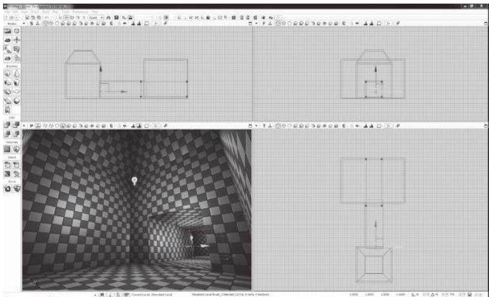  
FIGURE 2.56 A screenshot of the UDK interface while editing a hollow room. The checkers on surfaces demonstrate how textures automatically tile across in-engine objects, greatly lessening the need for UV mapping of environmental geometry.

When editing in UDK, as with the other engines we will discuss, understanding the unit system is vital for sizing objects. In UDK, a character is typically 96 UDK units tall. While this measurement does not have the simplicity of power of 2 settings employed by engines like Game Maker, designers can still use it as a base for their work. When using models imported from 3D art programs, which UDK refers to as static meshes, to build levels, it is recommended that you use a scaling model to generate metric- appropriate static meshes.

Source's Hammer Level Editor

Source debuted in 2004 with the games Counter Strike: Source and HalfLife 2. Like Unreal Engine 3, which debuted the same year, it remains a popular choice for designers thanks to consistent updates. Source is usable by anyone with a copy of a Source- built game and is downloadable on Valve Corporation's Steam distribution platform.

Source's internal level editing program, Hammer, combines much of what makes engines like Game Maker and UDK appealing. Like UDK, Hammer is a 3D- focused engine and allows users to edit geometry with geometric primitives called brushes. Like Game Maker, it features a power of 2- based grid system for editing levels with controllable snaps (Figure 2.57).

  
FIGURE 2.57 A screenshot of Hammer, showing a simple level built out of brush primitives. Hammer's brushes are editable, so objects such as arches and domes can be built in-engine.

Hammer's snap settings are vital for creating levels in the engine, as environments must be fully closed in order to be compiled, or processed into levels that can be run in Source games. The snap settings help users build levels that work around this limitation, but that also help create metric- appropriate geometry.

Hammer's texture system also conforms to its power of 2 focus. By default, textures imported into Hammer appear at a size dependent on their actual file size. For example, a  $128 \times 128$  pixel texture will always import at the same size. While these sizes are editable on individual brush faces, or sides, the default sizes are consistent such that the editor even includes test textures that feature notes on texture size (Figure 2.58). This level of consistency allows for powerful metric and measurement- based editing.

# Unity

The final engine we will discuss is Unity, a 3D- focused engine that has become popular among both large and small studios. Unlike the other 3D engines discussed here, Unity was not developed as a tool for any one specific game, but is rather a tool for creating an array of different game types. This lack of specialization is a double- edged sword: the engine allows for the flexible creation of many styles of games but lacks the level editors

  
FIGURE 2.58 Textures imported into Hammer at sizes consistent with their file sizes. For texture and unit planning, the engine includes annotated textures that show how big each object is.

  
FIGURE 2.59 A screenshot of Unity. The level prototype shown is constructed out of modular objects prefabricated in 3D art programs and then arranged in the engine.

that the other two 3D engines—both originally created for first- person shooters—have internally (Figure 2.59).

As such, level editing in Unity requires an extra bit of planning on the part of the designer. Unity uses its own system of units that are equal to 1 meter each, so building a measurement- based planning system is simple.

Unlike UDK or Source, however, Unity's 3D primitives lack the UV mapping to be effective brush geometry. Unity primitives are planar mapped, which means that textures are projected onto them from one angle. If, for example, a cube primitive is scaled so it becomes a rectangular solid, the textures on the short sides will appear squeezed.

Unity is an engine where modular prefabricated objects are vital. This requires a bit of extra time spent in 3D art programs and with UV unwrapping, but the result will pay off for creating metric- appropriate levels that can be rapidly prototyped from graph paper maps. Examples shown earlier in this chapter reflect this type of prefabrication: creating orthogonal tile objects for man- made environments and arrangeable plants, trees, and islands for organic environments. Unity even aids this kind of level construction with vertex snaps, a system that allows users to snap objects precisely to the sides and corners of other objects.

# SUMMARY

There is a wide variety of tools for the study, planning, and execution of game levels that can work together to create better game experiences. By understanding the different methods for drawing and diagramming space, we can become better observers of gamespace. By planning levels in such a way that we focus on measurements, we can prepare for the realities of gameplay. Implementing these findings in game engines and prototyping them in an iterative process can ensure that our game levels meet our original experiential goals. Finally, exploring different engines not only will allow us to find the best tool to implement our ideas, but also can help us modify our design method to fit within the constraints of each software.

In the next chapter, we take these lessons and explore the different types of spaces found in both real and game worlds. Through this exploration we will discover how to utilize these spatial types, and the points of view from which we see them, to create meaningful gameplay experiences.

# ENDNOTES

1. Indie Game: The Movie. Directed by Lisanne Pajot, performed by Jonathan Blow, Phil Fish, Edmund McMillen, and Tommy Refenes. Flutter Media, 2012. Film.

2. Kremers, Rudolf. Level Design: Concept, Theory, and Practice. Wellesley, MA: A.K. Peters, 2009, p. 33.3. Bogost, Ian. Persuasive Games: The Expressive Power of Videogames. Cambridge, MA: MIT Press, 2007.4. Ching, Francis D.K., and Steven P. Juroszek. Design Drawing. New York: John Wiley & Sons, 1998, p. 6.5. Ching, Francis D.K., and Steven P. Juroszek. Design Drawing. New York: John Wiley & Sons, 1998, p. 8.6. Ching, Francis D.K., and Steven P. Juroszek. Design Drawing. New York: John Wiley & Sons, 1998, pp. 29-31.7. Ching, Francis D.K., and Steven P. Juroszek. Design Drawing. New York: John Wiley & Sons, 1998, pp. 43-45.8. Le Corbusier. Towards a New Architecture. New York: Dover Publications, 1986, p. 47.9. Frederick, Matthew. 101 Things I Learned in Architecture School. Cambridge, MA: MIT Press, 2007, p. 68.10. Half-Life 2: Raising the Bar. Roseville, CA: Prima Games, 2004.11. Casali, Dario. Interview by author, personal. Valve Corporation, Bellevue, WA, October 27, 2008.12. Jarvinen, Aki. GameGame. GameGame. http://gamegame.blogs.com/ (accessed January 3, 2013).13. Super Mario Bros. Nintendo (developer and publisher), September 13, 1985. Nintendo Entertainment System game.14. The Legend of Zelda. Nintendo (developer and publisher), February 21, 1986. Nintendo Entertainment System game.15. Katamari Damacy. Namco, Now Productions (developer), Namco (publisher), September 22, 2004. Sony Playstation 2 game.16. Angry Birds. Rovio Entertainment (developer), Chillingo (publisher), December 11, 2009. Mobile device game.17. Team Fortress 2. Valve Corporation (developer and publisher), October 9, 2007. PC game.18. Resident Evil. Capcom (developer and publisher), March 22, 1996. Sony Playstation game.19. Metal Gear Solid. Konami Computer Entertainment Japan (developer), Konami (publisher), September 3, 1998. Sony Playstation game.20. SWARM!. e4 Software (developer and publisher), January 2, 2013. Mobile device game.21. Salen, Katie, and Eric Zimmerman. Rules of Play: Game Design Fundamentals. Cambridge, MA: MIT Press, 2003, p. 168.22. Fullerton, Tracy, Christopher Swain, and Steven Hoffman. Game Design Workshop: A Playcentric Approach to Creating Innovative Games. 2nd ed. Amsterdam: Elsevier Morgan Kaufmann, 2008.23. From the Introduction to Game Design course at George Mason University's Computer Game Design Program. Taught by Prof. Christopher Totten.

# INTERVIEW WITH ROBIN RATH

CEO, Pixel Press

Robin Rath is a web developer, product strategist, and game developer. In 2013, he successfully raised crowdfunding money on Kickstarter to create Pixel Press, a game development platform for mobile devices that allows users to design levels by drawing them on graph paper and photographing them. The first toolset, Pixel Press Floors, an application for creating platformer games, will be released for iOS in early 2014 and followed shortly by an adventure game tool.

Can you name a game, level, or level designer (or multiples of each) whose work has left an impression on you? Why?

I use this one a lot—Metroid—not only because it had such a big impact on my childhood, but because I have gone back and played it as an adult, and explored it in more detail since working on my latest project. I am infinitely impressed by how simple, but still challenging, it is. In reality, there is not much different going on from area to area with the exception of visuals and enemy physics—the main difference being level design. It's amazing how much the level design itself impacts the experience in a game like Metroid.

Are there any media outside of gaming that you find inspire your work?

I'm always inspired by the simplicity that web applications can embrace and achieve, and how that can be applied to games.

Describe your level design process—how do you begin? What tools do you use (on or off the computer)?

My video game background is likely not as extensive as most others in your book, but even as a kid the video game design I did was always on pencil and paper. I've since been heavily involved in building many web applications, and that experience has very much carried over into creating the first drafts of an application. I feel strongly that the mindset achieved during the true sketching process of a project is critical because it starts the project off in the most fundamental way possible.

What is your process for playtesting your levels?

From my experience with web application development, it's about starting early and often. With Pixel Press, we are providing testing tools very early on in the process, before the user gets to the design stage. Playtesting occurs in your head during the sketch process, and should continue throughout the project.

Do you find art and atmospheric effects an important tool for communicating with players? Any specific examples?

Absolutely, the idea of jump and running around in these foreign worlds is familiar in concept, but doesn't necessarily create a mood—atmosphere

creates the mood that makes the whole thing more believable, or if not believable, then purely fascinating and interesting.

How do you teach players to utilize your levels (without use of the GUI)? The mechanic you now find so often in video games, where the first few levels teach you how the game works, has been perfected in some instances—it works the best with simple platformers, as seen with games like League of Evil 3 on the iPhone. I think following this model for other genres is the way to go.

How do you entice players to explore game levels (without use of the GUI)? This is just about smartly stringing together objectives and enticing exploration by providing tools or objectives that build on each other. Lots of games do this well, when combined with a compelling storyline as well.

If a player is lost in one of your levels, how can he find his way back to where he is supposed to be (without using the GUI)?

If you've done it right, there were memorable visual clues that will help them get back without much trouble. This, of course, is easier with some games than others, but I think is an art in and of itself that games like the Halo series sometimes do really well, and sometimes don't.

What "laws of level design" have you developed in your own work that any designer should know? What should they avoid?

Understand the tools that you have at your disposal, and find interesting ways to use them and test your hypothesis to see if it's fun. Not sure other than pure experience that there is any other way to do it.

Your design app, Pixel Press, utilizes graph paper as a tool for level design. Describe how you came to the decision to utilize this format.

I've always felt that putting your head in a very fundamental place at the beginning of the project is the best place to start. For level design, you want to be very deliberate with what you are doing to create the most interesting challenge that rewards the user for succeeding. Working in a drag- and- drop environment gives the user too much power and they don't spend the time thinking about what they are doing, they are already in design mode. However, the alternative—creating a game from scratch using code (programming)—is beyond the mental capacity (or at the least, patience) for most people; drawing is a good middle ground. The graph paper also gives the whole process structure, which is a welcome experience for most people.

How important is it that users pay attention to the movement capabilities of their game characters? What can be accomplished through designing for these capabilities?

Understanding how the character can work within the environment is critical. If the character can only run and jump, and jump so high, you really need to know that, not just to avoid creating impossible- to- pass circumstances, but also to make circumstances fun. Beyond that, if the character has additional

capabilities that can be combined with run and jump, the possibilities to create even more complex challenges really opens up.

Pixel Press allows users to create different gameplay elements by drawing their levels with specific signs or visual elements. How is that useful to designers?

If we are talking about designers in the sense of the visual design of the game, then giving them tools to create games themselves is very powerful. Since most designers don't code (program), giving them this control is appealing.

Beyond Pixel Press, do you believe the methodology you've developed will be useful in other products?

We're focused on the platformer (run and jump) genre to start, but of course there are many other genres we can work around—adventure, role- playing game (RPG), racing, tower defense—just to name a few. We can even offer experiences that offer simple enhancements, such as drawing your own Madden Football play. Beyond that, we've talked about other industries, such as architecture, interior design, and manufacturing, but we've decided to start with the fun part first.

# Basic Gamespaces

Architecture is the thoughtful making of space.

—LOUIS KAHN

T Chapter 2, we explored some of the practical tools and methods with which we will design game levels, from planning on paper to constructing level geometry in game engines. Now we will discuss basic spatial arrangements that will enable us to create better gameplay experiences within our game levels.

First, you will learn about some simple spatial principles from architectural design: figure- ground, form- void, and others. Next, we will explore historic game spaces such as the maze and labyrinth, learning how these ancient space types influence modern game structures. From these core explorations, we will explore other popular spatial types found in modern games and discover how they are used to enforce different gameplay mechanics. Lastly, we will consider player point of view and discover what advantages and disadvantages are found in first, third, and other camera views.

What you will learn in this chapter:

Architectural spatial arrangements  Historic game space structures  Spatial size types  Molecule level spaces

Form follows gameplay with proximity diagramsHub spacesSandbox gamespacesConsiderations of cameraEnemies as alternative architecture

# ARCHITECTURAL SPATIAL ARRANGEMENTS.

As with Chapter 2, we will begin with lessons from architecture. Whereas we previously focused on tools and techniques that were useful in game engine environments, this time we will discuss spatial arrangements that can be utilized in games.

Games and architecture differ in the fact that real- world architecture must conform to real- world rules. For example, real- world buildings must have both an interior and an exterior- with the shape of one influencing the other. Real- world architecture must also take into consideration weather, geology, zoning regulations, and structural realities. These are not things that gamespaces must deal with. To one extreme, this can mean experimental structures such as Atelier Ten Architects and GMO Tea Cup Communication, Inc.'s Museum of the Globe, a large elliptical structure formed from cubes floating in space (Figure 3.1) or Hidenori Watanave's explorable database sculpture on the life of Brazilian architect Oscar Niemeyer2- both former structures within the virtual world Second Life.3 For more day- to- day level design, however, this means. gamespaces that are free from interior/exterior requirements. This results in more freeform spatial layouts based on player movement patterns, narrative events, or game mechanics (Figure 3.2). Indeed, interior and exterior are little more than descriptions based on the art used to decorate the gamespace.

With these differences in mind, spatial designers for games can take advantage of architectural lessons within the freedom of game design environments. Some of these lessons even have conceptual links to how levels are constructed in many modern game engines.

# Figure-Ground

Figure- GroundThe first architectural spatial arrangement we will explore is that of figure- ground. Figure- ground is derived from artistic notions of the positive and negative space of a composition, where positive space describes

  
FIGURE 3.1 A sketch of Atelier Ten Architects and GMO Tea Cup Communication, Inc.'s Museum of the Globe. Since the building is built within a virtual world, it does not require any structure to hold up the hundreds of cubes making up its main body. The designers designed the building's form in Microsoft Excel and then generated the geometry in an automatic modeling program.

  
FIGURE 3.2 Parti diagram sketches of level plans. Game levels can take on unusual formal characteristics because they do not have to conform to a corresponding interior or exterior as real buildings do.

the area inhabited by the subject of a piece and negative space describes space outside of or in between subjects (Figure 3.3).

Figure- ground theory in architecture comes from the arrangement of positive space figures, often poche'd building masses, within a negative space ground. When viewed in plan, the designer can see how the placement of building figures begins to form spaces out of the ground.

  
FIGURE 3.3 This illustration, known as Rubin's vase, shows the concept of positive and negative space and how they can be reversed. Based on whether the viewer is interpreting the black or white portions of the image as the negative space, this is either an illustration of two faces looking at one another or of a vase.

  
FIGURE 3.4 When mapping out spaces with figure-ground drawing, it is important to observe how the positive space figures create spaces out of the negative space ground. These spaces, having forms of their own, are considered positive space.

Indeed, the formation of such spaces in figure- ground drawings is as important as the placement of the figures themselves (Figure 3.4). According to architectural designer Matthew Frederick, spaces formed by arranged figures become positive space in their own right, since they now have a form just as the figures do.4 From an urban design standpoint,

these framed spaces are often squares, courtyards, parks, nodes, and other meeting areas where people can "dwell," while remaining negative spaces are for people to move through. $^5$

Frederick also points out that when utilizing figure- ground, both figural elements and spaces can be implied, $^6$  either by demarcating a space with structural elements or by creating negative spaces that resemble the form of nearby figures (Figure 3.5). This echoes theoretical neuroscientist Gerd Sommerhoff, who, as quoted by architect Grant Hildebrand, said:

The brain expects future event- and- image sets to be event- and- image sets previously experienced. When repetition of previous experience seems likely, the brain readies itself to reexperience the set. If expectances are confirmed, the model is reinforced, with a resultant sensation of pleasure. $^7$

In this way, we can see how figure- ground becomes a powerful tool for level designers to create additive and subtractive spaces within many game engines. Many engines allow for the creation of additive figure elements to be arranged within negative 2D or 3D space. Gamespaces are often based on mechanics of movement through negative space, using positive elements as ledges or supports for a player's journey. Under other mechanics, forming spaces in- between solid forms allows for the creation of rooms, corridors, and other spaces that players can run, chase, and hide in. Additionally, designers can communicate with players via implied

  
FIGURE 3.5 These illustrations show how figure-ground arrangements can be used to imply spaces or elements.

  
FIGURE 3.6 These illustrations show ways that figure-ground relationships can be utilized in many gamespaces, implying spatial relationships can be an effective way of relaying spatial messages to players.

boundaries or highlighted spaces that use figure- ground articulations like those described by Sommerhoff (Figure 3.6).

Form- Void

Form- void (also called solid- void) is in many ways a three- dimensional evolution of figure- ground. It is the natural application of figure- ground in games where the gamespace will be viewed from a non- top- down perspective (Figure 3.7). In form- void theory, spaces that are carved out of solid forms are implied to have a form of their own.

Just as figure- ground is spatial arrangement by marking off spaces with massive elements, form- void is spatial arrangement by adding masses or subtracting spaces from them. This further resembles the operation of many of

  
FIGURE 3.7 Some examples of form-void relationships between forms.

the game engines described in Chapter 2, "Tools and Techniques for Level Design," in how these engines allow for the placement of geometric forms or for their carving out of an endless mass. Similarly, 3D art programs allow for intersections between forms to be realized through either careful modeling or Boolean operations, where mathematical equations are used to combine 3D models in additive or subtractive ways. Buildings such as Peter Zumthor's Therme Vals or Mario Botta's Casa Bianchi, both in Switzerland, show how form- void relationships can be used to carve out spaces for balconies, doorways, windows, private rooms, and other functions (Figure 3.8). In games, such additions and subtractions can be used for hidden alcoves, secret passages, sniping spots, or even highlighted level goals.

# Arrivals

As we have already seen, level design is an art of contrasts. It is also an art of sight lines, pathways, dramatic lead- ups, and ambiguity about the nature of where you are going. All of these elements contribute to the experience of an arrival, the way in which you come into a space for the first time.

Much of how we will communicate with the player is through arrivals in space. It is also in how that space ushers the player toward his or her next destination or provides the means for the player to choose his or her own path. Much of how you experience a space when you arrive

  
Casa Bianchi

FIGURE 3.8 Sketches from Therme Vals by Peter Zumthor and Casa Bianchi by Mario Botta show how forms and voids can be used to define space.

in it comes from the spatial conditions of the spaces that preceded it: if you are arriving in a big space, spaces leading up to it should be enclosed so the new space seems even bigger, light spaces should be preceded by dark, etc. In their book Chambers for a Memory Palace, architects Donlyn Lyndon and Charles W. Moore highlight John Portman & Associates' Hyatt Regency Atlanta hotel as featuring such arrival in its atrium space. Dubbed the "Jesus Christ spot" by critics, it was not uncommon soon after the hotel was built for businessmen to arrive in the twenty- two- story atrium from the much lower- ceilinged spaces preceding it and mutter "Jee- sus Christ!" as they looked upward. Similar spatial experiences are common in exploration- based games such as those in The Legend of Zelda or Metroid series for leading up to important enemy encounters, item acquisitions, or story events (Figure 3.9).

Another important element of how players arrive at spaces is their point of view from the arrival point. As we will see later in the chapter, camera angles in games have a great deal of influence with how a player understands space. However, dramatic reveals and arrivals are possible regardless of the chosen point of view. In classical architecture, the procession- like approach to the Parthenon in Athens, Greece, shows how an occupant's point of view is steered toward dramatic reveals. Visitors climbing up the steps of the Acropolis would first see the Parthenon from below. Then, passing through

  
FIGURE 3.9 Many games use contrasting spatial conditions to highlight the approaches to gameplay-important spaces such as boss rooms or goals. This diagram of the Temple of Time from The Legend of Zelda: Ocarina of Time, where the player receives a narrative-important sword, shows how contrasted spaces and a Byzantine-esque basilica plan emphasize the importance of the sword chamber.

  
FIGURE 3.10 Diagram of the entry procession to the Parthenon. Visitors did not approach from the entryway side, but from a corner. They then had to walk around the building. Since all elevations of the building were equally intricate, it could be enjoyed from all sides as visitors walked around to the entrance.

the Propylaea, the portico- like entrance building of the Acropolis, they would be greeted by a three- quarters view of the Parthenon from its northwestern corner rather than a more two- dimensional view from straight on. The path then forced visitors to walk around the building before they would wind back to the entrance of the Parthenon itself. From this forced path, visitors got a more theatric approach to the Parthenon than if they had walked straight up to its entrance (Figure 3.10).

# Genius Loci

A last architectural spatial lesson is less of an arrangement and more of another goal for designing your own spaces. This lesson is known as genius loci, also known as spirit of place. This term comes from a Roman belief that spirits would protect towns or other populated areas, acting as the town's genius. This term was adopted by late- twentieth- century architects to describe the identifying qualities or emotional experience of a place. Some call designing to the concept of genius loci placemaking, that is, creating memorable or unique experiences in a designed space.

In Chapter 2, we discussed the Nintendo Power method of level design, where the designer creates a macro- scaled parti or plan of his or her level, and then distributes highlighted moments of gameplay as though developing a map for a game magazine. Each of these highlighted moments of gameplay- - be they enemy encounters, movement puzzles, or helpful stopping points- - has potential for its own genius loci. Are these places for rest or for battle? Should the player feel relaxed, tense, or meditative in these gamespaces? The answers to these questions depend highly on the game you are building, but can help you determine the kind of feel you want for your levels.

Beyond individual gameplay encounters, level designers can implant genius loci within the entirety of their gamespaces and use it as a tool for moving players from one point to another. Genius loci can be built through manipulations in lighting, shadows, spatial organization, and the size of spaces, which will all be discussed in detail later in the book. If you are building a level for a horror game, for example, the genius loci you build should be one of dread, created through careful selection of environmental art, lighting, sound effects, and other assets. Spaces in a game with little or no genius loci can be circulation spaces, that is, spaces for the player to move through to get to the next destination. Depending on the gameplay you are creating, circulation spaces may be a chance to rest between intensive encounters or tools for building suspense before a player gets to the next memorable gameplay moment.

Now that we have discussed a few more general spatial concepts, we can move on to exploring some historical gamespace archetypes. These will allow us to take the tools and techniques we have learned thus far and employ them in classical gameplay structures.

# HISTORIC GAMESPACE STRUCTURES

Many games and puzzles have been inspired by spaces described in classical literature or built in to historic sites. Beyond defining a specific

spatial condition of a game environment, they serve as important models for how game worlds can be structured: linearly, branching, or interconnected.

# Labyrinth

The first of these spaces is the classical labyrinth. According to Greek legends, the Labyrinth was built by the architect Daedelus to hold the half- man half- bull Minotaur for King Minos of Crete. Representations of labyrinths in art dating as far back as the Roman Empire depict labyrinths as winding passages that loop around themselves, eventually reaching an endpoint (Figure 3.11). While labyrinths are often confused with branching mazes, artists and writers such as Hermann Kern have made the distinction that classic labyrinths are *unicursal*—consisting of a single winding path.9 Labyrinths are also notable for their use as a floor pattern in many medieval churches, such as Chartres Cathedral, where walking the path of the labyrinth was a meditative experience.

Labyrinths are an important model for understanding gamespaces that are navigated in a linear fashion. As Salen and Zimmerman point out, games are often the least productive way to accomplish a task.10 Labyrinths also demonstrate that even in linear gamespaces, both literal and gameplay twists, turns, and challenges can add interest to an otherwise straightforward pathway. Beyond singular levels, many games are themselves labyrinthian, requiring players to follow one set path of events. Such a structure is useful for games where an embedded narrative, theme, or argument is being communicated to the player.

  
FIGURE 3.11 An illustration of a classical labyrinth.

Maze

Often confused with unicursal labyrinths, mazes are branching spatial puzzles where occupants and players must find their way through an elaborate structure of walls and pathways with multiple dead ends to find an exit point (Figure 3.12). Due to their branching nature, mazes are said to be multicursal, having more than one defined path. Despite the name, the legend of the Minotaur and the Cretan Labyrinth actually describes a maze—thus the current popular interchangeability between the terms maze and labyrinth. Upon finishing the structure, Daedelus is said to have nearly gotten lost among its many branching paths. Thus the hero Theseus utilized a ball of thread to remind himself of the way out during his mission to kill the Minotaur.

From the Renaissance through the nineteenth century, architects also developed hedge mazes, multicursal pathways through tall bushes in the gardens of large estates. Originally unicursal labyrinths, these structures evolved into branching paths that often contained several points of interest. Of note is the Labyrinth of Versailles, within which explorers could find thirty- nine sculptures depicting Aesop's Fables (Figure 3.13). The PC indie title Slender: The Eight Pages11 uses a similar layout, where players must navigate a maze of pitch- black forest pathways to find notebook pages before they are captured by a malicious entity (Figure 3.14).

Mazes, and even recreations of European- style hedge mazes and their American derivative, corn mazes, are a very common spatial type in games. Their branching nature with potential dead ends implies a rich risk- reward structure, where the game asks you to weigh different uncertain options with the hope of choosing an advantageous answer. In terms of game mechanics, maze levels of games are often paired with features such as powerful enemies or time limits to create dramatic gameplay situations (Figure 3.15).

  
FIGURE 3.12 An illustration of a maze.

  
FIGURE 3.13 A plan of the Labyrinth of Versailles showing the many branching paths.

  
FIGURE 3.14 A map of the forest in Slender: The Eight Pages. Notice that it has a similar layout and node-based structure for places where players may find the titular pages.

  
FIGURE 3.15 Two examples of in-game maze levels from The Legend of Zelda: Ocarina of Time and Super Mario Bros 3 show how designers use mazes to complement dramatic elements such as powerful enemies (Zelda) or a time limit (Mario).

The dead ends in mazes do not always have to be negative. Many games with explorable dungeons, such as Final Fantasy or Zelda titles, use branching paths and dead ends as incentives for exploration. Often these explorable branches yield treasure or other rewards. Games with even simpler worlds can also utilize small branching paths, such as in the previously mentioned mobile game SWARM!. Within levels of this game, small diversionary paths off of a level's typical route can lead to caches of coins and other rewards (Figure 3.16).

# Rhizome

While maze and labyrinth are architectural terms, rhizome is a term from botany. Rhizomes are networks of roots formed by underground stems of plants. This term was borrowed by philosophers Gilles Deleuze and Félix Guattari for their two- volume work Capitalism and Schizophrenia. As a philosophical concept, rhizomes describe a lateral representative structure of information and data without distinctive entry and exit points. At the beginning of A Thousand Plateaus, Deleuze and Guattari outline the guidelines of a rhizome, the most important of which, for our purposes, is that every point in them is connected to every other point at the same time12 (Figure 3.17). In this regard, the term rhizome has been used to describe the Internet,13 as users can access information on any website from any other website by typing in its Uniform Resource Locator (URL).

Spatially, the term rhizome can apply to any place that can be instantly traveled to from any other place. In the real world, air travel allows this

  
FIGURE 3.16 A plan sketch of level 1-3 of SWARM! showing small passageways off of the main level path. While not traditionally maze-like, these branching paths demonstrate in a small game the same methods for creating player curiosity found in much more complex titles.

  
FIGURE 3.17 A diagram of a rhizomatic structure. Mathematically, these are referred to as complete graphs, where all vertices on a geometric object connect to all other vertices. These kinds of structures are often used in religious iconography, such as the Christian shield of the trinity59 (also pictured).

to an extent. In games, a popular mechanic in large adventure games is to give players access to an instant transportation function that allows distances to be traveled quickly. In Pokémon, for example, players eventually gain an ability that allows bird Pokémon to transport them to places they have already visited. This ability also exists in many games in The Legend of Zelda, Final Fantasy, and Elder Scrolls series to help players manage travel over large in- game landscapes.

ActiveWorlds,14 Second Life, and other large virtual worlds have similar functions, but make them part of the user's standard moveset by allowing him or her to type in coordinates of where he or she would like to go. In ActiveWorlds, this has turned locations along the x and y axes of the world map, such as points (45, 0) or (0, 45), as well as points along the center diagonal between the two, such as (45, 45), into major commerce and development thoroughfares15 since they could be traveled to and remembered easily. Likewise, in Second Life, the interior of the Museum of the Globe can only be accessed through Second Life's coordinate system—further making it a piece of architecture that can only exist within a virtual world. The ability of game developers to script such options into games makes rhizomes a unique option for creating world logic and geometry within digital games.

Now that we understand spatial types that can describe the structures of both single levels and entire game worlds, we can discuss how even more micro- scaled portions of levels can engage users emotionally. For this next section, we look particularly at the sizes of gamespaces and discover how they affect a player's relationship with a space.

# SPATIAL SIZE TYPES

While size distinctions for gamespaces seem like rather banal information, they actually create some very interesting emotional scenarios in game levels. Here we discuss three size types that level designers can use to create their levels. These types can be used in a variety of gameplay scenarios, such as contextual tutorials and creating drama through survival scenarios.

# Narrow Space

The first size type we will discuss is narrow space, a spatial condition where the occupant feels confined and unable to move.16 When considering the measurement techniques highlighted in Chapter 2, narrow. gamespace is that which is not much larger than a player character's own size metrics- often with space for only two of such a character to stand in a passageway (Figure 3.18). Narrow space is a significant spatial type in video games that can be used for a variety of dramatic or skill- based gameplay scenarios.

Narrow spaces create tension by giving space scarcity, limited amounts such that space itself becomes a valuable resource. Under this model, conflict can rise from players' drive to keep space for themselves from other

  
FIGURE 3.18 Plan diagrams of narrow space. These examples show how narrow spaces can be used to create conflict scenarios among players and NPCs.

  
FIGURE 3.19 Diagram of a typical hallway space in Resident Evil's Spencer Mansion. The narrow hallways create a claustrophobic environment. This causes enemy encounters to be a significant threat, as the player is less able to move around them.

players or non- player characters (NPCs). In player vs. player conflicts, narrow space can be used to create bottlenecks for creating ambushes and traps or to provide tense "threading the needle" moments in racing games.

The narrowing of space close to the limits of player metrics creates a sense that the player cannot perform many of the actions he or she could under other conditions. This is significant for the other function of narrow spaces—evoking vulnerability by limiting player movement options. This is a common design feature of many horror games such as Resident Evil, where the hallways of the Spencer Mansion combined with the game's non- intuitive "tank controls" create a heightened sense of claustrophobia (Figure 3.19).

Stealth games also use narrow space in interesting ways. Games in the Metal Gear Solid series offer a plethora of spaces to hide in, but while some comfortably allow hero Solid Snake to scout out his next hiding

  
FIGURE 3.20 Narrow spaces in Metal Gear Solid games offer concealment from enemies, but at the cost of both mobility and visibility.

spot, others, such as lockers, vents, or crawl spaces, limit both Snake's mobility and the player's ability to see what is around him (Figure 3.20). This feature of many stealth games reinforces the idea that in stealth games, as in horror games, player characters are often weaker than their opponents.

# Intimate Space

The next size type is known as intimate space. Intimate spaces are neither confining nor overly large17 and are, in fact, what one might call metric appropriate, at a size that comfortably supports the size and movement metrics of player characters (Figure 3.21). Within intimate spaces, interactive surfaces or features are within reach of a player character's inherent abilities. In some games, the amount of space described in this way may change if the abilities of player characters can expand through additions such as high- jump capabilities or others.

A great deal of gamespaces could be described as intimate space. In corridor shooters and in multiplayer arenas where players are on even ground with no significant vantage points above or below, the gamespace can be considered multilateral intimate space (Figure 3.22). In multiplayer situations, intimate spaces create a spatially even playing field shared by multiple actors. Player skill notwithstanding, no player has an advantage over any other. Racing game tracks with wide enough road space for multiple cars allow players to compete against one another for race position rather than track space. In these situations, contrasting narrow and intimate spaces creates interesting gameplay situations and allows players to build strategies of how to proceed.

  
FIGURE 3.21 Intimate spaces are ones where everything within the space is accessible by the player character with its inherent abilities.

  
FIGURE 3.22 This sectional diagram shows multiplayer shooter characters battling within an intimate space arena. Architectural features like ramps, slight elevation changes, and occasional barriers do not interrupt the spatially even playing field of the level.

Intimate spaces in single- player games can have several beneficial effects. Due to their comfortable accessibility, they are often "friendly" locations within the plot of a game. Princess Peach's Castle from Super Mario 64 is an intimate space because the player can access many of the platforms inside without putting Mario at any significant risk. There are no pits or enemies to endanger the character and end the game. This space and others like it also act as a tutorial space for the game, allowing players to experiment with Mario's abilities at their own pace.

  
FIGURE 3.23 Intimate spaces in Batman: Arkham Asylum involve the use of vantage points and sight lines that are accessible through the abilities of the player character, Batman. These abilities allow for greater use of the level space by players than enemies, so intimate space in this case provides spatial advantages for this single-player experience.

One game series that utilizes intimate space in interesting ways is the Batman: Arkham series. For the first game in the series, Batman: Arkham Asylum, developer Rocksteady coined the term predator gameplay to describe the game's stealth hunting. As a contrast to typical stealth games where the protagonist is somehow weaker than the enemies, the developer argued, Batman would be stronger and have better command of his surroundings, similar to his capabilities in the Batman comic books. To complement Batman's abilities of gliding, grappling, and silently taking down foes, the level designers created level spaces that enabled these actions, with high vantage points and sight lines that allowed the player to capitalize on Batman's unique abilities (Figure 3.23). Unlike multiplayer games, where the focus of intimate space is to create comfortable spaces for many players, single- player games can utilize intimate spaces to give players an advantage over foes.

# Prospect Space

At times, games put players in the positions that Batman's foes in Arkham Asylum find themselves in: wandering through a large open

space and open to attack. This third spatial size type is known as prospect space (Figure 3.24).19 Hildebrand describes prospect space as that in which humans had to historically find food, water, and other necessities—outside of the safety of caves and open to predators and the elements.

Prospects in gamespaces take many forms. Once again looking to the multiplayer map, prospects are found in any area where one player may take a spatial advantage over another, such as by having a vantage point from above. In single- player games, prospects are used as boss rooms: large open spaces where the player cannot use his or her abilities to take a spatial advantage but must instead fight a single powerful foe. Such spaces are used regularly in the Mega Man game series, where players must finish each level by battling a powerful Robot Master (Figure 3.25).

  
FIGURE 3.24 This illustration shows a basic idea of how prospect space operates in terms of a player's openness to enemy attack.

  
FIGURE 3.25 Boss rooms in the Mega Man series are often large and open so players must directly deal with the attacks of foes.

Prospect spaces are similar to narrow spaces in their potential for creating fear in the player. They do so through opposite means, however. If narrow spaces create a sense of claustrophobia, prospects create a sense of agoraphobia, an anxiety disorder that includes a fear of wide- open spaces. While there may be a general sense of vulnerability in prospect spaces of a multiplayer deathmatch map, this feeling can be heightened through the use of fog, music, shadows, and other atmospheric effects related to the forming of your gamespace's genius loci. Slender: The Eight Pages's entire environment is a prospect draped in pitch- black darkness, heightening the sense that the malevolent Slender Man has mastery of the gamespace and is waiting just beyond the player's field of vision. His artificial intelligence (AI) is scripted in such a way that he will randomly appear to the player at varying distances and move closer when the player is looking away (Figure 3.26). As such, Slender Man's movements across the prospect space give the impression that he is supernatural and can move great distances quickly. To put this in terms of movement metrics: the space is built to enhance Slender Man's metrics while it makes the player's own movement metrics seem agonizingly slow.

Prospect spaces and the other spatial size types are much more complex beyond the qualities listed here. In later chapters, we discuss how they are

  
FIGURE 3.26 In Slender: The Eight Pages, the antagonist spawns randomly around the player, demonstrated in this plan diagram, giving the impression that he has complete control over the pitch-black prospect space (locations 1, 2, and 3 on the diagram). If the player turns away, the antagonist quickly pursues and further gives the impression of great speed (location 4).

mixed and matched with other types of spaces to create dramatic spatial articulations. Next, however, we explore a spatial type that connects the singular spatial atoms that we have thus far discussed.

# MOLECULE LEVEL SPACES

Now that we have discussed several isolated gamespace types, we need to understand how to link these spaces together in interesting and meaningful ways. Designers Luke McMillan and Nassib Azar, who is himself a former architect, in their Gamasutra article "The Metrics of Space: Molecule Design,"20 highlight a methodology for spatial organization based on the arrangement of gamespaces, how players reach one from another, and how designers can allow or disallow access between them for interesting play scenarios. Based on interpretations of mathematical graphing theory, which we delved into briefly during our discussion of rhizomes, they call this methodology molecule design. In this section, we discuss the basics of molecule design and adapt it to the architectural concepts we have explored thus far.

# The Basics of Molecule Design

McMillan and Azar's concept of molecule design is primarily focused on the relationship between play spaces, treated in their graphs as nodes and edges. Nodes are the play spaces themselves- - areas with significant enemy encounters, item pickups, spawn points, or opportunities for action. Edges describe the relationship between these spaces, be they visual or spatial (as in you can travel from one to another). One addition implied in McMillan and Azar's article is that of visual language, that we can formally add for our purposes to the diagrams to dictate what the proximities between nodes and the size or nature of your edges mean. In Figure 3.27, dotted lines show that spaces are viewable from one another, and solid lines show that you can move from one to another. Arrows on the solid lines show if spaces are one way, and thick lines show that spaces between the nodes are direct paths. Level plan and section drawings are included to show a level space that may be designed from such a molecule.

This methodology greatly resembles the Nintendo Power method discussed in Chapter 2, but engages spatial design on a more conceptual level. It is important to note that the shapes of these molecules are not necessarily the layout of the level, but a description of how spaces interact with one another. To demonstrate this, Figure 3.28 shows another set of level drawings that can be derived from the molecule diagram in Figure 3.27.

  
FIGURE 3.27 This molecule diagram establishes links between nodal gamespaces with the use of edges. A visual language has been established for edges to help describe elements of three-dimensionality as shown in the accompanying plan and section drawings of the level.

  
FIGURE 3.28 This set of level drawings is derived from the same molecule diagram found in Figure 3.27. Molecules describe relationships rather than actual level space.

Understanding the abstract nature of molecule diagrams is important for utilizing McMillan and Azar's last important concept: Steiner points. In graph theory, a Steiner tree is a spatial puzzle where the player must find the shortest point between two lines, constructed from points labeled A, B, and C, where A connects to B, B connects to C, but C does not connect to A. In McMillan and Azar's example, the answer

to the puzzle is a slight cheat, where players can draw a node directly in the middle of the three that is connected to each. This is a Steiner point (Figure 3.29). Steiner points in level design can occur in any spatial scenario where a player may access play spaces vertically, that is, by climbing or jumping from a nodal gamespace to a Steiner point space, then into another nodal gamespace in the molecule diagram (Figure 3.30). Steiner points are essentially shortcuts in level paths. These can be utilized purely by jumping from high ledges onto lower

  
FIGURE 3.30 Steiner points in level design may be used to conceptualize secrets, or shortcuts. These diagrams of tracks from Mario Kart 64 show how Steiner points (and some considerable skill) may be employed to skip large portions of the game's two longest tracks.

  
FIGURE 3.29 This diagram shows the Steiner tree puzzle and the answer utilizing a Steiner point.

ones to save time, or may even be incentivized with power- ups or other rare items.

Now that we have discussed the basics of McMillan and Azar's molecule design principles, we will see how we can further integrate them with our own architectural approach.

Spatial Types as Molecule Nodes and Edges

Molecule diagrams are very abstract. As such, they leave a lot of guesswork about what could be used as a significant gameplay node. We have already discussed many spatial principles that can be useful for defining these spaces. In the previous chapter, we established that in level design, form often follows core mechanics. Likewise, nodal gamespaces in your own molecule diagrams can represent areas where the player employs unique or intense applications of your core mechanics: big gun fights, sharp turns, boss battles, difficult platforming, etc. These nodes are also opportunities to emphasize the genius loci of your level. To once again use Slender: The Eight Pages as an example, each landmark in the wooded maze carries its own experience unique from the rest of the course. In the infamous bathhouse, for example, the normally prospect- structured space of the game world suddenly becomes a maze of narrow hallways where Slender Man could be around any corner. While the transitional edges between such landmark nodes allow for encounters with Slender Man, they ultimately shuffle players between more notable gameplay nodes.

Slender also demonstrates an important distinction of using spatial types as nodes. While the game itself is structured as a Versailles- esque maze, several of the nodes contain their own smaller maze spaces. The circulation spaces that bring players from one node to another may be very linear, as may the nodes themselves. In a level prototype based on Washington, D.C.'s, Sackler Gallery of Art, an underground museum with a downward- spiraling ramp system, the transitional spaces utilize the downward ramps to take players from one intense gamespace to another. In the more intense sections were either unicursal corridors that would use atmospheric effects or tight mazes for enemies, in this case zombies, to inhabit (Figure 3.31).

Molecule diagrams may also describe spaces where spatial size changes significantly. As described previously, size changes create their own special gameplay scenarios. McMillan and Azar pay special attention to spawn points in their article: the spaces where players begin a

  
FIGURE 3.31 This image of a prototyped level shows how transitional spaces (the downward spiraling ramps) may be linear, while the nodal gamespaces may follow their own linear or branching pathways on a smaller scale.

level or come back to life during multiplayer matches. These spaces may be large but intimate, allowing players to gather resources before rejoining battles. Likewise, transitional spaces may be equally intimate, keeping players on an even playing field when inside, but leading to large prospect spaces where players may gain spatial advantage over one another (Figure 3.32). In single- player games, where players can often better admire the designs of levels, transitions from intimately or narrowly scaled circulation to prospect spaces may not only describe changes in gameplay intensity, but also create their own "Jesus Christ spot" experiences.

If one reverses this dynamic, prospect- scaled transitional spaces allow for the generous usage of Steiner points. In the previous Sackler Gallery level prototype, the entire circulation space is a Steiner point that players may utilize within the limits of the player character's ability to fall from heights without taking damage. Alternatively, *Metroid Prime 2: Echoes* utilizes prospect/circulation spaces as challenges. The Steiner point ability to jump from higher levels to lower ones is used as an obstacle in sections where players must scale a set of platforms to progress in the game (Figure 3.33). Later, if the player is returning from the higher gamespaces, the Steiner point becomes a shortcut again.

In the next section, we explore another diagram type similar to molecule diagrams, though much less abstract. These diagrams will help us determine how to join related gameplay events already outlined for levels to one another.

  
FIGURE 3.32 This drawing and molecule diagram of a multiplayer map from Halo 4 shows how players move from intimate hallway spaces into prospect nodes where they may gain strategic advantages over one another.

  
FIGURE 3.33 This drawing of the Agon Wastes environment from Metroid Prime 2: Echoes and the accompanying molecule diagram show how Steiner points are used as obstacles: failure to jump to platforms where one may progress results in a return to earlier areas.

# FORM FOLLOWS GAMEPLAY WITH PROXIMITY DIAGRAMS

When a property owner wants to build a building, he or she often outlines a building program to give to potential architects. The program is a list of necessary functions the building must perform and spaces the building must have. Similarly, in Chapter 2, we discussed how level designers begin their design with a vision of the types of gameplay experiences it should have. This form follows function approach allows us to relate our level designs to the mechanics of the games we are designing them for.

Molecule design diagrams, which we discussed in the previous section, are very similar to a diagram type that architects use to organize building program requirements into building spaces: proximity diagrams. Proximity diagrams, like molecule diagrams, are made up of bubbles and connected with lines. The bubbles represent rooms or spaces that are to be part of the building and are sized according to square footage requirements for these spaces. Likewise, lines connecting the bubbles are sized according to how important it is for them to be adjacent21 (Figure 3.34). Also like molecule diagrams, proximity diagrams are not actual spatial plans. They are a tool for analyzing the functional idea for a building, but should not be understood as its final spatial plan.22

FIGURE 3.34 A building proximity diagram. Each bubble is sized according to the required square footage of a space. The sizes of lines show the necessity of spaces being adjacent in the final building.

  
FIGURE 3.35 A proximity diagram for a multiplayer first-person shooter (FPS) level. In this example, it is important for each sniper position to have a view of the main competition area for each spawn point to have access to gear. Despite the layout of the diagram, the final design can (and should) look drastically different.

Proximity diagrams can be used for level design as they would be used for real- world architecture. Rather than each bubble having the name or square footage for a functional building space, they have the names of gameplay spaces in them, such as boss room, sniping spot, or finish line. The sizes of these bubbles can stand for their size type. The sizes and type of line used to connect the bubbles can describe proximity priority and the type of connection spaces have. For example, it may be important for sniping positions to have a view of a large prospect space in a map, even if the player must actually travel a long set of corridors to get there (Figure 3.35).

Now that we have looked at some methods for organizing spaces in levels, we will explore some common world configurations found in games to discover how they are organized for ease of use and enjoyment.

# HUB SPACES

Beyond the spatial and organizational concepts already discussed, there exist other spatial types that deserve consideration. The first of these are hub spaces. Hubs are a type of intimate space where the player may

  
FIGURE 3.36 Hub levels include spaces such as Princess Peach's Castle from Super Mario 64 and Station Square in Sonic Adventure. They both lead players from environment to environment while allowing them to backtrack and freely explore.

access a game's different levels. Many hubs are non- threatening and offer players the ability to explore within the metrics of their character's abilities. Hubs distinguish themselves from other game world structures, such as sandboxes, which we discuss later, by separating levels from more intense gamespaces through the use of portals, doors, or some other device (Figure 3.36).

Hubs became popular in 3D games like Super Mario 64 and Banjo Kazooie as a way to facilitate player travel between different environments. In this way, they are semi- rhizomatic: they offer a central point from which to jump from a game space to a game space. From a performance standpoint, these hubs allow levels to be loaded one at a time rather than create the level of seamlessness that one might expect in a large sandbox environment. Also, they offer a narrative "out" for games that wish to have characters travel to themed worlds such as ice, volcano, jungle, etc. when it would otherwise be illogical.

From a gameplay standpoint, hubs are notable for how they manage player goals. Hub- based games are typically structured around collecting resources, gold stars, puzzle pieces, etc., that facilitate travel through the game world and unlock portals. As players complete more intense gameplay challenges, they collect more of the unlocking resources and can access new levels. While hub- based games offer an overall labyrinthine model through the general order in which one engages levels, they also offer great freedom to players in determining what missions to take, when and if to backtrack, or how long they wish to explore each level (Figure 3.37).

  
FIGURE 3.37 This diagram shows how hub-based games are typically structured. They represent a ladder of sorts where the overall journey is linear, but the activity of how to overcome each rung is largely determined by the player.

In many ways, hubs offer the best of both linear and open styles of gameplay. In the next section, we will explore another type of space that offers players almost complete freedom over their gameplay experience.

# SANDBOX GAMESPACES

In single- player games, developers create the feeling of a large open world by utilizing sandbox gamespaces. Sandbox worlds are named for their ability to have defined boundaries but also allow players to play however they want in less structured ways than many other games allow. One might imagine that the design of sandbox worlds is simple: provide the player with a large open set of spaces in which to play, and give him or her things to do. However, large spaces carry with them the problems of user orientation and location awareness.

As many real- world spatial designers know, these are problems regularly encountered by urban planners. It is perhaps not surprising that many of the most popular sandbox worlds are themselves cities. In this

section, we will explore some urban design principles that can be used to build successful sandbox spaces.

Pathfinding with Architectural Weenies

Perhaps one of the most important elements of sandbox spaces comes from creative pioneer Walt Disney. While shooting live action films with dogs, his studio would often need them to run across the set. To accomplish this, they would use sausages, which Disney called weenies, to entice the animals to run in the direction they wanted. Disney described tall buildings in his parks as having a similar effect for patrons by assisting with directional orientation. Jesse Schell, author of *The Art of Game Design: A Book of Lenses* and one of the designers on *Pirates of the Caribbean: Battle for Buccaneer Gold*, used the term *architectural weenie* to describe landmarks used to attract players to goal points in their game.\[23\]

Architectural weenies are an integral part of sandbox spaces. They allow these worlds to retain their openness but still direct players to places that designers want them to go. Many designers, such as Scott Rogers, cite Disneyland and its twin, the Magic Kingdom, as inspiration for much of their level design knowledge. In the design of Disneyland, Sleeping Beauty Castle, Splash Mountain, and other attractions not only direct visitors to themselves, but allow them to understand where they are by using these elements as guide points. In *Grand Theft Auto IV's*\[24\] take on Liberty City, landmarks like the Statue of Happiness and Rotterdam Tower serve similar functions: directing players to them but also acting as guideposts while wandering the landscape. In Schell's examples, the term *architectural* is used to describe how level designers create not only designed building spaces, but also designed natural spaces, as *Battle for Buccaneer Gold* uses volcanoes, burning towns, and other attention- getting sights. Schell's designation of these objects also shows how architectural weenies can take many forms beyond tall buildings.

One game that cleverly uses architectural weenies is *Half- Life 2: Episode 2*. In one scene, players must use a radio to alert allies of an impending alien attack. The narrative sequence of this scene requires players to enter a building to determine that the radio both exists and cannot power up. Then, players must explore a nearby building to find the power source for the complex and switch it on (Figure 3.38). To keep the open feel of the landscape while directing player action, the developers textured the radio building with bright red and yellow hues and textured the larger tower building in drab browns. Despite its smaller size, this turned the

  
FIGURE 3.38 A plan of the radio tower complex in Half-Life 2: Episode 2. While smaller, the radio building is textured with brighter colors that contrast with the greens and blues of the landscape. This directs player attention to it first, rather than the dark browns of the radio tower building itself.

radio building into an architectural weenie by making it stand out more against the natural greens, blues, and browns of the wooded landscape.25

Clearly, architectural weenies can take a multitude of forms. They can also serve a variety of tasks, including directing player action and helping players better navigate gamespace. In the next section, we will explore how this concept and others can further help players navigate sandbox worlds.

Organizing the Sandbox: Kevin Lynch's Image of the City

As stated previously, finding one's way in a large open space can be daunting. For this reason, urban planners have developed a number of organization principles for how to structure urban spaces. In his influential book *The Image of the City*,26 urban planner Kevin Lynch reports the results of a five- year study of how people form mental maps of cities. From this study, Lynch advocates aiding visitors by organizing cities with these elements: landmarks, paths, nodes, districts, and boundaries. Organizing cities in this way creates what he calls *legibility* for observers of a city,27 which is what we should strive to achieve in our own sandbox gamespaces.

This section will look at each of these elements to understand how they may be applied to video game sandbox spaces.

# Landmarks

Landmarks are recognizable elements that can be guideposts to people in an urban space.28 This definition should sound very similar to the concept of architectural weenies, as they are the same thing. As we discussed in the previous section, landmarks not only call attention to themselves, but also allow players to orient themselves by observing their relationship to the landmark in space. As many games do not utilize just urban- themed sandbox worlds—with popular choices including fantasy, post- apocalyptic, or historic landscapes—these landmarks can be natural objects or human- made elements that contrast with the rest of the landscape.

Half- Life 2 utilizes landmarks in an interesting way different from how they are typically used in sandbox games. While not a sandbox game itself, Half- Life 2 strives to create the feeling of a large, seamless world by dividing levels with minimal fanfare: no menus, cutscenes, or other conspicuous scene transitions. The game establishes early on that a distant tower, the Citadel, is the home base of the game's villains, and that the player's final goal is to eventually reach and destroy it (Figure 3.39). This tower is visible from most levels in the game, and players can track their progress by observing how close they are to the structure.

  
FIGURE 3.39 The Citadel in Half-Life 2 is a useful landmark for players to understand not only where they are in the game's large world, but also how far they have progressed in the game itself. The game establishes early on that its climax will take place there.

The Citadel shows how versatile landmarks are. They can direct player action, allow them to orient themselves in a large sandbox space, or track their progress by measuring their proximity to them.

# Paths

We have already discussed circulation spaces, channels for travel that connect significant gamespaces. Lynch discusses these types of spaces in his book as paths.29 Paths in urban design include roads, sidewalks, and other thoroughfares that allow people to travel through the city.

In terms of molecule design, these paths are the lines that connect significant gamespaces. They can have their own challenges, but are often intimately scaled spaces without significant aesthetic features. Their purpose is to usher players through to the next point of important gameplay. In our previous example of Liberty City, paths are the same types of spaces—streets, sidewalks, etc.—as those suggested by Lynch.

On the other hand, games like The Elder Scrolls V: Skyrim do not represent their sandboxes as large urban spaces, but as open landscapes. As such, many of the paths between towns, dungeons, and forts are much less direct and are, in fact, open fields. This allows players to enact their own Steiner points by taking direct routes between landmarks. While these paths might not be explicitly designed as such, they are recognizable. However, they run the risk of getting the player lost in their vast openness. To mitigate this, designers use subtle geographic features such as dirt paths, signposts, or rivers to evoke more direct pathways represented in urban plans.

For designers working in engines such as those described in Chapter 2, keeping these guidelines in mind when working with tools such as in- engine terrain editors is important for creating worlds that are not just aesthetically attractive, but also usable.

# Nodes

In many urban spaces, the intersections of pathways offer a variety of opportunities for engaging users. Not only can they be their own guide points for navigation (such as when you direct someone to a business by telling them what corner it is on), but they can also be places for people to gather or interact (Figure 3.40). Lynch calls these intersections nodes and highlights how they can be important focal points for large networks of paths.30

Nodes can be locations for landmarks to reside, channeling different paths onto one end goal. They can also, as Lynch points out, be strategic

  
FIGURE 3.40 Nodes at the intersections of paths offer opportunities for players to make strategic choices of where to go next in a game world and interact with NPCs or other players that may be gathered there.

decision points31 at which observers can decide what path to take next. In many open- world games such as Skyrim, such decision nodes are everywhere, forcing players to prioritize how they wish to spend their time: do you want to go find things to do in a town or explore dungeons?

These decisions become even more interesting when they take on moral or narratological purposes. For example, Rockstar Vancouver's high school- themed sandbox game Bully32 allows players to explore the fictional town and private school campus, taking on missions for various cliques in the school. The reputation the player has with each clique—bullies, jocks, nerds, greasers, and preppies—forms the game's morality system. If the player does something to impress the nerds, he or she may lose the favor of the jocks, etc. Spatially, the game offers many nodes at which the player can not only interact with NPCs, but also choose clique- friendly locations such as the gym, library, or autoshop (Figure 3.41).

# Edges

Edges, according to Lynch, are boundaries not formed by paths. They are linear elements that mark a transition from one continuous area or condition to the next. Edges can be walls, rows of buildings, changes in vegetation, or other markers that show that an area has changed in character or genius loci.33 In sandbox games, areas of varying genius loci allow players to feel that the world has variety in the way that games with distinct level theme types—ice, fire, forest, etc.—have (Figure 3.42).

  
FIGURE 3.41 The grounds immediately outside the Bullworth Academy school building in the game *Bully* are a node that offers access to a number of landmarks important to the game's various cliques. The academy building itself is a landmark that also serves as an architectural weenie, allowing players to orient themselves by their spatial relationship to it.

  
FIGURE 3.42 Different types of edges in sandbox worlds.

In 1949, mythologist Joseph Campbell described the hero's journey monomyth in his book *The Hero with a Thousand Faces*.34 As summarized by Campbell, the hero's journey plays out in this manner:

A hero ventures forth from the world of common day into a region of supernatural wonder: fabulous forces are there encountered and a decisive victory is won: the hero comes back from this mysterious adventure with the power to bestow boons on his fellow man.35

In *Origins of Architectural Pleasure*, architect Grant Hildebrand considers a spatial version of the monomyth focused on the journey's materiality. Materiality is the understanding of textural and visual qualities of a surface. As applied to the hero's journey, Hildebrand notes that as the hero ventures from his world, the materiality of his surroundings change from that of comfort, to epic wilderness, and often to a dark, corrupted state when encountering the final enemy.36 One sees this pattern play out in numerous works of literature, film, and games: from *Beowulf*37 to *The Legend of Zelda*.

From a production standpoint, edges can mark a change in *art style*. The type of architectural or vegetation models you use can shift, signifying the change to a new area. Likewise, transitions between textures on surfaces can generate player- perceived edges. These transitions can be quick or gradual. A quick transition may mark a defined border, and can often be accompanied by architectural details such as walls or gates, as landscape rarely transitions suddenly. These are especially useful if the area you are entering is the site of an event—a battle, fire, alien encounter, etc.—or if you are transitioning the realm of a specific group. Gradual transitions, on the other hand, may help build anticipation for reaching a new zone. Burned trees, arrows, and other ammunition sticking out of the scenery, etc., can give the impression that you are about to enter a dangerous area, creating a tension when approaching it. They can also indicate that you are reaching a natural border between environment types—plains to forest, desert to canyon, etc.

# Districts

The last of Lynch's elements is the *district*, which he describes as sections of a city where the observer enters "inside of" and which have some identifying character.38 In the previous section, we discussed how changes in art style, environment art elements, and texture can indicate changes in

  
FIGURE 3.43 A theoretical game map showing districts.

environments within a sandbox world. Once past these edges, players find themselves within districts (Figure 3.43).

Beyond changes in style, districts in games differentiate themselves from one another with changes in gameplay: types of NPCs, enemies, events, or mini- games. Districts can be containers for distinct narrative events or gameplay challenges. In the example of Disneyland, the park is divided into distinct districts: Tomorrowland, Fantasyland, Frontierland, and others that have their own distinct character and set of themed attractions. Likewise, Grand Theft Auto IV's Liberty City has several distinct districts of its own: the Algonquin district features skyscrapers and nightclubs, while Broker is a relatively poor district where the player first interacts with several of the city's criminals.

If sandbox worlds do not have distinct districts, or if districts do not have their own unique gameplay elements, sandbox worlds can feel empty. In the unfortunate case of Santa Destroy from the game No More Heroes,39 the city has many landmarks but few distinct areas of town. Instead, the entire city is a South Los Angeles- styled environment with a few disparate shops and locations to explore and take on missions. The game's action stages, on the other hand, occur in more distinct linear environments separated from this sandbox world. As reviewer Mark Bozon pointed out, "If the game was based only on the open world style, it would have been a pretty sizable disappointment."40 If the unique character of the game's action levels were carried over to the sandbox world, the city might have not only been more fun to explore, but also more believable as an urban space.

Clearly, a successful sandbox world is based on how well a player can "read" and understand it. In many games, as in real- world architecture, lines of sight and understanding the point of view of players are of

the utmost importance. What, however, is the designer to do with the spatial lessons we have discussed—largely based on real- world first- person points of view—if a game is in the third person, or even in two dimensions? In the next section, we will discuss how a player's point of view impacts gamespace.

# CONSIDERATIONS OF CAMERA

Since the release of the German driving game Nurburgring  $I^{41}$  in 1975 and its American counterpart Night Driver42 in 1976, first- person games have been a part of the gaming landscape. However, it was not until the early 1990s and the release of id Software's Wolfenstein  $3D^{43}$  that first- person games grew to the dominance they hold today. Indeed, many first- person games prior to Wolfenstein had abstract vector graphics or had to show static images rather than displaying a real- time textured 3D environment. Meanwhile, other games utilized 2D viewpoints from the side of the player character, known as side scrolling (Figure 3.44), or from above the player character, known as top down (Figure 3.45), to show the action of a game.

  
FIGURE 3.44 A 2D side-scrolling game. The view could be said to be a section of the gamespace.

  
FIGURE 3.45 A 2D top-down game. The view could be said to be a plan of the gamespace.

  
FIGURE 3.46 A 2D axonometric game.

There were even axonometric (popularly called isometric) games such as Zaxxon $^{44}$  and Q*Bert $^{45}$  (Figure 3.46).

In many modern game engines, point of view is dependent on where the designer places the camera, an object from which the player views gameplay. In a first- person game, the camera is located on a player object and given scripts that allow the player to look around freely. In a 2D game, the camera looks from either the top or side and often has options for perspective turned off, giving the camera an orthographic view. Axonometric and isometric views often feature cameras that look down on the player from up high. In this section, we will discuss how camera placement offers different limitations and opportunities for how gamespace is viewed.

# 3D Views

As most modern games are 3D, and since architecture is most often experienced by visitors in a three- dimensional fashion, we will discuss 3D views in games first. The two most popular viewpoints for 3D games are from the first- person view and the third- person view,

where the camera is located outside of the player character's body. While the difference between these two viewpoints is often minimal, there are gameplay situations better suited to one or the other, which we will explore here.

# First Person

First- person games are those where the camera is located in the "head" of the player character mesh (if the game uses a defined mesh for the player character at all) and action is viewed from the character's eye level. This is the most natural game view, as it is the view from which we view our own world (Figure 3.47).

It is in first- person games where level designers have full use of many of the architectural concepts discussed in this book. It is also where designers must use the most architectural tricks to capture players' attention, as the player has control over where the camera is looking, unlike in other game types. In Half- Life 2, for example, designers had to find ways to keep players near narrative events where NPCs were talking, since the game does not use passive cutscenes. Indeed, during narrative events and gameplay, designers must create lines of sight to direct player attention to details or direct their movement. The exterior contours of a gamespace are not visible from this point of view, so spatial size types, architectural weenies, and other design arrangements must be used to usher players through the gamespace.

From a gameplay perspective, first- person games can be very immersive, allowing the player to better take on the role of the game's protagonist. There are things that can also be limiting in first- person views, such as platform jumping and melee fighting mechanics that often benefit from a wider perspective.

  
FIGURE 3.47 Cameras in first-person games are located at the eye level of a player character and allow for maximum use of sight lines.

# Third Person

Third- person games are those in which the viewport camera is placed somewhere outside of the player character's body. Even among third- person games, there are many different varieties of view types. The first is rotating camera, which has the camera move around the player either in or out of his or her control. The second is behind, where the camera stays at a fixed point behind the player, typically by making the camera a child object of the player object. The third is over- the- shoulder, a semi- hybrid of first and third person where the camera is close behind the player character and allows the player to move the camera to look where the character is looking (Figure 3.48).

Third- person games offer many of the same spatial opportunities as first- person games, most notably the ability to create full 3D environments where lines of sight and other visual tricks can be used to direct player attention. They also offer opportunities to play with a camera's sense of perspective: by changing viewing angle options that many game engine third- person cameras have, designers can get trippy Tim Burton- esque angles and perspectives46 (Figure 3.49). Third- person cameras are also used in fixed- perspective games such as Resident Evil47 or Killer 748 to create cinematic camera angles: shots from below, in front, close up, or others. These can greatly increase the dramatic effect of certain scenes, though often come at the cost of ease of control of the player character.

Third- person games offer additional opportunities for 3D game types that first- person games often struggle with. The most notable is platform jumping, since the player can see where the player character's feet will land. Designers often add a shadow underneath the player character to

  
FIGURE 3.48 Three common types of third-person perspective in games.

  
FIGURE 3.49 In this screenshot from the short game The Nightmare Over Innsmouth, prepared for a presentation at the Game Developers Conference (GDC) in China, the designer modified the camera lens angle to get a warped perspective effect.

further help players find their way, such as in Super Mario 64. This is even more helpful in games with more acrobatic platforming, such as The Prince of Persia: Sands of Time,49 where players can take time to line their character up with poles, swings, ledges, and other obstacles that the Prince can climb on. This game also features brawler- style melee combat where players must move in and out of groups of enemies, something that would be difficult to do in first person.

Third- person games suffer in the area that first- person games excel in: aiming. Camera AI is also notoriously difficult to code well, so cameras that "want to kill players" are a common problem in third- person games. Over- the- shoulder third person mitigates this to a point, though some line- of- sight spatial relationships are better understood in first person.

# 2D Views

Before good- looking 3D was technologically possible, 2D games dominated the industry. Visually, a textured surface in 2D was more believable than the vector- generated surfaces of many early 3D games. In terms of mechanics, many of the things one can do in a 3D game can be done in a 2D game: platform jumping, shooting, exploration, and others. Since the heyday of 2D was when gaming devices were not powerful enough to create realistic graphics, 3D games were long considered to have a presentational advantage over 2D games. Now, as 2D games are being revisited on modern gaming technology, they are home to presentational styles that mimic hand- made arts such as painting, sculpting, crafts, and even knitting.

Games viewed at a 2D perspective have an interesting ability that most 3D games do not: showing the player things that are beyond the eyesight of the player character. In the *Metroid* series, it is common for players to see an upgrade hidden in several feet of rock waiting to be claimed, though the player character would logically have no idea it is there. This technique is very similar to the one employed by director Alfred Hitchcock to create suspense in his films.

A favorite example of Hitchcock's was to propose a scene where two people were sitting at a table, but the camera pans down to show that a bomb is underneath. That the diners do not know of the impending doom instills the scene with suspense for the audience that does get to see the bomb.51 The game *Metroid Fusion*52 utilizes this when an evil clone of heroine Samus Aran, the SA- X, walks through a hallway that is below the player. While Samus herself would possibly be able to hear the footsteps of the clone, the player gets a suspenseful view of how narrowly he or she is escaping death (Figure 3.50). Sadly, this technique is underused in 2D games, though there are other view- specific techniques that apply to the two most popular types of 2D views: side scrolling and top down.

  
FIGURE 3.50 The *Metroid* series uses 2D perspectives to show players the location of hidden items and passages. Likewise, *Metroid Fusion* uses this perspective to create Hitchcock-esque scenes of suspense.

# Side-Scrolling Space

Side- scrolling gamespaces are ones viewed from the side of the player character as though looking at a building section. Side scrollers can be some of the most spatially limiting level types, as there is not much one can design in the way of pathfinding. One's location in a side- scrolling level can also be difficult to track, especially in large open- world 2D games, typically termed Metroidvania for their popularity in the Metroid and Castlevania series.

The simplicity of side scrollers makes them effective at teaching their own mechanics: they put everything the player needs to know in a screenshot's distance from his or her avatar. Side- scrolling games often deal with action best understood from a "to the side" point of view, such as jumping, climbing, flying, and shooting. As such, it is important that when designing side- scrolling levels, there are very few "leaps of faith" that the player must take. Even large pitfall obstacles must show you their other end in one screenshot's width from the side where the player is standing (Figure 3.51). It is important for side scrollers to practice their own type of visual level metrics. Beyond simply making obstacles easily understandable, enemies and enemy projectiles should always leave enough time from when they enter the screen to when they reach the player such that the player has a chance to see and avoid them (Figure 3.52).

Unfortunately, side scrollers render many of the pathfinding and orientation methods we have discussed thus far useless. There are some, however, that experiment with not only height and width, but also depth by putting 2D level environments in layers that can be moved through forward and backward. Games such as Shantae: Risky's Revenge utilize this to give in- game villages a more realistic feel. Mazes in this game are more complex, as the player must not only move through left/right (x) and up/down (y) axes, but also forward/backward (z) (Figure 3.53).

  
FIGURE 3.51 In 2D side scrollers, designers should avoid adding "leaps of faith" to their games and always allow players to see the other side of obstacles from within one screen's width.

  
FIGURE 3.52 Enemies and their projectiles in 2D side scrollers should leave enough time from when they enter the screen to when they reach the player so that the player has a chance to avoid them.

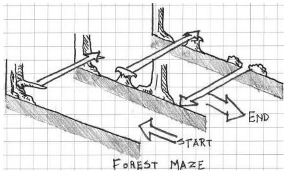  
FIGURE 3.53 Many environments in Shantae: Risky's Revenge allow the player to move forward and backward through layers of 2D side-scrolling environments. These add another level of depth to in-game mazes and dungeons not common in many side-scrolling games.

# Top-Down Space

Top- down gamespaces are ones where gameplay is viewed from above the player character as though looking at a building plan. Indeed, many early games resembled maps and building plans. On one hand, top- down games offer little in terms of creating sight lines and other things that are common in 3D games. However, they excel at creating opportunities for orientation, as many gamespaces can be understood in plan. These spaces can be understood as following the cardinal directions of north, south, east, and west, so devices like landmarks allow players to find their way through large gamespaces (i.e., "I am north of Hyrule Castle").

  
FIGURE 3.54 Like side-scrolling games, top-down games can show players things that the player character cannot necessarily see.

Like side scrollers, top- down games share the potential for Hitchcockstyle suspense due to their ability to show players things that the player character cannot necessarily see (Figure 3.54). Also like side scrollers, enemies should leave enough time between appearing on screen and when they hit the player such that the player has a chance to move.

Top- down games often feature mechanics that are best enacted in an expansive world, such as exploring or interacting with NPCs, though there are certainly exceptions. Top- down games, like side scrollers, are also well suited to mechanics that involve lining the player character up with a target such as shooting, sword fighting, or even rudimentary jumping. On the other hand, top- down games tend to be less reliant on reaction- based action than side scrollers, so more environmental information can be held off screen (Figure 3.55). In fact, withholding the entirety of a landscape or architectural feature in a top- down gamespace may actually invite players to explore further.

Now that we have explored the opportunities present in both 3D and 2D game views, we will look at those present in a type of gamespace that straddles the line between the two.

# Axonometric/Isometric Views

In the early 1980s, developers utilized a new game view type—the axonometric game—to create the impression of 3D space while utilizing art that

  
FIGURE 3.55 Since many top-down games involve exploring expansive worlds, information can be withheld off screen from players. Giving players incomplete information, such as showing part of a landmass or river in one screenshot, invites players to explore further.

was still actually 2D. Following early axonometric games like Zaxxon and  $Q^{*}Bert$ , this view continued to be popular in games from Knight Lore $^{54}$  to Starcraft. $^{55}$  In games, this point of view is often referred to as isometric, as that is the type of axonometric projection used to create the game art.

In classic axonometric games, the game is typically viewed without perspectival distortion, that is, without the objects on screen viewed along sight lines that meet at a vanishing point. While purely axonometric images can create a dramatic 3D effect, they also come at the cost of depth perception for the player. Axonometric drawings are notorious for the creation of optical illusions such as that shown in Figure 3.56. When constructing axonometric gamespaces, it is important to show the vertical relationships between surfaces very clearly so players are not confused by an object's position in space. Likewise, it is important to occlude, or disable the rendering of, foreground objects in these spaces so players do not lose their character when they move behind structures.

Isometric as a term has also been adopted by modern 3D game developers to describe a camera that is positioned at an angle above the player character looking down, with perspective options enabled on the camera object itself. This type of perspective is actually described as three- point perspective, as edges meet not only at horizontal vanishing points common to two- point perspective, but also at a vertical vanishing point below the level. Unlike actual isometric or axonometric views, changes in height

  
FIGURE 3.56 Axonometric drawings can easily disorient the player if not drawn properly. When making these kinds of gamespaces, make sure you find ways to show vertical spatial relationships.

are easily perceived thanks to the perspective option of the camera. This type of view, in both classic and 3D versions, allows for both a detailed 3D environment and the designer to show the player things that the player character cannot see.

Axonometric views can make it difficult for players to orient themselves in space. Unlike top- down 2D views, the player cannot benefit from the use of cardinal directions. And since the camera is facing downward, they also cannot make use of sight lines, so as much information should be on screen as possible, unless the world is an expansive one similar to those found in top- down 2D games. However, isometric games allow designers to make dramatic use of spatial size types, as players can easily see how their character relates to the environment around them. Still possible is creating a sense of claustrophobia with narrow spaces or a sense of agoraphobia with prospect spaces. In fact, these spaces' three- point perspective allow for the use of rhythmically arranged vertical elements to create a sense of epic hugeness in prospect spaces—creating a sense of vertigo as the player looks from the camera down at his or her character (Figure 3.57).

  
FIGURE 3.57 In this screenshot, regularly spaced biotanks are used in this lab environment to create a sense of vertigo from the camera down to the player character. This emphasizes the verticality of the gamespace, even though the player is viewing the game from a third-person perspective.

Now that we have discussed camera views and how they correlate with player perceptions of space in games, we will explore one last basic spatial concept. This concept will help us take an element unique to games and utilize it to toy with how a player perceives the nature of space around him or her in games.

# ENEMIES AS ALTERNATIVE ARCHITECTURE

In Chambers for a Memory Palace, Lyndon and Moore describe the concept of allies: statues, short columns, and other architectural elements that are of similar scale to an occupant.56 Beyond iconographic significance, they point out that allies in a piece of architecture can make spaces more inviting. In games, non- player characters fulfill many of these functions and often have their own gameplay reason for being in a space, sending the player on quests, guarding doorways, etc. NPCs that instigate quests often prohibit players from moving through a space until specific tasks are accomplished. As such, NPCs can help designers drive player interaction with the game world.

One key difference between gamespaces and real architecture is that enemies, not just allies, can also inhabit gamespaces. Enemies offer level

designers a unique type of architectural ally in their antagonistic relationship with the player. Where friendly NPCs may simply block a space until the player helps them, enemies block spaces by threatening to damage the player. As the player cannot directly pass through enemies without risking damage, game enemies can be seen as alternative architecture. In the train station environment at the beginning of Half- Life 2, alien soldiers are used as alternative architecture. While many games use locked or non- interactive doors to show a player they cannot enter a room, Half- Life 2 places sentries throughout a train station. If the player tries to pass, he or she is shoved back. Further attempts by the unarmed player are met with the aliens brandishing their weapons, an effective deterrent. Using interactive enemies rather than plain locked doors does several important things for the game: it builds Half- Life 2's dystopian narrative without exposition, it directs player movement through the station, and it creates the feeling that this station is populated, just as Lyndon and Moore argue is the role of architectural allies.

Using enemies as architectural elements of a level can be a powerful tool for level designers when paired with narrow space as well. In the original Resident Evil, for example, zombies fill the narrow hallways of the Spencer Mansion. As they approach players, they block off progress through hallways while shrinking the space the player can safely occupy. Players in this situation must decide whether to risk running past the zombie or shoot it.

As the Resident Evil zombies demonstrate, even enemies with simple AI can be powerful spatial tools. In his essay "The Rules of Horror: Procedural Adaptation in Clock Tower, Resident Evil, and Dead Rising," Matthew Weise describes a concept he calls the shrinking fortress in zombie films.57 In shrinking fortress scenarios, such as the one in Night of the Living Dead,58 the protagonists are surrounded by a large group of enemies, which continually advance on them and capture once- safe territory. In Night of the Living Dead, for example, survivors fight to protect themselves within a farmhouse. Eventually, the first floor of the house is overrun, and the heroes must retreat into the basement. This scenario can play out in games through story events that cut off previously accessible areas.

An even more powerful application of the shrinking fortress can occur in real time. Strong or difficult- to- kill enemies may be used to herd the player where the designer would like him or her to go (Figure 3.58). For this tactic to work, the enemies should be in overwhelming numbers, have

  
FIGURE 3.58 Enemies may be used to herd players where designers want them to go. For this to work, a large number of difficult-to-kill enemies should be used.

powerful attacks, or be difficult to kill. A scenario like this often requires the level space itself to be large, though swarms of enemies will create the feeling of narrow space. Applications like these demonstrate the power that level designers have to use enemies, NPCs, and other game elements not traditionally viewed as architecture for architectural purposes.

# SUMMARY

In this chapter, we have explored some basic spatial types that we can use to form our game worlds. From micro- scaled articulations of additive and subtractive space to world structures such as sandboxes, hubs, and classic gamespaces, we now have a set of spatial configurations to create with the game engine tools discussed in Chapter 2. We also know how to cater game space to the kinds of gameplay experiences we wish them to house through spatial size types. To pace these elements out or study how they interact with one another, we can utilize molecule and proximity diagrams. We can also organize large worlds of gameplay through urban design principles. On the player end, we can cater player experiences of our game spaces to the point of view they will have through in- game cameras. Lastly, we can use not only friendly NPCs, but also enemies to populate our game worlds, enhance the spatial types we have discussed, and direct player action.

In Chapter 4, we will discuss more directly how to create game levels that teach the mechanics of a game to players and reinforce these mechanics through the entirety of a game.

# ENDNOTES

1. Watanave, Hidenori. Archidemo: The Museum of the Globe. Archidemo. http://archidemo.blogspot.com/2008/07/museum-of-globe.html (accessed February 20, 2013).  
2. Watanave, Hidenori. Archidemo: Oscar Niemeyer in Second Life. Archidemo. http://archidemo.blogspot.com/p/oscar-niemeyer-in-second-life.html (accessed February 20, 2013).  
3. Second Life. Linden Research (developer and publisher), June 23, 2003. Online virtual world.  
4. Frederick, Matthew. 101 Things I Learned in Architecture School. Cambridge, MA: MIT Press, 2007, p. 3.  
5. Frederick, Matthew. 101 Things I Learned in Architecture School. Cambridge, MA: MIT Press, 2007, p. 6.  
6. Frederick, Matthew. 101 Things I Learned in Architecture School. Cambridge, MA: MIT Press, 2007, p. 4.  
7. Hildebrand, Grant. Origins of Architectural Pleasure. Berkeley: University of California Press, 1999, p. 95.  
8. Lyndon, Donlyn, and Charles Willard Moore. Chambers for a Memory Palace. Cambridge, MA: MIT Press, 1994, p. 212.  
9. Borries, Friedrich von, Steffen P. Walz, and Matthias Bottger. Space Time Play Computer Games, Architecture and Urbanism: The Next Level. Basel: Birkhauser, 2007.  
10. Salen, Katie, and Eric Zimmerman. Rules of Play: Game Design Fundamentals. Cambridge, MA: MIT Press, 2003, p. 97.  
11. Slender: The Eight Pages. Parsec Productions (developer and publisher), June 26, 2012. PC game.  
12. Deleuze, Gilles, and Félix Guattari. A Thousand Plateaus: Capitalism and Schizophrenia. Minneapolis: University of Minnesota Press, 1987.  
13. Koh, Chuen-Ferng. Chapter 1: Internet-Rhyzome. Internet: Toward a Holistic Ontology. http://wwwmcc.murdoch.edu.au/ReadingRoom/VID/jfk/thesis/ch1.htm (accessed February 26, 2013).  
14. ActiveWorlds. ActiveWorlds (developer and publisher), 1997. Online virtual world.  
15. Jakobsson, Mikael. Activity Flow Architecture: Environment Design in ActiveWorlds and EverQuest. In Borries, Friedrich von, Steffen P. Walz, and Matthias Bottger. Space Time Play Computer Games, Architecture and Urbanism: The Next Level. Basel: Birkhauser, 2007, pp. 164-167.  
16. Totten, Christopher W. Designing Better Levels Through Human Survival Instincts. Gamasutra—The Art & Business of Making Games. http://www.gamasutra.com/view/feature/6411/designing_better_levels_through_.php?print=1 (accessed February 27, 2013).

17. Totten, Christopher W. Designing Better Levels Through Human Survival Instincts. Gamasutra—The Art & Business of Making Games. http://www.gamasutra.com/view/feature/6411/designing_better_levels_through_.php?print=1 (accessed February 27, 2013).18. Batman: Arkham Asylum Video—Silent Knight Challenge Mode Extended Cut | GameTrailers. GameTrailers. http://www.gametrailers.com/videos/dfhan4/batman—arkham-asylum-silent-knight-challenge-mode-extended-cut (accessed February 27, 2013).19. Hildebrand, Grant. Origins of Architectural Pleasure. Berkeley: University of California Press, 1999, p. 22.20. McMillan, Luke, and Nassib Azar. Gamasutra—Features—The Metrics of Space: Molecule Design. Gamasutra. http://www.gamasutra.com/view/feature/184783/the_metrics_of_space_molecule_.php (accessed February 27, 2013).21. White, Edward T. Space Adjacency Analysis: Diagramming Information for Architectural Design. Tucson, AZ: Architectural Media, 1986.22. Yatt, Barry D. Assessing Program. In Parti Planning: A Guide to Pre-Design Analysis. Draft ed. Washington, DC: Catholic University of America, 2006, chap. 7, 7-35-7-54.23. Salen, Katie, and Eric Zimmerman. Rules of Play: Game Design Fundamentals. Cambridge, MA: MIT Press, 2003, p. 353.24. Grand Theft Auto IV. Rockstar North (developer), Rockstar Games (publisher), 2008. Xbox 360 game.25. Half-Life 2: Episode 2. Valve Corporation (developer and publisher), 2007. PC game. Developer commentary.26. Lynch, Kevin. The Image of the City. Cambridge, MA: MIT Press, 1960.27. Lynch, Kevin. The Image of the City. Cambridge, MA: MIT Press, 1960, p. 2.28. Lynch, Kevin. The Image of the City. Cambridge, MA: MIT Press, 1960, p. 48.29. Lynch, Kevin. The Image of the City. Cambridge, MA: MIT Press, 1960, p. 47.30. Lynch, Kevin. The Image of the City. Cambridge, MA: MIT Press, 1960, p. 47.31. Lynch, Kevin. The Image of the City. Cambridge, MA: MIT Press, 1960, p. 72.32. Bully. Rockstar Vancouver (developer), Rockstar Games (publisher), 2006. Playstation 2 game.33. Lynch, Kevin. The Image of the City. Cambridge, MA: MIT Press, 1960, p. 47.34. Campbell, Joseph. The Hero with a Thousand Faces. 2nd ed. Princeton, NJ: Princeton University Press, 1968.35. Campbell, Joseph. The Hero with a Thousand Faces. 2nd ed. Princeton, NJ: Princeton University Press, 1968, p. 23.36. Hildebrand, Grant. Origins of Architectural Pleasure. Berkeley: University of California Press, 1999.37. Heaney, Seamus. Beowulf: A New Verse Translation. New York: Farrar, Straus, and Giroux, 2000.38. Lynch, Kevin. The Image of the City. Cambridge, MA: MIT Press, 1960, p. 47.39. No More Heroes. Grasshopper Manufacture (developer), Ubisoft (publisher), 2008. Nintendo Wii game.

40. Bozon, Mark. No More Heroes Review—IGN. Video Games, Wikis, Cheats, Walkthroughs, Reviews, News & Videos—IGN. http://www.ign.com/articles/2008/01/22/no-more-heroes-review (accessed March 6, 2013).41. Nurburgring 1. Reiner Foerst GmbH (developer and publisher), 1975. Arcade game.42. Night Driver. Atari (developer and publisher), 1976. Arcade game.43. Wolfenstein 3D. id Software (developer), Apogee Software (publisher), 1992. PC game.44. Zuxxon. Sega (developer and publisher), 1982. Arcade game.45. Q*Bert. Gottlieb (developer and publisher), 1982. Arcade game.46. The Nightmare Over Innsmouth. Chris Totten (developer), 2011. Unreleased PC game.47. Resident Evil. Capcom (developer and publisher), 1996. Sony Playstation game.48. Killer 7. Grasshopper Manufacture (developer), Capcom (publisher), 2005. Nintendo Gamecube game.49. The Prince of Persia: Sands of Time. Ubisoft Montreal (developer), Ubisoft (publisher), 2003. Nintendo Gamecube game.50. Portal. Valve Corporation (developer and publisher), 2007. PC game.51. Alfred Hitchcock on Mastering Cinematic Tension. YouTube. http://www.youtube.com/watch?v=DPFsuc_M_3E (accessed March 7, 2013).52. Metroid Fusion. Nintendo R&D1 (developer), Nintendo (publisher), 2002. Game Boy Advance game.53. Shantae: Risky's Revenge. Tim and Chris Stamper (developers), Ultimate Play The Game (publisher), 1984. Sinclair ZX Spectrum game.54. Knight Lore. Way Forward Technologies (developer and publisher), 2010. Nintendo DSiWare game.55. Starcraft. Blizzard Entertainment (developer and publisher), 1998. PC game.56. Lyndon, Donlyn, and Charles Willard Moore. Chambers for a Memory Palace. Cambridge, MA: MIT Press, 1994, p. 164.57. Weise, Matthew. The Rules of Horror: Procedural Adaptation in Clock Tower, Resident Evil, and Dead Rising. In Perron, Bernard. Horror Video Games: Essays on the Fusion of Fear and Play. Jefferson, NC: McFarland & Co., 2009, pp. 238-266.58. Night of the Living Dead. Film. Directed by George A. Romero. Pittsburgh, PA: The Walter Reade Organization, 1968.59. Michael, Evans. An Illustrated Fragment of Peraldus's Summa of Vice: Harleian MS 3244. Journal of the Warburg and Courtauld Institutes 45 (1982): 14-68. http://www.jstor.org/stable/750966 (accessed February 26, 2013).

# Teaching in Levels through Visual Communication

To bring his organizing powers into fullest play, the painter must haul his perceptions out of their limbo and annex them to his plan.

—LEO STEINBERG

The definition of a good game is therefore "one that teaches everything it has to offer before the player stops playing."

—RAPH KOSTER

As systems of communication, game levels utilize sensory informa- . tion to connect with players. As games are now, this occurs primarily through visual and auditory means and through limited applications of touch. In this chapter, we focus on the visual power of gamespaces, how it can be used to teach, and how it can control a player's understanding of a game.

As we discussed in Chapter 2, "Tools and Techniques for Level Design," one of the most important goals of game levels is the adjustment of behavior in game players. For first levels especially, teaching how to play a game, what its goals are, and the cause- and- effect procedures that make it run are vital to a good game.

As the above quote from art critic Leo Steinberg points out, visual components of a work must be carefully planned and laid out, rather than haphazardly placed, to be effective communication tools. In this chapter, you will learn about different teaching methods present in modern games. You will also learn how to utilize art assets in such a way that the player associates them with meaningful information, and how they can be organized to teach players through direct or indirect methods. Lastly, we will explore how to use visual information to turn game levels into spaces of information that create feelings of certainty and uncertainty in players.What you will learn in this chapter:

What you will learn in this chapter:

Teaching theories for game levels Symbols and visual design in games Architectural forms and types Teaching gameplay through advertising methods Controlling information in memory palaces

# TEACHING THEORIES FOR GAME LEVELS

In order to understand the spatial tools we will use to adjust player behavior, we must first understand the theories supporting these methodologies. As we have seen and will continue to see throughout the book, learning from other fields is an important part of the ongoing development of game design. Throughout this chapter, we will reinforce three models of teaching commonly considered by game designers- B.F. Skinner's operant conditioning model, the Montessori method, and constructivism- as the framework of our visual communication methodology.

Behavior Theory and Operant Conditioning

Behavior theory, also referred to as behaviorism, is the study of observable behaviors in organisms. John B. Watson established behaviorism as a school of thought in psychology with his 1913 article "Psychology as the Behaviorist Views It."4 Ivan Pavlov and his famous studies into classical conditioning- - wherein he would ring a bell before feeding his dogs, thereby causing them to salivate every time he rang a bell- - were major influences for behaviorists.5

A major evolution of behaviorism came in 1937 when psychologist B.F. Skinner coined the term operant conditioning. Skinner rejected Watson and Pavlov's earlier emphasis on reflexive or involuntary actions

and "attributed a more active role to the learning subject."6 Operant conditioning involves changing voluntary actions of subjects via positive and negative reinforcements, as well as punishments.

In Skinner's experiments with his operant conditioning chamber (widely known as the Skinner box) he had rats pull a lever in response to a specific stimulus, typically an auditory or visual signal (Figure 4.1). In the version of the experiment for studying positive reinforcement, when the rat pulled the lever in response to the signal, it would receive a food pellet as a reward. However, pulling the lever at the wrong time would elicit a punishment, often in the form of an electric shock to the rat's feet. The box could also study negative reinforcement, which teaches the subject to perform actions to remove unfavorable conditions. In the Skinner box experiment, a lever could be used to stop negative stimuli such as mild electric shocks or loud noises, thus strengthening the behavior of pulling the lever in the rats.7

Skinner also wrote considerably for the field of education. The current system of grading students—rewarding success with good marks and punishing failure with poor ones—is often seen as an extension of his philosophies. Skinner himself argued for a methodology that avoided emphasis on lectures or tutorials, but rather on breaking large tasks into a series of smaller ones. As each task is performed, correct actions are reinforced so the student learns the proper way of performing his or her tasks.8 This methodology is also commonly applied to many games that seek to do away with extensive explanatory tutorials. When teaching mechanics in the first few levels of a game, such as is done in Super Meat Boy, gameplay mechanics are broken into individual tasks that are reinforced and repeated. As we saw in Chapter 2, Super Meat Boy9 focuses

  
FIGURE 4.1 A typical operant conditioning chamber, or Skinner box. The box is outfitted with devices for several types of experiments, including lights and loudspeakers to be used as stimuli, a food dispenser, a lever, and an electric grid to deliver shocks through the floor.

  
FIGURE 4.2 An early area in Batman: Arkham Asylum demonstrates how a negative reinforcement puzzle can transform a space. When the player initially enters a room in the Asylum's Intensive Treatment facility, it is filled with poison gas, requiring Batman to leap on catwalks to progress. When the gas is removed, the room becomes open for regular circulation travel. If viewed in terms of territories, players encounter this area as one that has been corrupted by an enemy and must reclaim it. As one of the first areas to use batarangs for solving puzzles, it is also an important gameplay tutorial.

its first few short levels on individual mechanics—jumping, running, wall jumping, introducing obstacles, etc.—that eventually create an extensive knowledge of Meat Boy's capabilities as a playable character.

Skinner- esque reinforcement and teaching models are commonplace in many game levels and puzzles. For example, solving puzzles or defeating enemies is often met with in- game rewards such as resources or new items. Designers often structure gamespace territories in such a way that players must remove negative conditions—poison gas, constantly spawning enemies, or enemy occupation—to make the territory safe for passage or to continue the narrative (Figure 4.2).

The Skinner box model can be used to describe the repetition of one singular action over and over again. As such, it has been used as a derogatory term for many newer game types, particularly games that force players to wait to perform one or two simple actions repeatedly, such as Farmville. For our purposes, we will look at operant conditioning as part of a larger palette of communication devices for educating players on how or when to utilize game mechanics.

Montessori Method

The world didn't want him to fail here. It was pushing him, but gently.

—THOMAS WAS ALONE, MIKE BITHELL10

Game design is a second- order design problem, $^{11}$  meaning that designers are communicating with players indirectly through their games. In this way, we can view our game levels as prepared environments of interactive objects for players to utilize. This is an important distinction for understanding our next educational model for level design: the Montessori method.

The Montessori method was developed by Italian physician and educator Maria Montessori beginning in 1897. It emphasizes the senses as a medium for absorbing information that is then interpreted by the intellect into solutions to practical problems. Current Montessori standards enforced by the American Montessori Society (AMS) and Association Montessori International (AMI) highlight the classroom as a free learning environment prepared by a teacher, with multiage learning groups, choices of activities, and uninterrupted work and interaction time. $^{12,13}$  Montessori education was accompanied by a set of Montessori sensorial materials that included blocks, cylinders, and other objects that would teach students how to utilize their senses to organize or arrange the objects (Figure 4.3). Similar objects, the Froebel gifts, were used in Friedrich Froebel's original Kindergarten in Bad Blankenburg, Thuringia, Germany. Frank Lloyd

  
FIGURE 4.3 Two of the Montessori sensorial material sets: the pink tower and the colored cylinders. These objects can be interacted with as the child likes, allowing many types of matching, stacking, and arranging activities. Each object's visual characteristics are meant to reinforce correct arrangements of the objects, such as big to small, tall to short, etc.

Wright famously received a set in his youth, citing the gifts as a major influence on his own architectural education. $^{14}$

In his book *Persuasive Games*, Ian Bogost suggests the Montessori method as an alternative view of how games teach players the traditional behaviorism- centered rhetoric. $^{15}$  Montessori views of games, he argues, support the development of player skill and problem solving over the course of an entire game. In a game's early puzzles, such as the movement and battling ones found in the original Nintendo Entertainment System (NES) *Ninja Gaiden*, $^{16}$  players learn the extent of player character Ryu Hayabusa's abilities that they can internalize and apply to later, more complex puzzles. Designers understanding this method of player learning can focus early levels on teaching players how to deal with obstacles individually, and then mix and match them later to create more complex puzzles (Figure 4.4). This is especially useful if designers have created a set of modular gameplay assets that they can simply mix and match within their game engine environments.

  
FIGURE 4.4 In SWARM!, the designers first introduced two basic puzzles in isolation—one where killing enemies opens gates and another where spinning a fan opens a gate—and then combined them into different orientations that players would have to figure out.

This outlook on teaching in games differs from the operant conditioning model in that it does not directly address reinforcements or punishments as outcomes to solving in- game situations. The skill gates discussed in Chapter 2, where players cannot progress until they learn the ability that lets them overcome a particular obstacle, are examples of this kind of teaching. Skill gates are self- reinforcing, as players are simply stuck if, for example, they do not learn that jumping is a way to pass over a block that is in their way.

# Constructivism

The last teaching method we will look at is constructivism. Constructivist models have origins in the work of theorists such as Montessori and others that advocate for sensory and activity- based learning methods. Other early influencers of constructivism, such as David Kolb, also advocate for reinforced feedback on the outcome of exercises. Constructivist learning models can be found in modern adult education classes and design or art schools. They are also popular in project and presentation- based coursework such as that in architecture schools. In many studio classes, students are guided through a design problem by teachers who oversee but do not directly intervene in a student's design actions. This combination of freedom and feedback make constructivist methods a better individual descriptor of how players learn in games than either operant conditioning or the Montessori method alone.

Kolb, along with Ronald Fry, outlined the following methodology for experiential learning: concrete experience, observation and reflection, forming abstract concepts, and testing in new situations (Figure 4.5). When taken as a methodology for understanding a player's interactions with a game, this can translate to attempting to overcome an obstacle, observation and reflection of play outcome, forming strategies, and testing new strategies. As pointed out by psychologist Pamela Brown Rutledge and game designer Jane McGonigal, games reinforce a cyclical model of problem solving through self- efficacy, an individual's belief in his or her ability to act and achieve positive results, and by encouraging risk through minimized setbacks.

Constructivist teaching in level design combines Montessori and operant conditioning learning in interactive systems of problem solving. As a designer, you create interactive environments and challenges for players to experiment with. Players, with the system you construct, then have the freedom to solve the problems you set up for them or even experiment with

  
FIGURE 4.5 Kolb and Fry's model of learning follows an iterative spiral through their four elements. When applied to play, it closely mirrors a scientific method-style of interacting with a game.

ways to "game the system" with shortcuts, Steiner points, or cheats. As they solve puzzles and problems, you set up places for the players to feel rewarded for their actions, reinforcing mechanics as they play through a game. Rewarding player action is important, as properly constructed challenges often require several playthroughs before they are overcome. Punishments such as dying or losing progress are also important for the constructivist model, but rather than a severe punishment or setback, players should be only set back to a point where they can comfortably retry a challenge.

Combat games such as Halo  $4^{21}$  excel at constructing iterative challenges when asking players to storm an enemy stronghold. Set placements of enemies allow players to form strategies of how to engage overwhelming forces over several playthroughs. The game also features a generous checkpoint system that stores the game state at locations where a player can easily try a single challenge again rather than restarting a level completely. Additionally, recognizing enemies or their weapons allows players to form strategies based on knowledge from previous encounters.

As evidenced by Halo 4 and similar games, modular methods of level construction allow you to use prefabricated assets to create additional challenges. Recognizing assets allows players to interpret new challenges because they recognize game objects from previous encounters. Generous checkpoint systems or distributions of checkpoint objects (however your

  
FIGURE 4.6 This diagram illustrates several different enemy strongholds created with a modular set of assets. Recognizable assets allow players to use Montessori-style understanding of the level to form strategies. The checkpoints at the beginning of each challenge help create an iterative problem-solving play style.

team implements this functionality) are important for allowing a constructivist gameplay style (Figure 4.6). Checkpoints should generally be placed before significant challenges. In our previously discussed methodology of the Nintendo Power method, this would involve placing a checkpoint immediately before your "callout points" on a level map.

In practice, these three styles of learning are often used together to teach players how to utilize a game. Operant conditioning is used to reinforce gameplay mechanics through applications of rewards and other positive game outcomes for success and through punishments for failures. The Montessori method gives us a framework for understanding how to structure a series of puzzles or challenges over the course of a game so that players can deduce solutions by recognizing elements of previous challenges, even if they are used in new ways. Finally, constructivist methods show us how we can structure challenges, feedback, and punishments in such a way that players are motivated to iterate their play to overcome or master gameplay challenges.

In the next section, we address the modular gameplay or environment art assets mentioned here, and we describe how level designers can use them as vital elements of a level's visual rhetoric.

# SYMBOLS AND VISUAL DESIGN IN GAMES

In the previous section, we delved into teaching methods for game levels—behaviorism, the Montessori method, and constructivism—that allow

us to create dialogs with players and teach them how to play our games. The common thread between these is that of the modular, reusable asset. In behaviorism, rewards and punishments are used to reinforce positive and negative associations for different types of sensory information. Montessori learning and development over the course of a game hinges upon the player recognizing elements of previous activities, and finally, constructivism speaks to the concept of game levels as spatial puzzles that players must solve through trial- and- error learning of what each level element means.

For reasons even beyond the ways they are constructed in development, games are well suited to these kinds of teaching. The key to teaching through visual communication in games is level geometry and environment art: the 3D models, textures, pixel sprites, and other assets that are used to create believable environments in games. In this section, we will explore functions for environment art that transcend typical "cool objects that populate levels" understandings and delve into how environment art helps designers teach gameplay.

Between 1928 and 1929, artist Rene Magritte created the painting *The Treachery of Images*22 (Figure 4.7), which depicts a smoking pipe and a caption underneath, *Ceci n'est pas une pipe* (this is not a pipe). Magritte, juxtaposing the image and caption, was making the self- referential statement that artists and designers do not create things, but instead create pictural representations of things. The pipe is actually oil paint applied to a canvas in such a way that it forms the image of a pipe, not a pipe from which one can actually smoke tobacco.

Artist Genee Cosden, in a submission to popular t- shirt printing site Threadless,23 juxtaposed the same caption with a green pipe and

  
FIGURE 4.7 A sketch of *The Treachery of Images* by Rene Magritte.

  
FIGURE 4.8 A sketch recreation of Genee Cosden's This Is Not a Pipe t-shirt design.

Piranha Plant from the game Super Mario Bros. (Figure 4.8).24 This version of the painting, whether intentional or not, applies Magritte's argument to objects in video games: they are not actual objects but are visual representations of objects. Paired with scripted behaviors, these in- game objects take on some of the behaviors of their real- world counterparts: swords and gun objects send damage to "enemy" character- objects, 3D models of first aid kits carry with them behaviors that increase a number related to player health, and so on. The pairing of visual art and procedural behaviors in game objects allows players to build strong associations between game objects and gameplay mechanics. These objects therefore become symbols of the gameplay mechanics they represent.

# Implementing Symbols in Games

Symbols are a powerful tool in games, both as a construction method and in utilizing the teaching methods discussed earlier in this chapter. The prefabricated assets discussed in our previous examples of Halo 4 and similar games are these very same types of symbols. For example, when Halo players see a Grunt, the most basic enemy in the game, they know what kinds of tactics they employ and how to defeat them. When designers put such enemies in a game, they typically have a few variations of the prefabricated enemy object that they litter around a level, meaning that not

only will their behavior be consistent, but also the player will eventually build a literacy of their habits as defined by their scripted behaviors.

The same is true of level objects and architecture. As we have seen in our brief explorations of Unity and other engines, an efficient way to construct levels is to reuse prefabricated assets. Once these are created, the designer can use and reuse them throughout his or her games. The player will also recognize the objects and associate them with a specific gameplay mechanic. In Halo, players attacking the enemy forts may see a purple platform floating in the air. This object, used throughout the game, typically features an enemy sniper. After one or two experiences seeing this object, they will see it as a symbolic indicator that they will be battling a sniper.

For environment art- intensive games, it is important to establish what portion of the scenery is a gameplay symbol and what is simply environment art. For example, L.A. Noire25 features an extensive environment that simulates the city of Los Angeles in 1947. However, only certain buildings are important to gameplay, and not all can be interacted with. The designers distinguish interactive buildings from non- interactive buildings by coloring the knobs, handles, or other entry hardware of the interactive buildings a gold color.

The difference between L.A. Noire's interactive doors and non- interactive doors goes far beyond the color of their doorknobs. As game objects in an engine, the interactive doors would most likely be 3D models with some sort of script attached that dictate how they respond to player interactivity—either working with collision- interaction scripts attached to the player or entirely driven by the door's own artificial intelligence. Alternatively, the non- interactive doors are just that: 3D models of doors or simply part of a larger 3D model of a building. These objects are just environment art—their interactivity consisting of only their ability to block players from passing through them.

In summary, it is important to follow two rules when building environmental symbols in games:

1. Each symbol must have a unique appearance, even from similar environment art objects.  
2. Each symbol must be repeated so the player learns what it means through repetition.

Following these two rules will allow you to use prefabricated game objects as elements of your game's visual language. As the player is exposed

to your language, he or she will gain literacy of it, knowing how to read it as he or she plays.

Teaching with Symbols in Games

Architect Adolf Loos, in a 1910 lecture, famously argued, "Ornament is a crime."26 The rationale for this, argued in rebuttal to the ornate art nouveau movement, was a belief that ornament could limit an object's stylistic longevity, and that the use of ornament was therefore unethical. This mindset helped solidify the visual style of architectural Modernism, which often featured clean, plain surfaces and straight lines.

Many of Loos's arguments were focused around ornament as frivolous aesthetic detail. However, as we showed earlier, our own use of environmental objects in games can go beyond mere ornamentation and become symbols: visual objects that carry representative associations with ideas or gameplay mechanics. Games teach through several methods, often in tandem with one another at one time. The repeatability of prefabricated game objects used as gameplay symbols allows these objects to become enforcers of the previously studied teaching methods: operant conditioning, the Montessori method, and constructivism.

# Introducing Symbols in First Levels

First levels of games are excellent for studying how games introduce the visual symbols that will form their gameplay language. As we saw in discussions of both Super Mario Bros. and Super Meat Boy, these games introduce symbols in the form of actual game objects or level geometry arrangements by allowing players to interact with them through their avatar's abilities (Figure 4.9). In the example of Super Meat Boy, players learn in level 1- 2 that vertical walls are interactive and may be gripped by Meat Boy. This is repeated as part of several other puzzles and rewarded by the players reaching Bandage Girl at the end of each level. Likewise, players of Super Mario Bros. will learn to jump at blocks from underneath after being rewarded with coins and powerups. As players progress through the game, they will see these symbols again and know what they do because of these first few conditioned encounters.

In SWARM!, the ball- rolling platform game explored in Chapter 2, the developers had the challenge of introducing an unconventional core mechanic to players: luring enemies into traps instead of fighting them directly. This mechanic was further used to unlock doors that would open when all enemies in an area were defeated. To teach the relationship between the player, enemies, and environmental puzzles, the designers

  
FIGURE 4.9 This famous first area of Super Mario Bros. level 1-1 introduces a plethora of visual symbols that will be important repeated gameplay elements during the rest of the game's 32 levels.

  
FIGURE 4.10 A level diagram showing the steps taken by the creators of SWARM! for introducing the game's enemies and the unusual way the player must defeat them.

first introduced the enemies far from any traps to communicate that the player could not directly defeat them with the default character. Later, enemy spawn points were set up in an area surrounded by traps, so players could watch the enemies hit the traps and explode. Finally, the player was put in a situation where he or she could lead the enemies into the traps, which would open a door (Figure 4.10). The three pieces of this last puzzle—trap, enemies, and door—were all located within one screenshot's view of each other so players could easily see their relationship. In further iterations of this puzzle, the designers could place the elements further apart, already making the relationship between puzzle elements clear.

Likewise, introducing new puzzle elements by controlling how the player views them (all within one screen in the case of SWARM!) proved to be a valuable method for these designers. $^{27}$

# Symbols as Guides

As we have seen, symbols are important tools for not only introducing mechanics early, but also for conveying the message of what actions to take throughout entire games. Portal $^{28}$  makes excellent use of environmental symbols to indicate gameplay mechanics. On the one hand, there are caution signs at the beginning of the game's test chamber puzzles that describe what hazards are inside. As players visit new rooms, see the symbols, then play the rooms themselves, they learn which symbols correspond to specific mechanics. Another layer of symbol occurs within the level geometry itself, where specific layouts of wall panels and masses are arranged according to the metrics of specific actions. As such, a player who enters a room and sees signs that indicate inertia- based puzzles, and then encounters the deep pit, wide canyon, and tilted wall panels consistent with the game's inertia puzzles will know what actions to take (Figure 4.11).

Portal demonstrates how these early encounters with symbols help designers implement Montessori and constructivist- style models in game levels. As the game is highly modular, elements are used and reused throughout the experience, but shuffled in new and interesting ways. Even the game's

  
FIGURE 4.11 Portal uses detailed signage and consistent level geometry types to indicate what tactics a player must use in puzzles. After establishing these relationships through gameplay and rewards in early encounters, players can recognize and implement these tactics later on.

textures, which each have their own material properties related to how they interact with portals, are symbolic: a white finish indicates that the surface will accept a portal, and a black shiny finish indicates that the player cannot place portals there. In this way, each room develops a rich dialog with players as they experiment and iterate new ways of solving each puzzle through geometry, texture, and symbol. Utilized in this way, newly encountered level environments act like new parts of a conversation for a player to engage in. As players learn what each symbol means, they will train themselves to search for them as indicators of what to do next in your game levels.

Designing and Placing Symbols for Effective Communication

As we have seen, establishing what objects are and are not symbols, as well as what each symbol stands for, is important for visually communicating with players. We have also seen that symbols must stand out from other pieces of environment art, such as L.A. Noire's gold doorknobs or Portal's white wall finishes. Good principles of visual communication are vital not only for the aesthetic quality of each symbol, but also to make them stand out from other, non- symbolic pieces of environment art.

Visual communication can aid level design in other ways. The most important is guiding players through environments. As we saw with our studies of Kevin Lynch's urban design principles in Chapter 3, landmarks and other noticeable geometries can help players orient themselves in large environments. However, other subtler principles implemented in a game's environment art can help players find their way through more intimate spaces.

# Basic Color Theory

In many games, color is a vital tool for communicating with the player. There are two reasons for this: the ways in which colors relate to one another, and the emotional or metaphorical associations colors carry. Color theory is a body of knowledge associated with understanding different ways that colors blend with one another. In color theory, there are several color models for understanding color.

The first and most commonly used in digital art is the hue, saturation, and brightness (HSB) model.29 This describes colors by their hue, the name of a color that most people think of as a color itself; their saturation, the purity of a color; and the brightness, how much black or white there is in a color. HSB is the model associated with programs like Photoshop or GIMP, as they are the elements of a color that these programs allow users to manipulate.

  
FIGURE 4.12 (See color insert.) In the additive color model, the primary colors of light—red, green, and blue—are combined to form new colors, and eventually white light when all three are combined.

Other color models include the additive color model, which is based on how light behaves, and the subtractive model, which is used in painting and printing. Additive color is based on primary colors of red, blue, and green. If one looks at a color monitor or television up close, he or she can see that each pixel is comprised of a red, blue, and green element. Adding these primary colors to one another forms different colors, which eventually create white when all three primary additive colors are combined (Figure 4.12). Due to the way this model works, digital art programs have a color mode called RGB for creating graphics to be displayed on a screen (like many images and textures used for video games).

The subtractive model is based on two different sets of primary colors: red, yellow, and blue (RYB), or cyan, magenta, and yellow (CMY). When either of these combinations of colors are combined, they form black. CMY is commonly used for three- color printing and graphics. However, it is RYB that gives us the commonly understood color wheel (Figure 4.13) of the three primary colors and their secondary and tertiary colors, which forms our basis of how we use colors in relation to one another.

The color wheel is an important tool for level designers. Groupings of three adjacent colors on the wheel are said to be analogous colors, which can help create a harmonious atmosphere based on a particular mood. For example, using blue, blue- purple, and purple together can create a somber or cold feeling in a level. Using complementary colors—colors opposite one another on the color wheel—can create a powerful effect, which we will discuss in the next section, on contrast.

  
FIGURE 4.13 (See color insert.) The color wheel. Groups of three colors next to one another are known as analogous colors, while colors on opposite sides of the wheel are complementary. Using complementing colors in visual design helps contrasting elements stand out.

It is also important to understand metaphorical associations that particular colors have gained over time. For example, the color combination of blues and purples was said to create a cold feeling. Likewise, a combination of red, red- orange, and orange creates a warm or hot feeling. Besides temperature, colors can stand for emotions—in Western culture, red is seen as analogous with passion or love, blue is sadness or tranquility, yellow is happiness, etc. These associations carry over to games: one typically sees red or green health items, due to these colors' associations with blood, medicine, or growth. Blue is the color of magic or mana in many games, having a mystical association. Green is also used in many contexts of alien creatures or monsters thanks to associations with nuclear materials or swamps. Level designers would be wise to pay attention to these and other color associations when planning their game environments.

# Contrast

An element of using not only color, but also shape, object size, and other visual elements of game worlds, is contrast. Contrast is the juxtaposition of objects such that one is meant to be directly opposite another in some quality such as size, color, shape, or style. When a designer uses contrast, it is typically to call attention to the unusual element. Common contrasts include using a bright object among darker ones, coloring an object

a complementary color to the predominant color of a scene, or putting a tall object among a collection of short ones.

Using complementary color to create contrast is commonly used in games like *Bioshock Infinite*.30 The chapel where player character Booker DeWitt enters the floating city of Columbia is predominantly blue and dimly lit. Each room has multiple passages into other rooms, but ones on the main path that will lead players out of the chapel contain bright elements such as a worshipper in white robes (to contrast the lighting condition) or orange lighting (to contrast the predominant color of the environment). The other passages, which often contain collectable resources, are analogous colors to the blues of the scene: purples and blue- purples.

As we saw in Chapter 3 during the discussion of Kevin Lynch's urban design elements, contrast is an important factor in leading players through a game environment. As we discussed the radio tower area of *Half- Life 2: Episode 2*, we saw that bright, warm- colored textures contrasted the cool blues and greens of the surrounding landscape as well as the dark browns and blacks of the surrounding buildings. Contrast is important for creating landmarks not only in large, exterior environments, but also within individual rooms and hallways, as shown in *Bioshock Infinite*.

# Framing

Another element of visual design of great use to level designers is the concept of framing. Framing describes the use of foreground elements to surround the view of something important in an environment as though it were in a frame (Figure 4.14). Framing is a technique useful for enhancing the approach to important game environments: as the player moves through a gamespace, framed openings or expansions of space can enhance or foreshadow the player's arrival at a point.

This simple but crucial aspect of visual composition is an effective tool for turning environmental transitions into guideposts. Combined with environmental techniques such as color theory and contrast, pathways and arrivals in games can be easy to navigate and dramatic.

Bioshock Infinite's introductory gamespaces provide a powerful example of framing. Important architectural areas along the player's intended path are framed with colorfully lit embellishments: embedded columns and sculptural ornaments. These pieces of environmental artwork also feature engraved sayings by famous in- game figures—building the characterization of the game's alternate America through embedded environmental narrative.

  
FIGURE 4.14 Vertical elements such as trees, columns, or doorframes are effective at helping designers frame scenes, adding to the drama of environmental transitions and approaches.

# Rule of Thirds

The last visual design concept we will highlight here is the rule of thirds. The rule of thirds dictates that a designer should divide an image into thirds both vertically and horizontally (creating nine total divisions), and then place elements of the composition along the lines (Figure 4.15). This produces more visually interesting compositions than if the designer had simply centered the subjects.

This concept is based on the idea that a visual composition should allow viewers' eyes to travel around the image rather than stay in one place. Subjects placed at the dividing lines in a rule of thirds image will keep the viewer's eyes moving around an image rather than staying at the center. Moving objects off center can help designers change the balance of an image or imply movement.

In game levels, subtle shifts of level objects to the side of a view can create more visually interesting lines of sight. In Thatgamecompany's Journey,31 the player character tends to occupy the first third of the screen. In the first level, the player character is placed to the left of centrally placed landmarks. Elements placed to the sides of the centrally located markers, such as those found in the game's first screen, for example, direct

  
FIGURE 4.15 This diagram shows how an image is composed with the rule of thirds.

  
FIGURE 4.16 This sketch of the first level of Journey shows how visual elements are placed in thirds on screen, including the player character itself. The off-centered elements direct the player gaze to the landmark in the center of the view.

the player's gaze toward important elements (Figure 4.16). Other markers require players to move slightly right or left, creating a more interesting path than if the player simply had to move straight. At the end of each of these shifts in path are also game objects that become symbols of specific mechanics, so the visual rhetoric of the scene is incredibly rich from both the visual composition and symbol- making standpoints.

Symbols are indeed an important element of teaching in levels with visual communication. Through the teaching methods we have explored, designers can introduce and reinforce the meaning of symbols or familiar level geometries. Effective uses of color, contrast, and composition allow symbolic geometries to stand out from other parts of a gamespace. In the next section, we will learn how preformed symbolic associations with architectural forms may also be used to communicate with players in large game worlds.

# ARCHITECTURAL FORMS AND TYPES

We have just discussed how game objects and level may be utilized to create visual symbols that evoke associations with gameplay mechanics. When teaching a player how to play your game with environments, these associations must be built through a combination of training methods such as those previously discussed. However, there are also symbolic associations derived from everyday architecture that are used to guide players in games: architectural types.

Architectural types describe a building's use through its form (Figure 4.17). In many cultures, buildings of the same use are built with similar forms. Over time, the form becomes associated with the building use, and a type is established. For example, a square building with a pitched roof is often understood as a house in Western cultures. Likewise, torii, Japanese gates, would conjure strong associations with temples to a Japanese person. Like symbols, formal building types carry strong associations of ideas beyond the architecture itself.

In games, building types can serve a similar purpose to their real- world counterparts. Games in the Dragon Quest32 series (known as Dragon

  
FIGURE 4.17 These shapes represent different building types in Western culture. Based on societal associations of building use with building form, types allow observers to understand their environment.

Warrior in the United States until 2005) often utilize building types to help players find their way around in- game towns. Like symbols, these types are associated with gameplay through training and demonstration. For example, players of Dragon Quest games who need to resurrect fallen party members or remove curses must find a church- the gameplay functions of which are removing status effects and saving the game. As a formal type, churches can be recognized by the religious symbols incorporated into their architectures- stars, crosses, and others- similar to how symbols are displayed on real churches and temples (Figure 4.18). These types often borrow heavily from the forms of real- world architectural types to communicate their purpose. Churches in Dragon Quest, for example, often incorporate formal elements such as a narthex or apse in their plans (especially in earlier games where the exteriors of buildings were not shown) or aesthetic elements like stained glass or religious symbols.

Even more overt are the types used in the Pokémon3 series. Like many role- playing games (RPGs), each town contains several consistent building types with different gameplay functions. In Pokémon, this includes a Pokémon Center for healing and communicating with other players, a Poke Mart for buying items, and often a Pokémon Gym containing one of the game's bosses. As in Dragon Quest, these buildings are recognizable by their outward appearances consistent with their architectural type. Unlike many early Dragon Quest games, however, building types in Pokémon games often utilize the same sprite or 3D model for

  
FIGURE 4.18 Sketches of churches from early and newer Dragon Quest games. In early entries in the series where building exteriors were not shown, churches were indicated through religious symbols and the shapes of their plans. In later entries the designers made the exteriors of the buildings resemble real-world Western churches.

each iteration of the type. In this way, building types in Pokémon games demonstrate building types as modular assets: the buildings communicate through their building type and are reusable from town to town. Even more graphically sophisticated games like The Elder Scrolls V: Skyrim34 utilize consistent assets when communicating building type: smithies have anvils and stoves, merchants can be found in booths or behind counters, and horses can be bought at barn- like stables. While Skyrim's wealth of detail allows many buildings to be unique, consistent elements like those mentioned above still allow these buildings to communicate their function to players.

Now that we have explored the different types of visual and architectural symbols in games, as well as the teaching methods through which we can train players with them, we can explore how teaching and visual arts work together in actual gamespace applications.

# TEACHING GAMEPLAY THROUGH ADVERTISING METHODS

In his book Persuasive Games, game designer Ian Bogost discusses how methods from the field of advertising can help designers communicate with players through visual and procedural means.35 Bogost describes three methodologies: demonstrative advertising, illustrative advertising, and associative advertising. These methods are extremely important to level designers, as they describe different methods of how we can communicate information to players. In this section, we will explore what each method of advertising is and how it represents a different style of communication.

Demonstrative Advertising with Scripted Events and Triggers

The first of these methods described by Bogost is demonstrative advertising. Ads that practice demonstrative advertising typically show a product, describe how it is used, and tell how it can help the consumer (Figure 4.19). When advertising video games, for example, this advertising style takes the form of "back- of- the- box" descriptions of a game that describe the number of levels or list a game's features. Products such as cars or tools often use demonstrative advertising to show the utility of the product for the user.

Demonstrations can be a powerful tool for communicating gameplay information to players. We can build associations between gameplay symbols and gameplay actions through controlled interactions with in- game objects. A demonstration of a certain gameplay element that players can watch but cannot directly interact with can also be an important tool

  
FIGURE 4.19 A demonstrative advertisement shows a product and introduces its useful or appealing features through copy text.

  
FIGURE 4.20 In-game demonstrative scenarios show players how hazardous gameplay elements work in a safe way so that players can build associations.

for demonstrating potentially dangerous obstacles or enemy encounters. These demonstrations occur when a player is in view of a dangerous obstacle, but far enough away that the player cannot interfere with the demonstrative action. For example, the Half- Life series typically uses demonstrations to introduce players to the barnacle enemy—a stationary alien character that eats any creature unfortunate to get stuck to its long tongue. Rather than introducing the player to these enemies by letting him or her get caught in the trap, which could be potentially disorienting and create a negative gameplay experience, the designers chose to allow players to watch another creature get caught before they themselves reach the barnacle (Figure 4.20).

In SWARM!, the method for destroying enemies—luring them into electrified traps—is introduced by placing the traps between the approach to a room and the enemies' spawn point (Figure 4.21). Building these demonstrations in game engines involves careful placement of scripted game

  
FIGURE 4.21 SWARM! introduces the indirect way players must kill enemies by placing traps between the player's entry point to a room and the enemy spawn points. Many demonstrations are based on the timing of scripted events and the placement of event triggers.

events, gameplay events that are controlled and activated through a game engine's internal logic- building language. Like many scripted in- game events, demonstrations also require the use of triggers, invisible collision objects that activate scripted events when the player character passes through them. Like other gameplay elements, carefully understanding or defining the metrics of how triggers and scripted events work (adjusting the distance of a trigger against the time it takes for the triggered event to occur, adjusting the size of triggers, etc.) is vital for setting up a successful demonstration of gameplay.

While in- game demonstrations involve objects that must be carefully constructed so they create specific gameplay experiences, the other advertising methods are much less concrete in how they engage players.

Illustrative Advertising through Environmental Narrative

Illustrative Advertising through Environmental NarrativeLike demonstrative advertising, illustrative advertising shows the product in the ad. However, unlike demonstrative advertising, illustrative advertising omits information on how the product is used or what features could be helpful to consumers, and instead shows the product in an appealing context. This is the "sex sells" method of advertising, where a product is shown being used by someone who then gains favor with members of the opposite sex. This type of advertising is about promoting a product based on building its image—this car helps you look good at fancy clubs, that

  
FIGURE 4.22 Illustrative advertising shows a product in an appealing context so the viewer builds associations between the product and an image he or she would like to possess.

cologne will attract beautiful women, our detergent will make your family happy, etc. (Figure 4.22).

Within games, illustrative advertising can be accomplished by building symbols through environmental narrative detailing. In Half- Life 2,36 for example, it is established that the lambda symbol  $(\lambda)$  is associated with the heroic resistance movement through environmental and contextual clues- the symbol is used on the player character's armor, in friendly bases, etc. As the player progresses through the game, he or she encounters the symbol many times, typically near caches of helpful items or breaks in long action sequences. Similarly, Resident Evil 4 utilizes ominously crafted signposts before enemy territories, traps, or encounters. After several iterations of signpost  $=$  danger sequences, the player learns that the. signs are a warning by the level designers that something dangerous is about to occur. Like Half- Life 2's use of  $\lambda$  , the designers craft a symbol by. illustrative means, reinforcing that signposts are followed by danger. Used in conjunction with behavioral and Montessori teaching methods, illustrated symbols become a powerful teaching tool in games.

Associative Advertising as Deconstruction

Associative advertising is the least concrete of the advertising methods discussed by Bogost. Like illustrative advertising, it builds a product's image by associating it with an appealing environment. However, associative

  
FIGURE 4.23 Associative advertising works similarly to illustrative advertising, but omits the advertised product entirely in favor of building an image for the product.

advertisements show only the context and leave the product's usage to the viewer's imagination. These kinds of advertisements are popular with car, beer, liquor, and cigarette companies, with their ads often showing implied users enjoying the company of friends, attending stylish parties, or fulfilling male power fantasies (Figure 4.23).

Associative advertising is the product of centuries of development in how advertisements are employed. Many early nineteenth- and twentieth- century ads featured lots of copy describing how a product is used. Over time, advertisers focused on quick, eye- catching image- building ads over descriptive ones—the result of consumers gradually spending less time interacting with each single advertisement.37 Likewise, associative methods within games are the result of the designer building a system of information over the course of a game. As players are taught how symbols, sounds, or game objects correspond to gameplay through demonstrations, reinforcement, or other methods, they learn the game's visual and auditory language. Players can, through Montessori learning, internalize how a game's symbolic communication system works and interpret even small variations on established patterns if they recognize familiar elements. Associative methods in games allow designers to show a symbol to communicate that the associated gameplay is nearby, even as the designer increasingly adds obstacles between symbol and associated element (Figure 4.24). This can be used, in a way similar to Half- Life 2 and Resident Evil 4, not only to build symbol = gameplay relationships, but also to deconstruct familiar gameplay elements or subvert established patterns.

  
FIGURE 4.24 Building strong associations in games allows designers to increasingly deconstruct the symbol = gameplay relationship. In this example, a symbol that indicates nearby rewards is placed farther and farther from the payoff. Building associations allows for gameplay elements to be mixed and matched with other puzzles or hazards.

Limbo excels at this type of deconstruction by playing its silhouetted art style against a player's relationship with established gameplay conventions. In an early puzzle, players encounter a large press with what appears to be a raised button directly underneath. Gameplay conventions dictate that the raised portion must be the button that operates the press, so the player should avoid it to stay alive. However, when the player moves next to the button so he or she may jump over it, he or she learns that the depressed ground next to the button is actually the mechanism that activates the lethal press (Figure 4.25).

Such subversions could even be utilized in gameplay narratives. Imagine a scenario where in a Half- Life 2 map, the player encounters what appears to be a friendly base and must choose whether to trust the characters within. However, contextual clues such as missing  $\lambda$  symbols could be used to communicate to observant players that the base is a trap. Such scenarios can provide the player with exciting choices to make if they are accompanied by opportunities to determine whether gameplay scenarios are consistent or inconsistent with the game's system of visual language.

The concept of gamespaces as systems of language and communication is an important one to the design of game levels. In the next section, we explore an architectural philosophy that utilizes the methods described in this chapter to control how players absorb and utilize information.

  
FIGURE 4.25 Associations built in one or more games may be used by game designers to create gameplay scenarios that remix previous puzzles or subvert accepted game conventions. Games such as Limbo utilize gameplay tropes to make players reinvent how they are trained to solve certain challenges.

# CONTROLLING INFORMATION IN MEMORY PALACES

As we have seen, gamespaces can contain a great deal of information that is not only stored, but also communicated to players in both overt and subtle ways. In this way, these spaces can be considered memory palaces. Memory palaces were a pneumonic device employed by Cicero, the Roman orator, philosopher, and statesman, for remembering the content of his speeches.38 Also called the method of loci, this technique has users constructing a palace or other architectural space in their mind, with each room, having its own unique architectural style, representing a piece of information. As the orator speaks, they imagine themselves moving from room to room—from talking point to talking point.

Chapter 3 mentioned the customization features of games like Second Life, which allowed users to create digital museums or sculptures for presenting information to other players. Minecraft and Little Big Planet users often erect elaborate structures as monuments to their favorite media franchises,39 explorations of theoretical systems,40 or even as working computers.41 These types of structures are pervasive in digital games as functional systems of communication: displaying the ideas of designers for others to see.

It is through these kinds of knowledge embedding in game levels that we can utilize gamespaces as instruments with which to create emotional experiences for players. In their book Chambers for a Memory Palace,42 Donlyn Lyndon and Charles W. Moore describe how pieces of architecture can become memory palaces through the use of memorable

communicative moments. In many ways, these pieces of architecture can help level designers manipulate the type and amount of information that they transmit to players: plot elements, enemy and obstacle locations, puzzle components, etc. In Rules of Play: Game Design Fundamentals, $^{43}$  Katie Salen and Eric Zimmerman describe three levels of information contained within games: certainty, uncertainty, and risk, based on the work of mathematician Richard Epstein. Through different methods for creation of emotional experiences in game levels, designers can carefully pace how players experience these levels of information in games. Before we explore the emotional experiences possible through using architectural experience concepts, we must understand these levels of information.

# Certainty

The first level of information described by Epstein, and by extension, Salen and Zimmerman, is certainty. A certain game is one in which the outcome is known. Salen and Zimmerman point out that in terms of measuring game outcomes, a game with a certain outcome is hardly a game at all. It is indeed far less exciting to watch a practiced player defeat a novice in a multiplayer video game or to see a sports team get completely shut out by its more skilled opponents.

On a more micro- level in a game, creating certainty within levels through consistent level elements can be a powerful tool for enticing players to explore or continue playing. Much of this chapter has been devoted to understanding symbol making and the use of modular assets in communicating gameplay elements through visual systems. As players learn how to recognize symbols in games, they will also learn to recognize the conditions under which those symbols reveal themselves. In games such as Super Metroid, $^{44}$  for example, rooms for recharging weapons are typically placed near rooms containing boss enemies. Also, a reward of some kind (typically in the form of a new weapon or ability) is placed after the boss room. This pattern is established early in the game and continued throughout.

Horror games such as Dead Space $^{45}$  establish patterns with their save rooms. While the overall tone of the game is one of dread and horror at the possibility of enemies jumping out at any time, the game's save rooms are established as safe zones early on in the game. This is done without exposition or other narrative devices, but simply through the player's experience of encountering a number of save rooms that do not contain enemies. Examples such as this and those found in Super Metroid communicate the

game's pacing to the player. Patterns of certainty help players know when to unwind or prepare for big action. They also feed players' excitement for the game as they play or as they shut the current play session down; knowing that something exciting is coming up soon will make players continue their current session or motivate them to come back to the game after shutting it down.

# Uncertainty

While certainty describes conditions where game outcomes are completely known, uncertainty describes a condition where the player has no concept of what to expect from a game. According to Salen and Zimmerman, this occurs in scenarios such as someone playing a game with a person he or she has never met before, such as two strangers sitting down at a chess table in a park.46

There are different ways to view uncertainty in level design. On one hand, a level space of pure uncertainty can be frustrating to players, who may be killed by an obstacle they did not know was there. As stated in Chapter 2, level designers should attempt to minimize situations where the player must go blindly into danger. If the point of a game is to bring players back for more, then uncertainty in level design can seem unfair.

Uncertainty in level design is a symptom of poor design or environmental art direction. If players find themselves at a t- junction within a level where they cannot surmise the best direction to go in next, they will feel that their choice may be arbitrary or that they may be forced to backtrack so they may see what lies in the direction they did not choose. The reason for such confusing game areas is typically bland and repetitive environment art, or the overuse of meaningless spatial configurations (as opposed to the purposeful use of special rooms for saving, healing, and the like discussed in the last section). Conversely, a junction that communicates what each branch holds, even subtly, allows the player to make informed decisions on where to go in a level. Returning to our theoretical t- junction, if the player finds his or her faction's logo spray- painted on the left passage while the right passage contains stacks of crates suitable for taking cover or signs of a previous struggle, this creates a much more communicative space. Based on the recurrence of these symbols in previous levels, the player may be able to infer that the left passage may contain resources that will prepare him or her for a battle in the right passage (Figure 4.26).

  
FIGURE 4.26 These two sketches of a t-junction in a first-person shooter level show how proper inclusion of varied environment art can reduce arbitrary uncertainty in a gamespace. The first example offers little to the player in the way of communicating which direction he or she should go. To understand what happens down each hall, the player would have to backtrack. In the second example, the environment gives the player the cognitive tools to make an informed decision on which path to take.

Uncertainty, however, has its uses. In many games with experimental mechanics or that want to subvert gameplay standards, uncertainty can be a powerful tool for establishing trust between player and designer. Games such as Jonathan Blow's Braid47 or Terry Cavanagh's Don't Look Back48 feature gameplay moments where players must jump off a large cliff toward a bottom they cannot see. Braid utilizes a mechanic where the player can rewind time, so each jump off of the cliff is an opportunity to learn where obstacles are for when the player tries again. This allows the cliff scene of the game to be an iterative experience of trial and error until the player finally reaches the bottom.

Don't Look Back is a modernization of the myth of Morpheus and Eurydice where the player must jump off a cliff to enter the Underworld. At the point of the game where the cliff is encountered, players can only move horizontally and jump. The few previous screens of the game at that point are also very sparsely populated with objects, so the player knows there is nothing for him or her to go back and find. With these factors in mind, the player comes to the realization that his or her only option is to jump off the cliff. As such, he or she is choosing to trust that the designer has not placed an instant death object below him or her. Moments like this, where the player must blindly trust the designer, can provide interesting moments of emotional gameplay.

# Risk

The examples of Braid and Don't Look Back show that even in player- designer trust- building uses of uncertainty, there are opportunities to get as much information on the uncertainty as possible. According to Salen and Zimmerman, uncertainty where the player knows the nature of the uncertainty is actually risk.49 Risk is a somewhat modified version of uncertainty where the player has incomplete information on what lies beyond the point of uncertainty or can make inferences on what to do next based on outside information. Risk is potentially the most powerful of the three levels of information within games, as it is what makes games feel exciting. Risk allows players to feel that their decisions may allow them to come to some successful outcome. If they do not, the attempt gives them enough information to risk another try: fitting the constructivist model outlined earlier in the chapter.

In game levels, the play between risk and rewarding players, often discussed in the design of games as risk- reward, is of utmost importance in creating interesting emotional experiences. Risk is created by playing communicative symbols (certainty) against new and ambiguous challenges (uncertainty), such as moving through the previously discussed first- person shooter hallway or a dark cave.

# SUMMARY

This chapter has provided a useful bridge between the construction of. gamespaces with reusable assets and the emotions of players. Designers can teach players about their games through different psychological methodologies. They can reward players for utilizing level elements in the proper way. They can allow players to explore levels through interaction and reuse their encounters in earlier levels to inform their later successes. They can also guide players to mastery of their games by allowing them to learn from previous mistakes.

We have also seen that reusable art assets and architectural types can be used to communicate with players. These symbolic assets create dialogs between the design of a level and the player's interactions with it. Visual communication principles such as color theory, contrast, and others help make this process simpler, by allowing symbolic assets and geometries to stand out from other information. Finally, we have seen how these symbols come to embody gameplay through advertising methodologies or through the controlling of information, turning our levels into emotionally

evocative memory palaces. As we move forward, scenarios like these will shape how we discuss players' experiences within gamespaces throughout the rest of the book.

# ENDNOTES

1. Steinberg, Leo. The Eye Is Part of the Mind. In Reflections on Art: A Source Book of Writings by Artists, Critics, and Philosophers, ed. Susanne Katherina Knauth Langer. Baltimore: Johns Hopkins Press, 1959-1958.  
2. Koster, Raph. A Theory of Fun for Game Design. Scottsdale, AZ: Paraglyph Press, 2005, p. 46.  
3. Rumble features of many game controllers, introduced with the Nintendo 64 Rumble Pack in 1997, provide touch-based feedback during game events such as collisions or climactic events. They also have potential to allow players to navigate space by feeling around and finding where level geometry is with rumble feedback. Mobile devices allow players to interact directly with their hands, but require players to see or hear what is happening on the screen in order to understand what it is they are "touching."  
4. Watson, John B. Psychology as the Behaviorist Views It. Psychological Review 20 (1913): 158-177. http://psychclassics.yorku.ca/Watson/views.htm (accessed April 6, 2013).  
5. Pavlov, Ivan P. Classics in the History of Psychology. http://psychclassics.yorku.ca/Pavlov/ (accessed April 6, 2013).  
6. Salen, Katie, and Eric Zimmerman. Rules of Play: Game Design Fundamentals. Cambridge, MA: MIT Press, 2003, p. 345.  
7. What Is Negative Reinforcement? Maricopa Center for Learning and Instruction. http://www.mcli.dist.maricopa.edu/proj/nru/nr.html (accessed April 6, 2013).  
8. Skinner, B.F. The Technology of Teaching. New York: Appleton-Century-Crofts, 1968, pp. 93-113.  
9. Super Meat Boy, Team Meat (developer and publisher), October 20, 2010. Xbox Live arcade game.  
10. Thomas Was Alone. Mike Bithell (developer and publisher), July 24, 2012. PC game.  
11. Salen, Katie, and Eric Zimmerman. Rules of Play: Game Design Fundamentals. Cambridge, MA: MIT Press, 2003, p. 168.  
12. Introduction to Montessori. American Montessori Society. http://www.amshq.org/Montessori%20Education/Introduction%20to%20Montessori.aspx (accessed April 6, 2013).  
13. Montessori in the Home. Association Montessori International USA. http://www.amiusa.org/montessori-in-the-home/ (accessed April 6, 2013).  
14. Hersey, George L. Architecture and Geometry in the Age of the Baroque. Chicago: University of Chicago Press, 2000.  
15. Bogost, Ian. Persuasive Games: The Expressive Power of Videogames. Cambridge, MA: MIT Press, 2007, pp. 238-239.  
16. Ninja Gaiden. Tecmo (developer and publisher), March 1989. NES game.

17. Kolb, David A. *Experiential Learning: Experience as the Source of Learning and Development*. Englewood Cliffs, NJ: Prentice-Hall, 1984.18. Kolb, David A., and Ronald Fry. Toward an Applied Theory of Experiential Learning. In *Theories of Group Process*, ed. C. Cooper. London: John Wiley, 1975.19. Rutledge, Pamela Brown. Video Games, Problem-Solving and Self-Efficacy Part 1. *Psychology Today*. http://www.psychologytoday.com/blog/positively-media/201208/video-games-problem-solving-and-self-efficacy-part-1 (accessed April 6, 2013).20. McGonigal, Jane. Jane McGonigal: Gaming Can Make a Better World. Video on TED.com. TED: Ideas Worth Spreading. http://www.ted.com/talks/jane_mcgonigal_gaming_can_make_a_better_world.html (accessed April 6, 2013).21. Halo 4. 343 Industries (developer), Microsoft Game Studios (publisher), November 8, 2012. Xbox 360 game.22. Magritte, Rene. *The Treachery of Images*. Oil on canvas, 1928-1929. Los Angeles County Museum of Art, Los Angeles, CA.23. www.threadless.com.24. Cosden, Genee. *This Is Not a Pipe*. T-shirt design, 2006. Threadless.com.25. L.A. Noire. Team Bondi (developer), Rockstar Games (publisher), May 17, 2011. Xbox 360 game.26. Loos, Adolf. *Ornament and Crime: Selected Essays*. Riverside, CA: Ariadne Press, 1998.27. Totten, Christopher W. *SWARM!—An Academic Postmortem*. Game career guide. http://gamecareerguide.com/features/1181/swarm_an_academic_.php (accessed April 15, 2013).28. Portal. Valve Corporation (developer and publisher), October 9, 2007. PC game.29. Ahearn, Luke. *3D Game Textures: Create Professional Art Using Photoshop*. 2nd ed. Amsterdam: Focal Press/Elsevier, 2009, pp. 18-28.30. *Bioshock Infinite*. Irrational Games (developer), 2K Games (publisher), March 26, 2013. Xbox 360 game.31. Journey. Thatgamecompany (developer), Sony Computer Entertainment (publisher), March 13, 2012. Playstation 3 game.32. *Dragon Quest*. Chunsoft (developer), Enix (publisher), May 27, 1986. Nintendo Entertainment System game.33. *Pokémon Red and Blue*. Game Freak (developer), Nintendo (publisher), September 30, 1998. Game Boy game.34. *The Elder Scrolls V: Skyrim*. Bethesda Game Studios (developer), Bethesda Softworks (publisher), November 11, 2011. Xbox 360 game.35. Bogost, Ian. *Persuasive Games: The Expressive Power of Videogames*. Cambridge, MA: MIT Press, 2007, pp. 153-162.36. *Half-Life 2*. Valve Corporation (developer and publisher), November 16, 2004. PC game.37. McKenna, Stephen. History of Advertising. Class lecture, The Rhetoric of Advertising. Catholic University of America, Washington, DC, January 2009.

38. Lyndon, Donlyn, and Charles Willard Moore. Chambers for a Memory Palace. Cambridge, MA: MIT Press, 1994, p. xi.  
39. Minecraft. Pixel Art Templates. http://www.minecraftpixelarttemplates.com/ (accessed May 21, 2013).  
40. meunierc2008. Turing Machine in Little Big Planet—Little Turing Machine. YouTube. http://www.youtube.com/watch?v=eUXgfnC9Tno (accessed May 21, 2013).  
41. Tutorials/Redstone Computers—Minecraft Wiki. Minecraft Wiki—The Ultimate Resource for All Things Minecraft. http://www.minecraftwiki.net/wiki/Tutorials/Redstone_Computers (accessed May 21, 2013).  
42. Lyndon, Donlyn, and Charles Willard Moore. Chambers for a Memory Palace. Cambridge, MA: MIT Press, 1994.  
43. Salen, Katie, and Eric Zimmerman. Rules of Play: Game Design Fundamentals. Cambridge, MA: MIT Press, 2003, p. 175.  
44. Super Metroid. Nintendo R&D1 (developer), Nintendo (publisher), March 19, 1994. Super Nintendo game.  
45. Dead Space. Visceral Games (developer), EA (publisher), October 14, 2008. Xbox 360 game.  
46. Salen, Katie, and Eric Zimmerman. Rules of Play: Game Design Fundamentals. Cambridge, MA: MIT Press, 2003, p. 175.  
47. Braid. Number None (developer), Microsoft Game Studios (publisher), August 6, 2008. Xbox Live arcade game.  
48. Don't Look Back. Distractionware (developer), Kongregate (publisher), 2009. Internet Flash game. http://www.distractionware.com/games/flash/dontlookback/.  
49. Salen, Katie, and Eric Zimmerman. Rules of Play: Game Design Fundamentals. Cambridge, MA: MIT Press, 2003, p. 175.

# INTERVIEW WITH GREG GRIMSBY

Assistant Professor of Game Design  George Mason University

Greg Grimsby is a 14- year veteran of the game industry who has worked on titles such as the Dark Age of Camelot series and Ultima Forever. He was the Art Director on Warhammer Online: Age of Reckoning, overseeing construction of the game's world. He has a BFA in painting and drawing from James Madison University and is on the faculty at George Mason University, where he teaches many of the 3D art, modeling, and animation courses.

Can you name a game, level, or level designer (or multiples of each) whose work has left an impression on you? Why?  Although old school, I was always very impressed by the level design work of Epic Games in the Unreal Tournament series. Their deathmatch level designs

were always executed with such a strong understanding of flow, landmarking, and visual impact. I learned a lot from the level design work in those games since deathmatch level design requires such tight and controlled synergy between layout and looks. The layout makes or breaks the play experience. Sure, players could have fun deathmatching in a big open pit, but that thrill wears off in about thirty seconds. A great deathmatch level provides opportunities for players to master the layout of the level, to work the level to their advantage. A great deathmatch map is like a good story—it has important parts, quiet passages of exposition, and a climax. A deathmatch map has these same elements designed into its structure via its flow and foci. Layer on top of this functionality a great- looking environment with awesome architectural design and weenies and you have the makings of a great level.

Are there any media outside of gaming that you find inspire your work? I am inspired by old master paintings of all kinds, from portraits to landscapes. Their understanding of color, composition, narrative, symbolism, and lighting show the potential we have to understand why things look good and how to achieve great works of art ourselves.

Describe your level design process—how do you begin? What tools do you use (on or off the computer)?

1. Gameplay goals. My level design process begins with building familiarity with the gameplay goals and needs of the level. If a designer does not intimately know the gameplay goals of a level, then the process begins with learning, via design docs or conversations with designers, what the level needs to do from a gameplay functionality point of view. Then we proceed to step 2.

2. Theme. I brainstorm ideas for the visual theme or environment of the level. Is the level an adventure in the bowels of hell? Is it a deathmatch in a wrecked space hulk? Is it a paintball battle in a low-gravity house of bounce? I try to think of a visually compelling and kick-ass environment.

3. Points of interest (POIs). Once I know the visual theme and location, I sketch points of interests and brainstorm vignettes of awesomeness that may make their way into the level. I ask myself lots of questions like: Where can we tease or foreshadow? What are some potentially cool “money shots”? What makes the player go “this looks frickin’ awesome”? I sketch and write down encounters and combat situations that could be cool.

4. Brainstorm and sketch flow. Next I nail down the basic flow of the map. Is it linear? Does it loop back on itself? Is it a hub-and-spoke design?

5. Sketch the map. In this step, I take all of the hodgepodge ideas and pull them together into a series of maps or concept roughs of the entire map.

6. Whitebox prototype. With a map in hand, I then get into the 3D software and make a whitebox prototype. The goal is to get the basic shell in to test stuff. I test the flow, the vistas, the running times, and lines of sight. Are they cool? I consider where more landmarks are needed and

other changes for better flow and breadcrumbing. More testing follows and more iterations.

7. Making it "purdy." Once the layout has been validated via testing, it's time to make final art.

What is your process for playtesting your levels?

It depends upon what the playtest is trying to discover. If it's a gameplay test, then I get in there and test the level—walk through the space, battle enemies, etc. I evaluate the visual design and critique if the gameplay is being helped or hindered by the layout. I ask what can be moved, added, adjusted, or removed to bolster the gameplay goals. A visual playtest is looking at very different, very "art director- y" things.

Do you find art and atmospheric effects an important tool for communicating with players? Any specific examples?

There are many tools in our visual language to communicate to the player what we want to say. We use these tools, art and effects included, to convey a mood to the player and support the gameplay pillars. Sure, a level can function on some basic level with whiteboxing, and it may even be entertaining depending upon the dependency of the game on visuals, lighting, and effects to set the needed mood. Dead space is not as scary without the lighting and all the atmosphere that the art and effects provide. Beyond communicating a mood, art can help a world feel like it has a history about it and make it feel lived in and believable. Architectural design, runes and signage, costume design, surface treatments, and color usage can communicate to the player who lives in your game world and what they are like. We used this a great deal in Warhammer Online to heavily imprint each zone with a different feel and a strong sense of which unique races lived in each environment.

How do you teach players to utilize your levels (without use of the GUI)? The best levels have so many affordances that lead the player, such as pathways, weenies, lighting, vistas, etc., that there isn't much to teach. Players know to follow the yellow brick road because we, as humans, understand certain conventions of how we interact with spaces. Rewarding players with cool visuals, encounters, or gameplay loot certainly helps incentivize them to follow your intended path through the level.

How do you entice players to explore game levels (without use of the GUI)? Weenies work wonders to draw players' attention to a distant location. We can use POIs to lead the player around and utilize as much of our map as we want them to. Oftentimes we don't want players to explore every inch of a level. In the huge zones of WAR, a player certainly could go off the roads and wander over the hills and mountains, but there were fewer encounters out there. In essence, their ratio of time spent in game to experience points (XP) earned was very poor if you wandered and explored. Now, if your game is trying to entice players to explore, then you need to make it potentially more worth their time than grinding along your storyline. You can entice them with

a random chance to encounter a rare mob or item. So there is basic carrot dangling you can do to get players to explore. The question is, do you want to? Can you craft the art across your entire game world to look equally cool? No. So do you want players seeing your weaker artistic efforts way off in the corners of your map?

If a player is lost in one of your levels, how can he find his way back to where he is supposed to be (without using the GUI)?

Players use their recall ring to teleport back. A hub- and- spoke design can certainly help along with visual clues, as can landmark weenies that players can see from a distance.

How do you direct the actions of players in your levels? How do you encourage players to play in undirected ways?

Flow directs the action. How you funnel and channel the player with roads, walls, and passages dictates where they can go and what they do. Players will tend to follow the right- hand wall. Players will gravitate toward open spaces over constricted ones. The layout of the map, how its connected, and what you can see from each part of the level direct the player without having to communicate any meta- goals to him or her. Visual points of interest and lighting play a great role in focusing the player as well. We are drawn to elements that stand out visually—that feel more important because of their scale, lighting, or content. The level designer needs to maintain a hierarchy of importance in his or her work—subduing parts of the level that are not of primary importance. So there is art and design content of primary importance, secondary importance, etc. A designer will not be able to lead the player to every bit of content directly, and there may be content available for free- range grazing, like trash mobs roaming a dungeon. The very existence of other paths of travel and of content that is not directly tied to your main storyline promotes undirected play, but you must be careful to control your signal- to- noise ratio. That is, all content competes for the players' time and attention—and you want players spending their time on your best stuff.

What "laws of level design" have you developed in your own work that any designer should know? What should they avoid?

1. Spend your art efforts where players will see it the most.  
2. Simple layouts should act as a framework for your complex visual designs, but underneath a yummy detailed veneer is an easy-to-understand flow.  
3. There should be something visually cool on screen at all times.  
4. Understand the anatomy of your environment and build that into your worlds. A ruleset based on real architectural structures or mother nature should show in your work. Forests have trees. Trees die. So forests have dead trees. Grass is sparse under trees where light doesn't reach. This is an example of a ruleset based on the anatomy of real forests. Your levels need to reflect this. If you are making up your own world, then design your own ruleset and stick to it.

5. Get your placeholders in early, and that includes color placeholders. On WAR we created simple solid color textures and used cutouts from our concept art to approximate and validate our color palettes very early—so placeholder early.  
6. Use foreground, middle ground, the horizon, and parallaxing to develop rich vistas.

Of course, there is a ton of other important stuff, but those rules help, especially from the artistic side of things.

As an art director, how do you address the issue of creating art for game worlds? Do you think of their functional game use first or their aesthetic elements?

Creating a world of game art means the art team must execute on the vision for everything that goes in it, and that is both an artistic act and a project management task. Even with a perfectly clear idea of how a game will look and what will be in it, all that artwork has to be built to, it must support the gameplay, and the art must meet the technical limitations of the engine. It is almost impossible to divorce the look of the game from what the capabilities of your game are. Similarly, if the art doesn't facilitate great gameplay, what's the point? This relationship requires a great deal of communication to happen between the game development team to ensure all these are being met. This communication happens in preproduction when decisions are being made about the vision of the game, and that vision is not just its look, but its feel, its core gameplay, its tone, and its underlying design philosophy and goals. Communication and collaboration continue until the game is done and beyond. That is how you build worlds that work and look great.

Do you see environment art more as a tool for adding aesthetic value or as gameplay indicators?

Coming from the visual side of production, I think artists will tend to always be biased to a visual point of view first. It is their torch to bear—to protect the visual quality of the game and to make sure that only gameplay goals that can be executed with visual quality make it into the product. So environment art in the hands of an artist will always aim to fulfill visual goals first, just as assets in the hands of a game designer will fulfill gameplay needs first and visuals second.

In Warhammer Online, each quest is given out at camps as part of a story chapter. How are these camps designed to be hubs for multiple tasks within the game?

Each chapter in WAR is centered on a zone of the world. The writers and quest designers build storylines and content to match the look and theme of that area. They accommodate the difficulty level associated with that zone. They continue the plot lines that occur throughout the entire game. The chapter hubs are centered around visual landmarks—towns and war- camps usually. The artists and designers work together to build these chapter

hubs, starting with a written document of all the quests that will occur there. The quests required additional, unique art, so the designers were given, in essence, a budget of new NPCs, props, and points of interest that the artists could specify to make for a hub and still finish the game on time. A lot of iterative design and playtesting ensured each hub flows well, is sized appropriately to match the content there, and that the player is directed to the next hub as the general quest line nears completion in each area. Players were directed to the next hub via quests in most cases.

How does a multiplayer world like that in Warhammer Online facilitate cooperation between players working together toward common goals? How does it enhance conflict?

WAR introduced the concept of public quests to massively multiplayer online (MMOs). Public quests are quests that players in an area can automatically join in on just by being at the questing area. A public quest, for example, may be to battle undead at an ancient ruin, and any characters that enter the ruin join in on the fun. This is one way in which WAR promoted cooperation between players—to complete the public quest and get a chance at cool quest loot. Even in locations of the game where public quests have not been designed, there is always the potential for players to form pickup groups (PUGs) with others in the area. There obviously is a huge amount of cooperation and teamwork in a game like WAR with its realm vs. realm (RvR) system, as players must work together to battle enemy realms in the RvR scenarios and battlefields.

As someone with a fine arts background, where do you see opportunities to educate game developers with more traditional media forms? How can games and art form dialogs to create new experiences?

There are universal principles of design at work in any creative process, and these principles are strongly emphasized in the fine arts. Artists are taught to evaluate every design decision, to look and see with a discerning eye, to strive for continuity and harmony in the work. Form meets function. They are taught many rules of visual communication, and that is what games are—visual communication. This is why any game designer, whether they are a coder, content designer, writer, or, of course, game artist, benefits from a background in the fine arts. If everyone on the game team has at least a basic understanding of composition, color, and continuity of design, then we would make better games. Of course I could flip this argument around and say that every artist could use some training in software engineering so they learn the principles of system- oriented design, state machines, and a general awareness of coding practices.

# Introducing Emotional Level Design through Survival Instincts

This all seemed a little dangerous. The world was not to be trusted. It was unstable, and it seemed to Thomas that it could let him down at any moment.

—THOMAS WAS ALONE, MIKE BITHELL¹

The History of every major Galactic Civilization tends to pass through three distinct and recognizable phases, those of Survival, Inquiry and Sophistication, otherwise known as the How, Why, and Where phases. For instance, the first phase is characterized by the question "How can we eat?" the second by the question "Why do we eat?" and the third by the question "Where shall we have lunch?"

—THE RESTAURANT AT THE END OF THE UNIVERSE, DOUGLAS ADAMS²

We have already explored historic types of gamespaces, identified practical methodologies for assembling levels, and utilized modular assets as communicative objects. In this chapter, we begin our explorations of how different spatial assemblies can create emotional

experiences for game players. We begin this exploration by identifying spatial orientations that tap into humanity's most primal need: survival.

As an experiential medium, games allow players to connect with on- screen characters in ways that other passive media, film, radio, etc., cannot. Consumers of these media cannot influence the outcomes of stories; the author predetermines the events. Games, however, give players a sense of agency over the stories of games through the ability to craft their gameplay narrative through decisions and achievement. The ability to influence the story extends to the player's ability to fail, ending the story with a disadvantageous finale. One common failure condition in games is death, playing into both humanity's need for survival and a player's desire for a game to continue.

Designers of both games and architecture acknowledge the utilization of humanity's survival instincts as a key to pleasurable design. For architecture, it is adherence to spatial principles that humanity has historically identified as safe that creates the feeling of pleasure. Games, however, utilize the achievement of overcoming unsafe circumstances as a source of pleasure: defeating a large boss monster, successfully crossing a bottomless pit, or breaking into an enemy fortress. In this chapter, we will discuss how level designers can play with the laws of pleasurable and unpleasant architecture to create exciting gameplay experiences.

What you will learn in this chapter:

Survival instincts and player avatarsProspect and refuge spatial designShade, shadow, and survivalThe power of negative spaceLoving and hating height

# SURVIVAL INSTINCTS AND PLAYER AVATARS

As explored in Chapter 1, many of the mechanics common in today's video games stem from early non- digital arcade, pinball, and carnival games. Many of these games were run by barkers, vendors who attract passers- by to entertainment events, who charged players for chances to accomplish the game's goals. In games where this transaction was automated, such as many pinball games, players that stayed in the game through buying extra chances could earn even more chances by achieving high scores or

reaching specific goals. For both psychological and economic reasons, staying alive to continue adding to one's score became a hallmark of the medium. Nolan Bushnell, the founder of Atari and former arcade barker, brought this thinking into early digital arcade games such as Computer Space5 and Pong.6 Manipulating a player's desire to keep playing while making the game too difficult to complete without paying for extra chances meant that arcade games became very lucrative. Soon this was common in the video game industry as it had been in pinball and carnival games. Even after video games entered the home, many games still utilized the rhetoric of "scores," "lives," and "continues" to mark the progress of players, even when players did not have to pay for extra chances. What began as an economic design decision had become a design paradigm.

Today, ensuring the survival of one's avatar is still an important part of many games, even though we have shed many mechanics held over from arcade games. While many modern games do not feature a life or game over system, they still allow players to fall in different ways. Even when not given the metaphor of health or survival, many games still feature a mechanic where the player is eliminated from play and must return to a previous checkpoint in levels. Post- arcade era games also allow players to spend more time interacting with their avatars, as these games are built around long play sessions. This causes players to become very attached to the characters they are trying to protect from game- ending death.

# Maslow's Hierarchy of Needs

Our tendency toward involving survival in games comes not only from industry traditions, but also from survival instincts. In his paper "A Theory of Human Motivation," Abraham Maslow proposed a hierarchy of needs that describes how humans prioritize their motivations. In this hierarchy, physiological needs such as shelter, food, and sleep rank among the most important, while self- actualization needs such as creativity and problem solving are among the least important7 (Figure 5.1). Even now, these hierarchical needs influence our feelings toward much in the world around us. In Origins of Architectural Pleasure, architect Grant Hildebrand studies humanity's shelter- based survival instincts and proposes a series of spatial principles for creating pleasurable spaces based on architectures that humanity has historically found safe.

As argued in the Gamasutra article "Designing Better Levels Through Human Survival Instincts,"8 from which much of the content in this

  
FIGURE 5.1 Maslow's hierarchy of needs.

chapter is derived, gamespaces can create dramatic tension by addressing both the survival of player avatars and historic notions of safe spaces. To do so, we must look at our gamespaces as not only levels meant to maximize the mechanics of a game in a friendly fashion, but also spaces for creating dramatic tension through close calls with failure. Modernist architects dealt with buildings as places for enacting the actions of living. To quote the original Gamasutra article, "If to architects the house was the machine for living, the game level should be the machine for living, dying, and creating tension by exploiting everything in between." In this section, we will explore different ways that game avatars become invaluable parts of our experiences with gamespaces that players will want to protect.

# The Problem of the Protagonist

The game avatar's ability to fail is one way that it becomes relatable for game players. As a resource for continued gameplay, the avatar is valuable and must be protected. Its vulnerability taps into our own survival instincts and need to protect ourselves from exterior dangers. Architecture and level design differ from one another in the way they handle dangers. According to Hildebrand, architects should strive for pleasurable spaces through the contrast of safe and unsafe architectures that ultimately favor safety. In level design, we can be much more heavy- handed with utilization of dangerous elements, as the risk of failure through loss of life or gameplay chances is ingrained in the experience. This also extends to gaming's use of enemies. Excluding our investigation of the Cretan labyrinth

in Chapter 3, few architects design structures with monsters as part of the design. However, enemies can be an important element of many video game levels and should be carefully planned as part of the experience of gamespaces.

In nature, humans have very few defenses against predatory and environmental hazards. Therefore, we have had to utilize our ability to construct shelters and tools to circumvent our lack of claws, spines, poisons, and other natural enhancements. Just as man searched his surroundings for ways to overcome danger, encounters with enemies in games help facilitate gameplay goals of enhancing player characters through resource finding. This theme of utilizing tools and power- ups to enhance characters beyond their natural state of weakness is common through many games, so much so that we can call it the problem of the protagonist.

# Problem of the Protagonist as a Game Structure

This scenario taps into our own quest for natural growth and enhancement over time. It is utilized in games such as The Legend of Zelda and Metroid and in role- playing games such as Dragon Quest as game structures: players are confined to a small territory of a large map by either powerful enemies or an environmental obstacle they cannot cross. As players explore their territory, they can find enhancements that allow them to move outside the territory or more easily defeat monsters that previously held them back (Figure 5.2). This pattern is repeated throughout a game, with the game environment continually expanding as the player explores

  
FIGURE 5.2 In games such as Metroid, players must explore territories for enhancements that enable them to increase their capabilities and access more of the game world. This structure can be regulated by the design of the game's world and is focused around exploration and achievement-based goals.

and progresses. Eventually the player avatar can explore the entire map and easily overcome dangers it once thought insurmountable. As a game structure, problem of the protagonist- based design is very environmental in nature and can create memorable worlds, such as Zelda's Hyrule or Metroid's planet Zebes.

# Problem of the Protagonist in Individual Game Challenges

The problem of the protagonist does not need to be an entire game structure. Utilizing the Nintendo Power method of game design from Chapter 2, problem of the protagonist exploration areas can be injected into individual high or low moments of gameplay. As we will see, the implementation of these systems depends greatly on the survival mechanics in the game itself.

In the article "Seeing Red: The Pitfalls of Regenerating Health," Eric Schwarz argues that the addition of regenerating health in games, a system where an avatar's health state increases over time while not being damaged, fundamentally changed how game levels and challenges are structured.12 This mechanic, he contends, made game challenges more immediate and even by allowing players to pause, regenerate, then move forward to the next challenge without having to explore for resources—a mechanic very conducive to the pacing of online multiplayer games. However, he also contends that regenerating health diminishes the pleasure of finding hidden objects through exploration and the drama of surviving challenges with low health in single- player scenarios.

While these mechanics are mostly utilized in first- person shooters, the concept of engaging health systems is central to our exploration of survival in level design and how to deal with avatar survival mechanics in individual encounters. If form indeed follows core mechanics, we must understand how drama is created in individual scenarios through a game's system of survival mechanics and structure our level's design around maximizing these mechanics. Games where avatars internalize many resource functions through regeneration, such as Halo: Reach,13 structure high and low moments much more straightforwardly: battles occur in large areas where players defend themselves by finding cover or stealing enemy tools (Figure 5.3).

In games where players must manage exterior survival resources, however, spaces where players encounter enemies can create vastly different experiences based on the ways they are structured. This is due to these games' ability to have varied game states, which in design terminology refers to the condition of a game's players at any one time. Games in which game states change over small periods of time, such as games where players must

  
FIGURE 5.3 In games where resource management is dealt with through regenerating systems, levels tend to be very linear and focus on ushering players from one challenge to another. Moments of high gameplay see the most intricate environments that handle problem of the protagonist issues of sheltering against enemies and finding new tools, such as enhanced weaponry from enemy drops.

  
FIGURE 5.4 In games where the game state can change depending on the player's amount of resources, level design can be used to create the opportunity for dramatic moments.

manage survival- related resources, can provide opportunities for dramatic emotional experiences and risk- reward scenarios through their level design.

For example, a narrow maze where hidden enemies stalk the player can create vastly different experiences depending on what state the player avatar is in when they enter (Figure 5.4). For players who are low on health,

  
FIGURE 5.5 In games where players must manage their survival resources, level design can take on a much less linear form if the designer creates opportunities for players to risk losing health so they may explore for powerful rewards.

such a scenario is intensely stressful, as the player is at his or her most vulnerable and is entering a space in which he or she has a disadvantage. For players with high health, this kind of space can still represent a significant risk: will they be able to maintain their healthy state through the dangerous territory? The maze also presents opportunities for risk- reward gameplay by allowing players to risk extra attack by exploring the entire maze, possibly earning helpful items as a reward. The result of this type of challenge- reward relationship is a level design far less linear than one in a game where resources regenerate (Figure 5.5).

As we have seen, the problem of the protagonist, as an element of many games, entices the exploration of gamespaces not just as a game structure, but also as a way to implement risk- reward gameplay. Now that we have explored the foundations of how survival scenarios form emotional experiences in games, we can explore how different formal and atmospheric elements of levels create dramatic gameplay scenarios.

# PROSPECT AND REFUGE SPATIAL DESIGN

In Chapter 3, "Basic Gamespaces," we defined three different spatial size types: narrow spaces, intimate spaces, and prospect spaces. These size types help designers create emotional experiences by contrasting level

  
FIGURE 5.6 Refuge spaces provide protection from external dangers and a place from which to plan how to move forward.

form against player metrics in different ways. The results are varying degrees of comfort within gamespaces.

A core element of Hildebrand's survival- based architectural concepts stems from how such spaces are contrasted against one another to create linked sequences of safe and unsafe spaces. He calls these spaces prospects and refuges.14

We have defined prospect spaces as open spaces where one is vulnerable to attack, such as those encountered by early humans who had to explore wide plains to find food and other resources. A refuge, on the other hand, is the contrast to prospect spaces that early humans would return to after their hunt: an intimate- sized space that was shielded from view and from which humans could look out onto prospect spaces to evaluate threats (Figure 5.6). The ability to evaluate threats is important when discussing prospect and refuge spaces, as it is this relationship between refuges and prospects that allows us to create gamespaces with this concept.

Creating Paths with Refuges, Prospects, and Secondary RefugesWhile one would typically assume that refuges describe permanent living structures, this is not always the case. Borrowing from D.M. Woodcock,15 Hildebrand divides prospect and refuge further into primary prospects, primary refuges, secondary prospects, and secondary refuges. Primary prospects and refuges are those we are immediately engaged in: the refuge we currently occupy and the prospect we are looking out onto from our refuge.

  
FIGURE 5.7 Secondary refuges are protective spaces seen at a distance from refuges and across prospect spaces. Alternations between refuge, prospect, and secondary refuge spaces can create interesting gameplay scenarios.

Secondary refuges and prospects are those in the distance—the refuge on the other side of the primary prospect, and the prospect beyond that (Figure 5.7).

From a level design standpoint, we are concerned with planning all of these spatial types. However, from a player perspective, we are concerned mainly with the relationships between refuges, prospects, and secondary refuges. These spaces can create exciting gameplay scenarios when used in proper sequence: running from cover point to cover point in a shooting game, moving from one hiding spot to another in a stealth game, and many others (Figure 5.8).

Prospects and Refuges in Architecture

Prospects and refuges are a mainstay in real- world architecture. In many works, prospect and refuge spaces are used to create a sense of public- private contrast: where there are separate spaces for both social and individual activities in a design. When dealing with public- private in the context of prospect- refuge, spaces for private actions are placed in enclosed refuges, while public gathering or circulation spaces are larger prospect spaces. As Hildebrand points out, architectural refuge spaces are often on a different horizontal plane than prospect spaces: higher to provide an advantageous view or lower to provide a cloistered hiding space. He also emphasizes ceiling height as essential for differentiating the two: lower ceilings create the feeling of greater protection.16 So prospect spaces are understood as

  
FIGURE 5.8 Refuge-prospect-secondary refuge alternations can create interesting gameplay scenarios.

  
FIGURE 5.9 The IT University of Copenhagen's atrium is a large prospect space through which students can move to the private classrooms, protruding refuge spaces overseeing the atrium.

uncomfortable for humans to linger in, their uses are typically movement based, while the uses of refuge spaces in buildings are typically static.

The IT University of Copenhagen's atrium, designed by Henning Larsen Architects, is one example of how prospect- refuge forms become public- private spaces (Figure 5.9). The atrium is a large public prospect space whose primary function is to allow students to circulate between classrooms. The classrooms, on the other hand, are private enclosed refuge spaces that hang over the atrium and allow occupants to see into the atrium outside.

Issues of prospect and refuge are deeply engrained in the design ideals of two of the most famous modern architects, Le Corbusier and

Frank Lloyd Wright. Le Corbusier's architecture has been described as largely prospect dominant. $^{17}$  In his book, *Toward an Architecture $^{18}$  (known widely as *Towards a New Architecture*), Le Corbusier outlines his five points of architecture (Figure 5.10):

Piloti: Thin concrete columns that form the structure of a building, typically arranged in a grid.

Free façade: Since the façade is also non- structural, it can be designed freely without the need to have structural elements.

  
FIGURE 5.10 Le Corbusier's five points of architecture.

Ribbon windows: Long horizontal windows that let in large amounts of light and air.

Open floor plan: Unrestrained design of interior rooms since none of the walls are structural.

Roof terrace: A flat roof that can be utilized by occupants.

Le Corbusier's points emphasize openness and the ability to see from one space to another. This is evident in his most famous work, Villa Savoye—built at Poissy- sur- Seine in 1929—whose wide living spaces are lifted by thin columns and surrounded by wide views of the house's exterior (Figure 5.11). Ramps rise from the ground floor, which houses servants' quarters, to the roof terrace on the third level, with each level having a better view of the wide open spaces underneath (Figure 5.12). The materiality of the space, lightly colored and unadorned concrete walls, aids in the open feeling of the space by allowing light to reflect throughout.

Frank Lloyd Wright's architecture, on the other hand, is largely refuge based. His works feature low, broad ceilings, natural materials, and expansive views of the outside consistent with the Prairie School style of architecture. It was a belief of Wright's that the hearth was a central element of the house, and he featured them prominently in the center of many of his most famous works.19 He utilized depressed sitting areas (Figure 5.13), large exterior overhangs that concealed those within (Figure 5.14), and dictated that perspective drawings of his designs be shown surrounded by trees (Figure 5.15). As Hildebrand suggests, this suggests a tendency toward concealment20 in many of Wright's works.

  
FIGURE 5.11 Sketch of the living space within the second level of Villa Savoye.

  
FIGURE 5.12 Sketch of Villa Savoye's ramps as seen from the roof terrace.

  
FIGURE 5.13 Section of a sitting area typical of Frank Lloyd Wright's building style.

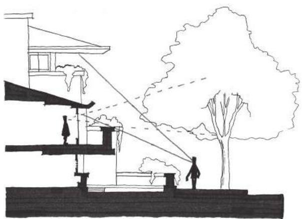  
FIGURE 5.14 Reproduction of a section of the Robie House comparing sight lines from outside the house and inside.

  
FIGURE 5.15 Exterior sketch of Frank Lloyd Wright's Unity Temple, built in Oak Park, Illinois, between 1905 and 1908. Wright's drawings show the temple nestled among heavy tree cover, though it is actually in a suburban area outside of Chicago.

Prospects and Refuges in Video Games

An obvious application of prospects and refuges in video games comes from the stealth subgenre in games such as Metal Gear Solid.21 In Metal Gear Solid, players progress through the game's levels by finding refuges from which they can discern the placement of enemy guards in prospect territories. Once they have done so, they can move through the prospect spaces to secondary refuges, and so on (Figure 5.16). This shows how prospects and refuges can be used to create discrete paths in games.

When utilizing prospect and refuge gameplay in this way, enemies become important architectural elements and the level itself a spatial puzzle. In The Nightmare Over Innsmouth,22 a companion game to the GDC China presentation of "Designing Better Levels Through Human Survival Instincts,"23 enemy behavior design and placement was imperative for turning a courtyard into a prospect- refuge gamespace. In this game, based on the H.P. Lovecraft novella The Shadow Over Innsmouth,24 the player must escape his or her hotel room by crossing rooftop beams, descending into a courtyard, and escaping through an empty house while evil townspeople pursue him or her. The courtyard is designed to utilize prospects and refuges in different ways. Players enter the courtyard from the lower level of a house, whose bottom door is on a lower level than the courtyard itself (Figure 5.17). From here they can look into the courtyard and see the entrance to the safe house, highlighted with orange light to contrast with the blue coloring of the courtyard, as well as the patrol paths of several townspeople. These enemies were scripted to patrol between waypoints, which were placed within the direct path from the courtyard entrance to the safe

  
FIGURE 5.16 A plan diagram of a level from Metal Gear Solid showing prospect and refuge spaces.

  
FIGURE 5.17 In The Nightmare Over Innsmouth, players can use the depressed entrance to the courtyard as a refuge.

house (Figure 5.18). Players who did not want to have encounters with the enemies had to use their time in refuges studying enemies' patrol patterns and finding the most advantageous time to move to secondary refuges.

The examples of architectural prospects and refuges in the previous section also allow us to understand more subtle uses of prospects and refuges in video games. Le Corbusier's Villa Savoye shows how wide spaces,

  
FIGURE 5.18 This plan diagram of the courtyard from The Nightmare Over Innsmouth shows enemy paths and refuges.

  
FIGURE 5.19 Comparison of Halo: Reach's Boardwalk map (right) with Le Corbusier's Ville Contemporaine (left).

views from above, and open planning can create a prospect- oriented space. These types of spaces are common in the multiplayer maps of first- person shooters.25 With its lightly colored architecture, the Boardwalk map of Halo: Reach26 could be taken straight from Le Corbusier's Ville Contemporaine—a "radiant city" with expansive parks, huge causeways, and gleaming towers27 (Figure 5.19).

Refuges, on the other hand, factor greatly into games where the player must search for hidden passages and secrets, such as *Metroid Prime*.28 Spaces in this game feature obscure alcoves and cantilevers that hide the game's many hidden items (Figure 5.20). These environments reflect

  
FIGURE 5.20 Sketches of environments from the *Metroid Prime* series show how these gamespaces employ Wright-esque details and natural materials to create a secretive, organic look.

the design values of Frank Lloyd Wright with their often intimate and organic atmosphere.

Prospects and refuges within level design can be utilized to create vastly different gameplay experiences within one set of gameplay mechanics. Games in the *Mega Man* series, for example, change the experience of their simple core mechanics—run, jump, and shoot—by varying the environmental conditions of battles. For battles with flying enemies, the room may feature several ledges for dodging around Mega Man's freely moving adversaries. Encounters with the Sniper Joe enemy, who hides behind a shield before shooting several bullets in succession, often occur near areas where Mega Man can jump in and out of cover. Boss rooms in these games are often entirely devoid of refuges and are pure prospect spaces, so players can have theatrical showdowns with these unique enemies (Figure 5.21).

It is worth noting a unique prospect- refuge experience used in *Half- Life* 230 where the prospect space itself is actually dangerous to the player avatar. In a reinvention of the children's game *Hot Lava*, where participants must avoid touching the floor, players must cross a beach under which dangerous alien insects live without touching the sand. They can move across the sand by moving debris with the Gravity Gun weapon to create bridges between rocky cliffs. In this case, the beach is the prospect space and the rocks are the refuges. Unlike the typical employment of prospect and refuge, everything is open. However, using the spatial experience of safe- unsafe contrasts creates a unique and memorable gameplay experience.

In the next section, we begin discussing spatial conditions with which humans have love- hate relationships by exploring lighting conditions.

  
FIGURE 5.21 Despite keeping consistent core mechanics, environments in Mega Man games create varied gameplay experiences by changing the prospect-refuge conditions in which players encounter certain enemies.

# SHADE, SHADOW, AND SURVIVAL

We have just explored prospects and refuges—wide open bright spaces and comfortably enclosed dark spaces. As we have seen, humanity's relationship with spatial sizes is simple: if a space is too large or too small, it is uncomfortable. However, if a space is accommodating to the abilities of a human or game avatar, it is pleasurable.

Our relationships with the lighting conditions of these spaces, however, are not so clearly defined. While discussing refuges, Hildebrand suggests that their low lighting conditions offer concealment from exterior dangers located in the brightly lit prospect. However, he later describes other transitions from light to dark as "not so pleasant."31 He attributes this to the strategic advantage of "seeing without being seen"32 when one is hiding in the dark. As one moves from dark to light, he may instead be the one who is being watched.

Architect Christopher Alexander, on the other hand, advocates for lighting conditions as a device for pulling occupants through space. In A Pattern Language: Towns, Buildings, Construction,33 Alexander describes how light may be used at junctions where the designer would like to lead occupants (Figure 5.22). In our previous discussions of contrast, lighting was an important element of emphasizing points along a path. Here we explore these elements of humanity's relationship with light and dark, and how they create dramatic gameplay experiences.

# Shade

The discussions of purely light and dark conditions do not touch upon the many other possibilities available to level designers within

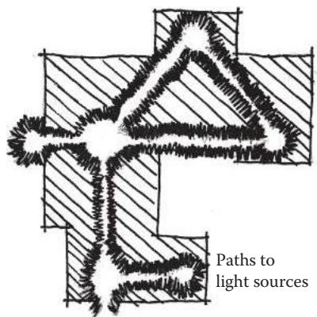  
FIGURE 5.22 This sketch, modeled after one drawn by Christopher Alexander, diagrams how light can be used at important junctions along a path.

their gamespaces. One such condition is shade. Shade is accomplished by allowing diffused lighting into a space through curtains, screens, or stained glass. It was a major feature of Gothic architecture, which strove to create an ethereal experience called lux nova, or "new light." This condition was also known as "mystic light" and was used to bring occupants of these churches closer to God. Shade is also a mainstay of the horror genre, with danger obscured by walls of mist.

Whether it is ultimately used to enhance beneficial or dangerous spaces, shade is known to create a sense of enticement in humans. As Hildebrand points out, incomplete visual information entices humans to explore and complete their knowledge of what they see.34 Rhythmic elements such as the columns in the Great Mosque of Cordoba (Figure 5.23) or the pattern of openings and partially revealed galleries in Carlos Scarpa's Castelvecchio Museum (Figure 5.24) further entice occupants to move through a space. Combined with shade, the result is a nearly inescapable need to explore.

Shade is an important element of many video games, as its ability to represent both sacred and malevolent spaces allows it to create atmospheric ambiguity—a condition where the player is unsure of whether a space is safe or unsafe due to a combination of friendly, unfriendly, and ambiguous spatial indicators. The Legend of Zelda: Twilight Princess,35 for example, utilizes both shade and prospect spaces for the interiors of many dungeons. As players wander through environments, they are left to wonder whether some large spaces are cathedrals that hold an important, sacred item or are the den of an evil monster (Figure 5.25).

  
FIGURE 5.23 The shaded conditions inside the Great Mosque of Cordoba (ca. 600 AD) work together with the rhythmic columns to create an enticing space that occupants want to explore.

  
FIGURE 5.24 Carlos Scarpa's Castelvecchio Museum in Verona, Italy (1972-1975), features openings between adjacent gallery spaces that entice both through rhythm and the obscuring of what is to the right and left of each portal.

The Nightmare Over Innsmouth utilizes shade and colored lighting to create atmospheric ambiguity as players descend into the prospect- refuge courtyard. After navigating a series of rooftop beams, players must enter the window of a house. While the space is safe and is actually a moment of low action between a tense balance challenge and an upcoming stealth challenge, the atmosphere is intended to be emotionally stressful. From within the house are the sounds of cultists chanting and an eerie green light—the product of

  
FIGURE 5.25 Zelda games often use a combination of shade and prospect spaces to create ambiguous dungeon environments: is the player about to receive an important item or be attacked?

  
FIGURE 5.26 (See color insert.) The Nightmare Over Innsmouth uses shade to create ambiguous moments of gameplay between points of high action. This allows the game to maintain a tense atmosphere despite a rest from challenges.

candles encircling a small altar. The visual of the altar and the lighting effect is revealed to players as they descend a tall staircase (Figure 5.26).

Such effects can be created in engines by thoughtfully placing light objects. While one must be mindful of the graphical expense of real- time lighting, dramatic lighting can be accomplished via light baking in content creation programs—having the program render a color map for the environment that includes lighting information. Many engines feature light mapping capabilities, which produce a texture that contains lighting

information, reducing the need for real- time lighting in areas where lighting will not change significantly.

In the mobile game SWARM!,36 the limitations of the target devices only allowed for one directional light: a light object that casts an infinite beam of light in a single direction, much like the sun. Therefore, designers had to carefully place each light in the angle that they wished the light in the scene to come from and tweak the object's settings. As SWARM! was built in Unity, these settings included the ambient lighting color of the level scene, the intensity of the light itself, and its color. With some creative tweaking, many different lighting conditions could be created with only one light (Figure 5.27).

On her blog Love Conquers All Games, game designer Christine Love describes how similar effects were created by the very limited four- shades- of- gray color palettes available on the Nintendo Game Boy and colorized on the Super Game Boy. In her article on colorization on the Super Game Boy, she describes how being able to only use four colors for an entire environment led to more evocative moods in games like World Heroes 2 Jet37 or King of Fighters '9638 when compared to their fully colored arcade counterparts.39 Though modern 2D color palettes vary, one can see how shade effects can be accomplished by creating scenes with dominant color palettes.

# Shadow

While shade is a diffusion of light that presents a mid- ground between light and dark, shadow is the condition created when an object obscures the light source and leaves a lack of light. Like shade, shadow has both positive and negative uses. For example, shadows fulfill Hildebrand's aforementioned description of the lighting within refuge spaces. They obscure those within from view and allow them to have a strategic advantage over opponents. This mirrors the friendly associations shadows hold for writers such as Jun'ichiro Tanizaki, who, in his essay In Praise of Shadows,40 reflects on the Japanese's relationship with shadows in their aesthetics, praising their subtlety and contemplative nature against the garish shine and brightness of Western objects.

The developers of the original Tom Clancy's Splinter Cell41 understood this when designing levels for their game, and conceived of the shadows in the game's environments as different spaces than those in the light. For this, they coined the term shadowspace to describe the unique areas where the game's protagonist, Sam Fisher, could move around undetected.42 The Court of the Lions in the Alhambra, located in Granada, Spain, utilizes

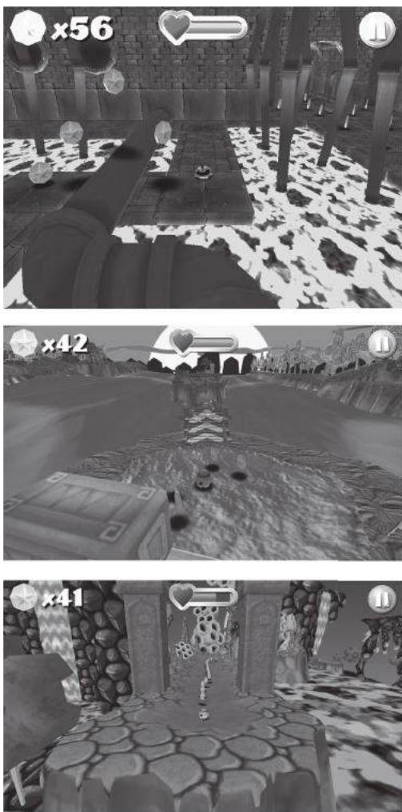  
FIGURE 5.27 (See color insert.) Screenshots from SWARM/ demonstrate that different lighting conditions can be accomplished while still limited to one light per level environment.

shadowspace to create the perception of a separate space (Figure 5.28). An arcade surrounds the court and separates the space underneath from the brightly lit courtyard itself. Despite being fully open to one another, the use of columns and lighting creates the perception of two separate spaces.

Shadows can, like physical architectural elements, also create the perception of rhythm. In *The Nightmare Over Innsmouth*, shadows coming from exterior windows of the character's hotel room and laid perpendicular to the player's line of sight are used to establish a rhythm and pull

  
FIGURE 5.28 Shadowspace is when shadows are used to create the perception of separate spaces by changing the lighting conditions within a single space. The term itself was coined by the developers of Splinter Cell and can be applied to architectural works such as the Court of the Lions in the Alhambra, Granada, Spain, built between 1362 and 1391 AD.

  
FIGURE 5.29 This rendered plan view of the beginning of The Nightmare Over Innsmouth shows how shadows can be baked into an environment to create the perception of rhythmic architectural elements. The layout of this portion of the level also recalls Scarpa's Castelvecchio Museum to create a sense of mystery and excitement in the horror-themed level.

the player further along the main path (Figure 5.29). As pointed out by Valve artist Randy Lundeen, shadows can also be used to create linear elements on surfaces parallel to the player's line of sight that pull the player toward their endpoint.43 Due to perspective distortion, lines such as those created by the shadows of structural elements will converge on a vanishing point. Used horizontally, this can create a dramatic sign for players to move certain directions in games (Figure 5.30).

Shadows' harmful associations should also be noted. Shadows work against humans when viewed from the light. They create the perception that they are hiding danger, which may very well be true in video games. In games such as Half- Life 2, dark alcoves are harbingers of enemy headcrabs, small creatures that leap at the player or turn non- player characters (NPCs) into zombies. This motif is also present in nearly every

  
FIGURE 5.30 This perspective sketch shows how shadows can create powerful linear elements that draw a player's eye, and eventually his or her avatar, through a space.

horror- themed game, where darkness may not only hide enemies, but also affect players in much more powerful ways.

Negative Space

Even when there is no danger within dark corners of caves or gamespaces, the psychological effect of the unknown cannot be ignored. In games, architecture, and media, darkness is just one way that designers build the perception of negative space. In art and graphic design, negative space is unused or blank space in a work, the exposure of the background. For our purposes, negative space refers to that which is unknown to the player, viewer, or occupant. In storytelling this can be the mystery surrounding the motivations of the player. In level design, this can apply to creating anxiety by making players unaware of what surrounds them.

In many ways, negative space is a way to bolster the effectiveness of prospect spaces as it works best when there is a perception of a beyond to the game space, or that it extends past what the player can see. One such example is the game Slender: The Eight Pages by Parsec Productions.44 In this game, players must search dark woods for eight pages armed with only a flashlight as they are pursued by a malevolent entity known as the Slender Man. The game's very structure is negative space: the environment is a large wooded prospect space shrouded in thick shadows. Slender Man is not a character with a set location or movement capabilities,

but rather is scripted to randomly $^{45}$  spawn around the player. This lends an air of mystery to him, as players are unsure of where he will be as they move around. The combination of the heavily shadowed environment and the Slender Man's method of movement give Slender Man omnipotence over the gameplay. Even when he is not on screen, the player is aware that he may be anywhere in the environment—a feeling enhanced by the game's sound design. Thus Slender Man ceases to be simply a humanoid figure, but also is embodied by the shadows.

In addition to its use with shadow, negative space has been used to add a feeling of malevolent unknown to environmental elements, such as bodies of water or architectural spaces. In the film Jaws, $^{46}$  director Stephen Spielberg withheld a view of the film's monster, a great white shark, for an hour—showing only views from the shark's perspective whenever it was stalking bathers. This decision on Spielberg's part made the shark synonymous with the water itself. Similarly, many science fiction- themed games utilize sound effects to create the impression that the world surrounding the player is bigger than the space directly around the player avatar. Dead Space $^{47}$  utilizes shadow and sound effects to create the impression that monsters are running through ventilation ducts and other structures within a large space ship. The Metroid series utilizes musical themes that are at times more like soundscapes rather than actual melodies.

Lighting conditions and negative space are both useful methods of not only putting players in interesting survival scenarios where their enemies are unknown, but also enticing players with withheld information or atmospheric ambiguity.

In the final section of this chapter, we will look at another environmental element that humanity has a dualistic relationship with: height.

# LOVING AND HATING HEIGHT

Just as we both fear and utilize shadow and shade as environmental tools, we have a similar relationship with height. While it is common to have a fear of heights, heights can also give a strategic advantage by allowing occupants of high places to look down on opponents below. In video games, sniper characters often utilize this tactic. In multiplayer games, sniping spots are often valuable areas for players to have control of, as they offer a refuge with a wide view of the map. Many strategy games feature mechanics where extra offensive or defensive capabilities are given to units located on higher terrain. In these ways, height is very beneficial indeed.

However, height can also provide an overwhelming sense of danger in. gamespaces. While when one is situated comfortably on a high precipice, there is a sense that the high place is a refuge, placing an occupant at a high point with little between him or her and the fall creates a stressful experience (Figure 5.31).

The Nightmare Over Innsmouth explores both elements of height early in the level (Figure 5.32). Near the beginning, the player is forced to cross the structural beams of caved- in rooftops to reach safety. As the beams are the width of the character, crossing them is perilous and requires

  
FIGURE 5.31 An occupant or player's relationship with the edge of a high space determines the experience it creates. When there is an architectural mediation between the occupant and the fall the height is comfortable and advantageous. When there is nothing the height is perilous.

  
FIGURE 5.32 The Nightmare Over Innsmouth demonstrates both uses of height in games: as an advantage and as a danger.

  
FIGURE 5.33 In this screenshot, vertical structural elements and windows draw the eye toward the bottom of a pit, making the height feel more intense.

the player to move slowly. Adding to the perception of height are the caved- in building's windows and the columns holding up the beams that the player is standing on. These vertical elements have the same effect as the shadow lines discussed earlier. Because they appear to converge at a point because of perspective distortion, they create a visual pull toward the bottom of the pit, making the height more intense (Figure 5.33). This is an architectural method modeled after Gothic churches such as the Notre Dame Cathedral in Chartres, France, in which structural columns were not represented as a singular monolithic piece, but as many smaller linear elements. These linear elements would be drawn upward from the floor of the church to the top of the vaulted ceiling to create the experience of peering into the heavens (Figure 5.34). This method is also used in games such as Half- Life 2, which utilizes vertical shadows on the Combine Citadel much in the same way shadows are used inside the structure: to create linear elements that draw the eye toward the shadows' vanishing point. When used vertically, the shadows emphasize the danger of the height.

The Innsmouth level also demonstrates height's beneficial uses. After surviving the walk across the beams, players can look down upon their next major challenge—the prospect- refuge courtyard. This allows players to scout the enemy patterns as though looking at a plan of the level, rather than having to do so from ground level where the enemies are actually dangerous (Figure 5.35). Like many spatial concepts discussed in this chapter, height can be used by level designers to create interesting experiences for players by utilizing its dualistic nature.

  
FIGURE 5.34 This sketch of Chartres Cathedral, built between 1194 and 1230, shows how structural elements begin at the floor and are then drawn upward to the top of the church. This draws the eye upward toward the heavens.

  
FIGURE 5.35 This screenshot shows how height allows players to look down upon enemies and have a tactical advantage on them. The character in the screenshot can use the time spent on the roof memorizing enemy movement patterns to make the upcoming stealth gameplay easier.

# SUMMARY

We have begun our explorations of how to create emotionally evocative. gamespaces by investigating spatial orientations related to primal survival instincts. We have seen that survival is core not only to our human experience, but also to the experience of many video games, with the ability to continue playing being a very powerful reward indeed. We also explored the architecture of survival, which provided insights for creating paths through the use of prospects and refuges, for the use of lighting through shade and shadow, and for the use of height.

While many of these architectures correspond with another primal emotion, fear, they can also be used to evoke other emotions by subverting a player's vulnerability to the architectures themselves. Games such as Thatgamecompany's Flower48 has players breaking through shadowy environments, bringing light and color to a monochromatic world. Batman: Arkham Asylum49 turns the idea of prospect and refuge on its head by making the game's prospect spaces intimate to Batman's abilities, making him the lurking horror in it. Empowering players in this way can create exhilarating experiences, which we also explore in the next chapter as we discuss reward spaces.

# ENDNOTES

ENDNOTES1. Thomas Was Alone. Mike Bithell (developer and publisher), July 24, 2012. PC game.2. Adams, Douglas. The Restaurant at the End of the Universe. New York: Harmony Books, 1981.3. Hildebrand, Grant. Origins of Architectural Pleasure. Berkeley: University of California Press, 1999.4. Salen, Katie, and Eric Zimmerman. Rules of Play: Game Design Fundamentals. Cambridge, MA: MIT Press, 2003, p. 348.5. Computer Space. Nutting Associates (developer and publisher), 1971. Arcade game.6. Pong. Atari (developer and publisher), 1972. Arcade game.7. Maslow, A.H. A Theory of Human Motivation. Psychological Review 50, no. 4 (1943): 370- 396.8. Totten, Christopher W. Designing Better Levels Through Human Survival Instincts. Gamasutra. http://www.gamasutra.com/view/feature/6411/designing_better_levels_through_.php?print=1 June 21, 2011 (accessed March 25, 2014).9. The Legend of Zelda. Nintendo (developer and publisher), February 21, 1986. Nintendo Entertainment System game.10. Metroid. Nintendo R&D1 (developer), Nintendo (publisher), August 6, 1986. Nintendo Entertainment System game.

11. Dragon Quest. Chunsoft (developer), Enix (publisher), May 27, 1986. Nintendo Entertainment System game.12. Schwarz, Eric. Gamasutra: Eric Schwarz's Blog—Seeing Red: The Pitfalls of Regenerating Health. Gamasutra—The Art & Business of Making Games. http://gamasutra.com/blogs/EricSchwarz/20120902/176928/Seeing_Red_ The_Pitfalls_of_Regenerating_Health.php (accessed May 29, 2013).13. Halo: Reach. Bungie (developer), Microsoft Game Studios (publisher), September 14, 2010. Xbox 360 game.14. Hildebrand, Grant. Origins of Architectural Pleasure. Berkeley: University of California Press, 1999, pp. 24-28.15. Woodcock, D.M. Functionalist Approach to Environmental Preference. Ph.D. dissertation, University of Michigan, 1982.16. Hildebrand, Grant. Origins of Architectural Pleasure. Berkeley: University of California Press, 1999, p. 32.17. Hildebrand, Grant. Origins of Architectural Pleasure. Berkeley: University of California Press, 1999, p. 39.18. Le Corbusier. Towards a New Architecture. New York: Dover Publications, 1986.19. Frank Lloyd Wright—The Prairie Style: From Theory to Practice. Frank Lloyd Wright's Westcott House. http://www.westcotthouse.org/prairie_style.html (accessed May 29, 2013).20. Hildebrand, Grant. Origins of Architectural Pleasure. Berkeley: University of California Press, 1999, p. 33.21. Metal Gear Solid. Konami Computer Entertainment Japan (developer), Konami (publisher), September 3, 1998. Sony Playstation game.22. The Nightmare Over Innsmouth. Christopher Totten (developer), 2011. Demonstrative PC game for GDC China presentation.23. Totten, Christopher. Designing Better Levels Through Human Survival Instincts. Half-day tutorial presentation at the Game Developers Conference, Shanghai, China, November 12-14, 2011.24. Lovecraft, H.P., and S.T. Joshi, eds. The Shadow Over Innsmouth. In The Call of Cthulhu and Other Weird Stories. New York: Penguin Books, 1999, pp. 268-335.25. It is this author's belief that Le Corbusier would have been an amazing designer of FPS deathmatch maps.26. Halo: Reach. Bungie (developer), Microsoft Game Studios (publisher), September 14, 2010. Xbox game.27. It should be noted that (as will be discussed in a later chapter) Ville Contemporaine was built to separate the mechanics of one's life—living, working, shopping, etc.—into discrete districts separate from one another, so the comparison to Boardwalk is mainly a stylistic one. The city's own scale was massive, as Le Corbusier designed the city around the use of cars and airplanes, which he loved and figured everyone would have in the future. If Boardwalk were to truly be something out of Ville Contemporaine, players would never even see one another, much less have a deathmatch.28. Metroid Prime. Retro Studios (developer), Nintendo (publisher), November 17, 2002. Nintendo Gamecube game.

29. Mega Man. Capcom (developer and publisher), December 17, 1987. Nintendo Entertainment System game.30. Half-Life 2. Valve Corporation (developer and publisher), November 16, 2004. PC game.31. Hildebrand, Grant. Origins of Architectural Pleasure. Berkeley: University of California Press, 1999, p. 54.32. Hildebrand, Grant. Origins of Architectural Pleasure. Berkeley: University of California Press, 1999, p. 54.33. Alexander, Christopher, Sara Ishikawa, and Murray Silverstein. A Pattern Language: Towns, Buildings, Construction. New York: Oxford University Press, 1977, pp. 645-646.34. Hildebrand, Grant. Origins of Architectural Pleasure. Berkeley: University of California Press, 1999, p. 51.35. The Legend of Zelda: Twilight Princess. Nintendo EAD Group No. 3 (developer), Nintendo (publisher), November 19, 2006. Nintendo Wii game.36. SWARM!. e4 Software (developer and publisher), January 2, 2013. Mobile device game.37. World Heroes 2 Jet. ADK (developer and publisher), April 26, 1994. Game Boy game.38. King of Fighters '96. SNK (developer and publisher), July 30, 1996. Game Boy game.39. Love, Christine. Fuck the Super Game Boy: Fighting Games. Love Conquers All Games. http://loveconquersallgam.es/post/2361219481/fuck-the-super-game-boy-fighting-games (accessed May 31, 2013).40. Tanizaki, Jun'ichiro. In Praise of Shadows. New Haven, CT: Leete's Island Books, 1977.41. Tom Clancy's Splinter Cell. Ubisoft Montreal (developer), Ubisoft (publisher), November 17, 2002. Xbox game.42. Borries, Friedrich von, Steffen P. Walz, and Matthias Bottger. Space Time Play Computer Games, Architecture and Urbanism: The Next Level. Basel: Birkhauser, 2007, pp. 84-85.43. Lundeen, Randy. Interview by author. Personal. Valve Corporation, Bellvue, WA, October 27, 2008.44. Slender: The Eight Pages. Parsec Productions (developer and publisher), June 26, 2012. PC game.45. Technically there's no such thing as true randomness with scripting, but this is the best word for it.46. Jaws. DVD. Directed by Steven Spielberg. Universal City, CA: Universal Home Video, 1975.47. Dead Space. Visceral Games (developer), Electronic Arts (publisher), October 14, 2008. Xbox 360 game.48. Flower. Thatgamecompany (developer), Sony Computer Entertainment (publisher), February 12, 2009. Sony Playstation 3 game.49. Batman: Arkham Asylum. Rocksteady Studios (developer), Eidos Interactive (publisher), August 25, 2009. Xbox 360 game.

# INTERVIEW WITH CHRIS PRUETT

Chief Taskmaster, Robot Invader

Chris Pruett is the founder and CEO of Robot Invader, developer of the mobile Android game Wind- Up Knight. He was previously Senior Developer Advocate at Google, responsible for bringing games to Android, and a senior programmer at Activision/Vicarious Visions. He is the author of Chris's Survival Horror Quest, an online blog in which he analyzes both famous and obscure horror games.

Can you name a game, level, or level designer (or multiples of each) whose work has left an impression on you? Why?

I am continually impressed with the design of the mansion in the original Resident Evil. Though the moment- to- moment gameplay involves shooting zombies, finding keys, and solving puzzles, the meta- game is about tracing routes through the maze- like mansion, finding shortcuts, and growing the size of the traversable space. Your job in the early Resident Evil games is to recursively unlock areas of the mansion until it becomes a complex, interconnected space, which you must then traverse as efficiently as possible to avoid excessive zombie encounters. In the end, it's the traversal of the (initially simple, eventually complex) map that requires the most brainpower; the zombies and puzzles are simply activities to complete on the way. This sort of design isn't unique to Resident Evil, but I think there are few games that do it better. It's very difficult to design this kind of space, but the Resident Evil games make it look easy.

Are there any media outside of gaming that you find inspire your work?

I am a big fan of Haruki Murakami's novels, particularly The Wind- up Bird Chronicle. I love the way the events in his writing take place deep below the surface of the narrative.

I really enjoy film as well, though I watch a lot less than I used to. Occasionally I will discover a comic book that sends me reeling for a while. Most recently that award goes to two Japanese books, Nijigahara Holograph and Sayuri.

Describe your level design process- how do you begin? What tools do you use (on or off the computer)?

The process varies dramatically with the format of the game. For a platformer like Wind- Up Knight, the level design cannot be started until the core mechanics are set in stone. So we do a lot of test levels with just boxes hanging in the air until we're able to lock down some of the core move set. From there we block out all of the levels using boxes and (often placeholder) enemies. Only when all of the levels are close to finished do we sit down and sort them into categories (generally by theme and difficulty), and only after that do we start to apply real art. Throughout this process we are constantly

throwing things away and reworking ideas. Wind- Up Knight went through several months of iteration before we started generating levels that actually appeared in the final game.

For our new, as- yet- unannounced project, the process is extremely different. This game is something a little more akin to the Resident Evil example I gave above: it's a space that is slowly opened over time for the player to explore. In this case, I started with a reasonable map layout (architectural plans for a house) and began by mapping the traversal of the player through it over the course of the game. From there I have applied a method called a puzzle dependency diagram which allows me to document the flow of puzzles through the space (puzzle C can't be completed before puzzles A and B are finished, etc.). So the design of the map and the contents of the rooms have been defined since very early in the project, and now our main job is to ensure that the pacing of progression matches the experience we intend to provide to the player.

What is your process for playtesting your levels?

We try to have as many people who are not on our team test as possible. It's useful to watch playtesters, but we also use automated analytics recording to identify issues. On Replica Island, I recorded the spots at which players died on a server, and then used that data to generate heat maps over the level geometry, which told me very quickly where the frustration points were.

Do you find art and atmospheric effects an important tool for communicating with players? Any specific examples?

This is also highly dependent on game style, but generally speaking, every tool at your disposal must be used to communicate with players. It's much harder than you might initially assume to send a player a message. Even giant flashing text on the screen will be missed (or ignored, or misunderstood) by some of your audience. So yes, we use art, sound, vibration, animation, UI—everything we can to get messages through the glass.

More specifically, Thomas Grip, the brains behind Amnesia: The Dark Descent, has a very useful idea about sense of presence. This is specifically applicable to atmospheric games. The idea is to remove all elements that might damage the feeling that the player is there in the world. This often causes heads- up display (HUD) elements to be entirely removed, but it doesn't stop there. Grip talks about removing unbelievable or out- of- place game elements whenever possible to maintain the sense of presence at all costs. For example, some developers like to leave jokes in the background art of their games (e.g., a movie poster named after the developer), but the sense of presence doctrine requires such elements to be removed.

How do you teach players to utilize your levels (without use of the GUI)? There's nothing wrong with GUI, or more generally, non- worldly elements to ensure communication with the player. For example, Metal Gear Solid would be unplayable if it lacked the 2D question mark icons that appear above

alerted enemies' heads. Better to ensure that the message is understood than to maintain some concept of realism.

That said, a really good level designer guides the players through a space without them realizing that they are being guided. Halo 1 does this very well, especially in outdoor environments. Subtle hills and efficient- looking valleys are used to guide the player exactly along the route that the designers want him to go without obvious breadcrumb items or GUI.

For our current secret project, we attempt to force the player down a specific path by giving them things to do along that path. For example, if the player finds himself with a key in his inventory and one locked door, it is likely that he tries the door before exploring other areas. If there is something interesting beyond the door, we expect him to pass through the doorway and explore it. In this way we try to lead the player through the game without explicitly forcing them down a fixed path. We also allow for certain areas to be visited in any order before a choke point is reached (which is what the puzzle dependency diagram I mentioned above describes). Gone Home is a recent example of a game that does this very well.

How do you entice players to explore game levels (without use of the GUI)? In a game like Wind- Up Knight, which is highly linear and exploration is not required to progress, we do it by dangling hard- to- reach items and secret passages in front of the player without telling them exactly where they are. For example, the player might see an alternate path, perhaps a subway below their feet, with items to collect. In order to find the entrance to that area, they'll have to go back and look for it, though players who are only interested in progression can skip it and move on.

In our new project, exploration is the core element of the game, so we hope that players approach the experience with a willingness to explore already in their minds. That said, we use narrative (dropping clues for the player to think about while she solves other problems), key items (via the recursive unlocking scheme I mentioned above), and puzzles (which often require searching an area to complete) to promote and reward exploration.

If a player is lost in one of your levels, how can he find his way back to where he is supposed to be (without using the GUI)?

In Wind- Up Knight, this basically isn't possible. It's a platformer, it only moves in two dimensions, and the player's options are to progress or die.

In our new game, we generally prevent players from getting lost by constraining the size of the explorable space. Eventually they will unlock a larger space, but it's a collection of spaces they have explored before, with a few new spaces hanging off the edges. Though the space enlarges, players are already familiar with most of it. We try to ensure that there are only one or two new places to go at any time, so if a player is lost, he can simply find an area he is unfamiliar with and explore that. That direction is always a forward path.

How do you direct the actions of players in your levels? How do you encourage players to play in undirected ways?

In our new game, we are using a technique common to many adventure games, which is to provide bits and pieces of problems and allow the player to resolve them out of order. For example, at any given time the player should have at most three outstanding problems to solve (where problems are things like a locked door, a combination lock, or the location of an item). These problems can be solved in any order, and once they are solved a new set of problems will be presented. More generally, each problem itself is solved by completing a series of steps, and if the player gets stuck on one step, he can go work on a different step for a different problem. The goal is to ensure that we almost never reach a point at which there is only one correct thing to do to progress. When those choke points do arrive, we try to make the next step as obvious as possible.

This way the player solves problems at their own pace, in the order that they prefer, but stays within the progression structure that we've defined for them.

What laws of level design have you developed in your own work that any designer should know? What should they avoid?

For platformers: define metrics and use them. All of your jumps should be the same size, or from a small set of predefined sizes. The height of your platforms, the distance from a warning to an enemy, the minimum space between challenges, all of this should be rigorously defined and consistent from level to level. The player is trying to find patterns in your design, and it's your job to provide them.

For adventure- style games: give the player no more than three problems to solve at any given time. Make areas that need to be investigated stand out from the background; the challenge should be to figure out what to do when you get there, not finding the exact pixel to click on. Be very wary of mixing "what do I do next!" challenges with "doing the next thing is mechanically hard" challenges. Give the player extra information if they try to investigate something more thoroughly. Close off paths that are no longer relevant to the game.

For all games: checkpoints and save reloads must start the player facing the direction that they were facing when the game saved. Make the difference between traversable and non- traversable areas exceedingly obvious.

You've done a considerable amount of game analysis for your blog, Chris's Survival Horror Quest. What spatial elements or types (room sizes, room types, architectural elements, etc.) have you seen throughout multiple games?

One common spatial theme in horror games is descent. Horror games almost always involve delving deeper and deeper underground. The general theme here is areas for which there is no clear escape route. This is often paired with one- way transitions (e.g., jumping into a hole). The message to the player is

simple: you can't escape. You must press forward. It is a very oppressive message.

How do you utilize your study of other games to influence your own designs? For some types of games, such as my current project, horror games provide a direct influence. I'm not making a horror game at the moment, but perhaps a close cousin to the genre, and things like the recursive unlocking setup are extremely valuable. But more generally, I think that thinking about games, and specifically why the designers made the decisions that they did, helps me think much more critically about my own games. Interestingly, I learn a lot more from the games that fail than from the games that succeed.

What place can environment art play in lending to an environment's mood? How can environment art allow designers to communicate with players?

I think this is a big piece of Grip's sense of presence theory. If the art distracts from the world, it will damage the sense of presence and hurt the overall effectiveness of the game. If it pulls the player in, the opposite effect is achieved. Silent Hill, with its hellish Otherworld version of the regular level geometry, is king of this.

Once you've established how player characters move and react to player input, how do you best design game environments to address these capabilities?

Player input and mechanics come first. Once those are defined, we define the basic level metrics (pit sizes, platform heights, etc.). Once we have those things we can start to combine elements to make for complex strings of input. It's hard but very fun!

In Wind- Up Knight, the player had a considerable amount of moves he or she could utilize—jumping, fighting, shield use, and rolling. How did you teach players to utilize these actions appropriately in levels, and how did you reinforce them throughout the game?

We start the player off with just one action—jump—and then slowly add new moves over time. By level 9 they have the four basic inputs defined, but it's not until much later, sometime around level 16 or 17, that they actually have access to all of the Knight's moves. This is tricky—we want to ease the player into the game, but we also want to get to the complex move sets as quickly as possible, as that's where the really fun level designs come into play.

# Enticing Players with Reward Spaces

Golf can best be defined as an endless series of tragedies obscured by the occasional miracle.

—UNKNOWN AUTHOR¹

What if everything that you see, is more than what you see? The person next to you is a warrior and the space that appears empty is a door to another world? What if something appears that shouldn't? You either dismiss it or accept that there is more to the world than you think. Perhaps it is really a doorway, and if you choose to go inside, you'll find many unexpected things.

—SHIGERU MIYAMOTO²

T that can make them more rewarding. We have previously discussed elements of rewards- - how they may be used to teach, and the challenges that often precede them. If challenges are what make games dramatic, rewards are what make them pleasurable.

This chapter focuses on the experience of the rewards themselves, particularly what makes them satisfying to obtain and how we can make

players aware of them in the first place. We look at how rewards contribute to the psychological journeys players take through our games. Next, we explore the types of rewards found in games, and how they facilitate movement through gamespaces. Finally, we explore how rewards become goals that create the structure for entire game worlds.

What you will learn in this chapter:

The purpose of rewardsThe types of rewards in gamespacesMaking rewards exciting through denialGoals and reward schedules

# THE PURPOSE OF REWARDS

At first glance, the purpose of rewards in games should be obvious: to give players a payoff for engaging a game, achieving specific goals, or improving their performance. However, in level design, designers can provide players with options of how to proceed through a gamespace, straight through the main action pieces or on longer paths of exploration, by suggesting the presence of rewards. Therefore, we may say that the purposes of rewards in level design are:

Incentivizing in- game behaviors Enticing exploration Creating a sense of curiosity

These three goals will form the basis of how we view rewards in this chapter and how we define how rewards are utilized in gamespaces. Before moving forward, we shall further explore these goals.

Incentivizing In- Game Behaviors

In Chapter 4, we explored the work of Ivan Pavlov, B.F. Skinner, and other behaviorists, psychologists who concerned themselves with observable behaviors in organisms. Both experiments incentivized actions to subjects by offering rewards.

Beyond these examples- where food, comfort, and the risk of electrical shock are factors- rewards are also useful in games for incentivizing and reinforcing gameplay mechanics. We have highlighted this

incentivizing as a method of teaching the player how to play a game by rewarding the correct actions that correspond to gameplay mechanics. However, rewards are also useful for attracting players to games and convincing them to spend more time in a game. As argued by Bernard Suits in *The Grasshopper: Games, Life, and Utopia*, games employ indirect methods toward accomplishing goals that seem inefficient compared to how one would accomplish the same goal outside of a game. He uses the examples of boxing and golf—if you want to make someone stay down for 10 seconds, you would use a force much greater than punches; if you want to get a ball into a cup, you would not hit it with a stick from hundreds of yards away. However, the boxer who knocks down his opponent wins the fight and moves up in ranking, and a successful golfer can boast about completing a hole under par—the standard amount of strokes it takes to complete a given hole. The pleasure of earning in- game rewards for these actions gives a reason to play despite what appear to be real- world inefficiencies.

In a spatial sense, rewards are useful for making a player take risks or leave the game's "main path." In Chapter 5, we explored a number of spatial arrangements that humans consider dangerous: areas where people are open to attack, shadowed spaces, and heights. There are spaces that seem illogical to travel through, so- called scenic routes apart from a more direct route to destinations. Just as pleasurable scenery or a memorable landmark entice people to take alternate routes in the real world, extra rewards incentivize extra exploration of a game world.

# Enticing Exploration

As resources, rewards have some type of scarcity or use that makes them valuable: enhancements to or refilling of the player's health, new weapons, ammunition, or an important quest item. For the level designer providing players with opportunities for exploration within their gamespaces, directly alerting players to the presence of rewards is an effective tool. It is here where the concept of a player's sight lines, which have been very important throughout the book, once again comes into play. Rewards that are put into the player's line of sight (Figure 6.1) but kept out of reach can be powerful motivators to explore the level he or she currently inhabits beyond any obvious routes. This reaction can be made stronger if the designer shows the reward but obscures or merely hints at the path to the reward itself. This can be accomplished by requiring the player to go through other rooms to reach the reward, placing the path behind

  
FIGURE 6.1 These sketches demonstrate how rewards can be shown to a player in different camera orientations. By making a reward visible within the player's line of sight, but obscuring the path to that reward, the player is enticed to explore further.

walls that hint at the path through windows or cracks, etc. This places responsibility for finding the path in the hands of the player, giving him or her a mystery to solve.

Creating a Sense of Curiosity

Curiosity is an important emotion in game development. While the concept of eliciting curiosity is similar to enticement, it is much more abstract. Rather than directly showing a reward to a player, the player gets clues that a reward may be nearby and is thus curious to see if the reward is indeed there. This can be accomplished with the use of modular assets, textures, lighting techniques, or anything that can be prefabricated and reused throughout a game as a symbol.

As discussed in Chapter 2, "Tools and Techniques for Level Design," a main goal of level design is the augmentation of space with information. Establishing rewarded patterns of gamespaces or modular assets is one way to feed information to players as they play (Figure 6.2). As these patterns are demonstrated to players and rewarded, such as the use of the lambda symbol in Half- Life  $2^{4}$  near friendly bases or weapon caches, players will know to look for further opportunities to be rewarded. In game structures such as the previously discussed problem of the protagonist, where players must hunt down metric- expanding rewards to progress through a game, curiosity can be a vital part of the game's core experience for finding both required and extra items.

The ways in which rewards entice further engagement into a gamespace and reinforce game mechanics depend on the types of rewards utilized. We will explore several types of rewards in games and how they apply to spatial design in games.

  
FIGURE 6.2 If players are rewarded for exploring spaces of a type or with certain visual elements, they will learn to recognize that rewards may be nearby if they recognize similar areas later in the game. This will make them curious to explore.

# THE TYPES OF REWARDS IN GAMESPACES

Now that we understand what rewards are for in game levels, we can discuss the types of game rewards that can be utilized in gamespaces. In Rules of Play: Game Design Fundamentals, Katie Salen and Eric Zimmerman describe the following types of rewards:

Rewards of glory: A sense of achievement gained by overcoming challenges in a game or winning a game. These rewards are not necessarily part of a game's mechanics.5

Rewards of sustenance: In- game objects that allow players to maintain their avatar in some way: health, ammo, magic, etc.

Rewards of access: An item or other gained resource that allows players to access a previously inaccessible area, such as a locked door. These are often one- time- use items such as keys. These may also include access to narrative items, such as video logs, or out- of- game information, such as concept art.

Rewards of facility: A new ability for a player that expands his or her moveset in some way. These may or may not also allow access to new areas.6

These rewards work within general game design to describe a game's effect on players and how resources can be allocated as a reward for overcoming obstacles. Our goals for rewards in level design describe a lot of

these, especially rewards of facility and rewards of sustenance. However, these rewards are largely item based: resource recharges, keys, power- ups, and the like. While in level design we are concerned with the placement of these reward items in space; as discussed in using rewards for enticement, there are types of level spaces or experiences that can themselves be rewards. We will discuss the types of reward spaces and how they correspond to the item and mechanic rewards identified by Salen and Zimmerman. These spaces are:

Reward vaults

Rewarding vistas

Meditative space

Narrative stages

As we will see, these spaces address issues of pacing, sight lines, and scripted events. By exploring what makes these spaces rewarding, we can understand how to create interesting levels with them.

Reward Vaults

The first and most obvious reward space in games is reward vaults. These spaces contain items, information, and other resources that constitute Salen and Zimmerman's gameplay reward types. They can be used for gameplay management opportunities such as save rooms. In terms of form and construction, these spaces frequently distinguish themselves from other level spaces in terms of lighting, music, or spatial character. They are often intimately sized and may feature high ceilings or vaulting, the use of arches to create a ceiling or roof, to architecturally celebrate the space (Figure 6.3).

A prime example of reward vaults is the item rooms from the Metroid series. In the original Metroid,7 these rooms feature a consistent architectural language throughout, and have their own music. This uniqueness reinforces the idea that the space is for a function apart from typical gameplay. Also, ceremonial statues with outstretched hands, evoking the architecture of ancient temples, hold reward items. Later games in the series would further embellish these spaces with columns, arches, and other temple forms.

A less obvious example of reward vaults comes in Bioshock Infinite,8 in which the player can find caches of items in storerooms off of the

  
FIGURE 6.3 In many Western Christian churches, the altar is often located at the end of the longitudinal axis of the church and celebrated with a half-domed ceiling structure such as in this sectional sketch of the church of St. Miniato Al Monte in Florence, Italy (built 1062-1090). This is referred to in architectural design as the apse of a church. Visitors reach the church and this important interior space after climbing a series of staircases both outside and inside the building.

game's main pathways. These vaults require short bouts of exploration and often the use of lock picks to reach. While not celebrated architectural spaces, they still contain rewards of sustenance, such as health, ammo, and salts; the game's mana resource; or rewards of access, such as audio logs.

Rewarding Vistas

An important but often overlooked reward in gamespaces is rewarding vistas, or impressive views of scenery. Like rewards of glory, these do not often offer anything in terms of gameplay resources. However, they are important for pacing purposes, providing a moment of catharsis after areas of high- action gameplay (Figure 6.4).

Rewarding vistas attract players to linger at them by offering interesting or unique game art to look at: wooded valleys, sunsets, the energy cores of alien architecture, cities, or other "eye candy." Coined by designers at Valve, rewarding vistas are used heavily throughout both Half- Life 2: Episode  $1^{9}$  and Half- Life 2: Episode 2.10 As these are first- person shooter games, the tendency of players is to run through the game to the next gunfight. However, with an interesting visual asset or animation to look at, players will pause for the intended rest. In games conducive to nearly constant action, like first- person shooters, rewarding vistas help create a

  
FIGURE 6.4 Rewarding vistas provide a moment of calm after high-paced action gameplay.

pleasantly contrasted moment of quiet gameplay without greatly slowing down the game's pace.

Beyond pacing concerns, rewarding vistas can also be utilized to celebrate spatial achievements such as climbing high structures. In Batman: Arkham Asylum,11 players who explore the high structures outside the asylum can view Gotham City in the distance. Likewise, The Legend of Zelda: A Link to the Past12 rewards players for climbing the maze- like caves of Death Mountain by showing forests and clouds beyond the environment of the game itself.

Meditative Space

A more extreme version of the rewarding vista is the meditative space. Like rewarding vistas, meditative spaces offer the moments of low- intensity gameplay that are vital for proper game pacing. Meditative spaces are intimately sized and either provide opportunities for players to enjoy the movement metrics of their avatar or provide an actually meditative atmosphere.

In The Prince of Persia: The Sands of Time,13 water fountains often break up the game's intense combat and platforming moments. These spaces offer a relaxing atmosphere with soft lighting and the sound of water as the Prince moves around in the fountain. While also an example of a

reward vault, as players can make the Prince drink water to heal himself, these spaces provide a pause in the game's otherwise intense action.

Portal $^{14}$  has players use elevators to travel between puzzle chambers. These spaces offer neither rewarding views nor resources, but break up gameplay so players may mentally recover from the puzzle they just completed and prepare for the puzzle to come.

# Narrative Stages

A reward type not addressed by Salen and Zimmerman is the reward of narrative exposition, the portion of a story that describes background information to viewers. As an interactive narrative medium, games may utilize storytelling as a reward for completing in- game challenges such as large battles or skill challenges. While the use of narrative gamespaces will be discussed in greater detail in Chapter 7, "Storytelling in Gamespace," it is important to know that games often utilize narrative as a form of reward.

When designing levels with scripted narrative events, it is important to provide spaces within which these events occur. Like the other rewarding spaces we have explored, these spaces distinguish themselves from others through celebratory architectures such as vaulting, arches, domes, and other structures (Figure 6.5). Games in the Final Fantasy series reserve the most significant story elements for epic architectural set pieces—the tops of towers, temple interiors, and balconies. In earlier entries, where combat would initiate randomly as players moved through the environment, the spaces approaching narrative stages would also identify themselves through a lack of enemies. Likewise, many of the narrative stages in Metal Gear Solid $^{15}$  games distinguish themselves with openness—high ceilings and tall monolithic structures for characters to speak from—in a game otherwise focused on alcoves and hiding places. In both examples, the lack of enemies allows players to leave a combat mindset, rest, and prepare to absorb narrative information—even if the narrative scene is followed by a significant battle.

Like rewarding vistas and meditative spaces, narrative stages provide important pacing changes and opportunities for players to rest. These spaces, however, also offer the added reward of allowing players to learn "what happens next" in a game's story.

These types of reward spaces are not made to stand alone. As examples like the water fountains from Prince of Persia show us, reward space types can be mixed together to be both meditative and rewarding, provide both vistas and narrative, or other combinations. Their overall

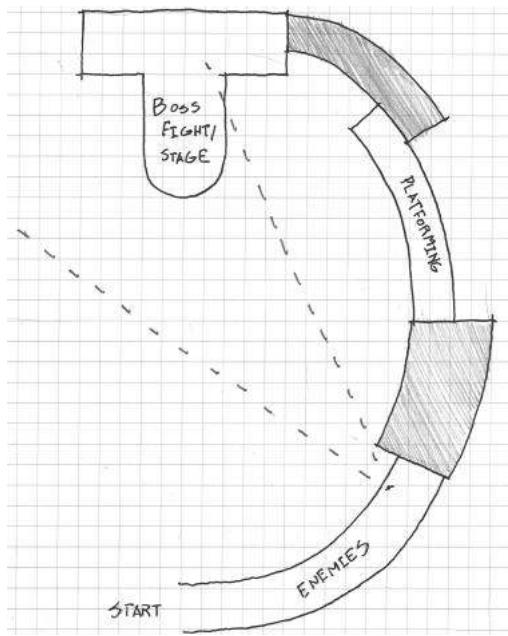  
FIGURE 6.5 Narrative reward spaces often have distinguishing architectural characteristics such as domes, towers, or other features. This allows them to both provide an interesting stage at which the often epic narrative events of games may occur and serve as easily identifiable spatial goals.

purpose is to give players a sense of achievement and prepare them for upcoming high- intensity gameplay. Reward spaces also interact with spaces that withhold them from players. While we have already explored dangerous spaces, there are other spatial orientations that, when used together with rewards and reward spaces, can entice greater exploration of game levels.

# MAKING REWARDS EXCITING THROUGH DENIAL

One aspect of what makes reward spaces rewarding is that they come after other spaces—dangerous spaces or other transitory areas—that make players feel as though they earned the reward. In this way, these spaces enhance the effect of reward spaces through spatial denial—the act of withholding rewards from players. While the dangerous spaces that we previously explored provide denial, there are others that, when utilized, hint at rewards while keeping their true nature a secret from players. These denial spaces entice exploration by making players aware of rewards and encourage curiosity by providing incomplete information. In this section,

we will explore several spatial orientations that architects have identified as useful for spatial denial.

# Zen Views

As spatial orientations for affecting a user or player's experience within a space, denial is based on controlling a player's line of sight to or awareness of reward spaces. The first comes from an entry in Christopher Alexander's A Pattern Language, the Zen view, in which Alexander describes its origin:

A Buddhist monk lived high in the mountains, in a small stone house. Far, far in the distance was the ocean, visible and beautiful from the mountains. But it was not visible from the monk's house itself, nor from the approach road to the house. However, in front of the house there stood a courtyard surrounded by a thick stone wall. As one came to the house, one passed through a gate into this court, and then diagonally across the court to the front door of the house. On the far side of the courtyard there was a slit in the wall, narrow and diagonal, cut through the thickness of the wall. As a person walked across the court, at one spot, where his position lined up with the slit in the wall, for an instant, he could see the ocean. And then he was past it once again and went into the house.16

Alexander's tale of the courtyard window describes the Zen view, named for its origin in a Buddhist monk's house, as a deliberate and fleeting experience of a spatial reward experienced when traveling to a destination (in this case, the monk's house, as sketched in Figure 6.6).

  
FIGURE 6.6 A sketch of the monk's house as described by Christopher Alexander. The window in the courtyard's stone wall controls occupants' view of the landscape beyond. This denial of a wide view makes the limited experience more rewarding.

Alexander contrasts this experience to that of a house where such a view is celebrated with wide picture windows: when the view is constantly exposed and treated as a destination, it eventually loses its power. The monk's small window only allows the view to be experienced for a short while and does not treat it as a destination, allowing the landscape to keep its experiential power.

In games, Zen views are often the first cognitive interaction that players have with rewards or reward spaces (Figure 6.7). These types of views interact with different reward spaces in different ways. For rewarding vistas and narrative spaces—which, as we have seen, often feature architecture of epic scale—Zen views function much in the same way that they do in Alexander's example: offering a fleeting glimpse of the reward so players will strive to reach it. In the case of reward vaults, the player is often shown a reward—item, treasure chest, etc.—but the path to the reward is somehow obscured, leaving responsibility for reaching the reward in the hands of players.

It should be noted that meditative spaces could be hinted at, but not often through Zen views. These types of spaces work best as surprises or refuges, and are often separated from the rest of a gamespace, rather than an element of a game's primary spatial sequence. Previewing these reward spaces is much more subtle, with entryways partially obscured by forking paths. These subtle previews are an important element of one of Frank Lloyd Wright's house designs, which we explore next.

  
FIGURE 6.7 Zen views in games function in different ways: rewarding vistas and narrative spaces are often hinted at through actual Zen views. While reward vaults can be shown to players, the path to the reward is obscured.

Frank Lloyd Wright's Hanna House

Hanna House, located on the Stanford University campus in California, distinguishes itself from Wright's other designs in several ways, the most important being the architect's first use of a honeycomb grid for the building's plan rather than rectangles (Figure 6.8). While a square or rectangular grid would create 90- degree- angled corners that are difficult to see around for occupants, Wright's design for Hanna House utilizes six- sided shapes with 120- degree corners. The effect allows occupants to partially see around the obtusely angled corners. This provides incomplete information of what lies beyond, requiring visitors to move around the corner to see a complete view of rooms.

The human brain has a remarkable ability to process partial visual information and automatically complete the picture. If part of an image that a viewer is familiar with, such as a letter, symbol, or common item in a video game, is obscured, the brain will still be able to understand what the object is. This ability is often used by graphic designers to create optical illusions, such as Rubin's vase- - the image that can be interpreted as a vase

  
FIGURE 6.8 Plan sketch of Hanna House by Frank Lloyd Wright, built in 1937 in Stanford, California.

# FIGURE GROUND

FIGURE 6.9 When confronted with incomplete information that resembles something it is familiar with, the human brain "fills in the gaps," allowing images to still be recognizable.

or two faces looking at one another or to create incomplete but still readable fonts (Figure 6.9). Hildebrand describes this ability as an important survival tactic: the brain can parse and organize complex or incomplete information into something that can be easily recognized.17 Hildebrand also highlights this instinct for its ability to incite curiosity: the brain will assume the identity of the incomplete information and seek verification.

Obtuse angles can be utilized in games to partially reveal rewards, enemy encounters, or other important events. They can hint at or warn of things to come, or elicit exploration by offering players ambiguous information. This creates a sense of risk: what is around the wide corner may be a reward or may be something dangerous. Passages of this type may obscure meditative reward spaces, keeping them off a level's main path but offering them through partial reveals.

In terms of actual level construction, Hanna House- style passages can be difficult to create in engines with no internal level editor. Many engines often work best when utilizing prefabricated square or rectangular objects (in both two and three dimensions). However, creating hexagonal level objects in an external content creation program or through careful design in an engine's internal level editor is possible and has the added benefit of "breaking the grid," obscuring that the engine bases level construction on blocky grids (Figure 6.10). The result is an aesthetically pleasing and emotionally evocative gamespace design.

Emotional experiences are core to the design of our next denial space, one that utilizes spatial denial to embody ethereal concepts.

Religious Structures and Eastern Garden Design

Religious Structures and Eastern Garden DesignHistorically, religious spaces or places with spiritual significance have been architecturally separated from their surroundings while maintaining connection with them. As seen in Chapter 1, "A Brief History of Architecture and Level Design," early tombs and religious structures in the United Kingdom utilized shafts to allow light into blocked- off inner structures. The biblical Solomon's temple featured a special room for housing the Ark of the Covenant, the Holy of Holies, which could only be

  
FIGURE 6.10 Honeycomb grids or obtusely angled spaces elicit curiosity by showing players partial information, create a sense of risk, and are useful for "breaking the grid" utilized by many modern game engines.

entered by the temple's high priest. In Eastern cultures, visitors to temples and houses must often pass through several layers of garden space, each meant to separate visitors from the business of the outside world and spiritually cleanse them before reaching their destination.

The theme of progressing through layers is common in video game dungeon design such as that found in many role- playing or action games. In God of War,18 player character Kratos must penetrate several layers of a temple to find Pandora's box. Likewise, many games with dungeons utilize the theme of descending—moving downward through floors to the destination of the level. Quests: Design, Theory, and History in Games and Narratives author Jeff Howard highlights the theme of descent as one demarcating the progression of players from one goal to another. As players descend through the layers of a dungeon or labyrinth, they are met with both greater challenges and greater rewards. Howard says the layered form of descending spaces allow players to anticipate the rhythm of puzzle and reward challenges.19

  
FIGURE 6.11 Layered denial spaces that follow the precedents of religious structures can occur both horizontally and vertically. They can also utilize Montessori-style successions of puzzles and challenges.

As the previous examples demonstrate, moving through layers of denial space before reaching a reward can be accomplished horizontally or vertically. As is demonstrated by the example of Eastern garden design, layered denial can be created with several iterations of similar challenges in Montessori- style succession. For example, if a player must pass through three rooms to reach a reward, the first should feature a simple iteration of a challenge to demonstrate how the challenge functions, the second room should be a bit more complex, and the third should be the most difficult (Figure 6.11).

For descent, moving through outer layers, and sequential gardens, these spaces work best when the player is aware that a reward is coming at the end of the sequence, even though the reward is often not shown to players beforehand. In God of War, it is well established through storytelling that an important quest item is hidden in the temple. Likewise, dungeons in games like The Elder Scrolls V: Skyrim20 hint at the presence of useful items with environmental cues: tombs and caves are littered with useful items and artifacts that lead to bigger rewards. Such dungeons communicate their own significance through environment art: banners and stone line the walls of tombs instead of blank rock. Such embellishments conjure illustrative associations with hidden items.

While this type of denial space acts more as a level structure, there are also ways to create similar experiences with individual assets.

# Layered Walls

As we have seen in the example of Hanna House, interiors are more interesting when occupants are aware of what else is occurring in other spaces. In the case of Hanna House, angles hint at but partially obscure what is around each corner. There are, however, other ways to hint at what is

occurring throughout a building. One useful method that both hints at what occurs in other spaces and utilizes the concept of denial through layers is layered walls. Rather than creating solid barriers to distinguish one space from another, spaces can be divided with structures that allow the spaces to interact with each other: doorways, windows, trellises, and screens.

In the mobile zombie game Dead Man's Trail,21 in which players must loot towns for supplies, the designers utilized environment art as denial screens- - players can see through layers of debris to assess the risk of zombies beyond and see if there are any items as they pass. While the debris still denies players access to loot, the debris also shows what they can find if they explore. Given the game's mechanic of needing to loot towns quickly before a horde reaches the player, enticing exploration in this way makes players weigh the risk of taking extra time to explore against the possibility of finding better loot.

Layered walls can also deny players access to rewards, but may be used to keep players aware of their goals during challenges. The Legend of Zelda games apply layered walls in this way regularly. In Ocarina of Time,22 the endpoint of Gerudo's Fortress level is a maze that players must navigate by utilizing keys gained elsewhere in the dungeon (Figure 6.12). The reward at the end is the Ice Arrow, a powerful magical weapon. Rather than solid stone walls, the designers utilized transparent metal fence textures, so players can see their goal through corridors of the maze. The Temple of

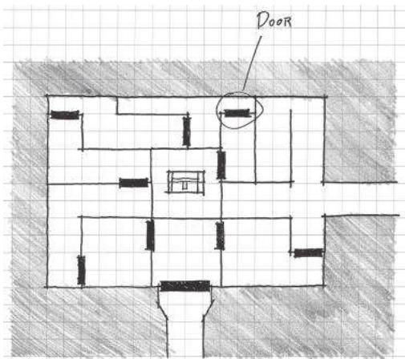  
FIGURE 6.12 The Gerudo Fortress environment in The Legend of Zelda: Ocarina of Time features a maze of fences so that players can see the goal of the maze, a large treasure chest at the center. This keeps players aware of the goal throughout the dungeon.

Time dungeon of Twilight Princess has a room where players must progress by flipping a switch several times to reorient the layered walls in the room between two arrangements. Each wall layer has an opening through which Link may shoot arrows at the switch. While providing a method for the player to progress through the puzzle, the voids in the wall also reveal the player's destination. As the player deals with enemies and collects treasure in the room, the view of the end goal keeps players on task.

The last denial space will also address layered walls that hint at other spaces, and combine them with the type of layering found in religious structures.

# Oku

In Japanese spatial design, there is a concept known as oku. As described by Japanese architect Fumihiko Maki, oku is a spatial layout in which the streets, alleyways, and other spaces wind around one another like the layers of an onion. These layers conceal small sitting areas, squares, and gathering spaces that can only be found as someone explores the winding pathways (Figure 6.13). Some of these layers offer opportunities for seeing

  
FIGURE 6.13 Spaces laid out according to the principles of oku have winding layers of walkways that conceal but hint at places for gathering and rest. Oku spaces utilize many different types of denial to create a powerful sense of curiosity.

these spatial rewards through other layers, offering them to explorers who take the time to hunt for them.

In many ways, oku is an amalgamation of all of the previously discussed denial spaces: it offers Zen views of other layers of the city through layered walls of urban fabric, features non- 90- degree corners that goad explorers, and denies reward spaces with layers of winding passages. Oku also shows the power of labyrinths and mazes—the ability not only to be tour puzzles, but also to communicate with players through selective revealing of information. In scenarios where players can view other layers of a maze, there are opportunities for players to gain advantages by observing enemies, collecting information on challenges, and finding rewards, among other things.

Oku does not have to exist solely in first- and third- person 3D games. In many ways, the maze from Pac- Man23 follows principles of oku. There are winding layers of maze with periodic rewards scattered throughout: power pellets and fruits. Awareness of the reward spaces allowed by the top- down 2D point of view motivates players to rush toward these rewards when necessary to escape enemies or gain points.

Now that we've discussed rewards and the types of spaces that can deny direct access to them, we will explore how we can use rewards on schedules that motivate players to continue moving through games.

# GOALS AND REWARD SCHEDULES

As we have seen, rewards and reward spaces of many kinds can be utilized to entice players to continue playing a game. They can be made more exciting to earn through the use of spatial denial that postpones a player's access to the reward. In many ways, the alternation between denial spaces and rewards is core to level design—challenges are designed around player metrics and rewards incentivize playing the challenges.

When designers make players aware of upcoming rewards and motivate the player to reach them—through either showing the reward, describing it through storytelling, or other means—the reward becomes a goal. Goals are an essential component of game design. On the one hand, there are often narrative goals that the player achieves through winning a game: saving a princess, bringing peace to the galaxy, creating new planets, etc. Often these goals have little to do with the game's actual mechanics, but help flavor in- game actions in exciting ways. On the other hand, gameplay goals like reaching a high score, finding an item that allows access to new areas, or reaching an important location can be arranged within

game levels to create certain experiences. In this section, we will explore different aspects of game goals to discover how they motivate gameplay and keep players engaged for longer.

Long- and Short- Term Goals

Depending on their complexity and length, games typically have more than one goal. For example, the long- term goal of Super Mario Bros. is saving Princess Toadstool from Bowser, the evil Koopa King. However, there are thirty- two levels in the original Super Mario Bros. If the only mark of success in the game was whether Mario was saving the princess, there would be a lot of wasted gameplay and angry players. However, the game has other goals: eliminating enemies, earning power- ups, collecting coins and extra lives, and reaching the end of each individual stage. The game's mechanics are even conducive to players setting their own goals. During the Art of Video Games24 exhibition at the Smithsonian American Art Museum in Washington, D.C., visitors had a competition to reach level 8- 1 in the 3 minutes of playtime allotted by the exhibit's copy of the game.

Super Mario Bros. and many other games retain player interest because they have long- term goals, short- term goals, and allow opportunities for player- defined goals. These demonstrate how goals are scalable throughout a game. Long- term goals are typically important narrative rewards or the ends of quests. These goals provide a distant achievement that players must work for over time. Short- term goals are much more immediate: beat a stage, defeat an enemy, find a health power- up, etc.

Many games that feature quests, missions during which players must retrieve an item or complete an action, utilize long strings of long- and short- term goals to move players through the game. In Ultima IV: Quest of the Avatar, players must master eight virtues by entering eight temples and exercising the virtues in the game's overworld. There are also quests for artifacts and dungeons to explore. While mastering the virtues and becoming the avatar are long- term goals of the game as a whole, mastering each individual virtue can also be a long- term goal based on where a player is in the game. For example, entering a virtue's shrine requires possessing its rune. When the player is retrieving a rune, that is the immediate short- term goal, while mastering the virtue itself is a longer- term goal that serves the even longer- term goal of mastering the eight virtues.

The Rod of Many Parts

This quest structure- finding or earning a number of items that facilitate the end of a game- is frequently used in games. Examples include Ultima IV's mastering of virtues, Super Mario Land  $2^{s^{25}}$  six golden coins for unlocking Mario's castle, and activating elemental lighthouses in Golden Sun.26 Howard compares these types of quests to the Rod of Many Parts, a story structure in which characters must collect seven parts of a magical artifact. Howard cites this structure as a mechanism for marking the progression through game levels and game narratives; the first piece of the rod may be acquired by accident in the game's narrative, but subsequent pieces are the result of the player progressing through further conflicts.27

While often used in games, this structure is also useful for establishing a consistent schedule of goals and rewards in game levels. One part of the rod (or one of the crystals, coins, maidens, etc.) is often the goal of one of the game's levels (dungeons, etc.). Each level is divided into a string of smaller challenges: puzzles, enemy encounters, obstacle courses, etc.

Reward Schedules

Doling out goals and rewards in a predictable schedule allows players to anticipate upcoming rewards. In many ways, this resembles the classical conditioning practiced by Ivan Pavlov- - players will know that after defeating dungeons, for example, they will receive an item. Goal and reward schedules are vital for holding player engagement in games- they keep players aware of when to expect payoffs for their gameplay, and therefore will motivate players to keep playing.

The Rod of Many Parts is far from the only reward schedule used in games. In arcade games, players were rewarded bonuses after each level, and could often rely on special bonus stages to appear incrementally- - after two or three regular stages. If a player were to die halfway through the third stage, he or she would be motivated to feed more quarters into the arcade machine to reach the bonus. Similarly, modern mobile and social games offer consistent amounts of points or currency for finishing levels. This currency can often be used to purchase in- game items. This facilitates a "just one more" scenario in these games, with players playing to save up currency for desired items.

In terms of level design, reward schedules are important for incentivizing in- game behaviors, enticing exploration, and creating a sense of curiosity through consistency. If players know that rewards and items come at a

consistent pace, every x number of rooms in a dungeon, for example, they will continue playing to get the next bonus. Players may even be motivated to explore the room in which they expect a reward if they do not find it immediately accessible.

This extends to symbolic art assets. If it is established that resources can be found by smashing crates or pots, then players will explore a gamespace to find these items. Rewards provide important motivation to explore a gamespace, and consistency in reward schedule helps build expectation of when to expect the next payoff.

# SUMMARY

In this chapter, we have explored game rewards as a motivating factor in game levels. We have looked at the effects that game rewards have in game levels, incentivizing in- game behaviors, enticing exploration, and creating a sense of curiosity. We have also explored the types of rewards in both games and gamespaces, including rewarding spatial types that hold items, allowing the player to take a break from quickly paced action, and seeing more of a game's story. We have explored spaces that make rewards more rewarding by denying players immediate access to them, and how these spaces and rewards can be paced to create goal and reward schedules. In their own way, each of the topics we have covered contribute to a player's own narrative of how he or she experiences a game.

In the next chapter, we further explore how gamespaces can be used as facilitators of narrative, both precreated by designers and created through the player's interaction with the game.

# ENDNOTES

1. Furlong, Ron. 50 Greatest Golf Quotes of All Time Bleacher Report. http:// bleacherreport.com/articles/540759-50-greatest-golf-quotes-of-all-time/ page/30 (accessed June 5, 2013). 
2. Sheff, David. Game Over: Press Start to Continue. New York: Cyberactive, 1999. 
3. Suits, Bernard Herbert. The Grasshopper: Games, Life, and Utopia. Toronto: University of Toronto Press, 1978. 
4. Half-Life 2. Valve Corporation (developer and publisher), November 16, 2004. PC game. 
5. Since Rules of Play's publication, many game consoles and online services have begun offering achievement systems that, in a way, quantify these types of rewards. 
6. Salen, Katie, and Eric Zimmerman. Rules of Play: Game Design Fundamentals. Cambridge, MA: MIT Press, 2003, p. 346.

7. Metroid. Nintendo R&D1 (developer), Nintendo (publisher), August 6, 1986. Nintendo Entertainment System game.8. Bioshock Infinite. Irrational Games (developer), 2K Games (publisher), March 26, 2013. Xbox 360 game.9. Half-Life 2: Episode 1. Valve Corporation (developer and publisher), June 1, 2006. PC game.10. Half-Life 2: Episode 2. Valve Corporation (developer and publisher), October 10, 2007. PC game.11. Batman: Arkham Asylum. Rocksteady Studios (developer), Eidos Interactive (publisher), August 25, 2009. Xbox game.12. The Legend of Zelda: A Link to the Past. Nintendo EAD (developer), Nintendo (publisher), November 21, 1991. Super Nintendo game.13. The Prince of Persia: Sands of Time. Ubisoft Montreal (developer), Ubisoft (publisher), 2003. Nintendo GameCube game.14. Portal. Valve Corporation (developer and publisher), 2007. PC game.15. Metal Gear Solid. Konami Computer Entertainment Japan (developer), Konami (publisher), September 3, 1998. Sony Playstation game.16. Alexander, Christopher, Sara Ishikawa, and Murray Silverstein. A Pattern Language: Towns, Buildings, Construction. New York: Oxford University Press, 1977, p. 642.17. Hildebrand, Grant. Origins of Architectural Pleasure. Berkeley: University of California Press, 1999, pp. 92-97.18. God of War. SCE Santa Monica Studios (developer), Sony Computer Entertainment (publisher), March 22, 2005. Playstation 2 game.19. Howard, Jeff. Quests: Design, Theory, and History in Games and Narratives. Wellesley, MA: A.K. Peters, 2008, pp. 50-51.20. The Elder Scrolls V: Skyrim. Bethesda Game Studios (developer), Bethesda Softworks (publisher), November 11, 2011. Xbox 360 game.21. Dead Man's Trail. Pie For Breakfast Games and e4 Software (developers), upcoming in 2014. Mobile game.22. The Legend of Zelda: Ocarina of Time. Nintendo EAD (developer), Nintendo (publisher), November 23, 1998. Nintendo 64 game.23. Pac-Man. Namco (developer and publisher), 1981. Arcade game.24. The Art of Video Games. Smithsonian American Art Museum, Washington, DC, March 16-September 30, 2012.25. Super Mario Land 2: 6 Golden Coins. Nintendo R&D1 (developer), Nintendo (publisher), November 2, 1992. Nintendo Game Boy game.26. Golden Sun. Camelot Software Planning (developer), Nintendo (publisher), November 11, 2001. Nintendo Game Boy Advance game.27. Howard, Jeff. Quests: Design, Theory, and History in Games and Narratives. Wellesley, MA: A.K. Peters, 2008, pp. 87-88.

# Storytelling in Gamespace

A S we HAVE sEEN, games are a powerful medium for designers to communicate with players through visual communication, teaching, and advertising methods. Emotions play a vital role in creating gameplay experiences in levels and can be evoked through the qualities of space- - size, orientation, lighting, and views. In this chapter we utilize many of these methods to tell stories with our gamespaces.

Games are unique from other media in their interactivity, allowing players to have agency over their gameplay experience. In the interest of creating dialogs with our players, level designers can utilize the unique opportunities games present both to convey precreated stories with their levels and to allow opportunities for players to create their own stories through gameplay.

In this chapter, we explore how game mechanics and art create storytelling opportunities. We also explore the different types of narrative spaces, as well as how modular level assets can be utilized to create environmental narratives or even show narrative progression. With these elements in mind, we reexamine narrative rewards to illustrate how narrative may be used to allow players opportunities for exploration, discovery, and writing their own narratives through gameplay.

What you will learn in this chapter:

Expressive designMechanics vs. motifNarrative spacesEnvironment art storytelling

Materiality and the hero's journey

Pacing and narrative rewards

# EXPRESSIVE DESIGN

In 1607, Emperor Shah Jahan, then the Mughal Prince Khurrum, was betrothed to Arjumand Banu Begum, a granddaughter of Persian nobles. When they were married five years later, Khurrum gave Begum the title of Mumtaz Mahal, the Jewel of the Palace, declaring her "elect among all women of the time."1 When Mumtaz died in childbirth in 1631, Jahan was inconsolable. After two years of grieving, he commissioned a tomb be built for her in Agra, Uttar Pradesh, India. To capture the memory of Mumtaz's beauty, architects and artisans from around the Muslim world built the tomb with precise proportions and calligraphic ornamentation of passages from the Qur'an.2 The surrounding gardens are based on Persian Charbagh (paradise gardens), with abundant trees, flowers, plants and prominent use of water to represent the four rivers of Paradise.3 The result is the Taj Mahal, one of the most significant and evocative architectural works in human history (Figure 7.1). Through the Taj Mahal's design,

  
FIGURE 7.1 The Taj Mahal and its surrounding gardens embody a historic love story and the beauty of the woman interred there through ornamentation, proportion, and landscaping.

the emperor embodied what he believed to be the beauty of Mumtaz, and an expression of his love for her.

In a similar—though much more commonplace—case, design guru Donald Norman, in his book *Emotional Design: Why We Love (or Hate) Everyday Things*, discusses his collection of three unusual teapots, each having a significant narrative or experience.⁴ One, designed by French artist Jacques Carelman, has the spout on the same side as the handle and is therefore impossible to use. The next, the Nanna Teapot, designed by architect Michael Graves, has a bulbous design of clear glass that shows the tea as it steeps and a tea ball inside that can be raised or lowered with a crank. The third, the Ronnefeldt "Tilting" Teapot, can be stood on its back for steeping, then propped upright for serving (Figure 7.2). Norman keeps the teapots on display because they each evoke different components of product design. However, each also embodies a unique story through the experience of brewing tea: one of snarky impracticality, one offering insight into the transformation of water to tea in an appealing form, and one that describes the readiness of the tea through the practical transformation of the pot itself.

Much like these more classical examples of design—architectural and product design—games have had the power to express narratives, emotions, and ideas. Long before video games gained the expressive power they have today—high- end graphics, media with large storage capacity, sophisticated sound design, and so forth—games, including non- digital ones, embodied a variety of ideas through their mechanics and visual elements. Throughout history, many games have been created to simulate important elements of the cultures from which they originated. Chess, for example, was created in India during the Gupta Empire (ca. 320–600 CE) as Chaturanga, which means "four divisions" (of the military).⁵ Slave children in the American South played musical, cooperative, and role- play games

  
FIGURE 7.2 An illustration of Donald Norman's teapot collection, as described in the book *Emotional Design*.

(not to be confused with role- playing games) to cope with their oppressive surroundings. $^6$

We have looked at level design in games as a tool for communicating with players and we have described game levels as media for teaching or evoking emotional responses such as fear, excitement, or joy. Examples such as the Taj Mahal, Donald Norman's teapots, and the games of historic cultures, however, show us that design can embody narrative or cultural ideas as well.

Narrative Design and Worldbuilding

As level designers, we should be concerned with finding the connections between narrative development, the embodiment of cultural ideas, and expressions of usable gamespace. A common expression of these factors is worldbuilding, the creation of fictional worlds, geography, and cultures. An important example for game developers comes from the work of J.R.R. Tolkien. Through works such as *The Lord of the Rings* and *The Silmarillion*, Tolkien created Middle Earth: a rich fantasy world beginning with unique languages and then adding political structures and landscapes. As a Rawlinson and Bosworth professor of Anglo- Saxon at Pembroke College, Tolkien specialized in ancient English languages, the Germanic languages, and spoke many others. $^9$  Tolkien acknowledged that languages were central to his works, as Middle Earth was primarily a place for the people who spoke Tolkien's own constructed languages. $^{10}$  The cultures he developed influenced his stories and the geography of Middle Earth.

Tolkien's language- centric works show one methodology for worldbuilding, as one might choose to design a world around politics, as a stage for a specific story, or as a home for specific characters. In the case of Middle Earth, the geography is a stage born out of the varied cultures Tolkien created and their relationships with one another. The design of Middle Earth, both visually and culturally, was one element that lent to the success of *The Lord of the Rings* and other works based in that world. Through the detailed descriptions the author provided, readers could envision the world of Middle Earth in their minds and eventually through popular media such as cartoons and film. Tolkien's works, and others like them, would be very influential on narrative- based games, both in setting and in the ability to conjure worlds from designed imaginary elements.

Narrative Worldbuilding in Games

Narrative Worldbuilding in GamesMany modern gamers are familiar with role- playing games thanks to products like Dungeons & Dragons $^{11}$  or Call of Cthulhu, $^{12}$  influenced by the works of Tolkien and horror/sci- fi writer H.P. Lovecraft, respectively. In their most basic form, the physical components of these games include sheets on which players can record their character's abilities, dice, and a guide for the Dungeon Master, the player who runs the game. Gameplay action largely consists of descriptions of events by the Dungeon Master and responses by players, though epic narratives are usually enacted through these exchanges. Far from the flashy visuals of modern video games, these games have endured for decades, and have sold millions of copies. Despite the abstract or text- based nature of these games' presentations, they share the ability to create meaningful narrative worlds through the imaginations and interactions of players. The histories and events of these worlds are often dependent on the actions of players during game sessions. $^{13}$

When computers became increasingly accessible in the late 1970s and early 1980s, many role- playing game enthusiasts saw the machines as natural homes for their own designed scenarios: the computer could do the calculations necessary to run the game, allowing players to focus on enjoying the story. Adapting many of their own Dungeons & Dragons  $(D\& D)$  scenarios to the computer, designers created early computer role- playing games such as Dungeon $^{14}$  and Akalabeth: World of Doom, $^{15}$  which even featured designer Richard Garriott's own  $D\& D$  character, Lord British. Around the same time, adventure games such as Zork  $I^{16}$  also became popular and featured complex worlds described through text alone (Figure 7.3).

While both computer role- playing games (RPGs) and adventure games utilized simple displays—primitive graphics and text descriptions—they provided engaging narratives that allowed player imaginations to fill in any gaps. While this book has concerned itself largely with level design based on a game's mechanics, it is important to note that gamespaces may also be conceived through designed expressions of narrative, just as in the examples in architecture, product design, literature, and game design given here. When creating game levels that embody both a game's mechanics and story, it is important to find a balance between the gameplay- focused (ludic) portions of a game and its narrative elements. In the following sections we explore how this can be accomplished through mechanics, gamespace qualities, and asset placement.

  
FIGURE 7.3 A portion of the map of Zork I. The game used text descriptions and commands based on the player moving in cardinal directions to create a richly detailed world.

# MECHANICS VS. MOTIF

Games are often constructed from core mechanics, the basic actions a player takes in a game. It is this mindset that makes many games fit into the genre of action games, which are commonly defined as games in which a player performs some action to overcome antagonistic entities or hazards.17 However, the history of games is full of many examples of design being constructed in the opposite direction, where mechanics are written to support an existing story. We can understand the comparison of mechanic- based design and narrative- based design as mechanics versus motif, which we explore in this section.

Narrative as a Generator of Design

One prominent example of beginning game design from a narrative is the creation of the original Final Fantasy, the first entry in what is today a lucrative game franchise.18 Hironobu Sakaguchi created Final Fantasy when he was tasked with creating a game to save the nearly bankrupt development studio Square in 1986. Given the freedom to create whatever he wanted, Sakaguchi admitted, "I don't think I have what it takes to make a good action game. I think I'm better at telling a story."19 From the story, Sakaguchi embedded a ruleset that supported the narrative structure of the game and allowed traditional elements of epic literature such as quests. The character of Final Fantasy's gamespaces, shown through environment art, supports the game's narrative.

In architecture, there is a dissonance between the aesthetics of many buildings and their storytelling abilities. In Chapter 2, "Tools and Techniques for Level Design," we discussed the parti, the formal generator of many building designs. Starting from parti is a product of the Postmodernist focus on form rather than the narrative experience of the building. Meanwhile, our studies of historic buildings up through examples in Modernist architecture, show a belief in the power of space to create an expressive experience, such as in the approach to the Acropolis, the simulated heavenly kingdoms of Gothic churches, or the concept of man rising above nature embodied in Le Corbusier's Villa Savoye.

Frank Lloyd Wright's famous Fallingwater parallels Final Fantasy's development by exemplifying design generated through narrative. Fallingwater was built for Edgar Kaufmann, the owner of a chain of department stores near Pittsburgh. Kaufmann's family often vacationed on the land near Bear Run, a stream in Fayette County, Pennsylvania, and hired Wright to build them a new weekend house there. Kaufmann had told Wright about his love of the falls at Bear Run and how he used a boulder at the top of the falls as a favorite sunning spot. Wright decided he would build the house on top of the falls and use the sunning boulder as the base of the house's hearth. The Kaufmanns' desire to entertain large groups at the house required lots of floor space, so Wright designed Fallingwater with generous cantilevers. Wright began his design as an expression of Kaufmann's vacation stories and allowed the form of the building to rise, quite literally, from the narrative.

In truth, designs beginning from either mechanics or narrative in games, and designs from form or expression in architecture are all equally valid. However, both become more powerful when supporting one another, such as Sakaguchi designing game mechanics to support Final Fantasy's story, and Wright designing a summer house around his client's vacation stories. In this way, designers should strive to find a balance between the game's mechanics and their motif- visual themes or narrative patterns. To do this, like Wright, level designers can use their designs to embody both existing narratives and the functional narrative of how a space is used.

# Mechanics vs. Story Narrative

The first type of gameplay narrative that designers must balance is embedded narrative, the predetermined story that plays out in a game.20 This kind of narrative can be used as a design generator for games. As we have seen, designs are often generated from embedded narratives: the experience

of losing someone you love, a favorite vacation spot, or the story of four warriors trying to save the world.

Narrative takes many forms in games. Some games convey narrative through cutscenes or text that is separate from gameplay. Some convey narrative through the art in the game itself or on the packaging. Salen and Zimmerman describe these methods as narrative descriptors, elements that give meaning to game mechanics by placing them contextually in a story.21 Many games separate their mechanics and narratives in such a way that they can exist without one another: the story is ultimately a backdrop for game mechanics. A common assignment for teaching game design in schools is to have students reverse the narrative elements of games, making gritty action games transform into fairy tales or having kid- friendly games switch narratives to become M- rated horror nightmares.

More powerful are the games whose mechanics are an essential part of their narrative experience. The indie game Thomas Was Alone,22 for example, was created to emphasize the concept of friendship. Mike Bithell, the game's creator, utilized level design and characters with different movement capabilities to enforce this theme, requiring players to utilize each character's abilities in tandem to finish levels (Figure 7.4). The concept for Assassin's Creed,23 created by director Patrice Desilets, was based on the life of eleventh- century missionary and assassin Hassan- i- Sabbah.24 From this narrative concept, the game was eventually given mechanics and level design that embodied elements of an assassin's work: moving stealthily through crowds, scouting locations, and fleeing acrobatically.

  
FIGURE 7.4 Thomas Was Alone features incredibly simplistic artwork, but the narrative of friendship is enforced primarily in the game's mechanics with additional characterization through voiceovers.

When working from either mechanics or motif as the foundation of your game and level designs, it is important to create a dialog between the two. For those designers who have the time and resources for such development, it is worth asking what the important narrative elements of your game are, what actions will support the narrative, and whether those actions can be translated into gameplay mechanics. For example, if one were to write the character of a hacker in a Japanese- style role- playing game (JRPG), one would want to understand what types of actions a hacker would take, rather than making the hacker actually play like a JRPG stock character, such as a mage, warrior, or summoner. Assuming that the hacker's specialty is opening computerized doors and making robot enemies turn on one another, the designer must design levels around this ability: Can the hacker move with stealth through the level, having robots fight for him or her? Can the hacker open passages for rewards that other player characters cannot? And, if this game takes place in the future rather than the medieval fantasy worlds of many RPGs, how does that affect the world and how players interact with it? If the overworld is outer space, can traditional random monster versus character battles work, or should designers invent an alternative? This balancing of mechanics and narrative elements is vital to making these elements work harmoniously.

# Mechanics vs. Gameplay Narrative

The element of interactivity lends itself to another type of narrative in games: emergent narrative.25 As players engage the rules of a game system, they create their own series of events that drives the game action forward. The set of actions taken by one player is usually different from the actions of his or her friends or other players around the world. Throughout this book, we have discussed games as second- order design problems—products where the direct behaviors of users that are out of the control of, though guided by, the work of the designer. While this presents a difficulty for designers intending to create specific experiences in their gamespaces, it is not impossible. Designers may guide players toward intended emotional responses, even if the exact experience of these responses is different for every player. A helpful method for laying the foundations of an intended user experience is to establish a gameplay narrative for your levels.

Gameplay narratives address the emergent aspects of game narratives by envisioning the experience of a player interacting with a game level. Designing for the previous section's embedded narrative would look like this:

This level is set on the planet of Majon, which features an enemy military base and surrounding slum towns. The level progresses from a town square where the characters' ship lands, then to the planet's complicated waterworks system. The player characters sneak through this into the base's main tower. Eventually players reach a large lab halfway up the tower where one of the experiments crashes out of its containment unit, initiating a mini- boss fight. A cutscene after this fight reveals that the game's main villain is in the base, and the player must fight to the top of the tower. Players fight the main villain at the end of the level with little success, and the level's story ends when the main characters narrowly escape death in their ship and pass out.

This type of level summary gives several important pieces of information: general information on the setting and locations, an idea of pacing through the progression of verbs (from sneak to fight describing movement through the level), and plot components of the level itself. A gameplay narrative, however, would allude to these narrative elements but also include information on the theoretical experience of a player interacting with the game:

The level opens with a text display that says "Planet Majon." Players choose two party members to travel with for the level. Play begins in the marketplace of a dilapidated and seedy slum town, where players can move north toward their goal on the map, west and east to. explorable areas of the marketplace featuring item shops, and south to return to their ship. Moving north takes players near large lakes of water with pipes emerging upward and terminating into the side of a large tower with severe vertical lines. Entering the water and the pipes takes players through a dimly lit maze where they must open and shut valves to reach the inside of the tower. Inside, they can stealthily kill guards until they reach a lab where a mini- boss fight occurs. After this, enemy encounters increase in frequency and are impossible to sneak past, forcing direct combat. Reaching the top of the tower, players find a large windowed room with rewarding vistas where they will see the narrative end of the level.

This summary, rather than focusing entirely on narrative events, addresses some of what the player does from a gameplay perspective. It also lays out the mechanics of each part of this theoretical level and

opportunities for exploration and secrets. Phrases like "dilapidated and seedy slum town" and "dimly lit maze" give hints to the spatial qualities of these areas, describing how a level designer might utilize lighting, textures, soundscapes, or other environmental assets. Such a narrative can even be expanded upon to include information about emotions players should feel as they play certain parts of the level, or experiences they have outside of mechanics ("the player should feel dread as he or she moves through the dark and narrow hallway," "jumping from the cliff to the brightly colored platforms below should be a joyful experience," etc.).

We have compared how one would design from narrative rather than from game mechanics and looked at how such a design methodology works with different types of narrative in games. In the next section, we further address the types of spaces used to create these narratives.

# NARRATIVE SPACES

Thus far, we have dealt with gamespace as an instrument for supporting game narratives or as the result of the game narrative as a design generator. However, level designs may be used to tell game narratives themselves. In Chapter 6, "Enticing Players with Reward Spaces," we discussed narrative stages, reward spaces where important narrative events play out. These are only one type of narrative space utilized in games. Designers should be familiar with the following four different types of narrative space and how they embody and support different types of game narratives:

Evocative spacesStaging spacesEmbedded spacesResource- providing spaces

Through these types of spaces, level designers can create exceptionally expressive game worlds.

Evocative Spaces

The first type of narrative space was defined by American media scholar Henry Jenkins in his essay "Game Design as Narrative Architecture."26 Jenkins describes amusement park attractions that use familiar shows,

films, or genre traditions as their topic, such as Disney's *Haunted Mansion*, *Back to the Future*,27 and others as evoking audience memories of familiar media. He also describes *American McGee's Alice*28 as evoking familiar imagery from Lewis Carroll's Wonderland stories while providing its own nightmarish take on them. Evocative spaces utilize familiar elements to set a mood, establish the fiction of a game story, or communicate positive or negative events. In the case of Wonderland—a normally cheerful, albeit absurd, place—*Alice's* version utilizes twisted recreations of familiar locales, establishing the narrative of a Wonderland ruled by the Queen of Hearts. Similarly, concepts discussed earlier in the book—symbolic assets, intimate spaces, etc.—can be used to describe a game's narrative state through evocative means. In *Bioshock Infinite*,29 the character Elizabeth can create alternative versions of the world the game takes place in. In one scene, players jump from the main game world, where the xenophobic government is in control, to an alternate one where rebels have taken control of the city. To establish this switch while allowing gameplay to continue, propaganda posters switch from government focused to rebel focused, while the city architecture remains the same (Figure 7.5). The effect is one of quick transition from a hopeless gunfight to a *Les Misérables*- esque revolution—the meaning and tone of the environment changes from negative to positive with the swapping of a few textures.

Evocative spaces work because of our understanding of the vernacular, the architectural language of certain locales, established through symbol building. The U.S. Holocaust Memorial Museum in Washington, D.C. uses the vernacular of European train stations and ghettos to evoke the

  
FIGURE 7.5 Bioshock Infinite shows sudden switches in action through texture swaps in familiar locales.

stories of Holocaust victims (Figure 7.6). Postmodernists such as Michael Graves and Robert Venturi are known for making architectural references to previous works and media in their own work. Michael Graves's Michael D. Eisner Building at the Walt Disney Studios in Burbank, California, for example, evokes both the history of the company and classical architecture through ornamentation. On the façade, Graves used atlas or telamon figures, male counterparts to caryatids—structural columns in the shape of women—of the seven dwarves supporting a large pediment (Figure 7.7).

Vernacular is useful for contrasting evocative art assets with one another in a scene, showing decay, corruption, or the passage of time.

  
FIGURE 7.6 The U.S. Holocaust Memorial Museum in Washington, D.C., built in 1995 and designed by James Ingo Freed. The architecture was designed to mimic post-WWII German architecture.

  
FIGURE 7.7 The Michael D. Eisner Building (formerly the Team Disney Building) at Walt Disney Studios in Burbank, California, completed in 1990.

The Last of  $U_{5}^{30}$  utilizes the vernacular of urban environments and overgrown forests against one another to create a world twenty years into a zombie apocalypse. Safe zones are mainly urban with militaristic outposts littered throughout, while areas outside the safe zones contrast urban architecture with overgrowth to give a long- abandoned feel.

Evocative vernacular is vital for establishing story, tone, and giving the player some idea of what has happened in a place. A small town with tanks and cars littered through the streets in a zombie game may show that there was at one point a chaotic clash. Vines growing on ruins show that a structure has been long abandoned. When a story becomes more specific, however, subtle environmental storytelling may not be enough. This is why we use the next type of narrative space, staging spaces.

# Staging Spaces

In Chapter 6, we described narrative stages as both enticing and rewarding spaces where a player feels that important game events will happen. Staging spaces are often unique and of large scale. They are easy to see as a player approaches them and often call attention to themselves through monumental architecture or unique features. They may house either gameplay events such as climactic battles or narrative events such as cutscenes, or scripted events where characters move around the player as he or she plays. There may also be staged background events, such as in the intro to The Last of Us, where players run through a linear city streetscape while scripted zombie apocalypse events happen around them.

In many ways, staging spaces that are important to actual gameplay can be atmospherically ambiguous. They may be where a player gains an important item, such as the pedestal of the Master Sword in Zelda31 games. They may also be staging spaces for large battles. Metal Gear Solid 3: Snake Eater32 has a unique staging area for two potentially different battle events in the game. In the Sokrovenno region, players either engage in a sniper's duel with The End, a boss character, or are ambushed by the Ocelot Unit, an elite military group. For these two distinct battle styles, the level needed to have both large- scale outlook points from which players and The End could use sniper rifles and smaller hiding spaces for taking cover during the more active Ocelot fight (Figure 7.8).

Staging spaces do not have to encompass in- game action, but can be exactly what their name implies: stages. In this way, staging spaces can be set up like the set of a film or play, to support the action that characters are taking within a game. Half- Life  $2^{33}$  utilizes staging space to tell stories and

  
FIGURE 7.8 This section of the Sokrovenno region in Metal Gear Solid 3: Snake Eater shows how the space is designed to stage battles of two different scales: a widely scaled sniper duel and a tightly scaled "run and gun" action.

break up intense action throughout the game. Dr. Kleiner's laboratory near the beginning of the game is a staging space where non- player characters roam and interact with the player and one another, giving expositionary dialog. The scene is set accordingly to evoke a sense of busyness through scattered objects and machine parts. It has places for the events of its specific scene to occur. Such staging spaces are often goals for the player to reach, and can therefore be used as rewards or as a way to control game pacing. In the case of Kleiner's lab, the player is then directed to escape the city and reach another staging space, Black Mesa East.

While Kleiner's lab has elements of a staging space, there are also game objects that allude to experiments prior to the player reaching it or even to the original Half- Life. These types of environmental references bring us to the next type of narrative space.

# Embedded Spaces

While there are embedded narratives in games—prescripted stories and scenes that form a game's primary narrative arc—there can also be embedded narrative spaces, spaces that contain narrative information in the architecture itself. Embedding narrative in architecture is an old tradition. Before the invention of the printing press in the 1450s by Johannes Gutenberg, books were expensive and typically owned by nobles. As a result, much of the population of Western countries was illiterate. Religious officials needed to find a way to expose commoners as well as nobility to the stories in the Bible, so they often stipulated that churches be built with biblical stories embedded in the architecture through sculpture, mosaics, and stained glass windows. Similarly, classical Greek temples often contained relief sculpture in the tympanum

  
FIGURE 7.9 Embedding narrative within religious structures has been an architectural tradition for millennia. In many cases, this was a response to the illiteracy of the general populace who worshipped in these buildings—allowing religious narratives to be understood by as many people as possible.

of their façades (Figure 7.9). Islamic architecture utilizes calligraphy in many important structures, such as the Taj Mahal and the Dome of the Rock in Jerusalem. The Dome of the Rock is an embedded narrative space, as it surrounds Mount Moriah, where Abraham is believed to have offered Isaac as a sacrifice, the temple of Solomon is believed to have been built, and Muhammad is believed to have taken his night journey to heaven.34

Embedded narrative spaces can be created with environment art by leaving evidence of use by characters or events that previously transpired in the space. Portal35 and Left 4 Dead36 use embedded narratives in their side chambers and safe houses, respectively. In Portal, a character known as the Rat Man hides outside of the testing chambers and leaves used food containers and erratic graffiti for the player to find. These subtle narrative hints develop an entirely unseen character, and foreshadow many of the events in the main narrative. Left 4 Dead players can see the writings of previous survivors who passed through safe houses, leaving information about the zombie plague, establishing the scope of the outbreak, and developing other unseen characters.

The game designers determine these types of narrative spaces and what information they contain. However, we have already established that there is not only embedded narrative, but also emergent narratives. The next type of narrative space will help players take advantage of the potential for players to make their own stories in games.

# Resource-Providing Spaces

Previous examples of narrative space have shown how spaces are created to embody narrative context through environment art, spatial quality, or as capsules for character dialog. These examples can, however, be passive if not used in the context of interactive narrative. As discussed

throughout this book, both architecture and gamespace have the advantage of interactivity—user interaction gives them meaning. Long after the original creators are gone, buildings may often be repurposed for new uses. For example, Hagia Sophia, a Byzantine church in Istanbul built between 532 and 537 and regarded as one of the most beautiful structures in the world, has been adapted for many uses over the centuries (Figure 7.10). Hagia Sophia was originally constructed as a Byzantine Christian church but was converted to a mosque when the Ottoman Turks conquered Constantinople in 1453, changing the iconography inside to fit Islamic traditions. Since 1935, it has been a museum displaying artifacts and art from the building's history. This building, as an important cultural and historic landmark, has been adapted over time to fit the purposes of whoever resided in the city and has even been featured in films such as the James Bond movie *From Russia with Love*. Other adaptive reuses of buildings can be seen in urban redevelopment projects and gentrification efforts, taking something originally for one purpose and using it for another.

  
FIGURE 7.10 An interior perspective of Hagia Sophia (built 532-537), designed by Anthemius of Tralles and Isidorus of Miletus. The building's impressive architecture and important cultural status has led it to be a prized possession for conquering forces in Istanbul.

The key element of these examples in providing resources for emergent narrative is that they have some identifiable quality and that they have inherently interactive features. Hagia Sophia is a status symbol. Buildings that are renovated for new uses usually have some marketable quality, such as being on a waterfront or near amenities. In games, landmarks and interactive elements give users incentives to utilize level spaces for more than just travel. In many RPGs and massively multiplayer online RPGs (MMORPGs), towns are important spaces for structured user interaction. Towns such as Goldshire in World of Warcraft37 become hubs for player activity (some positive and some negative) through a central location, being a familiar territory, and having many opportunities for quests and interactions. Games like Ultima Online foster player activity by setting up a morality system through which entry to certain towns is forbidden if one acts hostile to other players. This creates a sense that the game has territories that are unsafe for travel.

Emergent narrative space is not unique to MMORPGs or other games where large groups of players can interact with one another. Environments that provide many opportunities for interactivity, such as physics objects or other interactive environment pieces, can create some very influential emergent narratives. In the playtesting process for Half- Life 2, testers discovered that it was possible to kill barnacle enemies by allowing them to pick up exploding barrels with their tongues and shooting the barrels as they reached the creatures' mouths. Valve designers were so delighted by this discovery that they added it to several levels, providing the player with exploding barrels, a downward ramp, and a group of barnacles at the bottom, and called it barnacle bowling.38 Multiplayer party fighting games such as Towerfall39 include many interactive objects in tightly confined arenas (Figure 7.11). The use of these objects gives players various ways of dispatching one another beyond core mechanics, allowing for rich meta- game narratives that are fondly remembered long after players have put the game away ("Dude, remember that time I was about to shoot you but you dropped a crystal ball on my head?"). Some live on for years, such as Lord British's accidental assassination during the beta- testing of Ultima Online40 or the ill- advised charge of Leeroy Jenkins, a player who famously stormed individually into a boss room designed to be raided by teams in the MMO World of Warcraft.41

So far we have mainly focused on the theory and planning stages of spatial narratives, with a few mentions of practical construction elements

  
FIGURE 7.11 The arenas in party fighting games such as Towerfall include many interactive objects within a confined space that provide rich opportunities for emergent narratives.

such as modular assets and spatial quality. In the next section, we discuss practical methods for creating narrative space with modular assets.

# ENVIRONMENT ART STORYTELLING

Imagine playing a game where you are walking slowly down a dark hallway, debris crunching under your character's feet. You walk into what appears to have once been a small lounge. On a table, there is an abandoned gun and a half- filled clip; bullets are scattered around and some have dropped onto the floor. Next to the gun is a tipped- over bottle of whiskey. Under an overturned chair next to the table is a smeared path of blood that leads into another doorway lit up by a spotlight (Figure 7.12). As a player, what do you think happened there? What do you want to do next? How does this scene make you feel?

# Storytelling with Modular Assets

This scene may or may not have anything to do with the main plot of the game. Players who open the doorway the blood leads to may or may not find anything inside. What this scene does, however, is create a mininarrative with environment art. It's not difficult to imagine that the player

  
FIGURE 7.12 This type of scene is incredibly evocative from a narrative standpoint, and can be constructed by arranging prefabricated environment art assets in specific ways. Even if the player has seen similar assets elsewhere in the game, the arrangement is what makes the scene evocative.

may be able to collect the gun and ammunition on the table to bolster his or her own reserves or that these assets are the same ammo assets used throughout the game. However, the placing and arrangement of such assets tell a story: some person was hastily loading a clip when he or she was attacked and dragged off violently. The whiskey bottle provides slight character development and calls into question the skill of the person: was he dragged off because he was drunk, or was the thing so terrifying that he turned to the bottle to calm down? The story told by these objects contains no words, but helps establish tone, creates tension, and provides foreshadowing of things that the player may encounter later in the game.

As this demonstrates, modular art can be an effective tool for telling environmental narratives as well as communicating between designer and player. As we have seen with our explorations of narrative space, assets embedded into a gamespace can develop unseen characters or provide narrative clues to game action. In games, art assets have the power to be evocative. The designers of Dead Man's Trail,42 for example, mixed and matched the placement of environmental assets, pickup items, and zombie spawners to create mini- narratives within levels. As players loot for supplies, they come across areas designed to look like unlucky characters had passed through. One such example is in a level with hiking trails: designers scattered hunting rifle ammo around a tent and placed a teddy bear nearby. Zombie spawners were placed such that zombies would appear to come out of the woods—hinting at the fate of the family whose tent the player was looting (Figure 7.13).

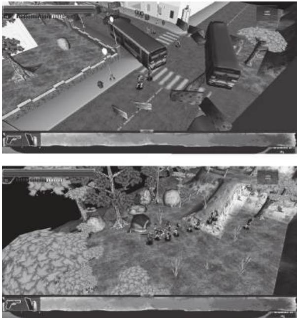  
FIGURE 7.13 These screenshots from an early version of Dead Man's Trail show how environment art can be used to hint at what has happened in a scene: vehicles and barriers are arranged to look like a terrified bus driver has tried to run through a blockade. Tents, hunting rifles, toys, and zombie spawners are juxtaposed to hint at the story of an unlucky family.

Environment Art and Cinematography

The juxtaposition of contrasting elements—guns and teddy bears, vehicles and barriers, etc.—has a great impact on the type of scene you are creating. The way in which the player views these objects is of utmost importance. Camera is an important consideration for storytelling in games, as level designers can utilize a game's cinematography to highlight spatial narrative. Cinematography is the study of film techniques, though it is often used to discuss the composition of scenes on film. For game designers, the relationship between camera and object position can be a powerful tool.

When discussing camera usage in games, we discovered that an important element was drawing a player's attention to environmental elements the designer wished him or her to see. In first- person games, this often includes drawing the player's view to objects with visual components such as lines, contrasting colors, or lighting. In 2D or top- down games,

cinematography can be used to show something to the player that the player's character may not be aware of—oncoming monsters or objects important to a level's plot.

An innovator in modern cinematographic storytelling techniques was Orson Welles in his 1941 classic film *Citizen Kane*.43 Welles used a technique in *Citizen Kane* known as *deep focus*, where objects in both the foreground and background are in focus as the result of layering pieces of film on top of each other.44 Two important scenes in *Citizen Kane* use deep focus or deep focus- like effects to convey narrative that would otherwise be told simply with dialog. The first is a scene where Kane's mother and father are arguing over whether to put Kane in the care of a wealthy banker or let him grow up in an impoverished Colorado town. As the adults—the father, who does not want to lose Kane, on one side of the room and the mother with the banker on the other—discuss the fate of the boy, he can be seen playing in the snow out of a window positioned between the adults (Figure 7.14). A later scene, composed by shooting a scene twice with the same piece of film to capture both foreground and background in focus, has Kane and an associate finding Kane's wife passed out from what they discuss as illness, but a medicine bottle and spoon in the foreground reveal to be a suicide attempt (Figure 7.15). Scenarios like this show how assets

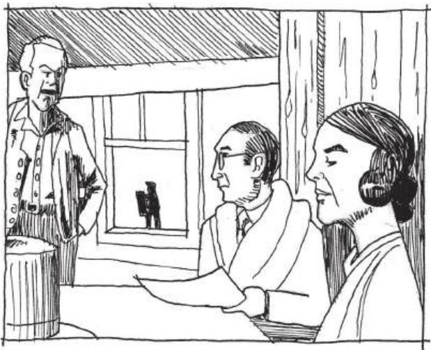  
FIGURE 7.14 An early scene in *Citizen Kane* positions two arguing factions on either side of a shot, while the object of the argument, a young Charles Foster Kane, is seen through a window in between the two.

  
FIGURE 7.15 This later scene of the film has the characters finding Kane's wife unconscious, while the scenery informs the audience that she had attempted suicide by careful placement of a medicine bottle.

may be positioned in such a way that they tell environmental narrative outside of the immediate action of a scene.

While not all games utilize environmental storytelling at the level of subtlety of Citizen Kane, some utilize foreground, background, or even in- game action elements to alert the players to various narrative elements. In Another World,45 the game's side- scrolling gameplay view is treated as one camera angle of several in a cinematic experience. Early in the game, a large monster can be seen stalking the player through the background of several screens. The "to the side" camera is used to show the player's alien ally (nicknamed Buddy) evading captors in other corridors while the two characters are separated later in the game (Figure 7.16). The second act of Sonic the Hedgehog 3 and Knuckles's46 Launch Base Zone depicts the launch of Dr. Robotnik's super weapon, the Death Egg by including the weapon in the level's background and having it launch at the level's end. In a way, the game also offers this launch as a rewarding vista for the players making it through the level, and allows them to watch the climactic launch during a moment of gameplay downtime before a boss fight. Even for games without fixed cameras, such as first- or third- person 3D games, the player's arrival at embedded environmental object narrative and how it is highlighted through other environmental elements—shadows, lighting, environmental contrast—is vital.

  
FIGURE 7.16 Another World uses the side-scrolling camera angle as a way to convey what is happening to a friendly character that the player is separated from.

In this section, we have looked at how individual pieces of environment art may be arranged to create environmental narrative. We also looked at the influence of camera position in telling such stories: carefully placing objects in or out of frame so they give players narrative information in addition to the gameplay action on a screen. Next, we look at a traditional story structure popular in games and how environment art can allow players to track their progress in it.

# MATERIALITY AND THE HERO'S JOURNEY

In his book *The Hero with a Thousand Faces*,⁴⁷ Joseph Campbell describes the idea of the monomyth, a basic pattern that many heroic narratives throughout the world follow. Campbell summarizes the fundamental elements of heroic narratives from different cultures in this way: "A hero ventures forth from the world of common day into a region of supernatural wonder: fabulous forces are there encountered and a decisive victory is won: the hero comes back from this mysterious adventure with the power to bestow boons on his fellow man."⁴⁸

This structure has the hero follow some variation of a call to adventure (which is often initially refused), followed by a road of trials and enemies to overcome. The hero then meets with a supernatural benevolent force (often referred to as the goddess), either realizing that it is a protection he has always had or finding a new protection and being blessed by it. The hero must face a powerful malevolent force, overcoming both its power and the hero's own demons. The hero must finally gain and escape with a boon of some sort (important quest item) and return to

  
FIGURE 7.17 The hero's journey is a pattern common to narratives of many cultures throughout human history. It is a popular narrative structure for modern video games.

his normal world, where he uses his newfound power to live out his life in peace (Figure 7.17).

In Origins of Architectural Pleasure, Grant Hildebrand argues that architecture can embody the stages of the hero's journey with both spatial quality and materiality.49 Hildebrand suggests that in many heroic narratives, landscape makes its challenge to the hero visibly noticeable by being "deficient, one way or another, in support or reassurance."50 As evidence, he suggests the ruins of Mycenaean forts or the American West as examples of such landscapes, and posits that their visual characteristics help create the heroic narrative itself. Hildebrand argues that buildings such as the Phillips Exeter Library and Salk Institute, both designed by Louis Kahn, embody the hero's journey through a contrast between intimately scaled "safe" study spaces and "dangerous" public transitory spaces. The study spaces in each building are finished in comfortable wood, carpet, and brick finishes, while the public spaces are finished in cold concrete51 (Figure 7.18). Studies of heroic fiction reveal Hildebrand's assertions to be valid: Odysseus's travels take him from the safety of his home in the green lands of Ithaca to war in Troy, around the Aegean, Mediterranean, and Ionian Seas—deserts of water instead of sand—and finally back home.52 Similarly, Frodo Baggins must travel from the comfortable farmland of the Shire and through the increasingly bleak lands of

  
FIGURE 7.18 Louis Kahn's Phillips Exeter Library and Salk Institute both use natural materials such as wood and stone in intimately scaled refuge spaces and harsher materials such as concrete in public spaces.

Middle Earth to the volcanic Mount Doom, where he can destroy the evil Sauron's One Ring in The Lord of the Rings.

Games often utilize materiality, specifically in the tile art or texturing of a game's level surfaces, as an indicator of a place's character and place along a hero's journey. The original Super Mario Bros. in many ways utilizes a micro- hero's journeys in each world of the game: Mario begins each world in a comparatively friendly level with cheerful music, trees, bushes, clouds, and few gaps. He then often (not always) descends into an underground world of some sort filled with new dangers: narrower spaces to move in, aggressive enemies, and darker coloration. Upon leaving this, he is in a stage that is aboveground but has more perils: wider gaps,

moving ledges, or narrow bridges that test his skills gained in the previous two levels. Finally, he must go to Bowser's castle where he encounters cold stone, boiling lava, and a climactic battle with Bowser himself. Upon reaching the captive at the end of the world, he is informed, "The Princess is in another castle," and begins anew (Figure 7.19). Environments in the original The Legend of Zelda53 follow a similar pattern: players begin in a forested area of Hyrule with abundant shops, wander through bleak and dangerous wilderness, and then descend into dimly lit dungeons.

When following a similar pattern in your own games, you can utilize different tile sets and color (diffuse) maps to create the desired environmental effect. Safe or homely places should feature natural or rich materials: grass, wood, brick, stone, and other Wrightian materials. As the hero moves forward in his or her quest, use increasingly harsh or battle- damaged materials: bigger or more roughly hewn stones, machines, alien technologies, iron, lava, acid, etc. (Figure 7.20). It is also fashionable to use "grunge" textures in modern games—textures that show wear, tear, or damage through dirtiness. Grunge is useful for showing corroded or corrupted areas that were once safe, in contrast to safe areas being clean, tidy, and inviting.

  
FIGURE 7.19 Each world of the original Super Mario Bros. embodies a miniature hero's journey: (1) Mario begins in a relatively friendly landscape, (2) descends into a darker vault separated from previous comforts, (3) returns to the surface to be tested by the environment, and (4) has a climactic battle where he rescues a captive.

  
FIGURE 7.20 Tile sets and textures can do a lot to convey a sense of place in game environments. As players move through a hero's journey, their environment should go from friendly and inviting to harsh or corrupted.

In many ways, movement through a game's narrative is its own reward. While a great story does not make a bad game good, it can make playing a bad game tolerable. In the final section of this chapter, we look at how expanded narrative can be used for in- game rewards and how narrative rewards can help us pace our game levels.

# PACING AND NARRATIVE REWARDS

While we have discussed narrative spaces throughout this chapter and earlier in the book, there has been only brief mention of narrative as a reward. We have discussed narrative stages as rewards in games: places where story events happen and the player can see from a distance. While we have explored the experience of such narrative spaces in terms of exploration, we have not yet viewed them from the standpoint of game pacing.

The Dramatic Arc as a Pacing Tool

In 1863, German novelist and playwright Gustav Freytag wrote *Die Technik des Dramas*, which studied dramatic stories in five acts: exposition, rising action, climax, falling action, and dénouement.54 This structure

  
FIGURE 7.21 Freytag's pyramid shows the stages of the dramatic arc.

formed what is known today as the dramatic arc, often visualized as a graphic called Freytag's pyramid (Figure 7.21).

The dramatic arc is a useful tool for tracking throughout fiction. Stories can contain one dramatic arc over the course of the entire narrative, or several. In the example of The Lord of the Rings, which was split into three smaller books, The Fellowship of the Ring, The Two Towers, and The Return of the King, each book has its own dramatic arc. Similarly, each chapter of each book often has a situation that follows its own arc. When Frodo and his party are attacked by Ringwraiths at Weathertop, for example, exposition sets up why the characters are there, the action rises as the Ringwraiths approach, the stabbing of Frodo is the climax, and Aragorn's driving off of the wraiths and the aftermath of the event are the falling action and denouement.

Games also use the dramatic arc to tell stories. Donkey Kong55 uses the dramatic arc across its four story levels thus: Exposition is the opening scene where Pauline is shown being kidnapped by Donkey Kong. The rising action is where Mario (then known as Jumpman) pursues Donkey Kong up increasingly complex levels of the skyscraper. The climax comes in the fourth level, where Mario must remove rivets holding Donkey Kong's platform up, and the falling action and denouement occur as Donkey Kong himself falls and Mario is reunited with Pauline.55a

In many gamespaces, action is organized into geographic designations: worlds, territories, etc., that have a common thematic factor. Super Mario Bros. games often have eight worlds with a series of sub- levels in each and a castle level at the end. Batman: Arkham City,56 which has a large open world, has territories belonging to members of Batman's "rogues gallery," and thus makes each territory represent that character's gimmick: ice, plants, circuses, etc. In both cases, each territory follows

a dramatic arc: Mario must travel through increasingly difficult levels to destroy the Koopa stronghold in each world, and Batman often has a mission to accomplish in each villain's hideout, which includes twisted puzzles and ends in a climactic confrontation.

Rewarding Exploration with Embedded Narrative

The level- by- level dramatic arcs in these games allow players to move easily through the games. As discussed in Chapter 2, it is important to keep a contrast of high and low action to properly pace a game. By structuring game levels with dramatic arcs—arrive in the level, overcome obstacles and challenges, overcome a large challenge or enemy, reach the goal of the level, emerge victorious—players feel as though they have accomplished something.

Falling action and denouement are both important elements of this structure for game designers, as they are opportunities for players to slow down and breathe. They are also where we can position rewards for players: a dramatic escape, an item that replenishes lost resources, or a sought- after artifact. Embedded narrative delivered at the end of dramatic arcs helps the player feel as though he or she is making progress through a game, whether this narrative is delivered environmentally, through scripted in- game events or through cutscenes.

This type of pacing also connects narrative structure to long- and short- term goals in games, offering the quest for a short- term goal as a satisfying dramatic arc of its own before pausing and moving on to the next in a larger long- term arc structure.

Rewarding Exploration with Optional Narrative and Easter Eggs

While the dramatic arc structure can give us a feeling for how to structure game levels and reward players by progressing them through a story, there are also opportunities to reward players with optional narrative for exploring gamespace on their own. Optional narratives can be important for games, as they give players additional incentives to test the limits of gamespace and make players feel as though they are privy to privileged information. These types of narratives can be rewards of glory in game levels, the discovery of which can enhance a player's interaction with a gamespace.

The implementation of these types of narratives often depends on the development resources of studios. For example, The Legend of Zelda: Majora's Mask57 features a standard Zelda narrative structure: overcome

a number of dungeons to gain passage to the final enemy's stronghold for a climactic showdown. However, the game also allows players the optional quest of collecting masks, which often involves helping non- player characters (NPCs). Many of these side quests have their own embedded narratives, such as one where the player must reunite two estranged lovers. Each mask quest features special characters, text, assets, and animations, making them more robust than many side quests in games.

While the example from Majora's Mask is possible with a larger development studio, smaller studios may not have the resources for additional content on that level. However, optional narrative rewards can even be created with simplistic storytelling methods. The Rat Man's hideouts in Portal are technically optional: they are not required for passage through the main game, and a player's understanding of the story does not suffer if he or she does not find them. However, Valve placed these stories closely enough to the main gamespace that players could find them easily. These assets are much more simplistic: special textures applied to game geometry. For many games, big or small, such assets could be created quickly by an artist, and then added in out- of- the- way places by a level designer.

Another Valve game, Half- Life 2, features an optional character that is a little more difficult to find, the All- Knowing Vortigaunt. By entering a tunnel full of radioactive waste in an early level, players can find this character, who speaks cryptically about in- game events and roasts a headcrab over a fire. Creating such a character is as simple as creating textural optional narratives. The designers used common assets—a vortigaunt alien, a headcrab, and a fire particle effect—and recorded some new lines for the alien to speak.

These are examples of "Easter eggs," hidden jokes, messages, or other rewards for looking closely at a work. Easter eggs have been used in many media, such as art, film, or software, often with the author hiding himself or herself somewhere in the work. The term Easter egg was coined for this type of hidden object by Atari staff after game programmer Warren Robinett included a hidden room in the 1979 game Adventure. This room contained the message "Created by Warren Robinett," an act of defiance against bosses who would not let Atari game designers put their names on their work.58

Finding such a reward in a game level, often at great risk, as with the All- Knowing Vortigaunt, or through a complex puzzle, as with the Warren Robinett message, can become an emergent narrative all its own—something for players to brag about to friends. Hiding these types

of narrative components in levels can make your own gamespaces fun to interact with both in and out of the game.

# SUMMARY

In this chapter we have considered level design from another perspective, that of meaning and narrative. We have seen that design is not the product of mechanical prompts alone, but also of stories. We have also seen how spaces, both digital and architectural, tell stories through architectural vernacular, set construction, and art assets, and we have seen how designed space can transform over time as different users interact with it, changing its use or interacting with it in surprising ways.

In terms of constructing levels, we have seen how environment art and prefabricated gameplay assets may be arranged to build narrative and how the positioning of a game's camera provides opportunity for delivering this narrative. We have also seen how environment art can indicate the progression of players through game narratives, such as those following Joseph Campbell's hero's journey. And finally, we have explored how story structures such as the dramatic arc can be used as pacing mechanisms, and how narrative can be used as goals and rewards within this pacing, for both required game actions and testing the boundaries of game worlds.

In Chapter 8, we continue our explorations of how players test the limits of game worlds and how communicating them to players helps build realms of possibility.

# ENDNOTES

1. Koch, Ebba, and Richard Andre Barraud. The Complete Taj Mahal: And the Riverfront Gardens of Agra. London: Thames & Hudson, 2006.  
2. Fazio, Michael W., Marian Moffett, and Lawrence Wodehouse. A World History of Architecture. 2nd ed. Boston: McGraw-Hill, 2008.  
3. In most Charbagh, the tomb is at the crossing of the canals, since the rivers of Paradise are said to start at a central mountain. Koch suggests that the Yamuna River, which is next to the tomb, and the gardens across from the tomb are an integral part of the Charbagh plan in addition to the garden's canals.  
4. Norman, Donald A. Emotional Design: Why We Love (or Hate) Everyday Things. New York: Basic Books, 2004, pp. 3-6.  
5. Murray, H.J.R. A History of Chess. Oxford: Clarendon Press, 1962.  
6. Wiggins, David K. The Play of Slave Children in the Plantation Communities of the Old South, 1820-1860. Journal of Sport History 7, no. 2 (1980): 21-39. http://library.la84.org/SportsLibrary/JSH/JSH1980/JSH0702/jsh0702c.pdf (accessed July 1, 2013).

7. Tolkien, J.R.R. *The Lord of the Rings*. 2nd ed. Boston: Houghton Mifflin, 1967.8. Tolkien, J.R.R. *The Silmarillion*. Boston: Houghton Mifflin, 1977.9. Jeffrey, Henning. On Tolkien: Growing Up with Language. *Model Languages* 1, no. 8 (1996). http://www.langmaker.com/ml0108.htm.10. Tolkien, J.R.R., Humphrey Carpenter, and Christopher Tolkien. *The Letters of J.R.R. Tolkien*. Boston: Houghton Mifflin, 1981.11. *Dungeons & Dragons*. Gary Gygax and Dave Arneson (original designers), 1974. Role-playing game.12. *Call of Cthulhu*. Sandy Peterson (original designer), 1981. Role-playing game.13. Kushner, David. *Masters of Doom: How Two Guys Created an Empire and Transformed Pop Culture*. New York: Random House, 2003.14. *Dungeon*. Don Daglow (designer), ca. 1975. Computer role-playing game on a PDP-10 computer.15. *Akalabeth: World of Doom*. Richard Garriott (developer), California Pacific Computer Co. (publisher), ca. 1979. Computer role-playing game on Apple II.16. *Zork I*. Infocom (developer and publisher), 1980. Computer text adventure.17. The term *action games* is also often understood as games with guns or other trappings of action movies, such as explosions, intense combat, etc. Action games, as a broad genre, is separated into the sub-genres of shooters, platformers, and many others.18. *Final Fantasy*. Square (developer and publisher), December 17, 1987. Nintendo Entertainment System game.19. *Final Fantasy* Retrospective: Part I. GameTrailers. http://www.gametrailers.com/full-episodes/bx14k1/gt-retrospectives-final-fantasy-retrospective--part-i (accessed July 1, 2013).20. Jenkins, Henry. Game Design as Narrative Architecture. MIT—Massachusetts Institute of Technology. http://web.mit.edu/cms/People/henry3/games& narrative.html (accessed July 2, 2013).21. Salen, Katie, and Eric Zimmerman. *Rules of Play: Game Design Fundamentals*. Cambridge, MA: MIT Press, 2003, pp. 399-401.22. *Thomas Was Alone*. Mike Bithell (developer and publisher), July 24, 2012. PC game.23. *Assassin's Creed*. Ubisoft Montreal (developer), Ubisoft (publisher), November 13, 2007. Xbox 360 game.24. The Making Of: Assassin's Creed. *Edge Magazine*. http://www.edge-online.com/features/the-making-of-assassins-creed/ (accessed July 2, 2013).25. Jenkins, Henry. Game Design as Narrative Architecture. MIT—Massachusetts Institute of Technology. http://web.mit.edu/cms/People/henry3/games& narrative.html (accessed July 2, 2013).26. Jenkins, Henry. Game Design as Narrative Architecture. MIT—Massachusetts Institute of Technology. http://web.mit.edu/cms/People/henry3/games& narrative.html (accessed July 2, 2013).27. *Back to the Future*. DVD. Directed by Robert Zemeckis. Universal City, CA: Universal Studios Home Entertainment, 1985.

28. American McGe's Alice. Rogue Entertainment (developer), Electronic Arts (publisher), October 6, 2000. PC game.29. Bioshock Infinite. Irrational Games (developer), 2K Games (publisher), March 26, 2013. Xbox 360 game.30. The Last of Us. Naughty Dog (developer), Sony Computer Entertainment (publisher), June 14, 2013. Playstation 3 game.31. The Legend of Zelda. Nintendo EAD (developer), Nintendo (publisher), February 21, 1986. Nintendo Entertainment System game.32. Metal Gear Solid 3: Snake Eater. Konami Computer Entertainment Japan (developer), Konami (publisher), November 17, 2004. Playstation 2 game.33. Half-Life 2. Valve Corporation (developer and publisher), November 16, 2004. PC game.34. Fazio, Michael W., Marian Moffett, and Lawrence Wodehouse. A World History of Architecture. 2nd ed. Boston: McGraw-Hill, 2008.35. Portal. Valve Corporation (developer and publisher), October 9, 2007. PC game.36. Left 4 Dead. Turtle Rock Studios/Valve South (developer), Valve Corporation (publisher), October 2008. PC game.37. World of Warcraft. Blizzard Entertainment (developer and publisher), November 23, 2004. PC game.38. Jacobson, Brian, and David Speyrer. Valve's Design Process for Creating Half-Life 2. Speech, Game Developers Conference from UBM, San Jose, CA, March 2006.39. Towerfall. Matt Thorson (developer and publisher), June 25, 2013. Ouya game.40. Donovan, Tristan. Replay: The History of Video Games. East Sussex, England: Yellow Ant, 2010.41. Leeroy Jenkins—YouTube. YouTube. http://www.youtube.com/watch?v=LkCNJRfSZBU (accessed July 4, 2013).42. Dead Man's Trail. Pie For Breakfast Studios and e4 Software (developers), upcoming in 2014. Mobile game.43. Citizen Kane. DVD. Directed by Orson Welles. Burbank, CA: Warner Home Video, 1941.44. Ogle, Patrick L., and Bill Nichols. Technological and Aesthetic Influences upon the Development of Deep Focus Cinematography in the United States. In Movies and Methods. Berkeley: University of California Press, 1985, p. 73.45. Another World. Delphine Software (developer and publisher), 1991. Amiga game.46. Sonic the Hedgehog 3 and Knuckles. Sonic Team (developer), Sega (publisher), October 18, 1994. Sega Genesis game.47. Campbell, Joseph. The Hero with a Thousand Faces. Princeton, NJ: Princeton University Press, 1949.48. Campbell, Joseph. The Hero with a Thousand Faces. Princeton, NJ: Princeton University Press, 1949, p. 23.49. Hildebrand, Grant. Origins of Architectural Pleasure. Berkeley: University of California Press, 1999, pp. 84–88.

50. Hildebrand, Grant. *Origins of Architectural Pleasure*. Berkeley: University of California Press, 1999, p. 84.51. Hildebrand, Grant. *Origins of Architectural Pleasure*. Berkeley: University of California Press, 1999, p. 87.52. Fagles, Robert. *The Odyssey*. New York: Viking, 1996.53. *The Legend of Zelda*. Nintendo (developer and publisher), February 21, 1986. Nintendo Entertainment System game.54. Freytag, Gustav, and Elias J. MacEwan. Freytag's Technique of the Drama: An Exposition of Dramatic Composition and Art. Internet Archive: Digital Library of Free Books, Movies, Music and Wayback Machine. http://archive.org/details/freytagstechniqu00freyuoft (accessed July 6, 2013).55. Donkey Kong. Nintendo (developer and publisher), July 9, 1981. Arcade game.55a. Fullerton, Tracy, Christopher Swain, and Steven Hoffman. *Game Design Workshop: A Playcentric Approach to Creating Innovative Games*. 2nd ed. Amsterdam: Elsevier Morgan Kaufman, 2008.56. *Batman: Arkham City*. Rocksteady Studios (developer), Warner Bros. Interactive (publisher), October 18, 2011. Xbox 360 game.57. *The Legend of Zelda: Majora's Mask*. Nintendo EAD (developer), Nintendo (publisher), October 26, 2000. Nintendo 64 game.58. Donovan, Tristan. *Replay: The History of Video Games*. East Sussex, England: Yellow Ant, 2010.

# Possibility Spaces and Worldbuilding

You should design each part of the garden tastefully, recalling your memories of how nature presented itself for each feature.... Think over the famous pieces of scenic beauty throughout the land, and ... design your garden with the mood of harmony, modeling after the general air of such places.

—FROM SAKUTEIKI, AUTHORSHIP  ATTRIBUTED TO TACHIBANA TOSHITSUNA¹

The enjoyment of scenery employs the mind without fatigue and yet exercises it; tranquilizes it and yet enlivens it; and thus, through the influence of the mind over the body, gives the effect of refreshing rest and reinvigoration to the whole system.

—LANDSCAPE ARCHITECT FREDERICK LAW OLMSTEAD²

E for emergent narratives through the use of interactive elements. Designers such as Warren Spector have called games with such richly interactive spaces possibility spaces- interactive worlds that produce emergent possibilities through rules. In addition to previously discussed embedded narrative elements, designers develop game worlds by crafting the rules of how they work and communicate these rules to players through gameplay.

Spatial designers—architects, landscape architects, and garden designers—have their own methods for developing worlds through the orientations of features and materials. In this chapter, we explore how to synthesize the methods of these more classical design fields with the worlds of digital games. We explore how players understand the possibilities present in interactive spaces and how designers inform players about the scope of these spaces. Also, we revisit elements of communication, decision making, and choice to learn how designers make explorable worlds. Lastly, we see how the designers of these worlds break their own rules to create engaging surprises for players to discover.

What you will learn in this chapter:

Understanding immersion and player individualityArchitectural phenomenology and playEmergent spacesMiniature garden aestheticJapanese garden design and worldbuildingOffering experiential choiceDegenerative design

# UNDERSTANDING IMMERSION AND PLAYER INDIVIDUALITY

We have described games as a second- order design problem in which designers cannot directly control the behavior of a product's users, but can control the rules of a system that users interact with. The late film critic Roger Ebert famously cited this as a reason that he believed that games were not art—he felt that the player's ability to control his or her experience of games diminished the designer's authorship. However, many game designers utilize this element of games as a way to build replayability into their products—the ability for players to have varied experiences with a game on repeated interactions. Many designers believe replayability and the potential for users to craft their own experiences in interactive worlds creates immersion, a complete acceptance of virtual game worlds as reality. Others, however, believe that the notion of total immersion defeats the promise of games as media that can be experienced by many different individuals. As we will see, this debate and a similar one within the field

of architecture can give us insight into how different players use space and how we can create dialogs between users and a space's unique qualities.

Immersion is a popular game industry buzzword for a game's ability to engage players. It is often cited as a goal of designers crafting a game, or as a positive quality. However, as is common with buzzwords, its true meaning is lost in its overuse. Katie Salen and Eric Zimmerman turn to the essay "Immersion" by François Dominic Laramee to readdress immersion's true meaning: "a state in which the player's mind forgets that it is being subjected to entertainment and instead accepts what it perceives as reality."4

# The Immersive Fallacy

Salen and Zimmerman respond to Laramee's definition of immersion with the immersive fallacy, a statement of rejection against true immersion that argues that games instead deal in metacommunication—expressions that take into account their own state of unreality. They use anthropologist Gregory Bateson's example of a dog biting another in play: the bite signifies a real bite, but is at the same time not a real bite; it is a simulated play of biting. Salen and Zimmerman respond with examples from the games Spin the Bottle and Quake. Players of Spin the Bottle kiss but are not expressing love, just as Quake deathmatch players are shooting one another but do not hate each other.5 While players may be engaged in these games and their dramatic elements, they are aware of the game within the context of the game's placement in the real world and within the scope of their own life experiences.

As we have seen in our explorations of how players learn within. gamespaces, gamespaces themselves hinge on both players' sensory experience of what is happening in the gamespace itself and their prior experience of the game they are playing or similar games they have previously played. Many players assume upon loading a new first- person game that they will have the same controls as many they have previously experienced: the W, A, S, and D keys control player movement, while the mouse is moved to look around and aim. Many players of old Nintendo Entertainment System games were scandalized when they rented a game that used the B button for jump instead of the traditional A button.

# Player Personalities

Moving even further away from total immersion in a game, player personalities are often considered when crafting game experiences. Games such as Dragon Quest III6 or Ultima IV: Quest of the Avatar7 ask players a series of questions at the beginning of the game to determine the stats

of player characters. Numerous studies and published works have referenced player types in games. Richard Bartle famously defined the types achievers, explorers, socializers, and killers to describe the players in multiuser dungeons (MUDs), a type of interactive space he helped create with Roy Trubshaw in 1978. " The fourth edition of Dungeon Master's Guide for Dungeons & Dragons describes common "player motivations" and how players functioning as "Dungeon Master," the player who designs gameplay scenarios and acts as the voice of the game itself, can engage each of these player types.9

In his Game Developers Conference (GDC) 2013 talk, "Applying the 5 Domains of Play,"10 Ubisoft creative director Jason VandenBerghe expanded the Bartle types to take into account five elements of personality: openness to experience, conscientiousness, extraversion, agreeableness, and neuroticism. These were compared to the titular five domains of play—novelty, challenge, stimulation, harmony, and threat—to determine where players fit on a chart of the first four domains (threat is left out and applied to its own set of criteria), each divided into four quadrants (Figure 8.1). As players answer where they fit on each quadrant of the chart, they can visualize their player personality on a  $4 \times 4$  grid diagram. VandenBerghe proposes that the test be used as a method for applying "accurate empathy" to a designer's gameplay, allowing him or her to think like different kinds of

  
FIGURE 8.1 Jason VandenBerghe's chart for player personality types tracks how players' personalities react to different domains of play: novelty, challenge, harmony, and stimulation. A player's answers to what he or she likes in each quadrant result in a simple player personality diagram.

players as he or she designs. He visualizes this by likening different styles to well- known fictional characters playing well- known games and says, "Play these games like these people."

The suggestion that player personalities factor greatly into the type of character one might build in a game, or that the types of games people play are dependent on their personalities, weighs heavily against the idea of total immersion in games. While the ideas of Bateson, Bartle, and VandenBerghe factor greatly into the subject matter of games themselves, they say little of how users engage gamespace. Architects have been struggling with notions of total spatial immersion versus metacommunication. It is this struggle that will help us explore how the spirit of individual gamespaces can be used in concert with player individuality.

# ARCHITECTURAL PHENOMENOLOGY AND PLAY

In Chapter 3, "Basic Gamespaces," we discussed the concept of genius loci, or "spirit of place." This element of architectural design challenges designers to give places their own individual character or transmit meaning through unique spatial experiences. While originally referring to a town's guardian spirit in Roman culture, the term gained its current usage by those applying the philosophy of phenomenology to architecture.

Architectural phenomenology was greatly inspired by the works of German philosopher Martin Heidegger, whose application of phenomenology argued against understanding the world in scientific or objective abstracts, but rather in empirical terms based on one's sensory information at any given moment.11 Architect Christian Norberg- Schultz applied Heidegger's thinking to architectural space, arguing that spaces should be understood for their own elements rather than through the lens of previous experience.12 As such, practitioners of architectural phenomenology are often concerned with creating spaces with a strong experiential element or that maximize some element of the building's site while shutting out exterior influences or symbols. Architect Peter Zumthor, a noted phenomenologist, stated that he begins projects by thinking which emotions or experiences he wishes to convey, while staying true to elements of site and material.13 For one piece, the St. Benedict's Chapel in Sumvitg, Graubunden, Switzerland (Figure 8.2), he emphasized the wood used to create the building by purposely adding a creaking floorboard. Zumthor described this addition as one that would "exist just below your level of consciousness."14

Phenomenology's supporters argue that works such as those by Zumthor are to be enjoyed for their own sake, without influence from

  
FIGURE 8.2 Peter Zumthor's St. Benedict's Chapel, built in Sumvitg, Graubunden, Switzerland, in 1989, clings to its mountainside site while contrasting against the forms of surrounding vernacular architecture. An intentionally warped floorboard inside emphasizes the materiality of the building.

a priori knowledge (knowledge known inherently without sensory input). Immersion seems to be the phenomenology of play: enjoying a game without input from the outside world. Some people take the concept of role- play to heart when playing, enacting what they would not in real- life situations, such as being an evil warlord, fighting powerful foes, or playing a member of the opposite sex. On the other hand, Salen and Zimmerman's immersive fallacy points to even this kind of play as engaging the meta- elements of games.

The phenomenology of gamespace is a mix of self- contained elements that also engage in meta- dialogs with players and culture. On the one hand, we have thus far explored how games utilize symbolic assets to modify player behavior or communicate with players and other cultural elements outside the game itself. On the other hand, level design seeks to emphasize the unique mechanics of games, as phenomenologist architects seek to emphasize the building's unique materials and experience. Therefore the same elements that work to emphasize the unique parts of the game they are in—modular assets used for behavior modification, asset arrangements for communication, etc.—can also engage meta- elements of games. Game world architecture can help facilitate player interaction, but it can create surprising game events by providing resources for different types of players.

In this sense, gamespace rejects architectural phenomenology. Gamespaces can be encountered by many different people in many different ways. The way that two players interact with a level, even if they share player personalities, will be completely different unless the developer forces players to play in a specific way. While such games better address concerns over authorship of gameplay experiences in games by taking choice away from players, they often are not remembered very fondly or do not have gameplay longevity—replay value.

Even games that are ultimately linear, such as those in the Final Fantasy $^{15}$  series, offer players some choices: character customization, job selection, side quests, etc. When these choices are stripped away, leaving less choice in gameplay, the response is not as warm. This was the case with Final Fantasy XIII. $^{16}$  In terms of level and world design, the game was much more linear than some considered acceptable, described by some reviewers as a "long hallway." $^{17}$  Modern first- person shooter level design has likewise been criticized for being a string of cutscenes and high- action encounters linked by hallways (Figure 8.3). While these spaces may succeed at maximizing a game's mechanics, they leave little ability for players to create their own experience of the game to compare with others' own experiences. In this way, we must seek to have a simultaneously phenomenological and metacommunicative approach to level design.

In the next section we further explore the elements of gamespace that allow players of different types to have their own experiences with gamespace and how gamespaces use their phenomenological elements to create emergent experiences.

  
FIGURE 8.3 A re-creation of a popular Internet image that describes the seemingly complex nature of older first-person shooter maps compared with the linear nature of modern ones.

# EMERGENT SPACES

EMERGENT SPACESThroughout the book, we have discussed games as systems. In Rules of Play, Salen and Zimmerman address the complexity of systems through the lens of Jeremy Campbell, author of Grammatical Man.18 Campbell describes complexity in systems as a "special property in its own right" and "enabling them to do things and be things we might not have expected."19 Since we often understand games as systems, that is, as sets of objects with behaviors and attributes that interact within a space,20 we can say that they have the potential to be complex and do the unexpected things that Campbell describes. If we consider the human players and their wildly divergent personalities as part of the interactive systems of games and space, these systems become increasingly complex. This complexity leads to an element of system that Salen and Zimmerman describe as "crucial" for understanding how systems become meaningful for players21: emergence.

# Emergence

In the previous chapter, we discussed how users interacting with games create emergent narratives, stories created by how one plays a game. As a concept, emergence refers to unexpected outcomes of systems in which unique components interact with one another. One of the most famous examples of emergence in the field of computer science is The Game of Life, a cellular automation created by John Conway in 1970. Conway's Game of Life is a "zero- player game," in which a user places a single cell on a large virtual checkerboard and activates the simulation. Rules dictate how living cells interact with dead cells around them, and how the living cells create more living cells. As the simulation runs, geometric patterns emerge due to the rules of the simulation. Some are temporary, while others actually create new cellular bodies (Figure 8.4). While the emergent outcomes of the system are observable when the simulation is playing, they cannot be learned from simply reading the rules of how cells interact. Thus these emergent results are dependent on the interactions of objects within the rules of the simulation.22

Rules and interaction are what make emergent outcomes possible within systems such as architecture and games. In Chapter 7's example of the Hagia Sophia in Istanbul, Turkey, cultural and geographic factors led to the church being an important status symbol for conquering armies in the area. Such factors exist outside the structural systems of the building itself (which in the case of Hagia Sophia has created emergent narrative of its own: the central dome has collapsed twice), but are no less part of

  
FIGURE 8.4 A sketch of Conway's Game of Life showing different patterns that are emergent results of the automation's rules.

its history. Likewise, as we have seen, games allow players to create their own emergent narratives as they play; two players' stories of how they heroically vanquished the same monster are often very different. Through their rules and design, gamespaces offer players possibilities in how they can play, which we discuss next.

# Possibility Spaces

We have explored the idea of gamespace as emergent worlds from a theoretical perspective, through player personalities, phenomenology, and emergence itself. The question is how to create worlds appropriate for emergent behavior through the largely phenomenological mindset we have used thus far throughout the book: emphasizing a game's rules and expressive elements through modular symbolic assets. Warren Spector, a designer whose credits include Deus Ex, System Shock, and Wing Commander, was once quoted as saying that games create possibility spaces. Possibility spaces "provide compelling problems within an overarching narrative, afford creative opportunities for dealing with these problems, and then respond to player choices with meaningful consequences."23

The idea that games are spaces where players can address problems through creative solutions is useful for defining how we must think of game worlds as emergent spaces. As illustrated by Conway's Game of Life, predefined rules or pieces with programmed behaviors can have unpredictable results. However, that illustration and those like it demonstrate emergence through barely interactive computer simulations. Possibility spaces still address this emergent element of predefined elements of games, but do so in such a way that brings the player into the fold. In Chapter 7,

"Storytelling in Gamespace," we discussed gamespaces that provide resources for emergent narrative and the example of Half- Life  $2^{24}$  playtesters killing barnacles by rolling exploding barrels at them. This action could take place because developers created procedures that allowed these things to happen, placed them in an environment that invited exploration, and allowed players to play. Likewise, players of the original Team Fortress25 discovered that they could jump very high with the soldier class if they jumped into the air and shot one of his rockets downward. This trick, called the rocket jump, became so commonplace in Team Fortress gameplay that it was featured in Valve's trailer for Team Fortress  $2^{26}$  where soldiers fly through the air to synchronized swimming music.

Setting the rules for worlds then allowing players to explore their possibilities is a powerful tool for in- game worldbuilding. Worldbuilding through possibility space encourages the creation of interactive elements that can be given narrative context with art, writing, and other expressive methods. This creates a world that is not only narratively expressive in the way Tolkien's Middle Earth was, but also interactively expressive in ways that only interactive designed spaces can be. In the next section, we discuss the actual construction of such worlds and how one designer introduces players to them.

# MINIATURE GARDEN AESTHETIC

In Spore Creature Creator designer Chaim Gingold's thesis, "Miniature Gardens and Magic Crayons: Games, Spaces, and Worlds,"27 he interprets an often mentioned but never explained aesthetic of legendary designer Shigeru Miyamoto, the miniature garden. According to Gingold, Miyamoto's miniature gardens reflect the design principles of Japanese gardens: miniaturized worlds in which occupants can explore a "multiplicity of landscapes"28 within a short period of time. Examples include the land of Hyrule in the Zelda series (Figure 8.5), the various environments in Super Mario games, and the exploable alien planets in Pikmin.29 He describes these worlds as complete and self- contained, citing three elements that make them both manageable and believable for players:

Clear boundaries

Overviews

Consistent abstraction30

  
FIGURE 8.5 The map of Hyrule from The Legend of Zelda: A Link to the Past has within it a variety of environments for players to explore that are quickly accessible, have clear limits, and are abstracted by their construction with symbolic game assets.

The construction of Miyamoto's worlds, and how they are introduced to players, factors heavily into their success. As possibility spaces, they have a limited and clear set of rules and objects that the player can interact with in the world. For ease of both a designer's construction and the players' ability to understand them (not to mention memory limitations of games), these gamespaces are constructed with modular symbolic assets rather than custom- built. This makes the world and its possibilities easy for players to understand: assets and their variations create a rich system of communication that players come to know as representational of gameplay mechanics. Likewise, keeping this world contained to clear boundaries and a limited set of assets also allows players to learn and interact with the symbolic system more effectively (Figure 8.6). It is the player's freedom to interact with these symbols, however, that produces the possibility of gameplay emergence.

While Miyamoto's miniature gardens provide opportunities for player emergence, Gingold also points out that these spaces have methods for

  
FIGURE 8.6 Some symbolic assets from A Link to the Past. These objects have a clear meaning and are therefore repeated across the game to allow communication of gameplay possibilities to players.

introducing these opportunities to players through linear means. It is this mix of linear and emergent that can show us how to craft the gameplay of our own game worlds.

# Overviews

The first method of introducing possibility space in miniature gardens is through overviews. As stated by Gingold, "Miniature Gardens are scale models of bigger phenomena. Fish tanks and gardens are scale representations of systems bigger than people."31 The miniature nature of game worlds has not gone unnoticed by writers throughout the history of the medium. In 1983, David Sudnow published Pilgrim in the Microworld, a "stream of conciousness"32 retelling of his experiences with the Atari 2600 game Breakout.33 Sudnow, over the course of several months, feverishly practiced the game until achieving mastery of it. Throughout the book are increasingly complex diagrams of the gameplay mechanics, especially the physics of how the ball and paddle interact with one another.34

Breakout, as with many early video games, has a single- screen structure that conveys a simple overview of the game action. In the first screen from Super Mario Bros.,35 the player can see a variety of important symbols from the game, as well as an enemy and a power- up item. This provides an introduction to many of the rules of Super Mario Bros.'s possibility space that are repeated through subsequent screens and levels.

# Overviews in Historic Games

Both Breakout and Super Mario Bros. are viewed from angles that render game action from outside the game world. In the case of these and other

  
FIGURE 8.7 In adventure games like The Secret of Monkey Island, each scene or location conveys its own possibility space. Puzzles are typically solvable with the items visible on the screen during the puzzle itself and with inventory items earned prior to the puzzle.

games from the 1970s and 1980s, the metaphor of a fish tank is an apt one: players interact with the game world from a perspective of omnipotence—they can see more than what the game character could conceivably see. This point of view works well in point- and- click adventures such as The Secret of Monkey Island,36 where players must find objects on detailed story screens—any given puzzle can typically be solved with what is visible (Figure 8.7).

Top- down games such as The Legend of Zelda and Dragon Quest share this same ability to great effect: designers are not limited to the character's point of view when showing or hinting at secrets beyond their current geographic location. From a miniature garden perspective, this also affords the ability to give players an overview of game possibilities. In many ways, we can attract players with new possibilities in the same way we do with rewards: by showing something previously unseen in a place that the player must explore to find.

# Overviews in 3D

Three- dimensional games such as first- and third- person games in which the player is viewing the game from very close to or from their avatar present their own challenges for integrating overviews. Some games provide a cutscene that flies over the level prior to the beginning of gameplay. In some cases this can be convenient, showing players what they will

encounter or even allowing players to find where they should go on a specific mission in a game world that allows lots of otherwise free exploration. However, these can feel artificial and break the sense that the player is in a space where he or she can be surprised or make discoveries.

The work of Chinese architect I.M. Pei provides insight into how three- dimensional space can have the overviews common in older video games. In buildings such as the Rock and Roll Hall of Fame in Cleveland, Ohio, Pei uses a glass wall as the façade to show viewers outside what is contained within. Upon entering the building, the museum exhibits are revealed on a series of stacked floors arranged like a collector's shelves (Figure 8.8). The building provides a summary of its contents with this reveal, but rewards those who explore further with more information.

Pei's design for the East Wing of the National Gallery of Art in Washington, D.C., alerts visitors to their options for exploration when they walk into the large atrium (Figure 8.9). Angular balconies and walkways protrude into the space from floors above, offering glimpses of the exhibits contained within, but requiring visitors to explore to receive the full experience. Like the Rock and Roll Hall of Fame, the overview gives a summary of what is contained within each section of the building but denies full understanding of each exhibit unless the visitor penetrates further into the space.

  
FIGURE 8.8 The arrangement of floors in the Rock and Roll Hall of Fame in Cleveland, Ohio—designed by I.M. Pei and opened in 1995—gives visitors an overview of the exhibits contained within when they enter the lobby.

  
FIGURE 8.9 A sketch of the atrium of the National Gallery of Art's East Wing in Washington, D.C.—designed by I.M. Pei and built in 1978. This space offers overviews of the spaces contained in the rest of the museum, but denies full access to them unless the visitor explores further.

As Pei's architecture shows us, overviews can be accomplished with first- or third- person views through the creation of vistas. These vistas allow players in games to see out over the game world and discover the limits of its possibility space. This is another scenario in which height in level design can be beneficial, allowing players to get an overview of 3D game worlds. In games such as Dragon Quest VIII: Journey of the Cursed King,37 players can often gaze out from the top of cliffs to the world below, seeing distant landmarks. Many worlds in Super Mario  $64^{38}$  also feature a high point from which players may look out onto the environment, seeing red coins, item boxes, enemies, obstacles, and other gameplay elements. Such vistas go beyond rewards, tactics, or scenery, and can give players an impression of the possibility spaces of 3D worlds. Combined with Lynchian elements such as landmarks, boundaries, and recognizable districts, players can make informed decisions about the path they will take through a space, just as a visitor to the Rock and Roll Hall of Fame can plan which exhibits they would like to see first.

While view- based overviews are great ways to convey the possibility spaces of games, they can also be a passive experience. When used too often, they can make the pacing of games feel stagnant. However, Gingold also highlights another form of overview that better utilizes games' interactivity.

Tours

Another method for introducing possibility spaces to players in miniature gardens is the tour. A tour is an initial introduction to gamespaces and their mechanics through a linear level experience. These tours often also show players game mechanics or elements that they may revisit at another time, teasing gameplay to come.39 In the example of the Rock and Roll Hall of Fame, the architecture of the space requires visitors to enter a linear exhibit on the history of rock music after seeing the lobby overview but before actually getting the opportunity to explore the previewed exhibits. Such a tour gives the teased exhibits a sense of historical context and offers the ability to explore them freely as a reward of facility, a reward that offers new abilities.

Game designer Doug Church describes similar experiences in the levels of Super Mario 64. He describes the first power star, the objects in the game whose retrieval is the goal of most levels, requiring that players travel a path that encompasses the entire environment (Figure 8.10). These challenges show previews of other challenges that the player will encounter later, much like the overviews from high places do. Church argues that in subsequent visits to the world, players will know where to

  
FIGURE 8.10 The first star of many worlds in Super Mario 64 often requires players to visit most of the gamespace and teases challenges to come. Some, such as Bob-Omb Battlefield, feature a tour-like exploration of the level that ends with an overview from a high place.

find other stars or challenges, as they have already seen much of what the world has to offer. $^{40}$

Like Pei's linear history exhibit in the Rock and Roll Hall of Fame, tours can also give players an introduction to many of a game's mechanics without resorting to a ham- handed tutorial where the game talks at the player. In *The Legend of Zelda: A Link to the Past*, $^{41}$  the introduction to the game, where Link must follow his uncle into the dungeons of Hyrule Castle, introduces many of the game's mechanics: combat, unlocking doors, avoiding pitfalls, pushing and lifting objects, and puzzle solving. Likewise, *The Last of Us* guides players through a series of challenges that teach the game's many mechanics—solving environmental puzzles, combat, stealth, and dealing with different zombie types—during the game's first chapter. Both examples package their tutorials within narrative scenarios rather than training sequences where they are being told the mechanics by another character. This allows players to engage the game's action right away while acquainting them with the game's system of mechanics and symbols.

# Possibility Space and Procedural Literacy

By now, it should be clear that a primary concern of miniature gardens is allowing players to maximize their possibilities by giving them a thorough understanding of what can be done in the space. In this chapter, we have thus far explored how space can be constructed to introduce what is possible within gamespaces. The introduction of game mechanics in possibility spaces aids the development of what designer Ian Bogost calls procedural literacy. $^{42}$  Procedural literacy is a familiarity with the rules of a game and how they function within an established possibility space. Symbolic assets are an element of this: players learn that certain level surfaces are solid while others may cause damage. They may learn the identity of items, gates, puzzle elements, objects that can weigh others down, etc. In terms of pure mechanics, this can also translate into an understanding of metrics, character abilities, or when players may encounter obstacles in games. These assets are the building blocks of levels, but are also the procedural language of gamespaces.

Bogost highlights the communicative power of such cause- and- effect procedures, arguing that developing procedural literacy in players can not only allow them to be better players of a certain game, but also help in the creation of procedural rhetoric—using game rules as a system of communication. Game rules and the construction of gamespaces as

a system of communication between the designer and player are a central theme of this book: designers must create a dialog with their players to make the best play experience possible. Procedural rhetoric is a tool that many persuasive games, such as those designed by Bogost or Jane McGonigal to solve real- world problems through gameplay, utilize.

Developing both procedural literacy and rhetoric helps players understand gamespaces and their possibilities better. In the previous examples of Super Mario 64 and A Link to the Past, players are guided through the mechanics that they will use throughout the entire game during tour levels. They are also given overviews that allow them to see other gamespaces where these mechanics will be useful.

Building procedural literacy and then exhausting player possibilities can create powerful game experiences. A previous example utilized Terry Cavanaugh's Don't Look Back43 to discuss uncertainty—the feeling of having no information of how to address game scenarios—and how it may help subvert game design standards. The example of a cliff that the player must jump off of blindly also helps demonstrate how designers can use exhausted game possibilities to guide players through the next steps of a game. Players who reach this cliff know that they have completed everything there is to do in each previous screen, and so know that their only option is to leap off the cliff (Figure 8.11). Tomorrow Corporation's Little Inferno44 creates a biting satire of free- to- play online and mobile games by restricting players to a very limited set of mechanics: buying and burning objects. Despite colorful descriptions of the many uses of each "buyable" (the game does not allow players to buy things with real money) item, the only thing players can do with them is burn them. This limited possibility space and establishing of procedural literacy allow the game to lampoon the trivial nature of in- game objects that people buy for real money in free- to- play games.

  
FIGURE 8.11 The cliff screen in Don't Look Back comes after a series of simple platforming screens in which the player easily accomplishes everything there is to do in them. As such, the player knows that there are no more gameplay possibilities left to explore when he or she reaches the cliff except to leap from it.

Designers must be careful, however, that well- developed procedural literacy does not break the experience of their game. If players can recognize the systemic elements of a game too well, they may dismiss otherwise effective atmosphere- building areas of your levels. In Dead Space, $^{45}$  for example, players must often traverse narrow ventilation shafts where they cannot attack. Observant players will notice that while they cannot attack, and are otherwise very open to attack, they also never encounter enemies in the vents beyond a few non- confrontational jump scares.

Envisioning levels as possibility spaces is a very effective way to communicate your game's mechanics to players. Effective possibility spaces introduce a game's mechanics and system of symbolic assets to players in such a way where they understand symbols when they are repeated. They also give players opportunities for creating their own emergent narratives by becoming procedurally literate about a game and testing the limits of what they can do in your gamespaces. In the next section, we will discuss the aesthetic elements of miniature gardens in games and how they can be used to build exciting game worlds.

# JAPANESE GARDEN DESIGN AND WORLDBUILDING

According to Gingold's interpretation, Miyamoto's miniature garden aesthetic borrows heavily from the design traditions of Japanese gardens. This is especially true when observing Japanese garden design's use of boundaries and abstraction. In Secret Teachings in the Art of Japanese Gardens, $^{46}$  David Slawson explores the purpose of Japanese gardens. In the West, he observes, many Japanese gardens utilize vernacular Japanese architecture: pagodas, torii gates, lanterns, etc., to give the garden "a Disneyland quality." $^{47}$  However, the true purpose of such gardens is to give the impression of natural landscapes in a small, explorable area. Depending on the scale one wishes to convey, these landscapes are created through the use of various landscaping features meant to represent natural formations: rocks may be placed as mountains, cliffs, or land forms; raked gravel may be used to represent bodies of water, as may small ponds (Figure 8.12). Vegetation also varies based on the scale of the garden; moss may be used as trees if the garden shows something very far away, or as grass if the garden represents something closer. Small pines are also used to create forest- like areas. Such gardens transport viewers to landscapes outside of their immediate surroundings within quick overviews and tours.

  
FIGURE 8.12 A turtle rock, formed from a rock with moss in the middle of a small pond, represents an island in the middle of a vast ocean. Such formations demonstrate how landscaping creates simulated landscapes within Japanese gardens.

In video games, Miyamoto's Mushroom World and Hyrule are primary examples of this. In early Legend of Zelda games, players move through Hyrule in a largely non- linear fashion and may visit a variety of different landscape types: deserts, lakes, forests, mountains, and others within the boundaries of the game world. Super Mario Bros. games feature tours of differing landscapes as each in- game world utilizes a different theme: grass, desert, tropics, ice, etc. New Super Mario Bros.  $U^{48}$  for the Wii U even utilizes the likeness of traditional Chinese scholars' stones—naturally formed stones with asymmetrical forms and perforations (Figure 8.13) that are popular features in Chinese gardens—as a backdrop for its mountain- themed world. Some of these worlds are largely interactive, such as Hyrule, and others are simply overviews of interactive spaces, such as those in Super Mario Bros. games. This allows us to explore how Japanese gardens treat points of view and what they can tell us about game worlds.

# Points of View in Japanese Gardens

In his book, Slawson addresses two types of Japanese gardens—those viewed from fixed vantage points in a building or structure and those that the user can interact with (Figure 8.14). As with camera angles in games, each type offers its own advantages and disadvantages when discussing how one sees the miniature world of the garden. The vantage point gardens allow viewers to see exotic landscapes from outside, giving an overview of everything within. Like 2D top- down or side- scrolling

  
FIGURE 8.13 A scholar's stone. They are traditional features of Chinese gardens and are formed naturally by water and weather conditions in coastal regions. New Super Mario Bros.  $U$  utilizes stones like these as a backdrop for the mountain world portion of its world map, lending to its miniature garden quality.

  
FIGURE 8.14 Two types of Japanese gardens: ones viewed from outside and ones that are interactive.

games, they express their worlds through controlled points of view from which the user can take in points of interest. The overworlds of Super Mario games are like these overview gardens, giving an overview of landscapes and describing to the user the types of adventures that may be contained within. In Super Mario Bros. 3,⁴⁹ each world has its

  
FIGURE 8.15 The map of Super Mario World is structured similarly to a vantage point Japanese garden and shows the fictional islands of Dinosaur Land. One might imagine it as a series of rocks with moss and small pines surrounded by raked gravel (as sketched here).

own map that uses symbolic assets to convey to players the contents of each level: numbered blocks denoted normal obstacle courses, forts are mini fortresses full of skeletons and ghosts, mushroom houses yield power- ups, and castles feature boss battles with Bowser's children. In Super Mario World,50 the maps of each world are linked into one continuous whole, offering players an overview of different landscapes at once (Figure 8.15).

The interactive tea or stroll gardens, on the other hand, allow users to explore their simulated environments. This allows designers to guide users through gardens with communicative views. Hyrule in early Zelda games was a mix of vantage point and stroll garden types. These early games offered overviews based on their point of view that had the Citizen Kane effect of allowing players to see things that their avatar could not. As these games evolved to 3D, they became more purely exploratory spaces, able to take advantage of more traditional viewpoint- based enticement strategies in their designs. The Hyrule of The Legend of Zelda: Ocarina of Time,51 for example, utilizes landmarks in a Kevin Lynch- esque fashion to entice players toward narrative- important quests.

Most importantly, the work of Slawson and his predecessors of over a thousand years gives insight into how game designers may use artificial landscapes and controlled user interaction to create possibility spaces that

feel like expansive game worlds. Slawson specifically utilizes two schemas that are of great importance to level designers, scenic effects and sensory effects, which we will briefly explore to understand how Japanese gardens can help us build emergent game worlds.

# Scenic Effects

Slawson's first schema of Japanese garden design is scenic effects: the ability to create visual representations of memorable landscapes. Historically, Slawson writes, such an element of garden design was important to Japanese aristocrats who traveled to China and Korea during the T'ang Dynasty, $^{52}$  as it allowed them to re- create sights they had seen in their travels. This, he claims, leads to a feature- oriented design aesthetic, where certain features are re- created to evoke feelings that one has when viewing them in nature. $^{53}$

Designers therefore often seek to develop scenic effects in such a way that reflect how something would happen in nature. Slawson uses the example of a knarled tree:

A gnarled pine from the mountains (or a similar one from the nursery) serves in the garden not merely as a weathered tree but also, by virtue of the way it is planted in a composition of rocks, as a powerful agent for evoking the atmosphere of craggy mountains far from civilization. $^{54}$

Creating landscapes in accordance with how they occur in nature helps give landscapes their individual character, or yo. The rocks, plants, water, and earth elements used by designers become a symbolic language through which the Japanese garden designer speaks to viewers about what type of landscape he or she is creating.

Such ideas are important in creating the feeling of possibility space worlds as representations of a landscape and for giving them their own genius loci. When creating game worlds as illustrative landscapes, designers can arrange art assets in a way that reflects the environmental storytelling methods. These, however, can establish the narrative reality of the game world. A world with a properly defined sense of place is a world that players can learn to use. As we have seen, consistent symbolic assets help create a rich system of communication between designer and player. Putting boundaries on this system in a miniature garden helps define the possibilities of a gamespace.

Gingold argues that clear boundaries help miniature gardens be "intelligible and plastic,"55 or understandable and moldable. A game with a clearly defined set of possibilities is easy for someone to pick up and play. Minecraft56 is an excellent example of such a world: clearly defined block objects form the world's geometry and have clearly defined relationships with one another. From these relationships, many potential combinations of materials are possible. Online players have created everything from giant 8- bit sprites to re- creations of famous real- world and game architecture.

While such elements create visually appealing landscapes in gardens and possibility spaces, they can also be used for creating interesting spatial experiences. Slawson covers this in his next schema.

# Sensory Effects

Sawson's description of sensory effects in Japanese gardens reflects the ideas that drive much of this book. He discusses the use of scenic elements as a medium for directing the experience of viewers. He also suggests directing visitors through gardens with hearing- based stimuli, like the sound of running water, or with the kinesthetic sensations of touch and movement through spaces. It is in his discussions of garden formations, however, that the lines between Japanese gardens and Gingold's miniature garden possibility spaces begin to blur.

As we have seen, carefully defining the boundaries of possibility space helps us teach players how to engage our games. Slawson uses the term scroll garden to describe what he and we have been discussing as vantage point gardens, likening the experience of early Japanese gardens to unrolling a scroll and viewing it from above. Such gardens, he states, must fit within a single frame, and he likens them to composing shots on film.57 In the possibility spaces of games, both 2D and 3D, the way in which a designer frames a view can have great impact on how a player understands what he or she is supposed to do.

This emphasis on scene composition addresses a problem that many new designers have when designing miniature garden spaces, exterior environments, and large game worlds: perceived randomness. In nature, trees, rocks, cliffs, and other natural features place themselves over time in unplanned ways. New designers often haphazardly place trees, rocks, and even buildings randomly on their maps, unaware of the importance of their positioning. Directing toward carefully placed scenic assets is how we help players understand our worlds.

  
FIGURE 8.16 Scenery in miniature garden worlds directs player views across horizontal and vertical planes.

As we saw in our earlier explorations of overviews and tours, many 3D miniature gardens direct the gaze of their players with carefully chosen high points from which the world can be viewed. When composing such views, it is important to understand how to direct the player's eye throughout your scene. Slawson describes the use of the two visual planes, horizontal and vertical, for this purpose, and recommends engaging both (Figure 8.16). He describes vertical, horizontal, and diagonal forces of objects in a garden, which dictate the direction in which a feature's energy flows and therefore its ability to point views in a certain direction. In terms of these planes, we have already seen how textural elements on the ground of a game world can direct the player's eye, such as with stripes of shadows leading into doorways in Half- Life 2. Diagonal forces, representing the visual forces of man in Japanese gardens, can direct views both upward and forward from a player's point of view. Diagonal elements like landscaping features or fallen debris can both frame and be visual launch pads to important landmarks. These landmarks are typically vertical elements such as tall buildings, mountains, and others, useful for directing user attention58 (Figure 8.17).

It is the relationship between landmarks and the less obvious elements of a view that can truly cement our ability to direct players through game worlds. The orientations of the most noticeable elements and the less noticeable elements are of equal importance to these designers. For example, gardens often feature rocks laid out in horizontal triad (Figure 8.18) and Buddhist triad (Figure 8.19) formations. Horizontal triad rocks are laid in such a way that each formation points to one another, while the formations themselves imply stability through triangular form. These formations emphasize horizontal motion. Buddhist triad rocks

  
FIGURE 8.17 Scenery elements can be said to have forces in Japanese garden design based on how their shape directs the user's gaze. In games, horizontal forces lead across the horizontal plane of an environment. Vertical forces lead upward and are often used as landmarks, and diagonal forces emanate from the player avatar upward and outward.

  
FIGURE 8.18 Horizontal triad formation rocks. These rocks mainly address the horizontal plane and imply movement along it.

show how short complementary rocks emphasize a central landmark rock, highlighting its vertical motion. Supporting this idea, Slawson describes a garden he once watched Professor Kinsaku Nakane build. Professor Nakane first placed a rock of middle height to establish a base height for the composition, and then placed the tallest rock to the right of it.59 An excerpt from the fifteenth- century text Senzui Narabi ni Yagyo no Zu (Illustrations for Designing Mountain, Water, Field, and Hillside

  
FIGURE 8.19 Buddhist triad formation rocks. These rocks have a minor triangulation along the horizontal plane but stretch vertically, resembling Buddhist deities as depicted in traditional statues: with two lesser deities flanking a major one.

Landscapes) illustrates an additional example of such a formation that it calls the master and attendant rocks. The master rock in a formation is the central and tallest figure, while the attendant rocks flank the master rock and are lowered "resembling persons with their heads lowered respectfully saying something to the Master rock."60 Establishing the size of a middle object to create the normal scale of a scene, and then developing more hierarchically important objects, is a good methodology for environment artists. In any game project, it is important to set up the metrics of your space before creating moments of high gameplay. Without establishing the norm, gameplay or visual elements may be mismatched or unplayable.

Through these explorations of vertical and horizontal forces as well as the relationships between landmark assets and the environment around them, we can understand how designers can direct players through large game worlds. Composing views—overview, tour, or simply a normal game view—in such a way that emphasizes choices for player action highlights the actions available within a game's possibility space (Figure 8.20). When combined with environments that teach players their limits for in- game actions, these create a powerful spatial dynamic between player abilities, environmental choices, and game goals. The levels in Journey61 produce such an effect. Players may run, jump, and glide in the game, and their goal for each area is to reach a gateway to the next area, often situated in a vertically emphasized mountainside. Understanding the limits of their avatar and their goal, players may then roam around the largely open level space, directed by environmental cues—architectural elements, cliffs, rocks, and others—that allow views of one another.

In the next section we further emphasize player choice and discuss spaces that emphasize simultaneously limited but undirected exploration.

  
FIGURE 8.20 In this theoretical game view, landscaping elements and their directional forces are used to emphasize landmarks on the vertical plane. When forces are combined, they create what Slawson calls a primary force vector.

# OFFERING EXPERIENTIAL CHOICE

Gameplay emergence can be a product of both phenomenological elements, such as symbolic assets that are unique to certain games, and the uniqueness that each player brings to all games. We have learned how miniature gardens, spaces that introduce players to their gameplay possibilities and offer the ability to explore multiple landscapes while directing player attention to important features, enable such emergence. Now we will look at spatial orientations that help us develop an awareness of player choice and discuss gamespace types that offer directed choice to players within explorable worlds.

Introducing Choice

When starting Minecraft, players awaken on an island with no resources and must find shelter before night falls and enemies appear. At this early stage, players may only move, jump, and punch, but may punch anything they wish. Upon punching blocks in the environment, they learn that the blocks break apart, can be collected, and can subsequently be placed

elsewhere in the world. Given the short time limit the player has to gather resources on this first day, successful players will seek easy- to- gather resources and make their shelter from them, often a simple hut or hole. However, the next days will see players expanding their resource pool and crafting tools. These tools allow the gathering of more powerful resources and eventually, the crafting of better tools. Eventually, the game opens up and the goal is less one of surviving nightly raids and becomes user defined: users can create what they want in Minecraft's sandbox world.

In many ways, the single- player experience of Mojang's Minecraft has much in common with I.M. Pei's architecture. Like the Rock and Roll Hall of Fame, the experience of Minecraft begins as one of linear discovery and becomes one of freedom within a defined world. Both works show how one introduces the element of choice in many games by initially guiding players through the rules in a directed or limited manner and then allowing players to explore on their own. In Minecraft, this process introduces players to the game's symbolic system of blocks. Each has uses and may be combined with other objects and is described by consistent artwork. However, this process also involves the player's a priori knowledge: gathering wood has certain connotations in human society, as does crafting a sword or pickaxe. The owner of a new pickaxe is likely to seek rock to use it on. This play between linearity and freedom, as well as unique and prior knowledge, helps direct players through the game. In this way, introductions into the symbols that enable player choice both are phenomenological and involve metacommunication. Players are introduced to unique symbols that they can interact with but that invite association with familiar objects.

Beyond the visual symbols themselves, that they were introduced in a limited fashion has much to tell us about the boundaries of miniature garden worlds such as Minecraft and how we introduce large systems of choice to players.

# Intelligible Choice

To acclimatize players to its large system of possibilities, Minecraft models choice by giving limited options to players in the beginning, but slowly expands it as players learn new things. At the beginning of the game, players are limited by what resources they can quickly gather, and thus the areas they have access to are limited. As they create new tools and learn more about the world, players gain access to more parts of their island, more resources, and get the impression that their own possibility space is expanding.

Minecraft and other sandbox games, such as Grand Theft Auto  $IV^{62}$  or the previously discussed Little Inferno, carefully limit player choice at first and slowly reveal new possibilities as players master each part of the game. These miniature garden spaces take Gingold's idea of establishing clear boundaries and use it as a teaching method: imposing limited boundaries at the beginning and expanding them as players learn the game. If these games gave players access to their entire possibility spaces at the beginning, it would be too big, too unintelligible. Framing portions of the world and possibility space into districts helps players master a few commands, and then move on to new ones when they are ready for boundaries to be pushed aside.

Lyndon and Moore discuss architectural boundaries and breaking them in Chambers for a Memory Palace.63 Humans place boundaries to organize space and mark territory. As Lynch points out, many of these territories have their own individual character that sets them apart from others. Lyndon and Moore go on to explore Japanese design elements such as shoji, rice paper screens that slide to reveal the outdoors, and the lack of interior furniture on tatami mat floors, which suggests continuous interior space. The edges of individual mats work much in the same way that horizontal shadows do, drawing the user's eye across the horizontal plane of the floor and into the outdoors, which are revealed by an open shoji (Figure 8.21). In game design terms, a player of a game is like the person inside the tatami matted room: he or she must perform the actions one would inside, and can then have the shoji pulled aside to reveal the next part of the environment. The relationship between districts should be established, as the tatami's horizontal lines draw the eye to the outside, both to transition to the next district and as an act of denial when the

  
FIGURE 8.21 Japanese houses mark the transition from interior to exterior with a thin membrane of shoji screens. A relationship between these two districts is created by architectural details that draw the eye from one district to another.

player has not yet earned entry to the new district. This gives players a tantalizing goal to look forward to as they explore.

Shaping Choice, Risk, and Reward

The border between these distinct districts—outdoors and indoors—gives occupants a choice of whether to remain indoors and view from within, or to explore the newly revealed environment. Outdoors may offer more possibilities for movement than the previous confines of the indoor space. Such is true of sandbox environments: players in Grand Theft Auto IV initially take on missions within a limited area of Liberty City, but are introduced to new districts as the game progresses. As they master the choices available to them in one district, new districts and new choices open up (Figure 8.22).

When developing such environments, designers can treat the borders between districts as skill gates that remain closed until the player has learned all there is to learn in the first district. The mastery of the last skill of a district acts as a trigger to open the path to the next one. Earthbound64

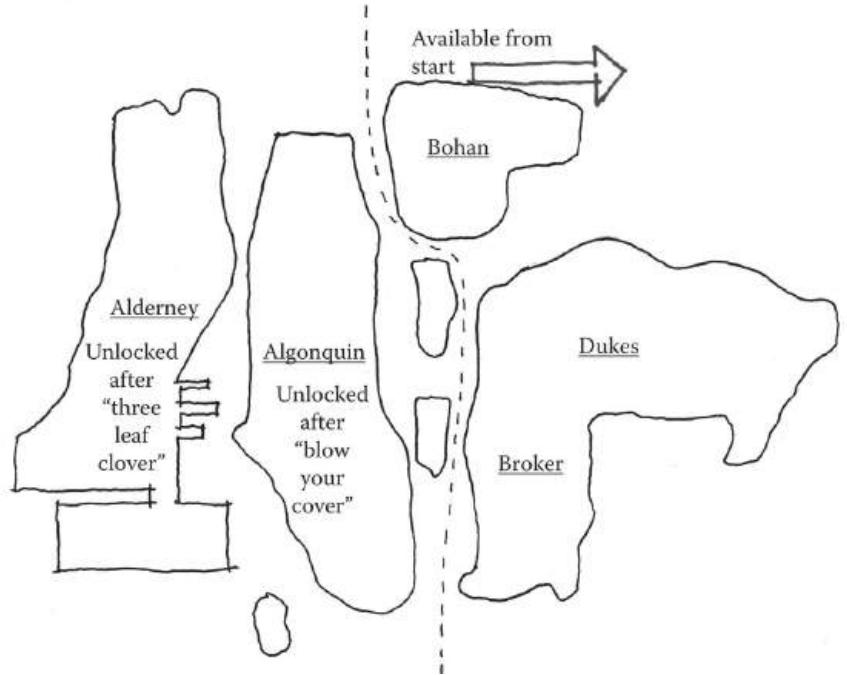  
FIGURE 8.22 Grand Theft Auto IV's districts each contain a set amount of tasks to perform before a new one is opened up. This forces players to master the possibilities of one space before moving on to the next one that offers additional choices.

for the Super Nintendo addresses this dynamic in an amusingly self- aware way, having police characters barricade the paths from town to town, claiming that it is their "claim to fame." These barricades are not removed until the player completes the main quests in each town or powers himself or herself up to appropriate levels to survive the next area of the game. Once each barricade is overcome, the world becomes openly explorable. In sandbox worlds, this often means that the player has agency to test all of the world's limits: Grand Theft Auto players can spend hours piloting boats and helicopters, Minecraft players can build their own structures, etc.

Behavioral biologist Karen Pryor calls this process of slowly introducing new information on a set of actions shaping. Shaping, she argues, takes the components of a complex action and breaks them into steps that can be individually mastered and built on. Her process of shaping behaviors focuses on increasing the criteria for positive feedback as new actions are learned: a reward is given first for something simple and then for increasingly complex steps. She argues for each action to be taught one at a time in isolation. She likens this method to learning a golf swing: players first learn how to grip the club, and then learn successive parts of the action. Rewards are given at first for mastering the grip, then for having a proper grip and backswing, then for properly moving from grip and backswing through to proper weight shifting, and so on. Lessons are kept interesting by keeping tasks "ahead of the subject"—always teaching the next action as each is learned rather than resting on already mastered ones.65

Shaping choice in the way that miniature garden games do allows players to understand the certain, uncertain, and risky elements of worlds. By understanding the choices available to them, players are able to interpret the best path to take when given a choice—elements they are familiar with lead them on paths where they can take educated risks or engage in actions they are certain they can perform. However, such gamespaces can subvert these choices by offering little indication of what is down multiple pathways. In the case of Earthbound, caves and dungeons often show multiple passageways on one screen (Figure 8.23) without indicators as to what the correct passage is to reach the end. In these cases where the game has shaped players' understanding of its possibility space, players are actually motivated to explore all of these passages in case one could contain extra treasures, despite the possibility that they could be attacked.

Beyond their use in role- playing and sandbox worlds, shaping, choices, and risks are also the basis of game worlds that offer both linear progression

  
FIGURE 8.23 This sketch of the Giant Step level of Earthbound shows how players are offered multiple passageways through a level with no indication of which one to take. Rather than making players uncomfortable with how to move on, such choices motivate players to try all of them if the designer has properly introduce his or her game's possibility space—risking spending extra time and resources in the dungeon to reap potential rewards.

and opportunities for player exploration. These worlds deserve their own investigation as they create very dynamic spaces driven by rewards and expanding possibility.

Reward- Possibility Mazes

Throughout the book, we have discussed games in the *Metroid* series and their unique style of gamespace popularly dubbed *Metroidvania*—so named for their use in the *Metroid* and *Castlevania* series. These spaces are mazes, as discussed in Chapter 3, tour puzzles with multiple branching pathways and dead ends. They are also miniature garden- like in that they have distinct districts and boundaries that offer players the opportunity to explore multiple environment types. Finally, they employ the shaping and expanding possibility spaces of sandbox worlds: players begin in confined areas with a limited amount of abilities and gain access to new areas as they learn new moves (Figure 8.24).

In addition to Metroidvania, we might call such worlds *reward- possibility* mazes, as movement through them is facilitated through exploration and

  
FIGURE 8.24 This sketch of the map from *Metroid* shows how areas are divided into distinct districts and also inaccessible without specific abilities. These worlds are both miniature gardens and shaping spaces that expand as players gain new powers.

rewards. Levels in these games greatly employ denial methods to goad players into exploration. Players who explore such mazes are rewarded with powerups, such as expanded jumping capabilities, better armor, or new weapons that allow access to new areas.

The reliance on rewards for advancement makes finding them critical to moving through the game. As such, these games often employ the risk- reward uncertainty described in the previous section's *Earthbound* example: showing multiple passages without specifying which one is correct. We may call these *uncertainty nodes*. Lyndon and Moore describe such a node in Eliel Saarinen's *Cranbrook Academy of Art*. At the end of an important axis on the grounds, Saarinen placed a portico that opens to a pond on the north side, the Cranbrook Art Museum to the east, and the Cranbrook Academy of Art Library to the west (Figure 8.25). This portico, as the climax of the axis, offers a choice of spaces rather than one distinct one. Each path likewise offers its own rich opportunities for exploration rather than a singular space.66

  
FIGURE 8.25 Eliel Saarinen's Cranbrook Academy of Art, built in Bloomfield Hills, Michigan, in the 1940s. These sketches show how the portico at the end of an important axis on the grounds offers a choice between multiple spatial experiences. Each choice is hierarchically equal to one another, and therefore leaves the choice completely to the occupant.

Reward- possibility mazes rely on uncertainty nodes to encourage backtracking. If a player chooses a particular path and discovers a new power along the way, he or she is often encouraged to return to explore previously visited spaces with his or her newfound powers. Many of these spaces have a particular spatial orientation or visual symbol associated with them. In Super Metroid,67 for example, players may from the beginning of the game uncover hidden blocks with weapon symbols drawn onto them (Figure 8.26). These assets consistently appear throughout the game and show players which tool they will eventually find that will allow them to break through. Once the required ability is found, the game shows the player that his or her new power destroys blocks of a certain type, encouraging players to backtrack and enter previously inaccessible areas. The blocks for the Speed Booster are an example of these kinds of symbols. Batman: Arkham Asylum68 utilizes actual level geometry as symbols for using specific tools. Batman's Line Launcher, for example, allows him to

  
FIGURE 8.26 Super Metroid uses symbolic assets to show players what tool to use to destroy barriers long before they have the proper tool. When players finally gain the tool and understand what wall types to use it on, they can backtrack to open new areas.

cross long horizontal pits over which he cannot gain enough verticality to cross with his default glide. These are introduced soon before Batman gains the launcher. When it is finally received, players know that the mysteriously uncrossable gaps are now within Batman's range of metric possibilities.

Much of how players understand reward- possibility mazes and miniature gardens depends on how designers inform them about the rules of these worlds. However, there are instances where breaking one's own rules can be advantageous. In the last section of this chapter, we discuss the benefits of defining rules and then breaking them.

# DEGENERATIVE DESIGN

We have described how designers can build possibility spaces by clearly defining and communicating the rules of game worlds to players, and then letting them have rein to explore them. Such spaces may offer plenty of opportunity for players to stay occupied with possibility space worlds. However, as we saw in the previous chapter, hidden surprises beyond the boundaries of established gamespaces can offer an incredible sense of discovery for players that would otherwise be testing the limits of your game worlds without reward.

Throughout this and other chapters, we have discussed ways to encourage players to explore our games: enticing with denial, rewards, uncertainty nodes, etc. Shigeru Miyamoto's quote from Game Over: Press Start to Continue that prefaced Chapter 6 applies here: "What if something appears that should not, according to our game rules, exist?"69 Such is the purpose of degenerative design, design that breaks the established rules of a game and gamespace.

Salen and Zimmerman use the term degenerate strategies to describe what is commonly known as cheating: utilizing hacks and loopholes in game rules to gain an advantage. In some ways, these can break the reality of the game world, allowing players to move outside its boundaries or uncover the world's artificiality. These may also gain these players an unfair advantage over players who are playing by the rules, which can ruin the experience of playing games.70 Degenerate strategies, however, also allow opportunities for creative strategies within the rules of a game—rocket jumping in Team Fortress, barnacle bowling in Half- Life 2, and bomb jumping in Metroid—that become beloved parts of their games.

Gingold references degenerative design when he discusses the concept of hide- and- reveal, the revelation of new spaces when players test the boundaries of miniature gardens. He uses the work of Miyamoto as an example, emphasizing his ability to "tease, goad, and lure" players into finding unforeseen areas in his worlds.71

Super Mario Bros. is a notable example of hide and reveal, as its place in the history of games and the comparison of its spaces and those of its contemporaries reveal the power of its own degenerative design. Super Mario Bros. was one of the first games to feature horizontally scrolling levels that were unique to one another: many players had not seen such gamespaces before. In this way, the ability to scroll left to right already broke many previous gameplay boundaries. However, players who ducked on pipes could find underground passages. Players who jumped in certain spots or at certain blocks that appeared to be plain brick were likewise rewarded with secret treasures or beanstalks into secret cloud worlds. In Super Mario Bros., Miyamoto established that the screen scrolled left to right, that question blocks held items and that brick blocks did not, and then completely threw these rules out the window to surprise and delight players. Once these were a part of the understood logic of Mario games, new logic was offered in subsequent titles, such as the white blocks players could duck behind and shortcuts under quicksand found in Super Mario Bros. 3. When designers establish rules, they should also be open to the idea of breaking them in ways that do not break the logic of the game, but instead provide exciting discoveries for players.

# SUMMARY

In this chapter we have discussed the assumptions of game players, writers, and spatial designers regarding how designed spaces respond to the world around them. We have learned how the design elements described in

other chapters support the idea of games as self- contained immersive systems, but how their reliance on players make them systems for metacommunication. We have studied how these competing relationships offer the opportunity for distinct play styles and unique occurrences that result from the rules of games, known as emergence. Emergent elements of games highlight how games are not simply containers for linear stories, but also spaces that offer interactive possibilities to players.

These spaces of possibility are enhanced by visualizing the space as miniature garden worlds that contain myriad environments for players to explore. Visualizing these spaces as miniature gardens in the Japanese tradition gives us guidelines on how to introduce possibility to players: overviews, tours, and defined but ever- expanding boundaries. Japanese garden design also informs the way we direct players through these spaces: through the careful design and placement of landscape features and level geometry that highlights and emphasizes places of interest.

Such miniature garden worlds and possibility spaces benefit from the designer limiting player interaction until they are ready to learn more about the world's possibilities. We explored this idea as shaping, teaching by slowly introducing the elements of possibility within a space. Worlds that teach through direction but also entice exploration through uncertainty form reward- possibility mazes, which reinforce exploration through rewards and shaping through denied access to new areas until rewards are earned. These spaces also encourage risk taking, as they present players with multiple, equally enticing paths.

Finally, we learned how despite the discussion of setting up, teaching, and creating possibility through rules, designers should embrace opportunities to also break their own rules. These expand the possibility spaces of games in ways often delightful to players, and reward those who test the limits of game worlds.

In Chapter 9, we explore multiplayer interaction through urban design principles for mixed- use neighborhoods.

# ENDNOTES

1. Tanaka, Tan. Early Japanese Horticultural Treatises and Pure Land Buddhist Style: Sakuteki and Its Background in Ancient Japan and China. In Garden History: Issues, Approaches, Methods, ed. John Dixon Hunt. Washington, DC: Dumbarton Oaks Research Library and Collection, 1992, p. 79.  
2. Slawson, David A. Secret Teachings in the Art of Japanese Gardens: Design Principles, Aesthetic Values. Tokyo: Kodansha International, 1987, p. 125.

3. Ebert, Roger. Games vs. Art: Ebert vs. Barker | Roger Ebert's Journal | Roger Ebert. Movie Reviews and Ratings by Film Critic Roger Ebert | Roger Ebert. http://www.rogerebert.com/rogers-journal/games-vs-art-ebert-vs-barker (accessed July 14, 2013).4. Salen, Katie, and Eric Zimmerman. Rules of Play: Game Design Fundamentals. Cambridge, MA: MIT Press, 2003, p. 450.5. Salen, Katie, and Eric Zimmerman. Rules of Play: Game Design Fundamentals. Cambridge, MA: MIT Press, 2003, p. 449.6. Dragon Quest III. Chunsoft (developer), Enix (publisher), June 12, 1991. Nintendo Entertainment System game.7. Ultima IV: Quest of the Avatar. Origin Systems (developer and publisher), September 16, 1985. PC game.8. Bartle, Richard. Hearts, Clubs, Diamonds, Spades: Players Who Suit MUDs. MUSE: Multi-Users Entertainment Limited. www.mud.co.uk/richard/hcds.htm (accessed July 14, 2013).9. Wyatt, James. Dungeon Master's Guide. Renton, WA: Wizards of the Coast, 2008, pp. 8-10.10. VandenBerghe, Jason. Applying the 5 Domains of Play: Speech given at Game Developers Conference from UBM, San Francisco, CA, March 27, 2013.11. Heidegger, Martin. Being and Time. New York: Harper, 1962.12. Norberg-Schulz, Christian. Genius Loci: Toward a Phenomenology of Architecture. New York: Rizzoli, 1980.13. Buchanan, Peter. The Big Rethink: Lessons from Peter Zumthor and Other Living Masters | Campaign | Architectural Review. The Architectural Review. http://www.architectural-review.com/the-big-rethink-lessons-from-peter-zumthor-and-other-living-masters/8634689.article (accessed July 14, 2013).14. Kimmelman, Michael. The Ascension of Peter Zumthor. The New York Times. http://www.nytimes.com/2011/03/13/magazine/mag-13zumthor-t.html?pagewanted=all&_r=0 (accessed July 15, 2013).15. Final Fantasy. Square (developer and publisher), December 17, 1987. Nintendo Entertainment System game.16. Final Fantasy XIII. Square Enix (developer and publisher), March 9, 2010. Playstation 3 game.17. Glasser, A.J. Final Fantasy XIII Review. Game Pro. http://www.gamepro.com (accessed July 18, 2013).18. Campbell, Jeremy. Grammatical Man: Information, Language, and Life. New York: Simon and Schuster, 1982.19. Campbell, Jeremy. Grammatical Man: Information, Language, and Life. New York: Simon and Schuster, 1982, p. 102.20. Salen, Katie, and Eric Zimmerman. Rules of Play: Game Design Fundamentals. Cambridge, MA: MIT Press, 2003, p. 51.21. Salen, Katie, and Eric Zimmerman. Rules of Play: Game Design Fundamentals. Cambridge, MA: MIT Press, 2003, p. 158.22. Salen, Katie, and Eric Zimmerman. Rules of Play: Game Design Fundamentals. Cambridge, MA: MIT Press, 2003, p. 162.

23. Squire, Kurt, and Henry Jenkins. Henry Jenkins. MIT—Massachusetts Institute of Technology. http://web.mit.edu/cms/People/henry3/contested-spaces.html (accessed July 18, 2013).24. Half-Life 2. Valve Corporation (developer and publisher), November 16, 2004. PC game.25. Team Fortress. Team Fortress Software (developer and publisher), August 24, 1996. Multiplayer Quake mod for PC.26. Team Fortress 2. Valve Corporation (developer and publisher), October 9, 2007. PC game.27. Gingold, Chaim. Miniature Gardens and Magic Crayons: Games, Spaces, and Worlds. Master's thesis, Georgia Institute of Technology, 2003.28. Gingold, Chaim. Miniature Gardens and Magic Crayons: Games, Spaces, and Worlds. Master's thesis, Georgia Institute of Technology, 2003, p. 7.29. Pikmin. Nintendo EAD (developer), Nintendo (publisher), December 2, 2001. Nintendo GameCube game. It is worth noting that this game was inspired by Miyamoto's own gardening hobby. In many ways, the comparison to a miniature garden is very literal here, as the environments in Pikmin are conceived as gardens where the miniaturized player and Pikmin can explore.30. Gingold, Chaim. Miniature Gardens and Magic Crayons: Games, Spaces, and Worlds. Master's thesis, Georgia Institute of Technology, 2003, pp. 7–8.31. Gingold, Chaim. Miniature Gardens and Magic Crayons: Games, Spaces, and Worlds. Master's thesis, Georgia Institute of Technology, 2003, p. 9.32. Anthropy, Anna. Pilgrim in the Microworld. Auntie pixelante. http://www.auntiepixelante.com/?p=1244 (accessed July 19, 2013).33. Breakout. Atari (developer and publisher), 1978. Atari 2600 game.34. Sudnow, David. Pilgrim in the Microworld. New York: Warner Books, 1983.35. Super Mario Bros. Nintendo (developer and publisher), September 13, 1985. Nintendo Entertainment System game.36. The Secret of Monkey Island. Lucasfilm Games (developer), Lucasarts (publisher), October 1990. PC game.37. Dragon Quest VIII: Journey of the Cursed King. Level-5 (developer), Square Enix (publisher), November 15, 2005. Playstation 2 game.38. Super Mario 64. Nintendo EAD (developer), Nintendo (publisher), September 26, 1996. Nintendo 64 game.39. Gingold, Chaim. Miniature Gardens and Magic Crayons: Games, Spaces, and Worlds. Master's thesis, Georgia Institute of Technology, 2003, p. 12.40. Church, Doug. Formal Abstract Design Tools. Gamasutra. http://www.gamasutra.com/view/feature/131764/formal_abstract_design_tools.php?print=1 (accessed July 20, 2013).41. The Legend of Zelda: A Link to the Past. Nintendo EAD (developer), Nintendo (publisher), November 21, 1991. Super Nintendo game.42. Bogost, Ian. Persuasive Games: The Expressive Power of Videogames. Cambridge, MA: MIT Press, 2007, p. 64.43. Don't Look Back. Distractionware (developer), Kongregate (publisher), 2009. Internet Flash game. http://www.distractionware.com/games/flash/dontlookback/.

44. Little Inferno. Tomorrow Corporation (developer and publisher), November 218, 2012. Mobile and PC game.45. Dead Space. Visceral Games (developer), Electronic Arts (publisher), October 14, 2008. Xbox 360 game.46. Slawson, David A. Secret Teachings in the Art of Japanese Gardens: Design Principles, Aesthetic Values. Tokyo: Kodansha International, 1987.47. Slawson, David A. Secret Teachings in the Art of Japanese Gardens: Design Principles, Aesthetic Values. Tokyo: Kodansha International, 1987, p. 15.48. New Super Mario Bros. U. Nintendo EAD Group No. 4 (developer), Nintendo (publisher), November 18, 2012. Nintendo Wii U game.49. Super Mario Bros. 3. Nintendo EAD (developer), Nintendo (publisher), October 23, 1988. Nintendo Entertainment System game.50. Super Mario World. Nintendo EAD (developer), Nintendo (publisher), November 21, 1990. Super Nintendo game.51. The Legend of Zelda: Ocarina of Time. Nintendo EAD (developer), Nintendo (publisher), November 21, 1998. Nintendo 64 game.52. Slawson, David A. Secret Teachings in the Art of Japanese Gardens: Design Principles, Aesthetic Values. Tokyo: Kodansha International, 1987, pp. 56-57. This is around the same time that the board game Go, originally known in China as Weiqi, is said to have appeared in Japan.53. Slawson, David A. Secret Teachings in the Art of Japanese Gardens: Design Principles, Aesthetic Values. Tokyo: Kodansha International, 1987, p. 58.54. Slawson, David A. Secret Teachings in the Art of Japanese Gardens: Design Principles, Aesthetic Values. Tokyo: Kodansha International, 1987, p. 60.55. Gingold, Chaim. Miniature Gardens and Magic Crayons: Games, Spaces, and Worlds. Master's thesis, Georgia Institute of Technology, 2003, p. 23.56. Minecraft. Mojang (developer and publisher), November 18, 2011. PC game.57. Slawson, David A. Secret Teachings in the Art of Japanese Gardens: Design Principles, Aesthetic Values. Tokyo: Kodansha International, 1987, p. 82.58. Slawson, David A. Secret Teachings in the Art of Japanese Gardens: Design Principles, Aesthetic Values. Tokyo: Kodansha International, 1987, p. 102.59. Slawson, David A. Secret Teachings in the Art of Japanese Gardens: Design Principles, Aesthetic Values. Tokyo: Kodansha International, 1987, p. 92.60. Slawson, David A. Secret Teachings in the Art of Japanese Gardens: Design Principles, Aesthetic Values. Tokyo: Kodansha International, 1987, pp. 92-93.61. Journey. Thatgamecompany (developer), Sony Computer Entertainment (publisher), March 13, 2012. Playstation 3 game.62. Grand Theft Auto IV. Rockstar North (developer), Rockstar Games (publisher), 2008. Xbox 360 game.63. Lyndon, Donlyn, and Charles Willard Moore. Chambers for a Memory Palace. Cambridge, MA: MIT Press, 1994, pp. 83-86.64. Earthbound. Ape and Hal Laboratory (developers), Nintendo (publisher), June 5, 1995. Super Nintendo game.65. Pryor, Karen. Don't Shoot the Dog! The New Art of Teaching and Training. Rev. ed. New York: Bantam Books, 1999, pp. 35-67.

66. Lyndon, Donlyn, and Charles Willard Moore. Chambers for a Memory Palace. Cambridge, MA: MIT Press, 1994, pp. 7-10.67. Super Metroid. Nintendo R&D1 (developer), Nintendo (publisher), March 19, 1994. Super Nintendo game.68. Batman: Arkham Asylum. Rocksteady Studios (developer), Eidos Interactive (publisher), August 25, 2009. Xbox 360 game.69. Sheff, David. Game Over: Press Start to Continue. New York: Cyberactive, 1999.70. Salen, Katie, and Eric Zimmerman. Rules of Play: Game Design Fundamentals. Cambridge, MA: MIT Press, 2003, pp. 271-274.71. Gingold, Chaim. Miniature Gardens and Magic Crayons: Games, Spaces, and Worlds. Master's thesis, Georgia Institute of Technology, 2003, p. 18.

# Influencing Social Interaction with Level Design

A good city street neighborhood achieves a marvel of balance between its people's determination to have essential privacy and their simultaneous wishes for differing degrees of contact, enjoyment or help from the people around.

—JANE JACOBS, FROM THE DEATH AND LIFE OF GREAT AMERICAN CITIES

You have to design and program differently. Combat action in an MMO is so different to combat in a first- person shooter.

—JOHN ROMERO

T HUS FAR, WE HAVE explored level design from a generalist point of view, not focusing on any specific genre or play style. Rather, we have looked at how games may use architectural design principles and engage players cognitively through spatial means. While not a specific genre, multiplayer environments—environments in which more than one player is active at one time—deserve their own investigation.

Like the levels of all games, multiplayer gamespaces exist to embody a game's mechanics. Whether the game is a first- person shooter game or a massively multiplayer online role- playing game (MMORPG), it must embody the actions players take in it: shooting, running, exploring, dungeon crawling, etc. However, games must do so in a way that supports multiple players, either simultaneously or in turns, competitively, cooperatively, or merely coexisting, all in the same space. Beyond having the players in the space, designers of multiplayer levels must also address how to have players within these spaces interact with one another meaningfully.

Urban design professionals have been tackling many of the same challenges for decades. In this chapter we explore several urban design ideas and precedents, and learn how the structures of multiplayer game worlds can help facilitate player interaction.

What you will learn in this chapter:

Emergence and social interaction

Learning from urban emergence

The importance of spawn points and quest hubs

Houses, homes, and hometowns in games

# EMERGENCE AND SOCIAL INTERACTION

There is nothing more emergent than the interaction between people. If emergent systems such as Conway's Game of Life are the result of exact and perfectly performed rules on a computer, they are much less dramatic than the interactions between human beings. Humans have moods, ups and downs, varying states of health, aches, pains, and varied personal histories that all influence how successful they are at interacting or playing with others.

Let us once again consider Ubisoft creative director Jason VandenBerghe's player type model from "Applying the 5 Domains of Play."3 VandenBerghe's player personality elements were openness to experience, conscientiousness, extraversion, agreeableness, and neuroticism. The five domains of play were novelty, challenge, stimulation, harmony, and threat. The player elements respectively correspond with:

How players feel about entering into a game experience

How they address tasks in the game

Whether they play best alone or with others

Whether they care about a larger narrative

Personal sensitivity to in- game events

Similarly, the domains of play correspond with factors of how game worlds are constructed:

How many interesting things are there to see?

Are challenges immediate and fast, or do they require practice?

When obstacles are met, what amount of action do they call for and with how many people?

Do we cooperate with others, or are they the obstacle?

Do our actions in the game have agency to affect some larger narrative of the game world, or is the current session self- contained?

What are the rules for discouraging bad behavior?

Based on these factors alone, we can already see how design concepts for multiplayer worlds are generated. By entering design with a purpose, we can begin to build our worlds around how we want players within to interact with one another.

Tabletop designer Jason Morningstar further addresses the emergence of multiplayer games in his East Coast Game Conference 2013 talk, "Tabletop Design Principles." Morningstar argues that rules in a game are just a small piece of the overall social system of multiplayer tabletop games. They "inspire as much as they constrain" players, merely facilitating and focusing interactions that players may have had anyway based on their personalities. Morningstar calls the interactions that occur between the explicit rules of the game and the personalities of individual players the "fruitful void."

Morningstar's approach is much like the "experience is key" approach that we have been taking with level design. Apart from a core mechanic, there is also a core shared experience driving the design of multiplayer gamespaces. If one takes the core mechanics or genre of his or her multiplayer game—a shooter, MMORPG, persistent virtual world, etc.—and asks the questions above of it, he or she can find a set of guidelines for

designing his or her world. VandenBerghe's player personality elements allow us to out ourselves in the shoes of different types of players. For example, we might be tasked with creating a first- person shooter deathmatch level for multiple players. What sort of player would that cater to? On the VandenBerghe chart, let us say that the player prefers realism/ exploration in the novelty quadrant, not work/skilled5 in the challenge quadrant, mechanics/player vs. player (PvP) for the harmony quadrant, and thrill/multiplayer in the stimulation quadrant (Figure 9.1). Now that we have a theoretical player or player type, we should create a map that can best support this type of gameplay. Let us ask ourselves the domains of play- based questions from above to envision our multiplayer first- person shooter (FPS) deathmatch map:

How many interesting things are there to see? There can be interesting things, but players often will not look at them for very long.

Are challenges immediate and fast, or do they require practice? Challenges are immediate, as players will be quickly shooting at one another. Practice occurs over many matches.

When obstacles are met, what amount of action do they call for and with how many people? Assuming even skill levels, the player with the better firing position or better gun will win.

Do we cooperate with others, or are they the obstacle? In deathmatch every other player is an enemy.

  
FIGURE 9.1 The VandenBerghe chart mapping for a theoretical FPS deathmatch player. Designing a map for such a player can give us insight into what kind of experience we can create with our levels.

Do our actions in the game have agency to affect some larger narrative of the game world, or is the current session self- contained? Sessions are self- contained.

What are the rules for discouraging bad behavior? Players can be banned from games.

Though not a very technical process, we already have insight into what kind of map to create. The map does not have to have a lot of interesting scenery or embedded narrative, but it should be navigable. Players should not take very long to get to one another, and there should be nodes that channel player activity and allow for large battles. Perhaps some sort of interesting scenery or brighter lighting can be employed in the node areas. The level should have multiple floors so players can gain a prospect- refuge advantage over one another. Lastly, there should be few other obstacles in the level, as the game should focus player attention on one another (Figure 9.2).

From our initial ideas, we can go through the steps outlined in Chapter 2, "Tools and Techniques for Level Design," including whiteblocking and playtesting with the target audience. The hope is that by designing for the right kind of experience and right kind of player, the level will be a success by meeting its design goals.

  
FIGURE 9.2 Sketches of a theoretical level based on the criteria derived from comparing our genre/mechanics (FPS deathmatch) to our player type from Figure 9.1, and finally our questions based on the five domains of play.

As this example has shown, player personalities and gameplay goals can show us a lot about what kind of map to create. If we keep our eyes on creating a quality experience, our level designs can bring players to the fruitful void of memorable gameplay moments. This technique can be applied to many different types of gameplay and many different types of players as well, giving us a strong starting point for many multiplayer levels. In the next section, we explore precedents for facilitating social interactions in urban design and learn what a hotly contested debate over how cities are arranged can teach us about constructing game levels.

# LEARNING FROM URBAN EMERGENCE

Cities are always the physical manifestation of the big forces at play: economic forces, social forces, environmental forces.

The thing that attracts us to the city is the chance encounter, it's the knowledge that you'll be able to start "here" and end up "there" and go "back there," but that something unexpected will happen along the way.

—QUOTES FROM THE DOCUMENTARY FILM URBANIZED, DIRECTED BY GARY HUSTWIT7

In many ways, cities are the ultimate emergent system: a collection of thousands, if not millions, of people brought together in a space. As the 2011 documentary film Urbanized highlights, cities are created and changed by, for, and sometimes even in spite of the wishes of inhabitants. Indeed, the destinies of cities are shaped by citizens, special interest groups, government officials, regulations, and economic and social forces. Due to these factors, studying cities, their design, and the history of urbanism can be helpful for game designers in understanding how space facilitates social interaction and gives players agency over the conditions of multiplayer gamespaces.

As we saw in our explorations of Kevin Lynch's urban design principles, cities utilize discreet elements—landmarks, paths, nodes, edges, and districts—to facilitate movement within. When considering the people part of this environment, Lynch's spatial rules also seem to aid human interaction: people gather around landmarks or run into one another on the paths between them, districts support different types of activity, etc. Perhaps more importantly, neighborhoods bring a sense of home and belonging. They also produce interpersonal relationships that make people

feel safe from some of the negative emergent effects of cities: crime, vandalism, and violence. Allowing for the organic mixing of human activities allows such neighborhoods or opportunities for interaction to occur. The history of urban design has even shown us examples of what happens when cities are not planned for facilitating positive interactions of residents.

Modernism and Non- Emergent Cities

In the late nineteenth and early twentieth centuries, the city was in a state of flux. Industrialization had packed people into cities looking for work, and cities had therefore become overcrowded. Rich landowners reacted to this demand for housing near industrial sites by packing as many people as possible into tenements for high rents. The result was urban slums like those lamented in the work of Charles Dickens and other nineteenth- century writers.

It was in 1898 that urbanist Ebenezer Howard proposed the garden city plan in his book Garden Cities of To- Morrow.8 Howard's plan divided the city into concentric circle districts, which separated the functions of cities, living, working, gathering, moving, etc., from one another (Figure 9.3).

  
FIGURE 9.3 A sketch reproduction of Ebenezer Howard's garden city plan diagrams from 1898. Each ring of the city houses a separate functional district.

The vision of this city was that work could be carried out in manufacturing districts, while housing could be placed among wide country green spaces where rent could be kept low. Travel between districts and between interlinked garden cities would occur on large boulevards moving out from the center of the rings.

The garden city movement had a great impact on modern architecture. In particular, Franco- Swiss architect Le Corbusier evangelized the idea of cities where the functions of living were separated. In 1922 he conceived Ville Contemporaine (Figure 9.4), a city plan where inhabitants would live and work within skyscrapers located in the center of the city. Surrounding the skyscrapers were parks and large motorways, which were themselves surrounded by administrative buildings and universities. With Ville Contemporaine, Le Corbusier sought to create the city as a large garden and usher in an age focused on the car and airplane as common transportation types. He saw architecture and urban design as tools for social change and, along with Gerrit Rietveld, Karl Moser, and a number of other famous architects, founded the Congres International d'Architecture Moderne (CIAM) in 1928. This group was responsible not only for formalizing the rules of what is considered to be the modern style of architecture, but also for promoting architecture as a tool for social and political change. Like Le Corbusier,

  
FIGURE 9.4 A plan sketch of Ville Contemporaine, a theoretical city designed by Le Corbusier in 1922. The functions of the city are separated from one another, and transit is done by car and airplane.

they advocated for urban design to separate the functions of a city into discrete districts; architect Ellen Dunham Jones has described this as being "like modern graphic design" in the tendency to neatly arrange things. $^{11}$

CIAM disbanded in 1959, but its influence on modern architecture was widely felt. While mainly theoretical, several cities were designed by either CIAM architects or architects influenced by their ideas. Le Corbusier himself designed the plan for Chandigarh, India, as the first planned city after India's independence in 1947.  $^{12}$  Like many of Le Corbusier's theoretical plans, Chandigarh separated different functions into their own districts, with blocks for parkland, industrial areas, and government facilities. Initially, the city was largely empty, though today that has mostly turned around. Even recently, however, visitors have commented that the city is sparsely populated with pedestrians. $^{13}$  Attractions such as Le Corbusier's Open Hand statue have had difficulty attracting visitors, but this is felt to be mainly due to government restrictions on visiting these sites. $^{14}$

Another separated- use city, Brasilia, Brazil, makes a somewhat more damning case against Modernist urban planning principles. The city has been described as "beautiful from an airplane, but a complete disaster on foot." $^{15}$  Designed by Lucio Costa, the city separates living, working, and administrative facilities among large super- blocks connected with highways. Between are vast green spaces designed to automotive scale. As a result, there are few opportunities for interaction between residents. $^{16}$

Perhaps the most often cited case against Modernist- inspired urban design is the Pruitt- Igoe housing project in St. Louis, Missouri. Completed in 1954 and designed by Minoru Yamasaki, the complex consisted of thirty- three apartment buildings separated by streets and large green lawns. Pruitt- Igoe was originally planned as a publicly owned housing complex in which maintenance money would be generated from rent revenue from the low- and lower- middle- class residents. When new suburban communities enticed middle- and lower- middle- class citizens to leave the city, Pruitt- Igoe was left with only the poorest tenants, and therefore with little opportunity for maintenance income. $^{17}$  The decay of the buildings was soon met with decreases in resident population and increases in crime rate. In 1972, demolition on the largely abandoned complex began, which was completed in 1976.  $^{18}$  Detractors of Modernist planning cited Pruitt- Igoe's design philosophy—isolating the function of living from the rest of

the city in favor of having large lawn spaces—as being a major factor in its downfall. Novelist Tom Wolfe commented:

On each floor there were covered walkways, in keeping with Corbu's idea of "streets in the air." Since there was no other place in the project in which to sin in public, whatever might ordinarily have taken place in bars, brothels, social clubs ... now took place in the streets in the air.19

These examples highlight what happens when interactive elements of space are separated from one another or have large areas of empty space between them. In cities, this can lead to isolation of residents and/or crime. In gamespaces, this has the potential to similarly isolate players from one another or make transitioning between two areas designed for different gameplay styles. While some isolation of the gameplay mechanics in an FPS map is helpful, could you imagine a map where areas for spawning or receiving ammunition are far enough away to make gameplay a chore? Could you imagine an online world where you go to one town to buy armor, another to buy potions, and yet another to receive quests?

A lack of tightly defined mechanics for interaction can lead to antisocial behavior. In the early days of the Ultima series, Richard Garriott struggled with how to give players role- playing freedom while encouraging them to behave in socially positive ways within his worlds. For the single- player experience of Ultima IV,20 this led to the game's theme of becoming a virtuous avatar. An encounter with a player in the wilderness who was enacting the role of a thief a bit too well inspired Garriott to create the reputation system for Ultima Online, which kept violent players out of cities and allowed players to police themselves.21,22

While these problems with separated interaction and the behavior of players in online worlds seem bleak, Garriott's solutions for mitigating his game's issues through player enforcement resemble urban design principles advocated by a prominent American writer, mother, and advocate for neighborhood preservation.

Jane Jacobs and Mixed- Use Emergent Neighborhoods

In New York City after the Great Depression, a powerful influence on rebuilding the city's broken infrastructure was Robert Moses, an urban planner often called the master builder of New York. Moses was responsible for commissioning many large highways and bridge projects that ran

through the city. These structures were responsible for breaking up several neighborhoods and leaving residents isolated from one another. He was also an opponent of public transit and tunnel projects, often opting for bridges and parkways even when other options were less disruptive to surrounding areas of the city.

One of Moses' strongest opponents was Jane Jacobs, a writer who had lived in Greenwich Village since 1935. In the 1950s, Jacobs began writing for the magazine Architectural Forum, focusing on urban development stories. Following a trip to Philadelphia to cover developer Edmund Bacon and his urban design initiatives, Jacobs began to question contemporary urban design practices. She noted that Bacon's plans focused more on high- rise development on sites than the people's ability to use them, which contradicted her own urbanistic ideas: focusing on intimate neighborhoods and interactions between residents. In a lecture she would later give at Harvard University, she said, "Respect—in the deepest sense—strips of chaos that have a weird wisdom of their own not yet encompassed in our concept of urban order."23

Jacobs had become a major advocate for neighborhoods once her comments were published in Architectural Forum. In the late 1950s she successfully fought against Robert Moses' plans to create an expressway through Greenwich Village. Her struggles with Moses continued over the course of the next decade whenever his plans resurfaced. Jacobs' most influential work in the field of urban design is the book The Death and Life of Great American Cities,24 which outlines Jacobs' own disgust with contemporary urban design principles focused on separated uses and large- scale development. The book instead advocates for preservation of intimate neighborhoods and social spaces.

Key to Jacobs' arguments are her four generators of diversity in cities:

1. Multiuse districts that encourage constant use by people  
2. Short blocks to allow easy access to amenities and exploration  
3. Buildings of varying age so as to vary economic factors  
4. Density of population25

Jacobs' four generators can greatly influence how we design multi- player gamespaces to best emphasize the emergence created by the interaction of multiple users. Jacobs uses the term social capital, arguing that

the socialization that occurs between individuals in a space can yield both social and economic benefits.26 She cites how a density of people in public places reinforces its safety and develops relationships between users, if only in passing. Eventually, Jacobs' arguments and those of other user- focused urbanists such as Kevin Lynch would become vital to the New Urbanism movement, which emphasized walkable neighborhoods and multiuse districts.

Using our level design vernacular developed throughout this book, it is possible to say that Jacobs' views are well aligned with game designers' seeking of emergent gameplay in multiplayer gamespaces. With a strong focus on planning for the sake of human users, Jacobs' outlook on design can be of great influence for designers of multiplayer spaces.

Integrating Urban Design into Multiplayer Gamespace

Level designers can take both the failures of Modernist urban design and the influences of new Modernism into account when addressing how players may use multiplayer gamespaces. Modeling multiplayer space design principles on Jacobs' own diversity generators and avoiding the pitfalls of Modernist use separations, it is possible to create four generators of emergence in multiplayer gamespaces:

1. Multiuse gamespaces that give players access to a variety of mechanics (shopping, talking, fighting, recharging, etc.)  
2. Close proximity of functional spaces to one another  
3. Spaces for players of different styles, types, or factions  
4. Accommodation of player density

To use multiplayer FPS games as an example once again, we may look at how one would model a capture- the- flag level under these principles. Capture- the- flag games divide players into two different teams, often red and blue, who compete to capture enemy flags and bring them back to their own base. Maps for this style of game are often symmetrical, with each team having a similar base on a far end of the map on either side of a wide prospect- scaled battle space. The Valhalla map from Halo  $3^{27}$  is an excellent example of this style, with two bases on either end of a large gulch, featuring intermittent rocks and cliffs for both cover and sniping (Figure 9.5).

Capture- the- flag maps are good examples of how to integrate our four generators into multiplayer worlds. Their rules necessitate certain

  
FIGURE 9.5 A plan view of the Valhalla map from Halo 3. This map demonstrates the typical structure of a capture-the-flag map: two symmetrically laid out team bases on either side of a large prospect-scaled battle space.

gameplay styles: defensive shooting by players guarding their team's flag, offensive raiding for those attempting to capture the enemy flag, and runs from one base to another when the flag has been captured. These requirements also create opportunities for unique gameplay—some players will prefer to hide and snipe into the space between the two bases, and others will take direct paths, fighting opponents head on. Diagrams of the Valhalla map, as shown in Figure 9.6, demonstrate our principles in this fashion. Both bases offer multileveled walkways rather than a direct path to the flag. Flags are cloistered on the bottom level of each base, allowing defensive players the choice to take refuge inside or snipe from upper levels that look out into the gulch. These bases also offer a variety of weapons for players to use: rifles, explosives, etc.

The gulch between the two bases is also multiuse: players can use the tops of cliffs as sniping positions, or sneak between bases or into cover in the river at the bottom. A turret midway through the map offers players the option of gaining a strategic advantage over the other team, and becomes an important landmark for either attacking or defending forces when flags are being transported between bases. While the map as a whole is large, it does not take much time to traverse, so raids can be quick and battle is nearly constant. This largeness offers additional opportunities for the vehicle- based play that is part of the Halo franchise, and accommodates the many players that may be in one match. All of this combines to create exceptionally emergent styles of play.

  
FIGURE 9.6 Diagrams of the Valhalla map show how the design of individual components supports emergent gameplay: bases offer different types of weapons and encourage different defensive styles. Terrain changes in the prospect battlefield allow sniping, vehicle, stealthy, turret, or direct styles of combat.

Towns and cities in massively multiplayer online games such as World of Warcraft  $(WoW)^{28}$  also promote emergent social gameplay. In WoW, towns often contain several gameplay- related amenities such as vendors, places to purchase items, and trainers, non- player characters that help players learn new skills. These may be located on the way to larger settlements or to raiding locations—zones where players and their teams fight game- controlled environmental hazards and foes. Likewise, cities contain many of the amenities of towns, but offer even more gameplay- related functions to further encourage social interaction: inns for rest, taverns for socializing, auction houses for exchanging goods with other players, and banks for storing items. Cities may also feature gathering spaces for specific guilds, organized groups of player characters.

These gamespaces are very much organized under New Urbanist principles and therefore fit into our own gameplay- centered generators for emergence. They feature a mixture of use types that are important for a user's gameplay in WoW: training, shopping, socializing, and facilitating quests. The proximity of spaces to one another encourages a constant presence of players traveling between landmarks, and the diversity of

  
FIGURE 9.7 Urban areas in MMOs such as the Stormwind City's Trade District in World of Warcraft offer a multitude of gameplay activities for different types of players within a small proximity, allowing for social interaction to occur.

vendors or trainers in any given town encourages the mingling of players of different classes and professions (Figure 9.7). In terms of construction, the shops of vendors or trainers within in- game urban spaces utilize consistent symbolic assets: building types and signage. In this way, players of each class can form a language in which symbols are important to them, and seek out these symbols. When buildings of different types intermingle, emergent socialization is not far away.

The design and the types of functions contained within a multiplayer. gamespace help encourage the mingling of different types of players when they follow New Urbanist ideas of multiuse development. While separating uses to focus on singular mechanics may create interesting single- player experiences, multiplayer maps are made more meaningful when they accommodate different types of players. In many ways, the spaces from which players first encounter a gamespace have a lot to do with how they prepare themselves for multiplayer emergence. In the next section, we explore these gamespaces- spawn points and quest hubs- more thoroughly to see how they send players off on the path toward emergent experiences.

# THE IMPORTANCE OF SPAWN POINTS AND QUEST HUBS

THE IMPORTANCE OF SPAWN POINTS AND QUEST HUBSThroughout the book, we have discussed the importance of pacing on games, alternating high and low action to create manageable gameplay and highlight exciting moments. While many multiplayer games avoid the quiet moments common in single- player experiences, the opportunity to refresh oneself is still a vital part of the experience. In this way, the places in which players appear on multiplayer maps, known as spawn points, and the places from which players embark on missions, which we will call quest hubs, are of great importance.

Shaping with Spawn Points

In previous explorations of emergent gameplay and possibility spaces, we discussed how games such as Minecraft29 introduce players to the possible mechanics of the game through controlled experiences at the game's opening. As in single- player games, where first levels establish the rules of a world and introduce them to players, the places where players first encounter multiplayer spaces have a great impact on that player's possible strategies. The possibilities present in spawn points and hubs have a great impact on how players may approach their time in a multiplayer game: What weapons are near them as they spawn? What shops can they access? What are the opportunities for leveling up or improving their skills?

The size of these spaces can greatly affect pacing. In action- oriented multiplayer games such as deathmatch shooter games, spawn points are small and offer a few nearby weapons to get a player moving along- - there is no time to linger, only to jump into the game's action. For players appearing on a map, spawn points are often in defensible places isolated from main action nodes but close enough to them so the spawning player can rejoin the fight quickly, as shown in Figure 9.2 and other similar diagrams throughout the book.

In the cooperative multiplayer shooter game Left 4 Dead,30 players begin each level in safe houses—sheltered areas with extra ammunition and health packs. These spaces are in many ways similar to spawn points in other shooter games, as they allow players to quickly recharge and go if they choose. However, they are largely inaccessible to the computer- controlled zombies in the game, and therefore allow players the opportunity to stay and plan their next moves. In this way, these spaces encourage socialization by letting players plan strategies for moving forward through Left 4 Dead's gamespace. The game also features weapon and health caches throughout levels, especially before important large- scale battles.

These not only control pacing for the game, but also let players decide how they will approach upcoming challenges based on their individual strengths and play styles.

In open- world or MMO games, players have similar opportunities—refreshing or outfitting themselves, socializing, planning, etc.—but within much larger spaces. These spaces, which we are calling quest hubs, have a great influence on how players explore and learn about multiplayer game worlds.

Shaping Player Interaction with Quest Hubs

In many MMOs and online worlds, players often enter the gamespace in a centralized town or designated beginner's area. In ActiveWorlds,31 a persistent online world, players begin near coordinates 0, 0 on the world map and may move outward from there. Due to the large numbers of players moving through this area, it has become an important in- game commerce hub. WoW players begin in a starting settlement or town dependent on their chosen race. These towns have access to trainers for every class, as well as introductory quests specific to the player's chosen race. These activities give players a sampling of available character types they may choose and teach them how to play the game. They also facilitate the establishing of unique play styles by giving access to the game's available classes.

The starting areas in games like WoW work in much slower and more deliberate ways than spawn points in multiplayer action games do. These spaces are larger and meant to be carefully explored. They encourage interaction between players, as they are often laid out with a multitude of things to do and quests to undertake. The multiuser dungeon (MUD) Federation II (Fed II)32 utilizes carefully planned initial encounters with the game world to teach players how the game works and shape their interaction and gameplay. New Fed players are limited to exploring their starting planet until they can purchase a spaceship, which requires gaining a permit and bank loan by utilizing communication commands. This introduces players to some of the basic mechanics of the game and then allows them to venture further once they have mastered these mechanics. Because many of the economic systems that players must contend with to advance are player controlled, the social hierarchy of the world facilitates interaction with other players.

In Quests: Design, Theory, and History in Games and Narratives,33 Jeff Howard discusses quest hubs like those beginning MMOs or MUDs, along with similar spaces in single- player games. These hubs, he says, facilitate

outward movement of players from inside hubs out into the larger world map through the use of quests or missions given by NPCs. Many of these missions require players to travel to other towns, which are themselves quest hubs. As such, these games use quests as a method by which to create tours of the game's possibility space. As players gain more power, movement between hubs and quest selection become easier, giving players more choice over their gameplay experience. Players may also unlock new mechanics as they complete quests.

Federation II's ranking system is based on this experience of travel, learning, and unlocking new abilities. Each new rank in the game opens opportunities to explore new territories and new game mechanics. For example, after the previously mentioned opening quest to get a spaceship, players must pay off that ship by performing cargo- hauling jobs for the Armstrong Cuthbert Company. These hauling missions act as a tour of the game's early planets, and also as opportunities for players to visit social hotspots such as bars. Once players have completed the early hauling missions, they may venture further into space, encountering other players. Eventually, as they move up in rank, they unlock access to the game's other mechanics—stock trading, managing companies, and eventually administrating governments. At this point, players have become the influential characters that newer players will seek out for help.

# Enticing Exploration with Side Quests

While emergence is certainly possible if players each have a list of primary quests to take on, more meaningful emergence can only come if players are allowed to customize their travels. For this reason, designers should offer players choices of tasks that are easily findable from their main paths. In many open- world games, the paths between main quests offer opportunities for side quests, tasks or missions that reward players for extra exploration. This type of structure is common in Bethesda Softworks games such as Elder Scrolls V: Skyrim, where the game world entices players with views of caves, tombs, towers, and other side quest locations while they travel between major quest hubs (Figure 9.8).

Quest structures in multiplayer RPGs are different than single- player ones, as multiplayer games do not often have a central plot that is advanced by game quests. Some quests or player- defined tasks in multiplayer games may involve more time, players, traveling, and benefit than others. Bigger quests may therefore seem hierarchically more important. Some quests,

  
FIGURE 9.8 This diagram of Skyrim shows how players are sent from one town to another. Side quests are easily found along the paths between main quest hubs. As such, main quests encourage travel to different parts of the world, within which players may freely access side quest content.

such as reputation quests in WoW, are smaller repeatable tasks that contribute to a larger- scale goal. Traveling to a bar and buying a round of drinks in Federation II is not a specific quest item, but it may reap social rewards and can therefore be considered a player- defined side quest. Multiplayer game spaces should offer both large- scale main goals and opportunities for smaller player- defined goals. These give players opportunities to define how they spend their time in these worlds.

Quest hubs form important nuclei to large game worlds. Players move outward from hubs and into quests and then return to hubs to refresh supplies, gain new weapons, or get new quests. In games that offer guilds, they may also be home bases for players to inhabit with social groups. We next explore the concept of a hometown in a game, and discover the benefit that players receive from having personalized territories.

# HOUSES, HOMES, AND HOMETOWNS IN GAMES

While quests hubs act as facilitators of travel throughout games, many players may find themselves favoring specific territories based on their level, their progress through a game's story, or the social player groups that

frequent these locations. Some games take this idea a bit further and allow players to have customizable places that become their own. The previous example of ActiveWorlds allows players to set up their own houses and shops, which helped create the commerce hub surrounding the world's entry point (Figure 9.9). Second Life34 allows players to craft their own houses and shops and even allows players to sell objects in the game.

The ability of players to customize elements of games gives players additional feelings of agency over the gameplay experience. Customization has been an element of gaming at least as far back as the advent of modern commercial wargaming, which is often attributed to the game Little Wars created by H.G. Wells in 1913. 35 These games, such as those in the popular Warhammer36 series, allow players to customize their own figurines with paint and other modifications, even as their stats are determined by common rules. In free- to- play mobile and social games, customization has proven a powerful moneymaking opportunity. In 2011, it was revealed that the economy for hats in the game Team Fortress 2,37 for example, totaled over $50 million.38

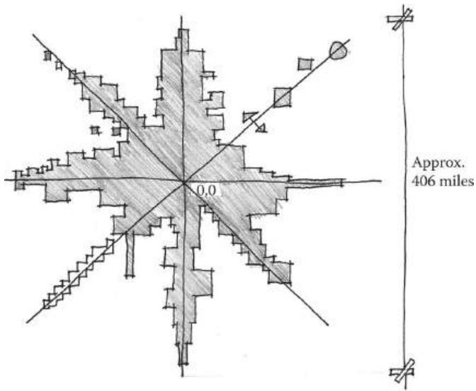  
FIGURE 9.9 A map diagram of ActiveWorlds when it was known as Alpha World showing the world's urban sprawl mass as it emanated from the coordinate 0, 0. The area surrounding coordinates 0, 0 became an important commerce hub, as many players passed through there. The ease of remembering coordinates along the game's x axis (such as coordinates 3, 0), y axis (0, 3), or diagonals (3, 3) allowed these stretches to become similarly valuable as the world sprawled outward.

Beyond the financial benefit to publishers of in- game customization, the ability for players to customize a part of multiplayer gamespaces also has social benefits. Jane Jacobs cites the importance of having a consistent feeling of familiarity with the people in one's neighborhood. Jacobs argues that the consistent presence of "public characters" such as shopkeepers and other residents helps them protect each other or facilitates introductions between residents who are known to have common interests.39 Having consistent social groups of players is helpful for creating common emergent histories of gameplay events. Clans and guilds can be given the opportunity to meet in in- game social spaces such as towns or taverns. Supplementary spaces ancillary to games, such as chatrooms or forums, likewise allow for the organization of competitions, clans, and rivalries that give multiplayer games meaning.

As mentioned, some game worlds allow players to design and build within them, creating their own home that others may visit. This is useful in games where the primary mechanic is socialization between players, such as Second Life. Second Life allows players to shape the game world themselves. This allows user- created content to be attractions or allows for socialization through visiting one another's space. This freedom has allowed multiple subcultures to evolve, such as those who use the customizable world for historic reenactments, cultural events, artistic exhibitions, or playing sports.

Animal Crossing: New Leaf40 utilizes the idea of in- game homes to facilitate interaction between players. Players are the mayor of their own town, and may customize it, their player avatar, and their own house as they wish. Social features of the Nintendo 3DS, such as wireless Internet access and StreetPass—a function that allows passing 3DS devices to communicate and exchange data—allow players to visit each other's towns, exchange items, and give each other gifts. These features allow players to share their in- game achievements and help one another progress through the game by sharing resources.

# SUMMARY

In this chapter, we have explored how understanding player personalities can inform decisions we make when creating gamespaces for multi- player games. Focusing on the development of player interactions rather than simply the execution of gameplay mechanics allows for gameplay to enter the fruitful void where interesting and memorable gameplay events occur.

We also explored historic urban design examples to see how the interaction between large groups of people has been managed. We compared Modernist design principles that separated functions and New Urbanist principles that advocate for mixed- use user- focused urban spaces. We saw how the mistakes of the Modernists should not be repeated in our own multiuser game worlds, and how mixed- use gamespaces can facilitate the interaction between players of different skills, styles, and types.

We saw how the structure of the spaces through which players enter multiplayer worlds, spawn points and quest hubs, affect player interaction with the world. Spawn points provide players with a quick opportunity to refresh resources before entering energetic multiplayer battles. Quest hubs encourage exploration, socialization, and introduce gameplay mechanics through carefully crafted introductory quests. These hubs also encourage the exploration of the larger game world, with quests often sending players to other hubs—cities, towns, planets, etc.—thereby giving players tours of the world. These travels also provide players with the opportunity for self- guided interactions and goals.

Lastly, we discussed how the player's ability to customize his or her own place in these worlds, whether by establishing relationships with specific players or customizing his or her own surroundings, encourages a sense of belonging. These custom in- game "homes" also provide an incentive for socializing in games through visits or gift giving, allowing players to help one another progress in the game.

In Chapter 10, we explore how sound design affects our perceptions of gamespace. Included are explorations of architectural rhythm, ambient sound, and spaces with little or no sound at all.

# ENDNOTES

1. Jacobs, Jane. *The Death and Life of Great American Cities*. New York: Random House, 1961, p. 59.  
2. Romero, John. John Romero at BrainyQuote. Famous Quotes at BrainyQuote. http://www.brainyquote.com/quotes/quotes/j/johinromero483970.html (accessed July 30, 2013).  
3. VandenBerghe, Jason. Applying the 5 Domains of Play. Speech at Game Developers Conference from UBM, San Francisco, March 27, 2013.  
4. Morningstar, Jason. Tabletop Design Principles. Speech at East Coast Game Conference from IGDA, Raleigh, NC, April 24, 2013.  
5. I say "not work" for brevity and because these games provide lots of instant gratification. However, many FPS players work very hard to become more skilled at their games, so in reality FPS deathmatches actually fall somewhere in the middle of not work and work.

6. Technically the final question regards banning for bad behavior, but that is more of an administrative question than a level design one.7. Urbanized. DVD. Directed by Gary Hustwit. Swiss Dots, 2011.8. Jacobs, Jane. The Death and Life of Great American Cities. New York: Random House, 1961, p. 17.9. Jacobs, Jane. The Death and Life of Great American Cities. New York: Random House, 1961, pp. 21-22.10. Fazio, Michael W., Marian Moffett, and Lawrence Wodehouse. A World History of Architecture. 2nd ed. Boston: McGraw-Hill, 2008, p. 507.11. Urbanized. DVD. Directed by Gary Hustwit. Swiss Dots, 2011.12. Business Portal of India: Investment Opportunities and Incentives: State Level Investment: Chandigarh. Business Portal of India: Government of India, Indian Economy, Investment, Incentives, Trade, Infrastructure, Legal Aspects. http:// business.gov.in/investment_incentives/chandigarh.php (accessed August 1, 2013).13. Morshed, Adnan. Chandigarh. Class lecture, Advanced Architectural Theory. Catholic University of America, Washington, DC, February 7, 2008.14. Nangia, Ashish. The Town That Corbusier Built. Change Observer: Design Observer. http://changeobserver.designobserver.com/feature/the-town-that-corbusier-built/15028/ (accessed August 1, 2013).15. Urbanized. DVD. Directed by Gary Hustwit. S.l.: Swiss Dots, 2011.16. Morshed, Adnan. Brasilia. Class lecture, Advanced Architectural Theory. Catholic University of America, Washington, DC, February 14, 2008.17. Husock, Howard. The Myths of the Pruitt-Igoe Myth. City Journal. http:// www.city-journal.org/2012/bc0217hh.html (accessed August 1, 2013).18. The Pruitt-Igoe Myth: An Urban History. DVD. Directed by Chad Fredrichs. New York: First Run Features, 2011.19. Wolfe, Tom. From Bauhaus to Our House. New York: Farrar, Straus, & Giroux, 1981, pp. 63-64.20. Ultima IV: Quest of the Avatar. Origin Systems (developer), Electronic Arts (publisher), September 16, 1985. PC game.21. Ultima Online. Origin Systems (developer), Electronic Arts (publisher), September 24, 1997. PC game.22. Donovan, Tristan. Replay: The History of Video Games. East Sussex, England: Yellow Ant, 2010.23. Alexiou, Alice Sparberg. Jane Jacobs: Urban Visionary. New Brunswick, NJ: Rutgers University Press, 2006.24. Jacobs, Jane. The Death and Life of Great American Cities. New York: Random House, 1961.25. Jacobs, Jane. The Death and Life of Great American Cities. New York: Random House, 1961, p. 151.26. Jacobs, Jane. The Death and Life of Great American Cities. New York: Random House, 1961, p. 138.27. Halo 3. Bungie (developer), Microsoft Game Studios (publisher), September 25, 2007. Xbox 360 game.

28. World of Warcraft. Blizzard Entertainment (developer and publisher), November 23, 2004. PC game.29. Minecraft. Mojang (developer and publisher), November 18, 2011. PC game.30. Left 4 Dead. Turtlerock Studios/Valve South (developer), Valve Corporation (publisher), October 2008. PC game.31. ActiveWorlds. ActiveWorlds (developer and publisher), 1997. Online virtual world.32. Federation II. IBGames (developer and publisher), 2003. Multi-User Dungeon.33. Howard, Jeff. Quests: Design, Theory, and History in Games and Narratives. Wellesley, MA: A.K. Peters, 2008, pp. 47-49.34. Second Life. Linden Research (developer and publisher), June 23, 2003. Online virtual world.35. History of Wargaming. HMGS. http://www.hmgs.org/history.htm (accessed August 4, 2013). Military strategy games, in reality, date as far back as Wei-qi (known commonly as Go) in 2000 BC, and others. Miniature wargames were also utilized throughout the nineteenth century by armies to practice battle strategies. However, Wells is one of the first to offer the games commercially.36. Warhammer Fantasy Battle. Games Workshop (developer and publisher), 1983. Tabletop wargame.37. Team Fortress 2. Valve Corporation (developer and publisher), October 9, 2007. PC game.38. Good, Owen. Analyst Pegs Team Fortress 2 Hat Economy at $50 Million. Kotaku. kotaku.com/5869042/analyst- pegs-team-fortress-2-hat-economy-at-50-million (accessed August 4, 2013).39. Jacobs, Jane. The Death and Life of Great American Cities. New York: Random House, 1961, p. 68.40. Animal Crossing: New Leaf. Nintendo EAD Group No. 2 and Monolith Soft (developer), Nintendo (publisher). June 9, 2013. Nintendo 3DS game.

# Enhancing Level Design with Music and Sounds

I have found, among my papers, a leaf, in which I call architecture frozen music. There is something in the remark; the influence that flows upon us from architecture is like that from music.

—JOHANN WOLFGANG VON GOETHE, FROM CONVERSATIONS WITH GOETHE IN THE LAST YEARS OF HIS LIFE

When I create soundtracks for games, I don't approach it as myself creating music for the game. I'm just a part of the development team. So to bring out the game's features, what sound or background music is able to bring out the atmosphere of the game?

I wanted people to feel the music and the atmosphere to be dark and gloomy, to give you a sense of feeling afraid and unsure about things. You're not confident. And then after you clear the game, you feel rewarded and happy that you cleared the game.

—HIROKAZU "HIP" TANAKA, ON HIS CREATIVE PROCESS AND COMPOSING MUSIC FOR METROID²

Wmation, interactive game mechanics, or cognitive problem solving.

We have explored level design in this manner: emphasizing visual symbols, spatial communication, and kinesthetic interaction. While often overlooked, audio also plays a major part in our understanding of gamespace.

Game audio is another way in which level designers can augment their. gamespaces with information. Audio can entice player movement, help set an atmosphere for gameplay, or reward players for their achievements. Sound design in games can help set the pacing of action, influencing the actions of players interacting with games. In this chapter, we explore sound design in game levels and discover how sound is the final ingredient for engaging players in our constructed game worlds.

What you will learn in this chapter:

The role of rhythm in games and buildings

Complementing level design with ambient sound

Enhancing gameplay experiences with sound design

# THE ROLE OF RHYTHM IN GAMES AND BUILDINGS

An essential part of our discussions about game pacing and architecture has been rhythm, the timed repetition of elements or movements. In gameplay, this has meant a steady alternation of high and low moments of gameplay, of dangerous and safe spaces, or of challenges and rewards (Figure 10.1). Each of these elements puts players on a schedule, which is internalized, providing powerful enticement through gamespace. In architecture, rhythmic use of visual elements—structure, shadows, etc.—provides a visual draw through space. Rhythmic elements also imply spatial separation, turning a single space into several (Figure 10.2).

Rhythm is also an essential element of music and sound design. In Western musical notation, rhythm is a function of the number and type of notes found in a bar of music. Musical meter, often describing

  
FIGURE 10.1 Examples of rhythmic pacing in gamespaces.

  
FIGURE 10.2 Examples of rhythmic elements in architecture.

the number of patterns and their timing in a piece of music, is another vital element, as it involves the study of specific repeated elements. Justin London, a musical scholar, has said that meter, understood as rhythmic elements repeated over the course of a piece, initially introduces itself to listeners and then forms a schedule on which it is expected.3

In these ways, the rhythmic elements of games, architecture, and music are not at all unalike. Rhythm not only provides the structure (pacing of games, spacing of columns, repetition of beats) that holds these media together, but also cognitive responses in consumers. In this section we explore several ways in which rhythmic elements can affect our understanding of gamespaces.

Mood and Music

When discussing sound in games and how it affects player mood and action, the first portion of a game's soundscape- - the sounds in a game that form a sonic environment- - that most people would think about is the game's music. Indeed, music in games is one of the most often noted and remembered elements of the experience. Jack Wall, composer for Mass Effect and co- founder of Video Games Live, a traveling video game music concert, said, "Music is the unseen character. It's the emotion behind the actions of a player. It's gently there to show the game designer's intentions. It's totally collaborative with the developer."4 As the Hip Tanaka quote above describes, game music contributes greatly to worldbuilding in video games. While players are interacting with mechanics, narrative, and other elements of the game world, they are not in the space themselves. Music offers emotional cues to players, and good composition can steer player emotions as deftly as gamespace construction can.

In a 1998 study, researchers at the Institute of HeartMath and the U.S. Naval Postgraduate School tested the ability of certain types of music to

affect the mood of listeners.5 They chose four types of music: classical, new age, grunge rock, and the then- recently created genre of designer music—music designed for affecting listeners in specific ways. The designer music is specifically of interest, as it most closely resembled contemporary video game music, with quick beats and atmospheric instrumentation. Using a 45- item questionnaire, the researchers tested how the four genres affected these elements of mood: caring, mental clarity, relaxation, vigor, hostility, fatigue, sadness, and tension.6

The results supported the hypothesis that all four types of music would affect listeners' emotional states. Classical music was noted to have no significant emotional effects other than lowering tension. New age music yielded increases in relaxation and decreases in hostility and tension, but also lowered mental clarity and vigor. Grunge rock produced increases in hostility, fatigue, sadness, and tension, while decreasing caring, relaxation, mental clarity, and vigor. Finally, the designer music increased caring, relaxation, mental clarity, and vigor while decreasing hostility, fatigue, sadness, and tension.7

Studies like this underscore music's ability to reach out to listeners and pull them into the emotion of a piece of gameplay. As we have seen, games are allowed to take us to places typically avoided by other media—fear, tension, aggression, and others—for the sake of creating an imaginary interactive experience. Game developers will often use sophisticated lighting or art to create this tension, as we see in many survival horror games. However, music can be the factor that truly cements the atmosphere hinted at by visual assets. Music may also be the factor that creates an atmosphere in scenarios where sophisticated visuals are not an option.

Metroid II: The Return of Samus8 for the original black- and- white9 Game Boy is a great example of how music can be used as a tool to build a tense atmosphere even in the absence of sophisticated graphics. In this game, players must explore the catacombs of a distant planet to hunt Metroids, the titular parasitic aliens featured in the series. Lacking color or high- resolution graphics, the developers still strove to encapsulate the isolated mood of the original through other means. Visually, designers changed the silhouette of Samus as she gained abilities rather than her color, as had been done in the first game. Samus's sprite was also enlarged to show more detail. This had the side effect of turning much of the game levels into narrow spaces (Figure 10.3).

In many ways, the musical composition for the game enhances the feeling of narrow space in Metroid II. Of his score for the original Metroid,

  
FIGURE 10.3  Metroid II utilizes both visual assets and a creative soundscape to recreate the isolated feeling of the original Metroid on the NES. Samus's sprite is bigger, causing many of the levels to become narrow spaces. The musical composition enhances the cramped feeling of the game levels by evoking the feeling of being in a nest.

Tanaka said that he wanted to create music that blurred the lines between the game's music and the sound effects of the game's world.10 Ryoji Yoshitomi's score for Metroid II takes this idea further by having extremely minimalistic music throughout the game. The music is often more like rhythmic ambient sound, with electronic cave sounds and the noises of creatures as the instruments. The music switches to a driving riff when players encounter Metroids. This adds to the tension of fighting a large, powerful enemy in a narrow space. Adding to the actual music is the Metroid's screech whenever players shoot it with a missile. This is especially notable, as the distance of the Metroid from Samus facilitates how fast the rhythm of screeches occurs. When there is a short lull in the player's firing, the Metroid can inch closer, and the rhythm of screeches increases—further heightening the scene's tension and the player's awareness of the game action.

Musical composition does not need to be a separate field from sound design. In his composition for Dead Man's Trail, composer Akash Thakkar created musical tracks based on his own Foley work, the recording of everyday ambient sounds. For one track, Thakkar created sound effects of slamming doors, shooting the last shell in a shotgun, and dragging a

cello bow over various household objects. $^{12}$  These sounds reflect popular tropes of zombie apocalypse stories: distant battles with hordes, losing the last bit of one's ammunition, the sounds of movement inside buildings. All these things add to the tension of each level, and make players aware of the actions they must take to survive.

The musical compositions of Flower, $^{13}$  on the other hand, are simple guitar and piano arrangements designed to elicit feelings of relaxation and happiness. The player sound effect of the game—a constantly blowing breeze—adds an element of nature to the music. Gameplay sounds are musical—as players hit flowers to open them, piano and violin notes play, adding to the simple background music. As players gain power and speed, so do the notes being played.

Jim Guthrie's soundtrack to Superbrothers: Sword & Sworcery EP $^{14}$  underscores the game's point- and- click mechanics and sense of mystery. The music of the game matches the emotions of gameplay: driving and rhythmic when the player explores new territory, slow and discreet during puzzles, or epic and assertive during boss battles. The creators of the game promote it as a "progressive rock album you can hang out in" $^{15}$ —the game is as much a progression of musical pieces as it is a progression of gameplay, giving the experience a rock operatic feel.

As the Institute of HeartMath and the U.S. Naval Postgraduate School's study of mood and music above shows, designed music like that found in games can have a promotional benefit on the listener's positive emotions. Fast- paced songs increase mental clarity, while smoother ones aid in relaxation or concentration. Music with oppressive riffs and a slow tempo, like much of the grunge music used in the study, has negative effects on the emotional state of listeners. In this way, game music should seek to build a consistent emotion, and level designers should seek to accompany their scenes with music that best conveys the mood they wish to create. Upbeat level one music from a platformer would go poorly with the dark spaces of a survival horror game.

The discussion of music and mood in games brings up another potential avenue for music in game levels: becoming interactive. Understanding the concept of interactive game rhythm will have great impact on how we understand the player's relationship with the rhythms of gamespace.

Rhythm and Interactive Sound

Game music often blurs the lines between sound effects and music. Some games, such as Metroid II and Dead Man's Trail, utilize sound effects in their

music to create a hybrid soundscape- song. Others, like Flower and Sword & Sworcery, utilize musical sound effects so that players feel as though they are contributing to both the game's outcome and music by interacting with the game. Describing this phenomenon of interactive music, interactive audio researcher Karen Collins has called game music multimodal—involving more than one sense. Collins argues that games engage three sensory modalities at once: audio, visual, and haptic (interactivity/action oriented).16

Following the mechanics of "call- and- response" toys such as Simon,17 where players attempted to repeat a pattern of electronic lights and tones by pressing buttons, a new type of game was popularized in the mid- 1990s that had players responding to button prompts so a track of music would play—the rhythm game. PaRappa the Rapper for the Sony Playstation was one of the first games in this style, requiring players to press a specific sequence of buttons in time with a musical track. If players failed to press the proper buttons, the track would play incorrectly. In this way, the player had agency on how the background music of the game played.

Rez,18 by United Game Artists, took a different approach. Rather than having players respond to musical prompts to maintain proper sound, Rez is a third- person rail shooter where game sound is musical. As players shoot enemies in levels, the music flourishes and different colors permeate the gamespace, building it from a blank grid to an array of complex architectural forms (Figure 10.4). The simultaneity of player action and the development of both game sound and visuals has been described as synesthesia, where a person experiences multiple sensory experiences from one sensory input.19 A synesthete, a person who experiences synesthesia, might perceive letters or numbers as inherently colored.

This type of gameplay, where user input and action affect game assets, produces a unique experience for players. Games in the Bit.Trip series,

  
FIGURE 10.4 Rez players interact with both the game's sound and level design by moving and shooting enemies. The increasing complexity of sound and space is feedback for the player's actions within the game.

such as Bit.Trip Beat $^{20}$  and Bit.Trip Runner, $^{21}$  have an effect similar to that of Rez. Players move forward consistently through levels and must respond to musical input in different ways depending on the mechanics of the game. Beat involves moving a paddle to hit dots à la Pong (Figure 10.5), and Runner is a "constant runner"- style game where players must make their character jump and duck to avoid obstacles. The timing of levels, kept consistent since the game automatically propels players forward, corresponds to the timing of a musical track (Figure 10.6). Likewise, interaction with specific bullet types (in the case of Beat) or mechanics (in the case of Runner) occurs when the player is supposed to hear those sounds. As the player plays, he or she comes to expect these sounds in each track and will move to make them happen. Over time, the player wonders if he or she is playing the game or if the game is playing him or her.

In terms of design, these gamespaces use level geometry as a medium for activating specific musical sounds: Rez and Bit.Trip players are both adding to and responding to the music of gamespaces by playing the game, yet at times players may feel that since they are anticipating specific rhythms, they know what move to make next in the game.

  
FIGURE 10.5 Bullets fired at players in Bit.Trip Beat come in waves synced to musical cues. Players become trained to expect certain rhythmic elements in the music and so begin moving their paddle in time with it.

  
FIGURE 10.6 This diagram of a level in Bit.Trip Runner shows how specific obstacles are arranged rhythmically and in repeated movement patterns. Items allow for optional notes in the music.

Rhythmic Entrainment in Games and Spaces

As we have discussed here and in other chapters, patterns and repeated instances of game sounds, objects, or gameplay experiences can train players to expect events to occur or understand what strategies to take. In this way, we can say that entire games or game worlds can have rhythms, much as game music can. Our exploration of rhythmic synesthesia games like Rez and Bit.Trip shows us that players interacting with rhythms will learn to anticipate when specific movements will occur. This rhythmic synchronization can also occur on a larger scale with game rhythms and with elements of gamespace.

In biomusicology, there is a concept known as entrainment, where an organism syncs itself to an external rhythm or to other organisms.22 A form of entrainment was used to facilitate the enticement practiced by early arcade games: if players are aware that bonuses occur every two levels, they will pay extra money to continue after dying. Entrainment patterns are very common in reward and short- and long- term goal- centric games like the Zelda series. Players know that after a short number of tasks in the overworld of many games, they will enter a dungeon, which will often contain a new weapon and an important quest item. The rhythm of Zelda gameplay drives players onward and is often enhanced by other elements that highlight this rhythm. For example, the embedded narrative events surrounding each dungeon often follow a dramatic arc. Players learn why they should go into a specific dungeon; they enter, there is a climactic battle, and finally falling action as players reap their rewards and order is restored. The games' status screens often reveal how many quest- important items there are to collect, and therefore how many dungeons. Such games give an overview of their rhythmic system and train players how to recognize it.

In purely spatial terms, buildings and game levels can also utilize rhythm. An example of this is the Great Mosque of Cordoba. On the one hand, it utilizes the shaded lighting condition that was established as having great ability to entice users through space due to its creation of atmospheric ambiguity. On the other hand, it has rhythmic arcades and double arches with alternating red and white voussoirs also entice through physical form by reaching in all directions through the hall. Architecturally, rhythmic components like the columns in the Great Mosque, staircases, shadows, doorways, terraces, or others create a sense of motion and continuity. These draw users through a space in the same way that linear elements, like those seen in Gothic churches or in Half- Life 2,23 do.

  
FIGURE 10.7 Even small architectural details like the spacing of floor tiles in a shopping mall can factor greatly into user entrainment. People will widen their pace and move faster over wide floor tiles, and slow down as they shorten their pace for smaller tiles.

The spacing of rhythmic elements in architecture can affect how users move through a space. In department store and mall design, for example, floor tiles are commonly smaller near expensive items. This makes shoppers slow down as their carts begin clicking on tiles faster, creating the feeling that they are moving too fast.24 Floor tiles between stores in shopping malls are often very large, so users will entrain their steps with the wider pattern. When shoppers reach the front of a store, the tiles at the entrance become smaller, slowing the pace of the walker as he or she entrains to the new shorter pattern (Figure 10.7). The same can be done in gamespace: wider rhythmic architectural elements in prospect spaces, such as buildings in urban driving games or shooters, pull users through large circulation paths, and when players encounter areas where they are immersed in a rhythm of smaller or more intimate elements, they tend to stop and explore the space before moving on.

# Varying Structural Rhythms

While gameplay occurs rhythmically and can entrain players to its rhythms to drive them forward, another element of keeping player engagement with rhythmic game structure is to layer rhythms on top of one another. This type of layering is evident when designers give players a series of long- and short- term goals in a game. Long- term goals form their own rhythm of "big" events—boss battles, cutscenes, story events, etc. This forms the foundational structure of the game, as in, "this game has eight levels," or "this game's story has four chapters." Within these larger structures lie individual stages (worlds 1- 1, 1- 2, and 1- 3), tasks, puzzles, or enemy encounters that create shorter and shorter- term goals.

When diagrammed, these goals begin to form rhythmic patterns. Major game rhythms may be marked with hierarchically more important lines, while other goals are given thinner and thinner lines according to their importance (Figure 10.8). In architectural façade design, such patterns of layered structural elements have been referred to as tartans, after the fabric pattern common in Scottish clothing.25 Architectural tartan patterns are constructed of alternating structural or façade elements of different hierarchical importance: from actual columns to window frames (Figure 10.9). In terms of gamespace rhythms, there can be entrainment

  
FIGURE 10.8 Architectural tartans like the one pictured can be diagrammed to show the layering of hierarchically different structural elements. Awareness of such layered façade features allows designers to create more visually complex building exteriors.

  
FIGURE 10.9 This diagram shows the layering of rhythms that occurs in The Legend of Zelda: Ocarina of Time. Major game events and goals have thicker lines, while other goals are marked with progressively thinner lines based on their scaling.

tartans based on large prospect- space rhythmic elements and more intimate elements. BioShock Infinite26 utilizes these types of tartans well in the combat- ready streets of Columbia: buildings and islands form large- scale rhythms that draw players from one climactic battle to another. However, players who explore individual structures will find richly developed reward spaces and embedded narrative spaces (Figure 10.10). The development of tartan- like rhythms in gamespace can have great effect on both the large- scale structure of a game and individual level spaces. Layering patterns of gameplay in this way with both large- scale events and individual challenges ensures that gameplay is richer than if only planned from without.

While rhythm is the major component in how music contributes to our understanding of architecture and gamespace, there are other opportunities that sound design in games offers for enhancing game levels. In the next section, we look at distinctions between two ways sound is implemented in game engines and how this can be used to draw players through levels.

  
FIGURE 10.10 Bioshock Infinite famously features varying layers of gameplay structural experience. The exterior spaces of Columbia work in large-scale patterns of islands and buildings that facilitate quick movement from battle to battle. Players interested in exploration will find more intimately scaled explorable areas and tasks, giving the game a tartan-like structure of gameplay experiences.

# COMPLEMENTING LEVEL DESIGN WITH AMBIENT SOUND

We have just discussed a major portion of a game's soundscape, music. However, there are other factors that contribute greatly to building a game's audio modality. One of these is ambient sound, sound effects that build environmental context. Here we look at two methods for employing ambient sounds and how they enhance our understanding of gamespace. The terminology we use is borrowed from the Unity engine and how it models how sounds work in space: 2D sound and 3D sound.

# 2D Sound

The first and more simple of the two sound models we explore is 2D sound. Music and contextual environmental sound effects such as wind, rustling trees, or distant urban sounds can be considered 2D sound. These sounds are played over a scene without regard for the distance of the source from the game's viewpoint. For example, a game in which the player character or non- player characters talk will often utilize 2D sound so the dialog can be heard. Game music is typically played over a scene, rather than from a specific source. While these sounds lack actual spatial implementation, they have other uses in building environmental context or atmosphere.

This type of environmental development is exemplified in Slender: The Eight Pages by Parsec Productions.27 The game's developer, Mark Hadley, is a sound designer, and utilizes changes in ambient noise to

describe the state of gameplay as players progress. At the beginning of the game, players can hear typical nighttime forest sounds: chirping crickets, wind rustling through trees, etc. As players collect pages, however, the ambient noise becomes increasingly ominous, starting with a steady drumbeat and eventually including different unsettling tones. Slender is notable for its use of negative space, building the feeling of being vulnerable within a large prospect space through a thick shroud of darkness. The 2D soundscape of this game aids this notion. The drumming can be described as the footsteps of Slender Man as he stalks players, and sometimes seen as simply scary sound effects. Either way, these sounds, which signal that players have the attention of the titular malevolent entity, give the impression of both distance and closeness. This aids the negative space and the antagonist's random spawning mechanics by making Slender Man's location relative to the player seem ambiguous. The lack of fading in and out for this soundscape likewise gives Slender Man an air of omnipotence in the gamespace, creating a tense atmosphere.

Dead Man's Trail utilizes sound to establish game state and hint at the world beyond the gamespace. Ambient noises of nature are used in many of the game's looting levels to establish setting. However, this quickly fades and becomes the dirge of zombie voices as the horde moves closer. Sound in this game has three purposes: to establish setting, to place the level in a much more vast world, and to inform players of how much time is left to loot. Each looting level allows players only a limited time before a large zombie horde arrives. Instead of a timer, ambient sound forces players to listen for the proximity of the horde and plan their looting accordingly.

Two- dimensional space is useful for scenarios in which the vastness of level space must be established, or for important sounds that must be heard by the player. There are also sounds whose ability to wax and wane with player proximity further enhance gamespace.

# 3D Sound

Beyond the singular volume of 2D sound is 3D sound, sound that becomes louder as players near its source. Where 2D sound excels at establishing the atmosphere of a gamespace, 3D sound calls attention to specific areas of a level. This can be useful for enhancing the size of a gamespace, guiding players through space, or as audio clues to secret passages.

Of sound effects in landscaping, David Slawson says that "auditory effects, such as the muffled and therefore 'distant' sound of a waterfall,

also may be employed to heighten the sense of near and far."28 These types of sounds can guide players by establishing a sense of proximity to specific objects or areas. In The Legend of Zelda: Twilight Princess,29 this effect is used early in the game to guide players through the Ordon Woods area. Players must listen for the singing of an important character to reach a narrative- important area and learn how to ride Link's horse. In The Legend of Zelda: Ocarina of Time,30 music is used in the Lost Woods area to guide players through a difficult maze. The maze is divided into rooms with four exits, and players must pause near each exit to test whether the music gets louder or softer (Figure 10.11). Portal31 uses a similar tactic to alert players to secrets: radios playing an instrumental version of Jonathan Coulton's Still Alive are strewn throughout levels. By offering in- game achievements to players for finding them, the developers turn listening for a specific song or sound into an exploration game of its own.

Sounds can create interesting opportunities to alert players to danger or disrupt their play. When creating especially powerful enemies or placing them in levels, giving them unique sounds can add further tension to encounters with them. In Half- Life 2, the poison headcrab enemies, whose attacks leave players greatly weakened, have a distinct rattling sound. Valve employees have noted that during playtesting, testers would drop whatever they were otherwise doing in the game to concentrate on destroying poison headcrabs if they heard the rattling.32 Likewise, clickers

  
FIGURE 10.11 In Ocarina of Time, music is used to guide players through the Lost Woods area of the game. The correct exits to rooms in the maze allow players to hear music more loudly than other exits.

in The Last of  $\mathrm{U}S^{33}$  have their own distinctive noise (for which they are named) that alerts players they are nearby. These enemies cannot see players but have an increased sense of hearing. Thus players may not move too fast around them. As they can instant- kill players, they are powerful blockages in player progress through the game, and their patrol locations often greatly affect the paths players take through levels. Their clicking sounds allow players to detect when these creatures are nearby and adjust their tactics accordingly (Figure 10.12).

Together, 2D and 3D sound can have a great effect on how players experience gamespace. Designers can use 2D sounds to establish the atmosphere of a game or depict a force that envelopes the entire gamespace, and 3D sound can be used as a guide for players or as an alert mechanism.

In the next section, we discuss game sounds that react to player action more strongly, and we see how these types of sounds can enhance gamespace principles explored in previous chapters.

  
FIGURE 10.12 Clickers in The Last of Us alert players to their proximity with distinct clicking sound effects. This allows players to adjust their gameplay strategies to deal with them. Because of their instant-kill abilities, they are also a powerful example of enemies as alternative architecture, as their movements greatly influence how a player must travel through a space.

# ENHANCING GAMEPLAY EXPERIENCES WITH SOUND DESIGN

The use of sound as indicators of approaching enemies or to mark pathways shows us that like art assets, sound assets can be symbolic. As players play Half- Life 2, they are trained to understand how a rattling sound indicates the presence of poison headcrabs. Like many Half- Life series enemy introductions, the first encounter with them occurs in an isolated fashion, in a room where they are one of the only enemies, so players can see what effect their attacks have and learn about the sounds they make (Figure 10.13). In The Last of Us, players are taught about clickers through a cutscene that clearly shows how they are visually distinguishable from other enemies, and through an easily overcome encounter where players can hear the sounds they make (Figure 10.14).

Karen Collins addresses this element of game sound, stating, "The concept of interactive sound as being event- driven suggests that events are repeatable—that if we repeat the action, we will receive the same reaction."34 She states that this repeatability is important for giving players feedback for their actions in games. Indeed, our idea of sound as symbolic assets in games is what allows us to use it as another tool for training players, rewarding them, or giving them other feedback for their actions. Even in situations where the quality of sound design rests on randomized variations of sounds (such as gunshots or footsteps of characters), she argues, audio feedback gives the impression that the players' actions have

  
FIGURE 10.13 Poison headcrabs are encountered in an isolated fashion that allows players to see the effect of their attacks without dying and hear their warning sounds.

  
FIGURE 10.14 Clickers in The Last of Us are first encountered in an area where they can be observed but easily avoided, and their distinct sound can be heard.

agency in the game world.35 To this end, designers can use symbolic audio assets in several ways to enhance their game's world.

Sound as Gameplay Feedback

We discussed earlier how interaction with elements in gamespace often elicits sound effects or musical tones. In Flower, we saw how interacting with closed flowers created notes that were added to the game's music (Figure 10.15). Weapons in many games often play satisfying effects when used: loud bangs for guns, explosions for rocket launchers, and clangs for swords.

If we are to consider sound effects in games as symbolic assets, we have to understand how they produce feelings of agency for player activity. In terms of characters, a pleasant "bwooop" when a character jumps and a jagged "err err err" buzzer when characters are hit become positive reinforcements and punishments, respectively, in response to player actions. Jumping in games is often a positive action, while being hit by enemy fire is a negative one. In Bit.Trip games, successful navigation of the game's environment plays a pleasant electronic note, while missing these opportunities plays an awkward click or thud sound. This use of sound complements the training methods discussed that utilize symbolic assets and rewards. As players

  
FIGURE 10.15 Moving through the world in Flower produces musical tones, which reinforce player interaction.

learn what types of sounds are created by what types of actions, they learn how to properly play the game.

Audio feedback is also useful for directing players within gamespace. Triggers in certain areas can be scripted to play pleasant melodies when players perform actions there. In Year Walk,36 players must at one point navigate a cave by selecting from an array of identical pathways. By listening for specific notes at each path, players can discern which way to go. The notes that lead players in the proper direction are pleasant and in major keys, while the notes that return players to the beginning of the cave are in harsh minor keys.

In Slender, players hear jarring bursts of static whenever Slender Man comes into view. This is an important trigger for players, as a primary mechanic of the game is to avoid seeing the character, which results in the player dying and the game ending. Especially during the early portions of the game, it is possible for Slender Man to be directly in front of players, but far enough away that trees or darkness obscure him. Audio is important here, as it gives players an indication that the antagonist is nearby and they must not continue in his direction. Sound helps dictate the player's interaction with Slender Man, and it also gives players warnings that steer them away from unfair deaths.

Symbolic game objects can have their own symbolic audio assets. Levers can make a satisfying click when pulled, doors can open with a heavy grinding sound, etc. When played in response to player actions in a level, they give the impression that the player has somehow greatly affected the gamespace. When the object that players are interacting with is directly on screen, hearing the sounds an object makes has a similar purpose to the

  
FIGURE 10.16 Environmental sound effects can give feedback for direct interactivity or alert players that they are affecting something elsewhere in the level.

sound effects that characters make: providing satisfying feedback. However, these sounds can also indicate that something has happened elsewhere in the level, as is often the case in dungeon crawling games (Figure 10.16).

Sound as Reward

Sometimes the audio feedback from important events or difficult puzzles triggers the playing of more triumphant audio assets. Audio feedback is being used here as a reward for in- game actions. In Zelda games, jingles play whenever players solve a puzzle in a room or gain a new item. The same is true for most action- adventure games—a unique chime or tune plays in response to player victory. Rewards can be some of the most multimodal experiences in games. In terms of interactivity, they come after players have overcome challenges or performed an important in- game action. Rewards often have a visual component—the sprite or 3D

model of the reward object, or some visually rewarding space. Audio also ties the experience together with upbeat celebratory fanfare. Like the link between interactive and visual modalities, the combination of a sound effect with a specific and repeatable game event closely links the sound and game event together.

Audio rewards in games are not necessarily rewards in and of themselves, but are used to enhance other types of rewards or guide the emotions of players in rewarding scenes. When gaining access to a new weapon or ability, which in Salen and Zimmerman terms would be a reward of facility,37 players may hear a heroic tune. The sound played in a reward vault, rewarding vista, or meditative space may have a relaxing melody when compared with the intense rhythms that possibly accompanied any preceding challenges. In these ways, sound in games can move us through the dramatic arcs of individual gameplay challenges.

Sound as Narrative Indicators

Sound can clue players in to the narrative state of a game. As we have seen, sound in games is largely incidental, designed for accompaniment of performed events. However, sounds can also give insight into elements of gamespace that are themselves narrative indicators.

In Chapter 7, "Storytelling in Gamespace," we discussed how textures indicate the narrative state of games with regard to the hero's journey. As a game moves forward, the state or type of materiality indicated through art assets typically deteriorates: green fields give way to the wet stones of dungeons, lava of volcanoes, or ominous metals of alien cities. Sound can fill in gaps of our understanding of gamespace materiality left by our inability to touch gamespace. It can enhance prospects with echoes, make grass in fields seem plush with sumptuous rustling, or enhance the eeriness of swamps with thick sloshing that makes the player's skin crawl when he or she thinks of what his or her avatar is walking in.

Even the music of a gamespace can be a material indicator. In Sword & Sworcery EP, Jim Guthrie's music not only guides gameplay mood, but also enhances the material awareness of players in specific scenes. The Dream World has slow, melodic music that echoes faintly, making the entire space seem ethereal. Battles with the game's main antagonist, the Gogolithic Mass, feature heavy but sharp percussions that recall the sound of crunching armor and bone. The careful use of these types of evocative music and sound assets greatly enhance the material reality of gamespaces and the experience of interacting with them.

# SUMMARY

While level designers and architects mainly consider the visual and interactive elements of space, video games also allow the use of audio enhancements to our designs. In this chapter, we have explored how music and sound affect player moods and can be used to enhance emotional responses to gamespace. We have also seen how sounds in games create rhythms that, if utilized in certain ways, can cause players to expect them. These expected rhythms in musical composition, game structuring, and game level construction can affect the speed of how players interact with games, or offer layered game experiences through differently scaled challenges.

We also explored how game sound exists in video games: through both overlaid 2D sound and location- specific 3D sound. These sounds offer opportunities for describing the nature of gameplay elements and gamespaces in different ways: do certain elements overwhelm a gamespace, as in many horror games where monster effects fill a level, or are they guideposts that lead players to destinations? These types of sounds may also be used to create a sense of great distance through muffled location- specific sound effects or faint 2D soundscapes.

Lastly, we looked at how specific sound effects can enhance gamespace experiences discussed earlier in the book. Sounds can give feedback for specific mechanics or be rewards for important gameplay tasks. These enhance the ways that gamespaces train players and the experience of earning rewards. Sound effects can give narrative context to gamespaces by describing their materiality. Partnered with visual representations of materials, players get a sense of how it feels to be in a gamespace despite not physically inhabiting it.

In Chapter 11, we address gamespaces that blur the lines between game worlds and the real world. We will learn how designers use both high- and low- tech methods to give real- world spaces game contexts, and even cause real- world good.

# ENDNOTES

1. Goethe, Johann Wolfgang von, and Johann Peter Eckermann. Conversations with Goethe in the Last Years of His Life. Boston: Hilliard, Gray, and Co., 1839. http://books.google.com.br/books?id=pN1M2653ViAC&pg=PA282#v=onepage&q&f=false.  
2. Parish, Jeremy. A Conversation with Hip Tanaka from 1UP.com. 1UP.com. http://www.1up.com/features/conversation-hip-tanaka (accessed August 5, 2013).

3. London, Justin. Hearing in Time: Psychological Aspects of Musical Meter. Oxford: Oxford University Press, 2004, p. 4.4. Lane, Rick. Different Keys: How Music Works in Games. IGN. http://www.ign.com/articles/2012/07/30/different-keys-how-sound-works-in-games (accessed August 5, 2013).5. McCraty, Rollin, Bob Barrios-Choplin, Mike Atkinson, and Dana Tomasino. The Effects of Music on Mood, Tension, and Mental Clarity. Alternative Therapies 4, no. 1 (1998): 75-84. http://www.musicontap.co.uk/downloads/Music_Mood_Effects.pdf (accessed August 5, 2013).6. McCraty, Rollin, Bob Barrios-Choplin, Mike Atkinson, and Dana Tomasino. The Effects of Music on Mood, Tension, and Mental Clarity. Alternative Therapies 4, no. 1 (1998): 75-84. http://www.musicontap.co.uk/downloads/Music_Mood_Effects.pdf (accessed August 5, 2013), pp. 75-77.7. McCraty, Rollin, Bob Barrios-Choplin, Mike Atkinson, and Dana Tomasino. The Effects of Music on Mood, Tension, and Mental Clarity. Alternative Therapies 4, no. 1 (1998): 75-84. http://www.musicontap.co.uk/downloads/Music_Mood_Effects.pdf (accessed August 5, 2013), p. 79.8. Metroid II: The Return of Samus. Nintendo R&D1 (developer), Nintendo (publisher), November 1991. Nintendo Game Boy game.9. Some would argue black and green.10. Brandon, Alexander. Gamasutra-Features-Shooting from the Hip: An Interview with Hip Tanaka. Gamasutra. http://www.gamasutra.com/view/feature/2947/shooting_from_the Hip_an_.php (accessed August 6, 2013).11. Dead Man's Trail. Pie For Breakfast Games and e4 Software (developer), upcoming in 2014. Mobile game.12. Thakkar, Akash. Akash Thakkar: PAX East 2013 Game Audio panel. SoundCloud. https://soundcloud.com/athakkar/pax-east-2013-game-audio-panel (accessed August 5, 2013).13. Flower. Thatgarnecompany (developer), Sony Computer Entertainment (publisher), February 12, 2009. Sony Playstation 3 game.14. Superbrothers: Sword & Sworcery EP. Cappybara games (developer and publisher), March 24, 2011. Apple iPad game.15. Parmar, Robin. Innovative Sound in Games: Superbrothers-Sword & Sworcery EP. theatre of noise. http://www.theatreofnoise.com/2012/07/innovative-sound-in-games-superbrothers.html (accessed August 6, 2013).16. Collins, Karen. Playing with Sound: A Theory of Interacting with Sound and Music in Video Games. Cambridge, MA: MIT Press, 2013, p. 22.17. Graft, Kris. Before There Was Guitar Hero... - Page 6 of 6 | Features | Edge Online. Edge Magazine. http://www.edge-online.com/features/there-was-guitar-hero/6/ (accessed August 6, 2013).18. Rez. United Game Artists (developer), Sony Computer Entertainment (publisher), January 7, 2002. Sony Playstation 2 game.19. Borries, Friedrich von, Steffen P. Walz, and Matthias Bottger. Space Time Play Computer Games, Architecture and Urbanism: The Next Level. Basel: Birkhauser, 2007, p. 115.

20. Bit. Trip Beat. Gaijin Games (developer), Aksys Games (publisher), March 16, 2009. Nintendo WiiWare game.  
21. Bit. Trip Runner. Gaijin Games (developer), Aksys Games (publisher), May 17, 2010. Nintendo WiiWare game.  
22. Clayton, Martin, Rebecca Sager, and Udo Will. In Time with the Music: The Concept of Entrainment and Its Significance for Ethnomusicology. ESEM CounterPoint 1 (2004): 1-45.  
23. Half-Life 2. Valve Corporation (developer and publisher), November 16, 2004. PC game.  
24. Dan, Lockton. Controlling Shoppers. Architectures | Dan Lockton | Design & human behaviour. http://architectures.danlockton.co.uk/2006/05/12/controlling-shoppers/ (accessed August 7, 2013).  
25. Jenkins, Eric. Diagramming Architectural Tartans. Class lecture, Design Thinking. Catholic University of America, Washington, DC, 2004.  
26. Bioshock Infinite. Irrational Games (developer), 2K Games (publisher), March 26, 2013. Xbox 360 game.  
27. Slender: The Eight Pages. Parsec Productions (developer and publisher), June 26, 2012. PC game.  
28. Slawson, David A. Secret Teachings in the Art of Japanese Gardens: Design Principles, Aesthetic Values. Tokyo: Kodansha International, 1987, p. 106.  
29. The Legend of Zelda: Twilight Princess. Nintendo EAD Group No. 3 (developer), Nintendo (publisher), November 19, 2006. Nintendo Wii game.  
30. The Legend of Zelda: Ocarina of Time. Nintendo EAD (developer), Nintendo (publisher), November 23, 1998. Nintendo 64 game.  
31. Portal. Valve Corporation (developer and publisher), October 9, 2007. PC game.  
32. Half-Life 2: Raising the Bar. Roseville, CA: Prima Games, 2004.  
33. The Last of Us. Naughty Dog (developer), Sony Computer Entertainment (publisher), June 14, 2013. Playstation 3 game.  
34. Collins, Karen. Playing with Sound: A Theory of Interacting with Sound and Music in Video Games. Cambridge, MA: MIT Press, 2013, p. 33.  
35. Collins, Karen. Playing with Sound: A Theory of Interacting with Sound and Music in Video Games. Cambridge, MA: MIT Press, 2013, p. 34.  
36. Year Walk. Simogo (developer and publisher), February 21, 2013. iPad game.  
37. Salen, Katie, and Eric Zimmerman. Rules of Play: Game Design Fundamentals. Cambridge, MA: MIT Press, 2003, p. 346.

# INTERVIEW WITH ERIC ZIMMERMAN

Independent Game Designer  Arts Professor, NYU Game Center

Eric Zimmerman is a game designer and academic who has been in the industry for nearly twenty years. He co- founded Gamelab in 2000, a company that during its operation won numerous awards at the Independent Games

Festival, Games For Change, and other events. He co- authored Rules of Play: Game Design Fundamentals with Katie Salen in 2004, has been creating games playable in public spaces such as Meta Game, and has collaborated with architect Nathalie Pozzi on several urban installation game projects.

Can you name a game, level, or level designer (or multiples of each) whose work has left an impression on you? Why?

Every game I play leaves some kind of impression on me. Even if I don't like it, it's important to take note of why. Getting in touch with one's own pleasure and aesthetic reactions to games and other forms of culture is important for game designers to cultivate.

Are there any media outside of gaming that you find inspire your work? There is not a media outside of games that does not inspire my work.

Describe your level design process- how do you begin? What tools do you use (on or off the computer)?

Since I work on and off the computer, on extremely different kinds of games, there is not a single process. The only common denominator is a very strongly iterative process based on lots of playtesting.

Do you find art and atmospheric effects an important tool for communicating with players? Any specific examples?

The experiential aspects of games are always important to take into account. For example, in my recent board game Quantum, the illustrations and bits of narrative sprinkled throughout the game are very important in cementing the game's meaning. Each card signifies in four ways: title, functional subtitle, effect description, and illustration. The card as a unit in the game's process relies on all of these elements.

How do you teach players to utilize your levels (without use of the GUI)? It varies radically per game. The foundation is an intuitive interface, early levels that let players explore through trial and error, and playtesting any help or tutorial functionality.

How do you entice players to explore game levels (without use of the GUI)? By having an engaging, repeatable core mechanic.

How do you direct the actions of players in your levels? How do you encourage players to play in undirected ways?

By setting player expectations properly about the type of game that they are playing.

You've worked on a great number of games, both digital and physical. How have you seen digital gamespaces direct the experience of gameplay? How have you seen the physical space around a game (either digital or non- digital) direct game experiences?

The only way to answer such a big question is to say that directing players around a space (a physical space, a space of possible action, a space of

meaning, a social space, etc.) is part of the core design challenge of making any game.

Meta Game, which you designed with Local No. 12, has been featured several times at the annual Game Developers Conference (GDC) in San Francisco. How do you see games like this as an influencer of social interactions in real- world events or contexts?

I don't see the game as influencing social events. I see the game piggybacking on existing social interactions between players. The game was designed to take advantage of the ways that people are already interacting at GDC.

Some of your recent projects have been collaborations between yourself and architect Nathalie Pozzi. How do you begin these projects: with a game idea, architectural idea/parti, or an intended experience?

Each of our five projects has begun differently. Often we are responding to a particular space or context for a commission. Other times they begin with a gameplay idea or with an idea for designing the physical space in a particular way.

What is the relationship between the architectural spaces in your recent games and the games themselves? If you remove one, how does or could the other change?

Again, the relationship is different for each game. Ideally, they are intertwined. Our first game, Sixteen Tons, can be played as a tabletop game (although it loses something). Our most recent game, Interference, absolutely requires the physical installation in order to be played.

If you were to design the world for a digital game after working on these games and architecture projects, are there lessons that you would utilize that you've learned from real- world gamespaces?

Yes. I am utilizing those lessons now. The biggest one is that the design of space can greatly impact the play of the game, even if the space has nothing to do with the structure of the game or the functioning of the game rules.

# Real-World Adaptive Level Design

Today, I look forward and I see a future in which games once again are explicitly designed to improve quality of life, to prevent suffering, and to create real, widespread happiness.

—JANE MCGONIGAL, REALITY IS BROKEN

We are called to be architects of the future, not its victims.

—BUCKMINSTER FULLER, FROM A FULLER VIEW

Tis book has investigated games and architecture as two separate isolated by the boundary between game and real- world realities. Games find themselves apart from reality in tightly defined rule- based universes abstracted from the complexity of real life. And real life is more serious than "just games," right?

There have, in fact, been games developed for the purpose of affecting elements of the real world by modeling scenarios in ways that let players explore them, learn about them, or use game mechanics to overcome them. The term for these explorations is persuasive games, games that affect the world around them in some way. Both high- and low- tech game solutions have been created that add game elements to the real world in

ways that make our everyday lives important to in- game activities and vice versa. These are pervasive, augmented, and alternate reality games that turn real- world architecture into gamespace.

In this chapter we tear down the barrier between real and gamespace to discover how the rules of games can create new possibilities for real- world space. We consider the purpose of putting such games into real- life spaces, and what positive effect social games have on the spaces in which they are played. We also look at how models for urban interaction can give us insight into how these games can be designed to best facilitate player socialization in real space.

What you will learn in this chapter:

When magic circles collide

Adaptive game reuse goals

Analysis for adaptive core mechanics

# WHEN MAGIC CIRCLES COLLIDE

There exists in game design theory a concept of a separate reality created by games wherein the rules of a game are laws by whichh that the inhabitants, players, must abide. Entering this world requires only that players recognize the rules and agree to abide by them as long as they are inside. This concept is known as the magic circle, a term borrowed from Johan Huizinga's Homo Ludens and used to describe the temporary worlds created by games (Figure 11.1).

Magic Circles Colliding through History

We have previously discussed ways in which games address the world around them through metacommunication—the ability of games

  
FIGURE 11.1 A popular graphic for expressing the magic circle is that of a game of marbles. Players shoot other marbles to knock them out of the game boundaries.

and media to highlight things about the world around them or create abstract simulations of real actions. We have seen this in games such as spin the bottle, where players play at kissing one another without the condition that they are in love, and online first- person shooters allow players to shoot one another with guns, but there is no real- life murder involved.

For centuries, games have been used to model real- world behaviors in similar ways, but for uses that extend beyond the playing of games for entertainment purposes. In ancient China, the game Weiqi, which we know today as Go, was one of the four accomplishments used to qualify men for service in the bureaucracy, along with painting, poetry, and music.5 Chaturanga, which eventually evolved into what we know today as chess, was a simulation of Indian military strategy based on four divisions.6 Miniature wargaming originated in 1824 when a Prussian prince utilized a miniatures game created by his father to teach military tactics to other officers.7 In 1929, Edwin Link Jr. invented the Link Trainer, the first flight simulator. This device, originally developed as a carnival ride, would become instrumental in training U.S. Air Force pilots during World War II. This led the way to more video game- like machines with movable cameras and model landscapes.8 In the 1960s architect and philosopher Buckminster Fuller created the World Game, a series of logical challenges in which groups of players would address world crises.9 These games are a few historic examples of how games have been used to create real- world effects. Today, the games discussed would be called serious games, since they model real- world scenarios in such a way that they train players to deal with them.

# Games with New Contexts

Beyond serious games, there are games that utilize both high- and low- tech to merge their magic circles with the real world. These games do so by changing the context in which the games are encountered. Rather than engaging stationary devices like PCs or television consoles, these games utilize mobile devices, augmented reality displays, and portable pieces like playing cards to administer gameplay. This allows them to transform real- world spaces into gamespace. Thus the mechanics of these games can take on real- world contextualization.

An early example, The Beast,10 was an advertising game created by Microsoft as promotional material for the film A.I. Artificial Intelligence.11 In this game, players could receive e- mails or phone calls, read blogs,

or go to websites with information relevant to the movie's fictional world. This material also had relevance to actions players could take in the game. However, the delivery of in- game information through the user's real- world communication channels or regular Internet browsing made it contextually unique. Games like Shadowcities12 or Ingress,13 where users' mobile phones are the medium through which the game is played, require players to move through real urban spaces to locate and capture in- game items. During the play of either example, the technology is merely a tool that feeds information to players on how they should move through real- world gamespace.

# Device as Dungeon Master

Such games take devices on which users would otherwise be playing games and make them the facilitators of players' real- world actions by giving them in- game contexts. The Dark Knight ARG,14 a game used to promote the Batman film The Dark Knight,15 sent directions to public game events via websites or e- mail. The computer therefore became a facilitator for game experiences. Likewise, Ingress challenges players to use their global positioning system (GPS)- enabled smartphones to find portals in real- world cities. These portals are only visible within the Ingress Android application, and the player must be close to them to interact. This requires players to use their phone to influence their real- world movements for the game.

An important element of these games is that the medium with which the game is played—computer/Internet, smartphone app, text message, or deck of cards—is an administrator of in- game actions. Even when a human game master is acting from afar and sending content to players, the user end experience is one of interaction with his or her device. For this reason we can say these games have a major component of device as Dungeon Master, where real- world gameplay is facilitated by some technological or analog method.

In modern iterations of these games, the medium for game administration is often portable, allowing players to move independently. Before smartphones were as popular as they are today, some games, such as Frank Lantz's Pac- Manhattan16—a version of Pac- Man17 played around Washington Square Park in New York City—utilized cellular telephones to connect players to "controllers." These administrators would give players game and location information that is managed by smartphones today. Also, cameras on these devices, portable game consoles like the

Nintendo 3DS, and Google Glass allow for the overlaying of augmented reality (AR) information. AR is the implementation of digital information to enhance the real world. A simple example is the graphics overlaid onto televised American football games. Viewers can see the line of scrimmage or the line the ball needs to cross in order for the offensive team to earn a first down.

Magic Circle Game Typology

Depending on the context and delivery medium for these games, they can be divided into several categories. These will be useful to us later, as we define how these types of games can be utilized to inform game reuses of urban space.

We can divide magic circle games into the following categories.

# Pervasive Games

Pervasive games utilize a mobile device or mobile device feature of some sort (smartphone, text message, application, GPS, etc.) to administrate physical gameplay in the real world. This most often includes, but is not limited to, movement through real- world spaces.

# Augmented Reality Games

Augmented reality games specifically utilize digital information overlaid onto views of the real world. This can involve finding objects in real spaces by viewing them through the camera of a mobile or other AR- capable device, or simply using the real world as a backdrop for a digital game (Figure 11.2).

# Alternate Reality Games

Alternate reality games use delivery vectors that players use in their everyday lives—e- mail, phone, text message, etc.—to send players in- game directions or information without acknowledgment that the message is for a game. Examples include receiving e- mails from in- game characters as though you were one of their colleagues. These may or may not involve needing to travel around real- world space.

# Low-Tech Public Games

Low- tech public games utilize a commonly agreed upon ruleset, scenario, or a low- tech portable game piece such as game cards to administer in- game actions. Examples include live- action role- playing (LARP) games

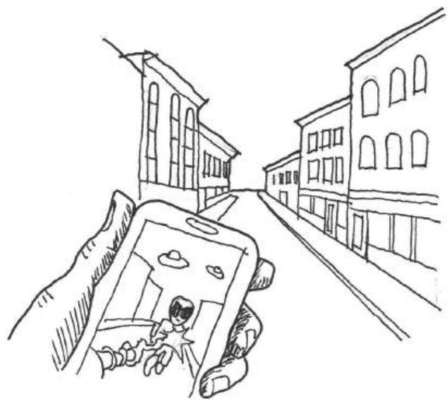  
FIGURE 11.2 Augmented reality games utilize mobile devices as a window through which players can view in-game action. This can have uses either in administering digital explorations of real-world space, or as a visual gimmick.

such as historic reenactments, fantasy role- plays, and immersive improvisational theater scenarios. More game- like examples include Humans vs. Zombies, $^{18}$  a "big game" played on college campuses where human players cooperate to fend off teams of zombie players over varied periods of time: hours, days, or months. There is also Metagame, $^{19}$  a social card game of debating about art, culture, and video games for play at parties or game conferences.

By understanding these types of games and how they administer real- world play, we can also see how they may be adapted to directly address real- world spaces. We can begin to see how designers may use them to facilitate interaction between players. In the next section, we will take a look at how these games can be utilized for architectural reuses and what the goals of such implementations are.

# ADAPTIVE GAME REUSE GOALS

Combining games with architectural space offers opportunities for different types of gameplay experiences in the real world. To understand how these experiences occur, we must understand the goals of adaptive

game reuse—using game mechanics to transform the experience of real- world spaces.

# Adapting Level Design Goals

From Chapter 2, "Tools and Techniques for Level Design," we know that a major goal of level design is the augmentation of space. In adaptive game reuse, space is augmented figuratively with game mechanics and sometimes quite literally through augmented reality devices. We can accomplish the other level design goals by adjusting their meaning for real- world contexts. "Adjusting behavior" describes how the insertion of game mechanics into real- world interactions can give actions gamespace- important meanings. It also describes how a player's motivation for performing real- world actions can transform into performing ones dependent on in- game incentives. "Transmission of meaning" can describe how narrative descriptors delivered by game devices can change the meaning of actions ("I'm going downtown to find a portal"). It can also describe how game mechanics in real- world space can affect positive change in the space, or even facilitate players toward art or structures that themselves have important meaning.

# Real-World Level Design Goals

In addition to adapted versions of our goals for level design, real- world games can and should also have their own set of design goals. Unlike video games, real- world games are inserted retroactively into preconstructed spaces. This is the opposite of our video game level design methods, in which we designed game levels to complement game mechanics. In this instance, we are designing game mechanics to complement level space. This is why we concentrate on this type of level design as adaptive game reuse.

Adaptive game reuse games are meant to highlight a condition of their preexisting level spaces. They may also facilitate some type of action within these spaces. We may even use a combination of these properties to affect positive change within the space. Thus we can say that there are three goals for adaptive game reuse. They are the building of:

1. Games that enhance  
2. Games that pervade  
3. Games that rehabilitate

These goals give us a lens through which we can study previously designed adaptive reuse games and see how they might inform our own designs.

# Games That Enhance

The first goal for adaptive game reuse games is enhancement of the space that already exists. Games that accomplish this take some themeing or mechanics from their site and use the game to highlight these features. Games that enhance are great enactors of the level design goal of transmitting meaning. For example, a powerful tool for storytelling in gamespaces, as we have discussed previously, is embedded environmental narrative—textures, 3D models, and other art assets with narrative purposes. Games can be utilized in real- world gamespace to direct players toward similar meaningful pieces: architectural details, works of art, or museum exhibits.

The Smithsonian American Art Museum utilized such a game during its Art of Video Games exhibit in 2012. Taking advantage of the increased number of visitors from the game exhibition, it had D.C.- area game designers create a scavenger hunt game called Museum Quest. Players would hunt down museum "ghosts," played by exhibit volunteers, and beat them in dice games. This facilitated movement through the museum's many exhibits for visitors who may have otherwise only visited the Art of Video Games.

The Virtual Public Art Project,20 an app for displaying public virtual art, utilizes augmented reality and GPS technology to overlay 3D modeled sculpture onto public spaces (Figure 11.3). Augmented reality is also utilized on the Nintendo 3DS in the AR Games21 application to add game images to real- world environments. Players place cards with specific images onto a flat surface, which will be recognized by the app, causing game data to be displayed. For example, some games turn whatever surfaces the player is aiming the camera at into a fishing pond or archery range. Dragons or other creatures may attack, causing players to move themselves around the table to avoid losing the game. The app also has a function for adding customized Mii characters to images. Creative players have reproduced the card images on large- scale formats to create giant Miis in real- world public spaces, and then spread the images over the Internet. Applications like this demonstrate how games or game- like applications can encourage participation through game incentives or creative tools.

  
FIGURE 11.3 The Virtual Public Art Project app enhances public spaces and encourages visitation by displaying 3D modeled sculptures in specific locations that can only be accessed by viewing them through smartphones.

# Games That Pervade

The next type of adaptive game reuse game builds upon the previous goal's focus of enhancing specific spatial experiences with games and utilizes them as tools for enhancing parts of everyday life. These games pervade our ordinary experiences in such a way that they enliven otherwise mundane activities like commutes and turn them into gameplay opportunities. They also facilitate social interactions between players of these games through shared experience of the mechanics and opportunities for emergent encounters.

While not one specific game, but a feature of a portable console, the StreetPass function of the Nintendo 3DS provides a pervasive game experience. It allows two passing 3DS devices to interact and exchange a small amount of data- - game stats, race times, characters, or other things depending on the games each player uses- - that can be played within each other's games. Nintendo's own accompanying games for this feature require interaction with many other 3DS owners to complete, so social play is encouraged.

StreetPass turns travel through populated areas into a game through passive means. While users do not have to be constantly engaged with it, the feature can be active while they go about their daily routine. This encourages users to keep the system with them and play with the data

they receive from other players at their convenience. The mechanics of each game have inspired groups of users throughout the world to form the StreetPass Network, which arranges gatherings in cities so players can not only gain lots of StreetPasses but also reap the in- game benefits of repeat encounters. By combining features that encourage user interaction and repeated use in the outside world, StreetPass enhances players' everyday routine with passive play.

Games like Shadowcities and Ingress pervade the user's everyday experiences. These games have players competing for territories with other factions. Territories are captured by attacking specific landmarks, which must be in the immediate vicinity of the players attacking them. Many of these are located at real- world destination landmarks, such as statues, museums, or other important structures. Since it is developed by a subsidiary of Google, Ingress integrates many of Google's social features, such as Google+, into its gameplay. This turns the game into a simultaneous augmented- alternate reality pervasive game. By being dependent on location, these games can also become a part of a player's everyday routine or further enhance visiting new or faraway places.

# Games That Rehabilitate

The third goal for adaptive game reuse games is spatial or personal rehabilitation. These games utilize magic circle games' ability to both enhance an element of a space and influence the actions of players, and use these abilities to effect positive change.

Both games and architecture have been proposed as interventions for various societal problems. To educate people about alternative ways to address world problems, Buckminster Fuller created the World Game. Likewise, architects have addressed the lack of affordable housing and the need for environmental sustainability with projects such as Cotney Croft and Peartree Way in Stevenage, Hertfortshire, England, by Bailey Garner LLP22 (Figure 11.4).

Game designer Jane McGonigal merges the two in many of her real- world games, which focus on the needs of a specific location or community and determine how a game might be beneficial. In Cruel 2 B Kind, for example, players are texted an act of kindness that is their weapon and one that is their weakness but are given no information on who else is playing the game. They are supposed to wander around a public space defined as the game boundary and perform their random act of kindness/weapon to others without calling attention to themselves or indicating that they are

  
FIGURE 11.4 Affordable and environmentally sustainable developments like those at Cotney Croft and Peartree Way in Stevenage, Hertfortshire, England—completed by Bailey Garner LLP in 2011—address larger issues through their construction methods.

  
FIGURE 11.5 Cruel 2 B Kind players utilize acts of kindness to hunt for one another within a defined public area. As a side effect, non-players benefit from their gameplay actions.

playing a game. Players are eliminated if they are the recipient of the act of kindness which is their weakness from another player, but must themselves be kind to as many people as possible to find their target. In her book Reality Is Broken, McGonigal explains that she designed this game to increase the jen ratio—the amount of social well- being in a space—of wherever it's played, as it reinforces kind behavior, even if only for the length of the game (Figure 11.5).23

McGonigal's game Tombstone Hold- Em addresses the problem of cemetery care and maintenance caused by lack of visitors through a variant on a popular card game. Players divide into pairs, and after three cards of a five- card hand are drawn, must find tombstones that will complete a winning poker hand. The shape of a stone determines what suit (hearts, diamonds, clubs, and spades) it is, and the dates on the stone determine

the card value. To use the stones as cards, the players must be able to touch the tombstones, but also some part of one another. A beneficial side effect of this game is that since players must be able to read stones to utilize them, they often have to clean them off or move debris away from them.\[24\]

In addition to these low- tech variations, rehabilitating games can use digital delivery vectors. Two games designed at George Mason University, Onward\[25\] and Life Quest,\[26\] utilize common game mechanics and themes to motivate people on criminal probation through that difficult process. Each app utilizes a check- in system to track player tasks but contextualizes real- world activities in different ways. Onward allows players to define their own quests, which respond to their own goals for bettering their lives—education, distancing themselves from dangerous influences, overcoming drugs, etc. As players progress through the quests, they are given points that can be spent in the game's store for items, which can then be utilized to progress through in- game adventure levels (Figure 11.6). Life Quest, on the other hand, has players choose their own quests at the beginning of play, and then moves them along a board that asks them to check in on their quest progress. For completing quests over certain intervals, players are given in- game rewards that can be used to customize their avatar (Figure 11.7).

These games create positive intervention because of designers' investigations into the problems they are trying to correct or the space they are trying to rehabilitate. By combining game mechanics with goals for

  
FIGURE 11.6 Onward gives players in-game currency for completing out-of-game quests toward finishing the probation process. This allows players to progress in in-game adventures.

  
FIGURE 11.7 Life Quest tracks player progress in real-world quests with an on-screen game board, and then rewards them with in-game items.

creating real- world effects, architectural spaces can become socially transformative gamespaces. Creating these kinds of effects requires users to understand both the problems they are trying to address and the space in which they are putting their games.

In the next section, we explore analysis methods for finding the mechanics of real- world spaces.

# ANALYSIS FOR ADAPTIVE CORE MECHANICS

Now that we know what the various goals for adaptive game reuse are, we can explore how to plan for their gameplay. We have just discussed how real- world games differ from video games in terms of when their levels are constructed. As real- world spaces, adaptive reuse games' levels are often built before the game that will be designed for them. This is counterintuitive with how levels are designed for games—in response to the game's intended mechanics. The question is how to find the core mechanics of public gamespace.

# Site-Specific Core Mechanics

Video game level design follows the mantra "form follows core mechanics." However, explorations of pervasive games by Jane McGonigal, the Smithsonian, Local No. 12, and others show us that like many multiplayer games, the mechanics of these games are derived from the intended social experience. Cruel 2 B Kind encourages emergent pleasant interactions between players and visitors, Museum Quest seeks to increase user engagement in museum exhibits, and Metagame facilitates socialization at game conferences.

In addition to focusing on social user experiences, these games derive their mechanics from the architectural use or social condition of the intended playspace in which they intervene. In this way, it is easy to

discern the core mechanics of spaces. For example, Museum Quest seeks to expand the area of the museum that the players will explore and the number of artworks they will see. Thus exploration is the core mechanic of this game, as it is designed to support an exploration and observation space. As tracking systems, Life Quest and Onward transform the concept of a to- do list into gameplay. Depending on the issues players have that led them to be on probation, these games turn self- improvement tasks, such as signing up for a GED program or building a resume, into quest mechanics.

# Rules for Social Intervention

As we have seen, many of these games are designed to facilitate user engagement in sites: museums, public spaces, commuter spaces, etc. This focus on public space allows us to revisit the urban design principles of Modernists and of New Urbanists to explore how the game mechanics of these projects build social gameplay.

In many ways, the danger of "always there" technology such as mobile phones is their ability to connect everyone to their personal social network at all times. While this may seem counterintuitive to our discussions about network capabilities as facilitators of play, the danger of these devices is their ability to put everyone on their own social desert island. Self- contained mobile applications that keep players' attention too focused on the app itself risk becoming the Ville Contemporaine of the tech world. For many games, and for the level design concepts discussed, this is fine. However, adaptive game reuse games seek to create public social game experiences.

We have previously discussed Jane Jacobs and her ideas on developing neighborhoods with mixed- use buildings that allowed people to cross paths and interact. We also discussed how multiplayer games could utilize spaces appropriate for different types of play styles in one level to create rich, emergent spaces. This is also true for games meant for public spaces. On the one hand, there can be private gameplay stages, such as the adventure levels in Onward or the mini- games in the 3DS's StreetPass software, that are private to the owner of the device. However, these games also have a public aspect. Onward utilizes points gathered in real- world interactions to impact these private game experiences. StreetPass utilizes wireless communication between devices to exchange resources required for its packaged games—puzzle pieces, characters, game data, etc. Alternating public- private gameplay encourages social gatherings for these games, as

  
FIGURE 11.8 Games such as StreetPass facilitate movement through real public space by alternating public and private modes. Modes such as mini-games or resource management/collecting can be enjoyed privately, while collecting these resources requires gathering in public areas.

the gatherings become an important element of gameplay. If one were to map gameplay of these pervasive games, one might find that it resembles an occupant of the type of neighborhood Jane Jacobs advocated for: players stay primarily in their private spaces, but move outward to interact with others on sidewalks or in social nodes (Figure 11.8). In this way, the private modes of these games—role- playing games (RPGs), resource managing, collecting, or exploration—become a quest hub for the player's real venturing into public social play scenarios.

These games also benefit from the existence of public characters. We have already seen how fostering regular interaction between players can enhance multiplayer game experiences. Public games can benefit from game structures or social groups in which gameplay is facilitated by a leader. In this chapter we have stated that these games use the device as the game's Dungeon Master, but there is also room for human administration for organizing gameplay events, tournaments, or parties. For example, the StreetPass Network is administrated by Josh Lynsen, who began the network in Washington, D.C., after seeing Japanese gaming fan groups gather to use the social features of Dragon Quest IX.27 While StreetPass as an application allows for interaction between random players, Lynsen's organizing of like- minded players has fostered a much more formal movement of interactive social play. For example, players of the StreetPass game Find Mii,28 an RPG where the Miis of StreetPassed players are recruited to fight monsters, can arrange to help one another via repeated uses of one another's Miis, having their Miis wear certain colors for rooms that require them, or exchange gameplay tips. As a side effect, this community has developed a shared understanding of StreetPass- enabled games. This is another element of constructivist learning. In addition to trial- and- error engagement in gameplay, constructivism includes the building of

shared knowledge by multiple users. This is social constructivism, and can greatly enhance how people play and learn about games.

Such groups allow for engagement with non- players in ways that can have a positive effect on the public gamespace. As we saw with Cruel 2 B Kind, players' "killing with kindness" was meant to affect non- players and enhance the overall jen ratio of the gamespace. StreetPass groups in major cities are a readily available social circle that out- of- town visitors or people who are new residents in a city can take advantage of. Lynsen has reported that tourists who are also StreetPass users have approached his group during D.C. events. By building games with public characters, along with mixed- use public- private mechanics and site- specific core mechanics, we can generate positive effects for public urban spaces with games.

# SUMMARY

In this chapter, we moved outward from video games and into games that create real- world play opportunities. We learned about the magic circle, a concept for describing how games create their own nested realities. We studied games that blur the boundaries of these magic circles—pervasive, augmented, alternate reality, and low- tech public games—and discussed the types of technology used to bring games to the real world. These games utilize devices as Dungeon Masters and allow users to move independently through the real world with game accompaniment.

We looked beyond classifications for these games to discover gameplay goals that can help us bring gamespace to the real world in adaptive game reuse games. These games can allow us to intervene in troubled public spaces or communities with play. These goals for creating games that enhance, games that pervade, and games that rehabilitate utilize technology or game tools to turn users' interactions with real space into gameplay. If modeled properly, these games can have great positive effects on the public spaces in which they are played.

Finally, we discovered how the structure of these games—utilizing mixed- use neighborhoods like those advocated by Jane Jacobs—can facilitate social interaction between players. On the one hand, a variety of gameplay mechanics and a mixture of public and private play modes can turn these games into self- contained quest hubs. On the other hand, public figures such as game or social group organizers further help build communities that can have positive effects by visiting public areas. Through these

design methods it is possible to take what we know about level design, architecture, user engagement, and social urbanism and bring them into one shared gamespace.

# ENDNOTES

1. McGonigal, Jane. Reality Is Broken: Why Games Make Us Better and How They Can Change the World. New York: Penguin Press, 2011.  
2. Sieden, Lloyd Steven. A Fuller View: Buckminster Fuller's Vision of Hope and Abundance for All. Studio City, CA: Divine Arts, 2012.  
3. Huizinga, Johan. Homo Ludens: A Study of the Play-Element in Culture. Boston: Beacon Press, 1971.  
4. Salen, Katie, and Eric Zimmerman. Rules of Play: Game Design Fundamentals. Cambridge, MA: MIT Press, 2003, pp. 95-96.  
5. Pinckard, William. Go and the "Three Games." Kiseido's home page. http://www.kiseido.com/three.htm (accessed August 8, 2013).  
6. Bird, H.E. Chess History and Reminiscences. London: Dean & Son, 1893. http://www.gutenberg.org/cache/epub/4902/pg4902.html.  
7. History of Wargaming. HMGS. http://www.hmgs.org/history.htm (accessed August 4, 2013).  
8. Donovan, Tristan. Replay: The History of Video Games. East Sussex, England: Yellow Ant, 2010, p. 59.  
9. World Game. Buckminster Fuller Institute. http://www.bfi.org/about-bucky/buckys-big-ideas/world-game (accessed August 8, 2013).  
10. The Beast. Microsoft (developer and publisher), 2001. Alternate reality game.  
11. A.I. Artificial Intelligence. DVD. Directed by Steven Spielberg. Warner Bros., 2001.  
12. Shadowcities. Grey Area (developer and publisher), 2011. Mobile phone MMORPG.  
13. Ingress. Niantic Labs (developer and publisher), 2012. Mobile phone MMORPG.  
14. The Dark Knight ARG. 42 Entertainment (developer and publisher), 2008. Alternate reality game.  
15. The Dark Knight. DVD. Directed by Christopher Nolan. Burbank, CA: Warner Bros. Entertainment, 2008.  
16. Pac-Manhattan. Tisch School of the Arts, New York University (developer and publisher), 2004. Real-world pervasive game.  
17. Pac-Man. Namco (developer and publisher), 1981. Arcade game.  
18. Humans vs. Zombies. Gnarwhal Studios (developer and publisher), 2005. Real-world "big game."  
19. Metagame. Local No. 12 (developer and publisher), 2011. Social card game.  
20. Virtual Public Art Project. Virtual Public Art Project (developer and publisher), 2010. Augmented reality mobile application.  
21. AR Games. Nintendo (developer and publisher), March 27, 2011. Nintendo 3DS augmented reality game.

22. Building Futures: Cotney Croft and Peartree Way, Stevenage. hertsdirect.org Partnerships. http://www.hertslink.org/buildingfutures/content/migrated/ branches/13888224/17087247/17233828/cotpear (accessed August 9, 2013). 
23. McGonigal, Jane. Reality Is Broken: Why Games Make Us Better and How They Can Change the World. New York: Penguin Press, 2011, chap. 10. 
24. McGonigal, Jane. Reality Is Broken: Why Games Make Us Better and How They Can Change the World. New York: Penguin Press, 2011, chap. 10. 
25. Onward. Pixel games (developer), Center for Advancing Correctional Excellence (publisher), 2013. Mobile serious game. 
26. Life Quest. Team Life Quest (developer), Center for Advancing Correctional Excellence (publisher), 2013. Mobile serious game. 
27. Dragon Quest IX: Sentinels of the Starry Skies. Square Enix (developer), Nintendo (publisher), July 11, 2010. Nintendo DS game. 
28. Find Mii. Nintendo (developer and publisher), March 27, 2011. Nintendo 3DS StreetPass game.

# INTERVIEW WITH CHRIS WEED

Founder, Gnarwhal Studios

Chris Weed is co- founder of non- digital game company Gnarwhal Studios and the co- inventor of the big urban game, Humans vs. Zombies (HvZ). [NB. parentheses should be roman] Played on college campuses throughout the world, HvZ is a game of tag where zombie players must tag human players when they are walking through public areas.

Can you name a game, level, or level designer (or multiples of each) whose work has left an impression on you? Why?

This is the single hardest question to answer. I've grown up with video games. I've grown up in video games. I can still collect almost all of the heart pieces in The Legend of Zelda: A Link to the Past. That information is burned into my mind. I'm confident that were I to suffer severe head trauma and forget my own name I would still be able to find those heart pieces.

It's very difficult for me to make a coherent list of any reasonable length of level design that has left an impression on me. Now that my childhood house has been demolished, the levels I played on my NES and SNES in my room are as real to me as my actual room. Maybe they're more real to me, because I can never go back to my childhood room but I can always play through the games again.

To give an actual answer that isn't a cop- out, this past week I've been playing Guild Wars 2 and I have been continually impressed by how beautiful and varied the areas are.

Are there any media outside of gaming that you find inspire your work?

I think I'm very critical of myself and my abilities to the point where I often feel lacking for inspiration. When I do find inspiration it's important for me to accept it in whatever form it comes in. Sometimes that can be a good conversation or a cup of coffee that leads you to just want to create or do something. I take a lot of inspiration from movies and novels as well. There's also a certain amount of inspiration you can find in the dark parts of life and the things that upset you. Working to correct those things can be very inspiring.

Describe your level design process- how do you begin? What tools do you use (on or off the computer)?

For Humans vs. Zombies (HvZ) the process is very low- tech and almost always starts with walking through an area (or thinking about an area if you know it well enough), letting your mind wander to various thoughts of "wouldn't it be cool if ...," and then figuring out how to create those moments. There are a considerable amount of things you need to keep in mind in order to know which ideas are worth pursuing and how your players will interact with the space. You need to be better at poking holes in your designs than your players will be. For that reason it's often helpful to work with other people and for one person to take on the role of saboteur.

Seeing that process take shape from a single idea to an actual event to stories the players are telling months after the game is an incredible process and one of my favorite things in the world.

What is your process for playtesting your levels?

The last question describes our process of poking holes in our own design. That is the extent of our playtesting. Due to the nature of the game, we simply can't test our ideas. The best you can do is to learn from prior experience and try to apply those lessons to future designs.

Do you find art and atmospheric effects an important tool for communicating with players? Any specific examples?

Atmosphere is one of the most important elements of our game. With HvZ we have an unusually small amount of control over that atmosphere. The control we do have as designers is mainly to set the tone for the game. We usually make an attempt at theatrics and an overarching plot to tie all of the game's missions together. Though, truth be told, this is almost always the first area to fall victim to triage when we are down to the wire.

The players also have a huge responsibility for the atmosphere of the game. The biggest challenge here is usually just making them aware of this. If you can make your players understand the impact their attitude and approach will have on their own experience, they will often be reasonable. There is of course a balance you need to strike, and there are certainly times when you need to step in and correct behavior. Transparency, honesty, and authority are the most important tools when doing this.

The last factor in the atmosphere for the game is the location you are playing in and also the literal atmosphere. Weather can completely change how

players interact with a space. Despite our best efforts, we have not had any luck in controlling the weather.

An example of all three of these factors coming together is one of my favorite missions, the Laser Mission. The mission began at  $10\mathrm{p.m.}$ , two hours before the game officially started and before the original zombie could begin tagging humans. We had players meet in our campus' chapel and sit in the pews. We introduced them to our plot, that they were among the last survivors on earth living in a small community that was now thought to be compromised. The lights went out, zombies began hanging on all of the windows. Even though they knew they weren't in any real danger, that the game hadn't started, the players all got into it. They screamed and huddled in the middle of the building. The zombies burst through the doors and the players dispatched them. They were told that in order to turn the power back on, they needed to fix the power grid. This involved a high- power laser pointer on a tripod and several Ikea mirrors. The players had to position the mirrors so that the beam of light would hit a spot across campus.

We opened the doors and all walked out of the chapel into the most beautiful foggy night I have ever seen. Half an hour before it had been a clear boring night. We could not have asked for or planned for a more atmospheric fog. It made the mission infinitely more exciting and is to this day one of my favorite memories of the game.

How do you direct the actions of players in your levels? How do you encourage players to play in undirected ways?

Usually there is a conceit of players needing to amass themselves in a specific location before the mission can begin. From there we have several methods we use. We either give players a location they need to get to, a specific target, in which case the difficulty comes from getting to that one location, or we make the objective more vague and only give clues, in which case the difficulty comes from figuring out what or where the objective is. Alternatively, we can use a non- playing character (NPC) to lead the players in a specific route. There are pros and cons to each method mainly centered around exactly what the players will be able to make decisions about. Using an NPC and taking a specific route can allow you to lead your players in an interesting, well- designed route, but it removes some of their agency and some possibilities for meaningful choice.

There is also another method, which is to create an artificial barrier. For example, "You can't go beyond that fence." This is much harder to do in a real- world game and requires that everyone playing keep another piece of information in their brain. This might seem like a small trivial detail when you're designing a mission, but in that moment when a player is experiencing your mission, every addition like this has a high cost. Making the additions intuitive and obvious goes a long way to softening the blow. It is important to remember that for every rule you add, you're adding potentially infinite edge cases that you haven't thought of. Without an experienced intuition for how a game works and how your players interact with it, this can be very dangerous.

What laws of level design have you developed in your own work that any designer should know? What should he or she avoid?

I was on a panel a few years ago with Nathalie Pozzi, whose background is in architecture. She explained how similar the two domains felt to her. In both you're creating a possibility space. You direct how people will interact with what you build, but there's a limit to how far you can control it. That has stuck with me and feels especially true with games like HvZ. When you are responsible for creating the very physics of your game, it is easy, I think, to take the control you have over that world for granted. With HvZ our control is much more withdrawn. We're forced to accept the location we're given and work from there. We also cannot control (no matter how much we might sometimes want to) how our players will interact with what we design. It has led to a very soft, almost improvisational approach to design. Rather than asking "what possibilities should I create?" I find myself asking "how can I prepare for the things I'm not anticipating?"

Now, with screen games, and depending on your genre, that might not sound like a lesson that applies—and it might not apply in the same way. There are, however, very important collaborative moments, particularly in the playtesting phase. My "law" then would be to have a soft understanding of what your game is until you see other people playing it. Learn from your players.

What inspired you to create a game like Humans vs. Zombies on your college campus?

HvZ was a rebellious, anti- authority, extremely silly act. We wanted to make the campus our own. We wanted to create something fun and accessible. We thought zombies were cool. To say a whole lot more about it would probably be a betrayal. There honestly wasn't much thought about it.

To dig a little deeper, one of my high school teachers would tell us stories about month- long games of capture the flag that he would play in college. If no one was guarding your flag, people would break into your dorm and steal it. I think those stories probably had the single biggest effect on my grades. From that moment on I knew I had to get into college.

How did you originally build a community of players to play a "big game" in a real space?

We put fliers up around campus. The start of HvZ also coincided with the beginnings of Facebook. We were really into what we were doing, and I think people saw that and wanted to be a part of it. Also, a whole lot of luck.

How does the experience of playing Humans vs. Zombies transform the spaces it is played in? How does playing Humans vs. Zombies transform player actions in these public spaces?

A low wall becomes a point of ambush. A walk to a cafeteria becomes a challenge of your bravery. The shadows make you feel safe. When you are committed to the game, it changes how you see nearly everything you come in contact with. It is a very primal feeling. Leaving the safe zones immediately

raises your heart rate. Your eyes become hyper- aware of sudden movement. Any sound moving toward you makes you freak out. To some people this probably sounds like a nightmare, but for a lot of people they feel more alive than life usually allows.

You cease to see the world around you as serving an aesthetic sense. The space around you is both a tool and an obstacle of your survival. To that end you feel much more connected to your surroundings. The better connected you are, the better you will be at the game. The game incentivizes that connection.

The spaces change after the game is over as well. There are non- descript areas of campus that now hold very special meaning to a lot of people. While it's obviously just a silly game, the kinds of shared experiences it creates really can transform spaces forever. One example is a small courtyard on campus where nearly fifty zombies waited in ambush for the human players. The zombies had the good sense and the rare self- control to wait until all of the humans had piled into the courtyard before they sprang from the bushes and doorways. I don't think any humans made it out alive. From then on I always felt like someone was watching me whenever I was in that courtyard.

What have been some positive elements of managing big games in real public spaces? What have been some sensitive elements you have needed to negotiate with people on or adapt to?

This game has led to my relationship with my girlfriend and friendships with some of my favorite people in the world. That is also one of the most common things I hear about people's experience with games around the world. It's the reason they met their wife. It's the reason they met their friends. It's the reason they found a social group at school. Being set in a public space makes it easy for anyone to feel ownership over the experience and to feel an equal part in the experience. Setting games in a public space is a great equalizing tool.

There is, of course, the issue of non- players. Our game can be disruptive. Many people's understanding of appropriate use of public space does not include games like HvZ. There is also the issue of the use of toys that resemble guns. There are many people who have a problem with these things. An important lesson we needed to learn was that our actions and our game really did have the capacity to negatively impact people. Our game did not exist in a vacuum. We were able to solve all of our issues by speaking to those people who had complaints and dealing with each other's issues respectfully and appropriately.

# Conclusion

A elements of game development, such as level design, behind. We must learn to balance game design's own firmitas, utilitias, and venustas- functional requirements, usability, and delight- rather than ignore one to focus on another.

We have explored many facets of both architecture and games here. We began with a historical foundation of both arts and discovered ways in which each dealt with technical and societal factors to create meaningful experiences. This led us to explore methods for analyzing spatial design and documenting this analysis through plan, section, elevation, and other representational methods. We explored tools and techniques for designing game levels based in traditional game design methods, as well as some that merge architectural foci on modularity and measurements.

These tools in hand, we studied traditional spatial types in games and how they might be organized like traditional architectural forms. We discovered how the size of spaces and the ways in which they are arranged can influence our experience of them. From some of these practical concerns, we explored spatial design to see how it can fit our goals of level design: the adjustment of behavior, transmission of meaning, and augmentation of space. For this we discovered that gamespaces can utilize art assets to which we can assign game behaviors or associations, making them symbolic art assets. With these we can teach players how to play our games. We also saw how simple manipulations of the way spaces are arranged and presented can create emotional experiences such as suspense, fear, denial, and reward. And, we saw how we may establish rhythms of goals in our level spaces that entice players through our games. We also discussed how many of our art assets can help mark the player's place in a story. This is especially true of textures and materials in environment

art, which can be powerful descriptors for working with traditional narrative structures such as the hero's journey.

After illustrating some of these experiential orientations of space, we explored ways in which we may tell stories or provide players with the resources to make their own. As many games create possibility spaces through a set of rules embodied in an environment, we discovered how games build worlds through rules. We returned to our spatial learning methods to discover how these possibility spaces slowly shape user behavior through controlled exposure to a game's mechanics that later allow players to freely explore. Such explorations of mechanics formed our discussions of multiplayer gamespaces, and how theories of urbanism demonstrate how we might create exciting multiuser worlds through mixed- use spatial layouts rather than by separating gameplay functions. To complement these discussions of how gameplay is controlled, we further explored rhythms in games—both in architectural spaces and in sound assets. Through this, we discovered how sound and rhythm might be of use for establishing the mood of our game, as well as for directing the pacing of gameplay. In Chapter 11, we explored games that utilize gamespaces both in the computer and out of doors, or that utilize digital components to influence real- world game actions. These games can be used for entertainment purposes or may have real- world impacts as intervention pieces.

In many ways, Chapter 11 highlights the place that the level design knowledge in this book holds in the developers' toolbox. These ideas are beyond technology. While they influence how we build levels when we sit down at our 2D art or 3D content creation programs, middleware game engines, or proprietary software, they have a larger meaning. The advantage of learning spatial design principles for level design from an art form as timeless as architecture is that the principles we utilize today will be relevant when our current favorite game engines are historic footnotes. Many of the most influential works cited in this text are at least fifty years old. Many are hundreds or even thousands of years old, yet the experiences they create through their spatial arrangements have withstood both time and the emergent narratives brought on by intense human interaction. Through these timeless spatial design principles, we hope to build timeless gameplay.

  
FIGURE 4.12 In the additive color model, the primary colors of light—red, green, and blue—are combined to form new colors, and eventually white light when all three are combined.

  
FIGURE 4.13 The color wheel. Groups of three colors next to one another are known as analogous colors, while colors on opposite sides of the wheel are complementary. Using complementing colors in visual design helps contrasting elements stand out.

  
FIGURE 5.26 The Nightmare Over Innsmouth uses shade to create ambiguous moments of gameplay between points of high action. This allows the game to maintain a tense atmosphere despite a rest from challenges.

  
FIGURE 5.27 Screenshots from SWARM! demonstrate that different lighting conditions can be accomplished while still limited to one light per level environment.